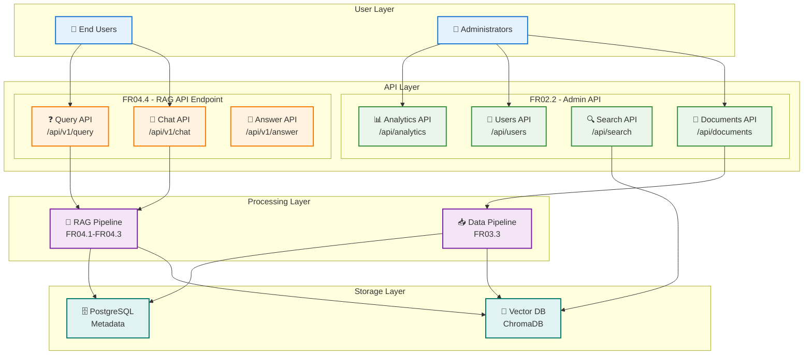
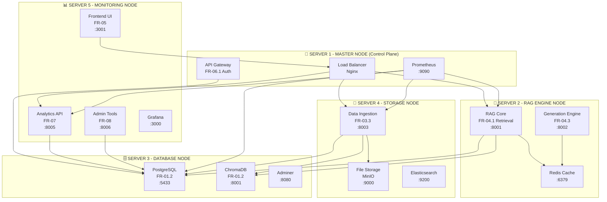
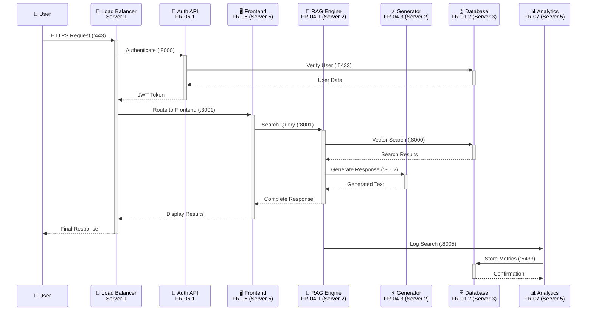
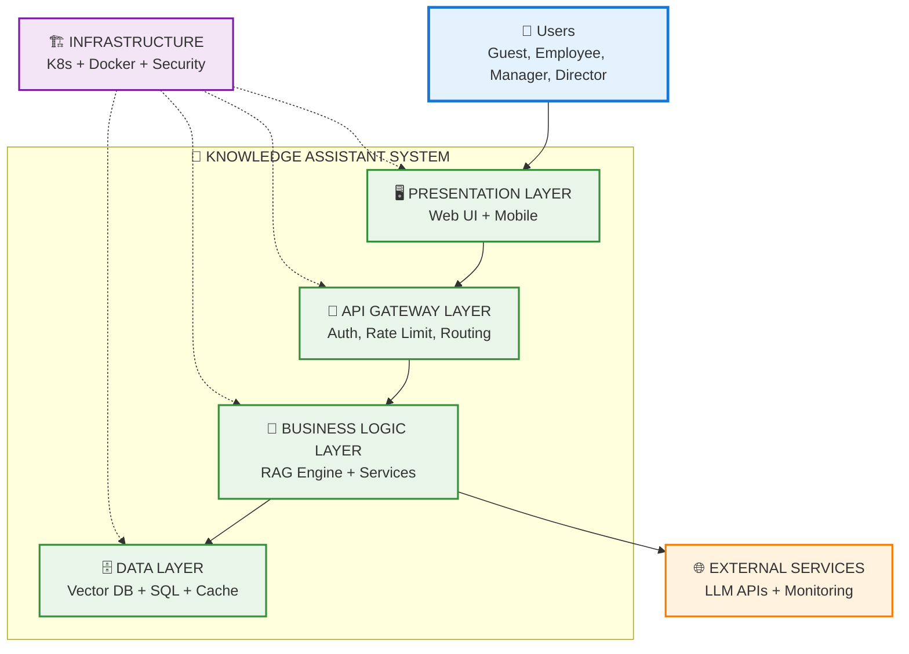
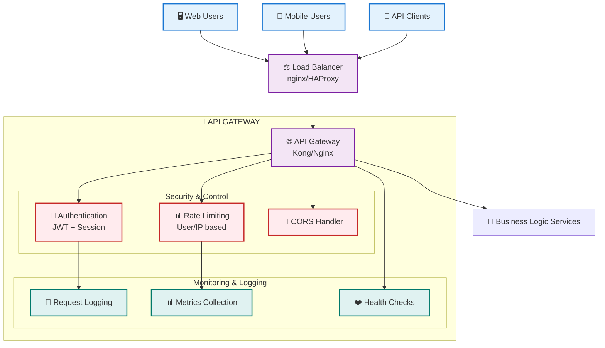
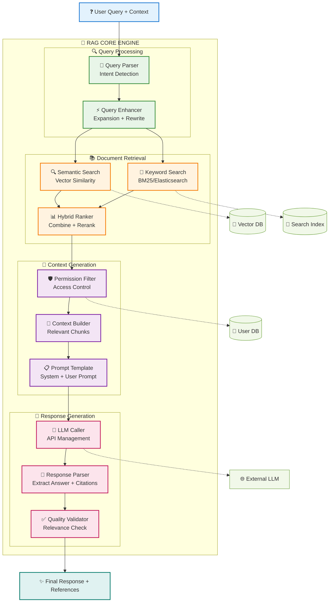
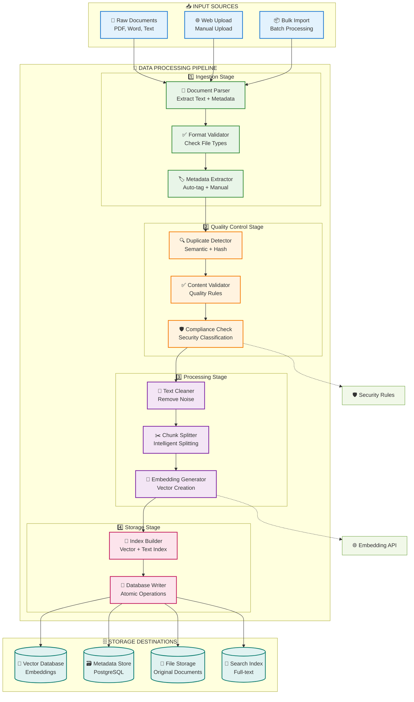
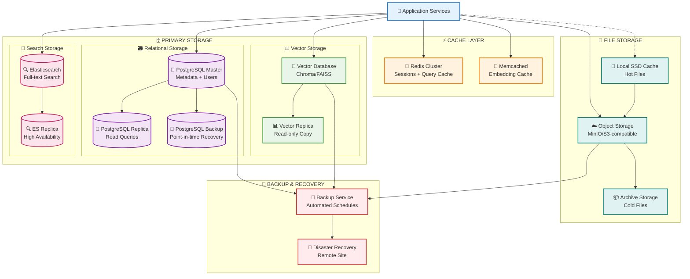
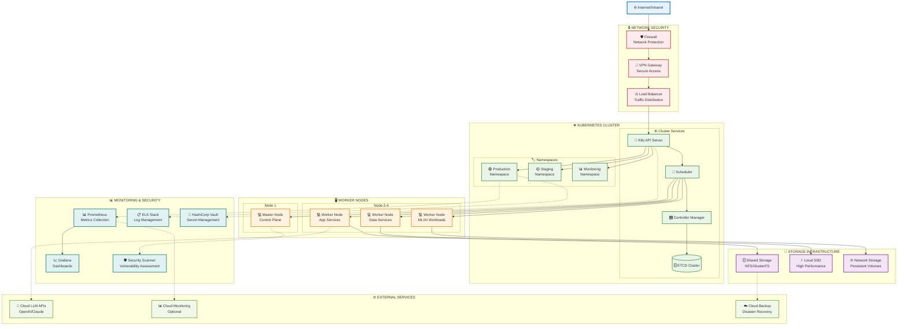

Tôi sẽ giúp bạn tạo sơ đồ module chức năng với các port được phân bổ rõ ràng để tránh xung đột. Trước tiên, hãy để tôi tìm hiểu về cấu trúc dự án hiện tại.Bây giờ để tôi tìm hiểu thêm về cấu trúc port và deployment của các module:Bây giờ tôi đã có đủ thông tin để tạo sơ đồ phân bổ port và module. Dưới đây là sơ đồ chi tiết:

# 🏗️ **SƠ ĐỒ MODULE & PORT ALLOCATION - HỆ THỐNG RAG KNOWLEDGE ASSISTANT**

## 📊 **MERMAID CHART - SYSTEM ARCHITECTURE**



## 🖥️ **CHI TIẾT CẤU HÌNH MÁY CHỦ VÀ PORT**

### **🎯 Server 1 - MASTER NODE (Control Plane)**
```yaml
Vai trò: API Gateway + Authentication + Load Balancing
Module triển khai: FR-06.1 (Authentication & Authorization)

Services & Ports:
├── Nginx Load Balancer
│   ├── HTTP: :80 → :443 (SSL redirect)
│   └── HTTPS: :443 (External access point)
├── API Gateway (FR-06.1)
│   ├── Auth API: :8000 (Internal)
│   └── JWT Service: :8007 (Internal)
├── Prometheus Monitoring
│   ├── Metrics Collection: :9090
│   └── Node Exporter: :9100
└── Consul Service Discovery: :8500

Network Configuration:
├── External Interface: 192.168.1.10/24
├── Internal Cluster: 10.0.1.10/16
└── Management VLAN: 172.16.1.10/24

Cấu hình tối thiểu:
├── CPU: Intel i7-12700 (12 cores)
├── RAM: 32GB DDR4-3200
├── Storage: 500GB NVMe SSD
└── Network: 2x Gigabit Ethernet
```

### **🤖 Server 2 - RAG ENGINE NODE**
```yaml
Vai trò: RAG Core Processing + Text Generation
Module triển khai: FR-04.1 (Retrieval) + FR-04.3 (Generation)

Services & Ports:
├── Document Retrieval API (FR-04.1)
│   ├── Search API: :8001 (Primary service)
│   ├── Health Check: :8001/health
│   └── Metrics: :8001/metrics
├── Text Generation API (FR-04.3)
│   ├── Generation API: :8002 (Primary service)
│   ├── Streaming: :8002/stream
│   └── Batch Processing: :8002/batch
├── Redis Cache Cluster
│   ├── Master: :6379
│   ├── Replica 1: :6380
│   └── Replica 2: :6381
└── Background Processing
    ├── Celery Worker: :5555 (Flower UI)
    └── Task Queue: Redis Channel 0

Network Configuration:
├── External Interface: 192.168.1.20/24
├── Internal Cluster: 10.0.1.20/16
└── GPU Network: 10.1.0.20/16 (Dedicated for ML)

Cấu hình tối thiểu:
├── CPU: Intel i9-13700K (16 cores)
├── RAM: 64GB DDR4-3200
├── GPU: NVIDIA RTX 4060 Ti 16GB
└── Storage: 1TB NVMe (App) + 2TB NVMe (Cache)
```

### **🗄️ Server 3 - DATABASE NODE**
```yaml
Vai trò: Primary & Vector Database + Caching
Module triển khai: FR-01.2 (Database Schema v2.0)

Services & Ports:
├── PostgreSQL Database
│   ├── Main DB: :5433 (External access)
│   ├── Replica 1: :5434 (Read-only)
│   ├── Replica 2: :5435 (Read-only)
│   └── PgBouncer: :6432 (Connection pooling)
├── ChromaDB Vector Database
│   ├── API Server: :8000 (Changed to avoid conflict)
│   ├── Admin Interface: :8000/admin
│   └── Collection API: :8000/api/v1
├── Database Administration
│   ├── Adminer: :8080 (Web interface)
│   ├── pgAdmin: :5050 (PostgreSQL admin)
│   └── Grafana DB Dashboard: :3002
└── Backup Services
    ├── pg_dump Service: :9876
    └── Backup Scheduler: :9877

Network Configuration:
├── External Interface: 192.168.1.30/24
├── Internal Cluster: 10.0.1.30/16
└── Database VLAN: 172.16.2.30/24

Cấu hình tối thiểu:
├── CPU: Intel i7-13700 (16 cores)
├── RAM: 64GB DDR4-3200 ECC
├── Storage: 500GB NVMe (OS) + 4TB NVMe RAID-1 (DB)
└── Network: 2x Gigabit + 10Gb SFP+ (optional)
```

### **📁 Server 4 - STORAGE & PROCESSING NODE**
```yaml
Vai trò: File Storage + Data Processing Pipeline
Module triển khai: FR-03.3 (Data Ingestion Pipeline)

Services & Ports:
├── Data Ingestion API (FR-03.3)
│   ├── Upload API: :8003 (Document upload)
│   ├── Processing API: :8003/process
│   ├── Batch API: :8003/batch
│   └── Status API: :8003/status
├── File Storage System
│   ├── MinIO Object Storage: :9000
│   ├── MinIO Console: :9001
│   └── SFTP Server: :2222 (Secure file transfer)
├── Search Infrastructure
│   ├── Elasticsearch: :9200
│   ├── Kibana: :5601 (Log analysis)
│   └── Logstash: :5044 (Log processing)
└── Processing Services
    ├── Document Parser: :8004 (Internal)
    ├── Vietnamese NLP: :8005 (Internal)
    └── Embedding Service: :8006 (Internal)

Network Configuration:
├── External Interface: 192.168.1.40/24
├── Internal Cluster: 10.0.1.40/16
└── Storage VLAN: 172.16.3.40/24

Cấu hình tối thiểu:
├── CPU: Intel i5-13400 (10 cores)
├── RAM: 32GB DDR4-3200
├── Storage: 8TB HDD RAID-5 + 2TB NVMe Cache
└── Network: 2x Gigabit Ethernet
```

### **📊 Server 5 - MONITORING & ANALYTICS NODE**
```yaml
Vai trò: Analytics + Admin Tools + Frontend UI
Module triển khai: FR-07 (Analytics) + FR-08 (Admin Tools) + FR-05 (UI)

Services & Ports:
├── Analytics & Reporting (FR-07)
│   ├── Analytics API: :8005 (Business intelligence)
│   ├── Streamlit Dashboard: :8501
│   ├── Report Generator: :8502
│   └── Data Export API: :8503
├── Admin & Maintenance (FR-08)
│   ├── Admin API: :8006 (System administration)
│   ├── Maintenance Tools: :8506
│   ├── Backup Manager: :8507
│   └── Health Monitor: :8508
├── Frontend Interface (FR-05)
│   ├── Main UI: :3001 (Next.js application)
│   ├── Chatbot Interface: :3002 (FR-05.2)
│   ├── Admin Panel: :3003
│   └── Mobile API: :3004
├── Monitoring Stack
│   ├── Grafana: :3000 (Dashboards)
│   ├── AlertManager: :9093
│   └── Jaeger Tracing: :14268
└── Communication Services
    ├── WebSocket Gateway: :8080 (Real-time)
    └── Notification Service: :8081

Network Configuration:
├── External Interface: 192.168.1.50/24 (DMZ)
├── Internal Cluster: 10.0.1.50/16
└── Management VLAN: 172.16.1.50/24

Cấu hình tối thiểu:
├── CPU: Intel i5-12400 (6 cores)
├── RAM: 32GB DDR4-3200
├── Storage: 4TB HDD (Logs) + 500GB NVMe (Apps)
└── Network: 2x Gigabit Ethernet
```

## 🔗 **BẢNG TỔNG HỢP PORT ALLOCATION**

| **Server** | **Service** | **Module** | **Internal Port** | **External Port** | **Protocol** | **Purpose** |
|------------|-------------|------------|-------------------|-------------------|--------------|-------------|
| **Server 1** | Nginx LB | FR-06.1 | 80/443 | 80/443 | HTTP/HTTPS | Load Balancing |
| | API Gateway | FR-06.1 | 8000 | - | HTTP | Authentication |
| | Prometheus | Monitoring | 9090 | 9090 | HTTP | Metrics Collection |
| | Node Exporter | Monitoring | 9100 | - | HTTP | System Metrics |
| **Server 2** | Retrieval API | FR-04.1 | 8001 | 8001 | HTTP | Document Search |
| | Generation API | FR-04.3 | 8002 | 8002 | HTTP | Text Generation |
| | Redis Master | Cache | 6379 | - | TCP | Primary Cache |
| | Redis Replica | Cache | 6380/6381 | - | TCP | Cache Replication |
| **Server 3** | PostgreSQL | FR-01.2 | 5433 | 5433 | TCP | Primary Database |
| | ChromaDB | FR-01.2 | 8000 | 8000 | HTTP | Vector Database |
| | Adminer | Admin | 8080 | 8080 | HTTP | DB Administration |
| | PgBouncer | Connection Pool | 6432 | - | TCP | Connection Pooling |
| **Server 4** | Ingestion API | FR-03.3 | 8003 | 8003 | HTTP | Data Processing |
| | MinIO | Storage | 9000/9001 | 9000 | HTTP | Object Storage |
| | Elasticsearch | Search | 9200 | 9200 | HTTP | Full-text Search |
| | Kibana | Logging | 5601 | 5601 | HTTP | Log Analysis |
| **Server 5** | Analytics API | FR-07 | 8005 | 8005 | HTTP | Business Analytics |
| | Admin Tools | FR-08 | 8006 | 8006 | HTTP | System Admin |
| | Frontend UI | FR-05 | 3001 | 3001 | HTTP | Main Interface |
| | Grafana | Monitoring | 3000 | 3000 | HTTP | Dashboards |

## 🚨 **XỬ LÝ XUNG ĐỘT PORT - TROUBLESHOOTING**

### **🔍 Kiểm tra Port đang sử dụng**
```bash
# Kiểm tra tất cả port đang mở
netstat -tulpn | grep LISTEN

# Kiểm tra port cụ thể
lsof -i :8001

# Kiểm tra container Docker
docker ps --format "table {{.Names}}\t{{.Ports}}"
```

### **⚠️ Các Port Conflict phổ biến**
```yaml
Common Conflicts:
├── PostgreSQL: 5432 vs 5433 (Use 5433 for FR-01.2)
├── Redis: 6379 vs 6380 (Use 6379 for master, 6380+ for replicas)  
├── ChromaDB: 8000 vs 8001 (Use 8000 for Chroma, 8001 for Retrieval)
├── Frontend: 3000 vs 3001 (Use 3000 for Grafana, 3001 for UI)
└── MinIO: 9000 vs 9200 (Use 9000 for MinIO, 9200 for Elasticsearch)
```

### **🛠️ Script tự động kiểm tra Port**
```bash
#!/bin/bash
# save as: check_ports.sh

echo "🔍 Kiểm tra Port Allocation - RAG Knowledge System"

# Danh sách port cần kiểm tra theo module
declare -A ports=(
    ["80"]="Nginx HTTP"
    ["443"]="Nginx HTTPS"
    ["3000"]="Grafana Dashboard"
    ["3001"]="Frontend UI (FR-05)"
    ["5433"]="PostgreSQL (FR-01.2)"
    ["6379"]="Redis Master"
    ["8000"]="ChromaDB (FR-01.2)"
    ["8001"]="Retrieval API (FR-04.1)"
    ["8002"]="Generation API (FR-04.3)"
    ["8003"]="Ingestion API (FR-03.3)"
    ["8005"]="Analytics API (FR-07)"
    ["8006"]="Admin Tools (FR-08)"
    ["9000"]="MinIO Storage"
    ["9090"]="Prometheus"
    ["9200"]="Elasticsearch"
)

echo "🚦 Port Status Check:"
for port in "${!ports[@]}"; do
    if lsof -Pi :$port -sTCP:LISTEN -t >/dev/null 2>&1; then
        service=$(lsof -Pi :$port -sTCP:LISTEN | awk 'NR==2{print $1}')
        echo "⚠️  Port $port: ${ports[$port]} - OCCUPIED by $service"
    else
        echo "✅ Port $port: ${ports[$port]} - AVAILABLE"
    fi
done

echo ""
echo "🐳 Docker Container Port Check:"
docker ps --format "table {{.Names}}\t{{.Ports}}" 2>/dev/null || echo "Docker not running"

echo ""
echo "💡 Quick Fix Commands:"
echo "   Stop conflicting services: sudo systemctl stop postgresql redis-server nginx"
echo "   Free up ports: sudo fuser -k 5432/tcp 6379/tcp 3000/tcp"
echo "   Restart with clean slate: docker-compose down && docker-compose up -d"
```

## 🔄 **FLOW DIAGRAM - MODULE INTERACTIONS**



## 📝 **CHECKLIST TRIỂN KHAI**

### **✅ Pre-deployment Checklist**
```bash
# 1. Kiểm tra port conflicts
./check_ports.sh

# 2. Verify system requirements  
free -h && df -h && nproc

# 3. Check Docker installation
docker --version && docker-compose --version

# 4. Test network connectivity
ping 192.168.1.10 && ping 192.168.1.20  # Test inter-server communication

# 5. Verify environment files
ls -la */.env && grep -l "PASSWORD\|SECRET" */.env
```

### **🚀 Deployment Sequence**
```yaml
Deployment Order:
1. Server 3 (Database): FR-01.2 Database setup first
2. Server 1 (Control): API Gateway and authentication
3. Server 4 (Storage): Data ingestion pipeline  
4. Server 2 (RAG): Core processing engines
5. Server 5 (UI/Analytics): User interface and monitoring

Health Check Sequence:
├── Database connectivity (:5433, :8000)
├── Authentication service (:8000) 
├── Core APIs (:8001, :8002, :8003)
├── Frontend UI (:3001)
└── Monitoring (:3000, :9090)
```

### **🔧 Recovery Points**
```yaml
Failure Recovery:
├── Database failure → Restore from backup, switch to replica
├── Service crash → Docker restart, health check validation
├── Port conflict → Kill conflicting process, update config
├── Network issue → Check firewall, restart network service
└── Resource exhaustion → Scale up, optimize queries
```

**Chuyên gia, với sơ đồ này bạn có thể tránh được mọi xung đột port và triển khai hệ thống một cách có hệ thống. Mỗi module đã được phân bổ port riêng biệt và có backup plan khi gặp sự cố!** 🎯✅
---
# KIẾN TRÚC GIẢI PHÁP ĐỀ XUẤT
## PROPOSED SOLUTION ARCHITECTURE

```mermaid
graph TB
    %% User Layer
    subgraph "👥 USER LAYER"
        Web[🖥️ Web Browser]
        Mobile[📱 Mobile App]
        API_Client[🔧 API Client]
    end
    
    %% Load Balancer & API Gateway
    LB[⚖️ Load Balancer<br/>nginx/HAProxy]
    
    %% API Gateway
    subgraph "🚪 API GATEWAY LAYER"
        Gateway[🌐 API Gateway<br/>Kong/Nginx]
        Auth[🔐 Authentication<br/>JWT/OAuth2]
        RateLimit[📊 Rate Limiting]
        Logging[📝 Request Logging]
    end
    
    %% Application Layer
    subgraph "💼 APPLICATION LAYER"
        subgraph "🤖 RAG Core Engine"
            QueryProcessor[🔍 Query Processor]
            Retriever[📚 Document Retriever]
            ContextBuilder[🧩 Context Builder]
            LLMOrchestrator[🎯 LLM Orchestrator]
        end
        
        subgraph "📊 Business Logic Services"
            UserMgmt[👤 User Management]
            DocMgmt[📄 Document Management]
            PermissionSvc[🛡️ Permission Service]
            AnalyticsSvc[📈 Analytics Service]
        end
        
        subgraph "🔧 Data Processing Pipeline"
            DataIngestion[📥 Data Ingestion]
            EmbeddingGen[🔢 Embedding Generator]
            QualityCheck[✅ Quality Control]
            ChunkProcessor[✂️ Chunk Processor]
        end
    end
    
    %% Cache Layer
    subgraph "⚡ CACHE LAYER"
        Redis[🔴 Redis<br/>Session & Query Cache]
        Memcached[💾 Memcached<br/>Embedding Cache]
    end
    
    %% Storage Layer
    subgraph "🗄️ STORAGE LAYER"
        subgraph "📊 Vector Storage"
            VectorDB[🔢 Vector Database<br/>Chroma/FAISS/Weaviate]
            EmbeddingIndex[📇 Embedding Index]
        end
        
        subgraph "🗃️ Relational Storage"
            PostgreSQL[(🐘 PostgreSQL<br/>Metadata & Users)]
            ReadReplica[(📖 Read Replica)]
        end
        
        subgraph "📁 File Storage"
            ObjectStore[☁️ Object Storage<br/>MinIO/S3-compatible]
            LocalFS[💽 Local File System]
        end
    end
    
    %% External Services
    subgraph "🌐 EXTERNAL SERVICES"
        LLMService[🧠 LLM Services<br/>OpenAI/Claude/Local LLM]
        EmbeddingAPI[🔢 Embedding API<br/>OpenAI/HuggingFace]
        MonitoringExt[📊 External Monitoring<br/>DataDog/NewRelic]
    end
    
    %% Infrastructure Layer
    subgraph "🏗️ INFRASTRUCTURE LAYER"
        subgraph "🐳 Container Platform"
            Kubernetes[☸️ Kubernetes Cluster]
            Docker[🐋 Docker Containers]
        end
        
        subgraph "📊 Monitoring & Logging"
            Prometheus[📊 Prometheus<br/>Metrics]
            Grafana[📈 Grafana<br/>Dashboards]
            ELKStack[📋 ELK Stack<br/>Logs]
        end
        
        subgraph "🔒 Security & Backup"
            Vault[🔐 HashiCorp Vault<br/>Secrets]
            Backup[💾 Backup Service]
            SecurityScan[🛡️ Security Scanner]
        end
    end
    
    %% Data Flow Connections
    Web --> LB
    Mobile --> LB
    API_Client --> LB
    
    LB --> Gateway
    Gateway --> Auth
    Gateway --> RateLimit
    Gateway --> Logging
    
    Auth --> UserMgmt
    Gateway --> QueryProcessor
    Gateway --> DocMgmt
    
    %% RAG Engine Flow
    QueryProcessor --> Retriever
    Retriever --> VectorDB
    Retriever --> PostgreSQL
    Retriever --> Redis
    
    Retriever --> ContextBuilder
    ContextBuilder --> LLMOrchestrator
    LLMOrchestrator --> LLMService
    
    %% Data Processing Flow
    DocMgmt --> DataIngestion
    DataIngestion --> ChunkProcessor
    ChunkProcessor --> QualityCheck
    QualityCheck --> EmbeddingGen
    EmbeddingGen --> EmbeddingAPI
    EmbeddingGen --> VectorDB
    EmbeddingGen --> PostgreSQL
    
    %% Storage Connections
    UserMgmt --> PostgreSQL
    DocMgmt --> PostgreSQL
    DocMgmt --> ObjectStore
    PermissionSvc --> PostgreSQL
    AnalyticsSvc --> PostgreSQL
    
    PostgreSQL --> ReadReplica
    VectorDB --> EmbeddingIndex
    
    %% Cache Connections
    QueryProcessor -.-> Redis
    Retriever -.-> Memcached
    UserMgmt -.-> Redis
    
    %% Infrastructure Connections
    Kubernetes --> Docker
    Prometheus --> Grafana
    ELKStack --> Logging
    Vault --> Auth
    Backup --> PostgreSQL
    Backup --> VectorDB
    Backup --> ObjectStore
    
    %% Monitoring Connections
    Prometheus -.-> QueryProcessor
    Prometheus -.-> PostgreSQL
    Prometheus -.-> VectorDB
    ELKStack -.-> Gateway
    MonitoringExt -.-> Kubernetes
    
    %% Styling
    classDef userLayer fill:#e3f2fd,stroke:#1976d2,stroke-width:2px
    classDef gatewayLayer fill:#f3e5f5,stroke:#7b1fa2,stroke-width:2px
    classDef appLayer fill:#e8f5e8,stroke:#388e3c,stroke-width:2px
    classDef cacheLayer fill:#fff3e0,stroke:#f57c00,stroke-width:2px
    classDef storageLayer fill:#fce4ec,stroke:#c2185b,stroke-width:2px
    classDef externalLayer fill:#f1f8e9,stroke:#689f38,stroke-width:2px
    classDef infraLayer fill:#e0f2f1,stroke:#00796b,stroke-width:2px
    
    class Web,Mobile,API_Client userLayer
    class Gateway,Auth,RateLimit,Logging gatewayLayer
    class QueryProcessor,Retriever,ContextBuilder,LLMOrchestrator,UserMgmt,DocMgmt,PermissionSvc,AnalyticsSvc,DataIngestion,EmbeddingGen,QualityCheck,ChunkProcessor appLayer
    class Redis,Memcached cacheLayer
    class VectorDB,EmbeddingIndex,PostgreSQL,ReadReplica,ObjectStore,LocalFS storageLayer
    class LLMService,EmbeddingAPI,MonitoringExt externalLayer
    class Kubernetes,Docker,Prometheus,Grafana,ELKStack,Vault,Backup,SecurityScan infraLayer
```



## 🏗️ **CHI TIẾT KIẾN TRÚC CÁC TẦNG**

### 1. **👥 USER LAYER - Tầng Người dùng**
- **Web Browser**: Giao diện chính cho desktop users
- **Mobile App**: Ứng dụng di động (tùy chọn trong phase 2)
- **API Client**: Cho tích hợp với các hệ thống khác

### 2. **🚪 API GATEWAY LAYER - Tầng Cổng API**
- **Load Balancer**: Phân tải traffic đến multiple instances
- **API Gateway**: Routing, protocol translation, API versioning
- **Authentication**: JWT-based auth với session management
- **Rate Limiting**: Chống DoS, quản lý quota per user
- **Request Logging**: Audit trail cho compliance

### 3. **💼 APPLICATION LAYER - Tầng Ứng dụng**

#### 🤖 **RAG Core Engine** (Trái tim của hệ thống)
- **Query Processor**: Xử lý và normalize câu hỏi người dùng
- **Document Retriever**: Tìm kiếm semantic trong vector space
- **Context Builder**: Xây dựng context từ retrieved documents
- **LLM Orchestrator**: Điều phối LLM calls và response generation

#### 📊 **Business Logic Services**
- **User Management**: CRUD operations cho users và roles
- **Document Management**: Upload, versioning, metadata management
- **Permission Service**: Authorization logic theo RBAC model
- **Analytics Service**: Usage metrics, performance analytics

#### 🔧 **Data Processing Pipeline**
- **Data Ingestion**: Batch và real-time data import
- **Chunk Processor**: Text chunking với configurable strategies
- **Quality Control**: Duplicate detection, content validation
- **Embedding Generator**: Vector generation từ text content

### 4. **⚡ CACHE LAYER - Tầng Cache**
- **Redis**: Session storage, query results cache, user permissions cache
- **Memcached**: High-frequency embedding vectors cache

### 5. **🗄️ STORAGE LAYER - Tầng Lưu trữ**

#### 📊 **Vector Storage**
- **Vector Database**: Primary storage cho embeddings (Chroma/FAISS)
- **Embedding Index**: Optimized indices for fast similarity search

#### 🗃️ **Relational Storage**  
- **PostgreSQL**: Master database cho metadata, users, permissions
- **Read Replica**: Load balancing cho read-heavy operations

#### 📁 **File Storage**
- **Object Storage**: Scalable storage cho original documents
- **Local FS**: Temporary storage cho processing pipeline

### 6. **🌐 EXTERNAL SERVICES - Dịch vụ Ngoài**
- **LLM Services**: OpenAI GPT-4, Claude, hoặc self-hosted models
- **Embedding API**: OpenAI embeddings hoặc HuggingFace models
- **External Monitoring**: Optional cloud monitoring services

### 7. **🏗️ INFRASTRUCTURE LAYER - Tầng Hạ tầng**

#### 🐳 **Container Platform**
- **Kubernetes**: Container orchestration, auto-scaling, service mesh
- **Docker**: Application containerization

#### 📊 **Monitoring & Logging**
- **Prometheus**: Metrics collection và alerting
- **Grafana**: Visualization dashboards
- **ELK Stack**: Centralized logging và log analysis

#### 🔒 **Security & Operations**
- **HashiCorp Vault**: Secrets management
- **Backup Service**: Automated backup cho tất cả storage layers
- **Security Scanner**: Vulnerability scanning cho containers

---

## 🔄 **DATA FLOW CHÍNH**

### **Query Processing Flow:**
```
User Question → API Gateway → Query Processor → 
Document Retriever → Vector DB + Permission Check → 
Context Builder → LLM Orchestrator → External LLM → 
Response với Citations
```

### **Document Ingestion Flow:**
```
Upload Document → Data Ingestion → Quality Check → 
Chunk Processor → Embedding Generator → 
Vector DB + Metadata → PostgreSQL
```

### **Permission Flow:**
```
User Request → Authentication → Permission Service → 
PostgreSQL lookup → Allow/Deny + Filtered Results
```

---

## 🎯 **THIẾT KẾ ĐẶC BIỆT**

### **🔧 Modular & Replaceable Components:**
- Mỗi service có thể thay thế độc lập (loose coupling)
- API-first design cho future integrations
- Configuration-driven behavior

### **📈 Scalability Considerations:**
- Horizontal scaling cho stateless services
- Database partitioning strategies
- Cache layers cho performance optimization

### **🛡️ Security by Design:**
- Multi-layer authentication & authorization
- Encryption at rest và in transit
- Comprehensive audit logging
- Regular security scanning

### **🔄 High Availability:**
- Multiple replicas cho critical services
- Database replication
- Circuit breaker patterns
- Graceful degradation strategies

Kiến trúc này đảm bảo **scalability, maintainability, security** và **performance** theo yêu cầu đã đề ra trong SRS document.

Bạn nói đúng! Tôi sẽ tách thành các diagram từ tổng quát đến chi tiết để dễ theo dõi hơn.

# KIẾN TRÚC HỆ THỐNG - PHÂN CẤP DIAGRAM

## 1. 🌐 **HIGH-LEVEL ARCHITECTURE OVERVIEW**



---

## 2. 🖥️ **PRESENTATION & API GATEWAY LAYER**



---

## 3. 🤖 **RAG CORE ENGINE - BUSINESS LOGIC**



---

## 4. 🔧 **DATA PROCESSING PIPELINE**



---

## 5. 🗄️ **DATA STORAGE ARCHITECTURE**



---

## 6. 🏗️ **INFRASTRUCTURE & DEPLOYMENT**



---

## 📋 **TỔNG KẾT KIẾN TRÚC**

### **🎯 Ưu điểm của kiến trúc này:**
1. **Modular Design**: Mỗi layer có thể phát triển và scale độc lập
2. **High Availability**: Multiple replicas và failover mechanisms  
3. **Security-First**: Multi-layer security với proper access controls
4. **Scalable**: Horizontal scaling cho mọi components
5. **Maintainable**: Clear separation of concerns và comprehensive monitoring

### **📈 Khả năng mở rộng:**
- **Vertical**: Tăng resources cho existing services
- **Horizontal**: Thêm replicas và worker nodes
- **Functional**: Dễ dàng thêm features mới qua API
- **Geographic**: Multi-region deployment ready

### **🔄 Data Flow tổng quan:**
```
User → Load Balancer → API Gateway → RAG Engine → 
Vector Search + Permission Check → LLM Processing → 
Response with Citations → Cache → User
```

Kiến trúc được thiết kế để đáp ứng tất cả yêu cầu trong SRS với khả năng mở rộng trong tương lai!
