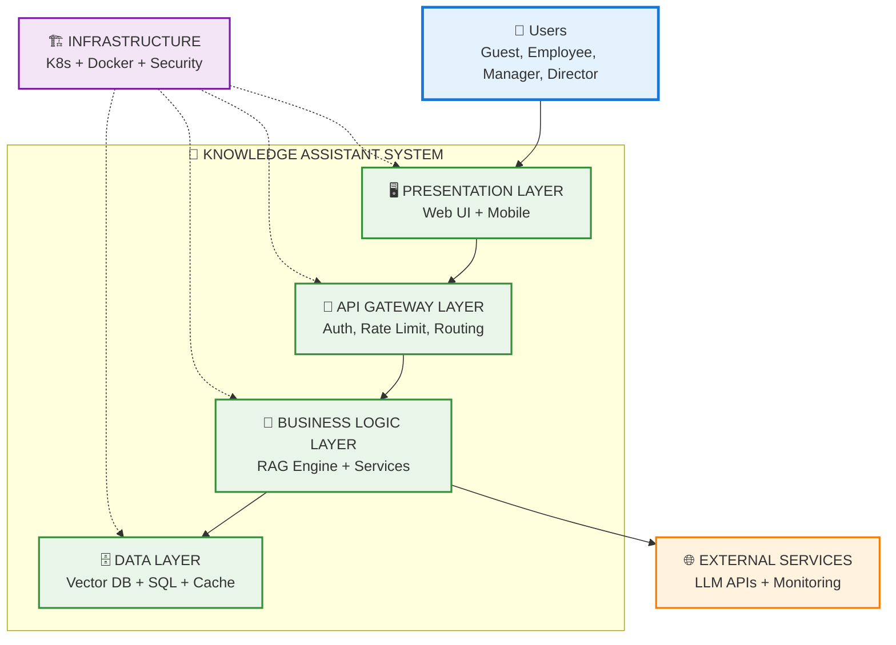
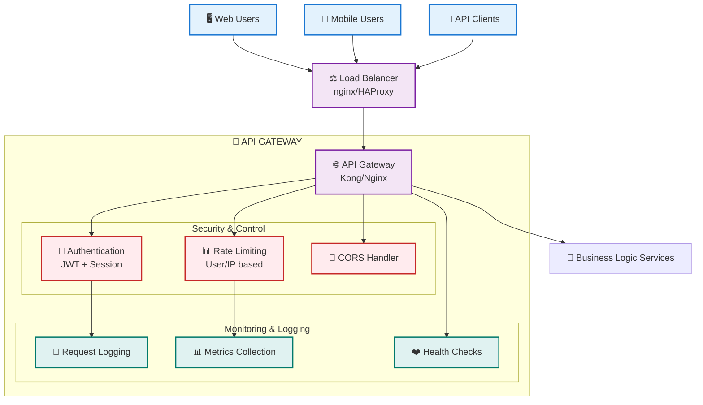
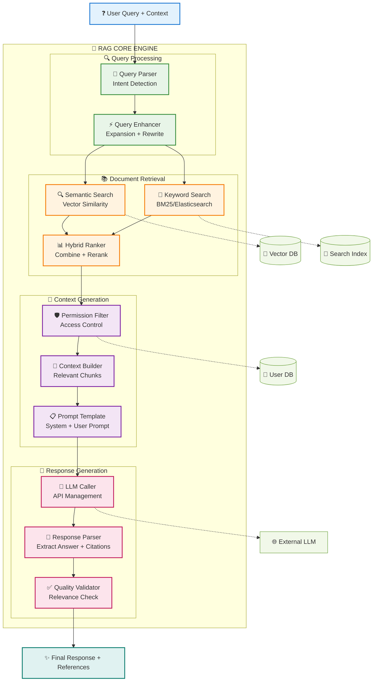
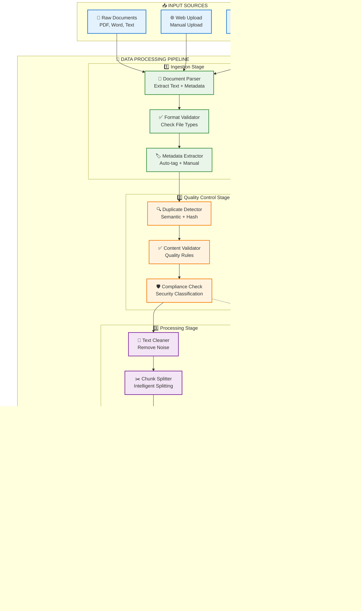
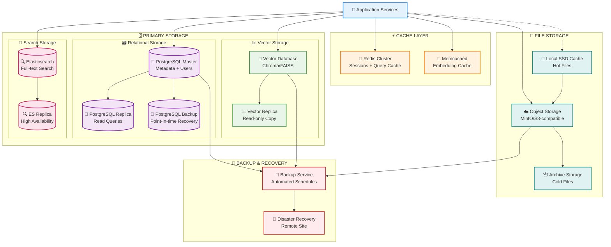
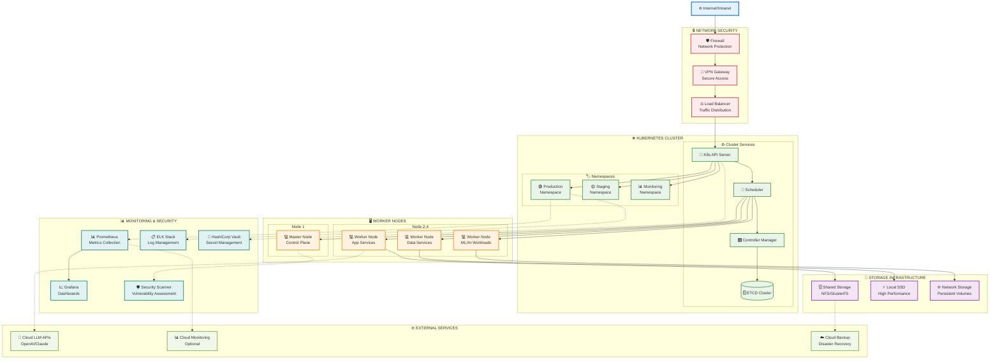

# KIẾN TRÚC GIẢI PHÁP ĐỀ XUẤT
## PROPOSED SOLUTION ARCHITECTURE

```mermaid
graph TB
    %% User Layer
    subgraph "👥 USER LAYER"
        Web[🖥️ Web Browser]
        Mobile[📱 Mobile App]
        API_Client[🔧 API Client]
    end
    
    %% Load Balancer & API Gateway
    LB[⚖️ Load Balancer<br/>nginx/HAProxy]
    
    %% API Gateway
    subgraph "🚪 API GATEWAY LAYER"
        Gateway[🌐 API Gateway<br/>Kong/Nginx]
        Auth[🔐 Authentication<br/>JWT/OAuth2]
        RateLimit[📊 Rate Limiting]
        Logging[📝 Request Logging]
    end
    
    %% Application Layer
    subgraph "💼 APPLICATION LAYER"
        subgraph "🤖 RAG Core Engine"
            QueryProcessor[🔍 Query Processor]
            Retriever[📚 Document Retriever]
            ContextBuilder[🧩 Context Builder]
            LLMOrchestrator[🎯 LLM Orchestrator]
        end
        
        subgraph "📊 Business Logic Services"
            UserMgmt[👤 User Management]
            DocMgmt[📄 Document Management]
            PermissionSvc[🛡️ Permission Service]
            AnalyticsSvc[📈 Analytics Service]
        end
        
        subgraph "🔧 Data Processing Pipeline"
            DataIngestion[📥 Data Ingestion]
            EmbeddingGen[🔢 Embedding Generator]
            QualityCheck[✅ Quality Control]
            ChunkProcessor[✂️ Chunk Processor]
        end
    end
    
    %% Cache Layer
    subgraph "⚡ CACHE LAYER"
        Redis[🔴 Redis<br/>Session & Query Cache]
        Memcached[💾 Memcached<br/>Embedding Cache]
    end
    
    %% Storage Layer
    subgraph "🗄️ STORAGE LAYER"
        subgraph "📊 Vector Storage"
            VectorDB[🔢 Vector Database<br/>Chroma/FAISS/Weaviate]
            EmbeddingIndex[📇 Embedding Index]
        end
        
        subgraph "🗃️ Relational Storage"
            PostgreSQL[(🐘 PostgreSQL<br/>Metadata & Users)]
            ReadReplica[(📖 Read Replica)]
        end
        
        subgraph "📁 File Storage"
            ObjectStore[☁️ Object Storage<br/>MinIO/S3-compatible]
            LocalFS[💽 Local File System]
        end
    end
    
    %% External Services
    subgraph "🌐 EXTERNAL SERVICES"
        LLMService[🧠 LLM Services<br/>OpenAI/Claude/Local LLM]
        EmbeddingAPI[🔢 Embedding API<br/>OpenAI/HuggingFace]
        MonitoringExt[📊 External Monitoring<br/>DataDog/NewRelic]
    end
    
    %% Infrastructure Layer
    subgraph "🏗️ INFRASTRUCTURE LAYER"
        subgraph "🐳 Container Platform"
            Kubernetes[☸️ Kubernetes Cluster]
            Docker[🐋 Docker Containers]
        end
        
        subgraph "📊 Monitoring & Logging"
            Prometheus[📊 Prometheus<br/>Metrics]
            Grafana[📈 Grafana<br/>Dashboards]
            ELKStack[📋 ELK Stack<br/>Logs]
        end
        
        subgraph "🔒 Security & Backup"
            Vault[🔐 HashiCorp Vault<br/>Secrets]
            Backup[💾 Backup Service]
            SecurityScan[🛡️ Security Scanner]
        end
    end
    
    %% Data Flow Connections
    Web --> LB
    Mobile --> LB
    API_Client --> LB
    
    LB --> Gateway
    Gateway --> Auth
    Gateway --> RateLimit
    Gateway --> Logging
    
    Auth --> UserMgmt
    Gateway --> QueryProcessor
    Gateway --> DocMgmt
    
    %% RAG Engine Flow
    QueryProcessor --> Retriever
    Retriever --> VectorDB
    Retriever --> PostgreSQL
    Retriever --> Redis
    
    Retriever --> ContextBuilder
    ContextBuilder --> LLMOrchestrator
    LLMOrchestrator --> LLMService
    
    %% Data Processing Flow
    DocMgmt --> DataIngestion
    DataIngestion --> ChunkProcessor
    ChunkProcessor --> QualityCheck
    QualityCheck --> EmbeddingGen
    EmbeddingGen --> EmbeddingAPI
    EmbeddingGen --> VectorDB
    EmbeddingGen --> PostgreSQL
    
    %% Storage Connections
    UserMgmt --> PostgreSQL
    DocMgmt --> PostgreSQL
    DocMgmt --> ObjectStore
    PermissionSvc --> PostgreSQL
    AnalyticsSvc --> PostgreSQL
    
    PostgreSQL --> ReadReplica
    VectorDB --> EmbeddingIndex
    
    %% Cache Connections
    QueryProcessor -.-> Redis
    Retriever -.-> Memcached
    UserMgmt -.-> Redis
    
    %% Infrastructure Connections
    Kubernetes --> Docker
    Prometheus --> Grafana
    ELKStack --> Logging
    Vault --> Auth
    Backup --> PostgreSQL
    Backup --> VectorDB
    Backup --> ObjectStore
    
    %% Monitoring Connections
    Prometheus -.-> QueryProcessor
    Prometheus -.-> PostgreSQL
    Prometheus -.-> VectorDB
    ELKStack -.-> Gateway
    MonitoringExt -.-> Kubernetes
    
    %% Styling
    classDef userLayer fill:#e3f2fd,stroke:#1976d2,stroke-width:2px
    classDef gatewayLayer fill:#f3e5f5,stroke:#7b1fa2,stroke-width:2px
    classDef appLayer fill:#e8f5e8,stroke:#388e3c,stroke-width:2px
    classDef cacheLayer fill:#fff3e0,stroke:#f57c00,stroke-width:2px
    classDef storageLayer fill:#fce4ec,stroke:#c2185b,stroke-width:2px
    classDef externalLayer fill:#f1f8e9,stroke:#689f38,stroke-width:2px
    classDef infraLayer fill:#e0f2f1,stroke:#00796b,stroke-width:2px
    
    class Web,Mobile,API_Client userLayer
    class Gateway,Auth,RateLimit,Logging gatewayLayer
    class QueryProcessor,Retriever,ContextBuilder,LLMOrchestrator,UserMgmt,DocMgmt,PermissionSvc,AnalyticsSvc,DataIngestion,EmbeddingGen,QualityCheck,ChunkProcessor appLayer
    class Redis,Memcached cacheLayer
    class VectorDB,EmbeddingIndex,PostgreSQL,ReadReplica,ObjectStore,LocalFS storageLayer
    class LLMService,EmbeddingAPI,MonitoringExt externalLayer
    class Kubernetes,Docker,Prometheus,Grafana,ELKStack,Vault,Backup,SecurityScan infraLayer
```



## 🏗️ **CHI TIẾT KIẾN TRÚC CÁC TẦNG**

### 1. **👥 USER LAYER - Tầng Người dùng**
- **Web Browser**: Giao diện chính cho desktop users
- **Mobile App**: Ứng dụng di động (tùy chọn trong phase 2)
- **API Client**: Cho tích hợp với các hệ thống khác

### 2. **🚪 API GATEWAY LAYER - Tầng Cổng API**
- **Load Balancer**: Phân tải traffic đến multiple instances
- **API Gateway**: Routing, protocol translation, API versioning
- **Authentication**: JWT-based auth với session management
- **Rate Limiting**: Chống DoS, quản lý quota per user
- **Request Logging**: Audit trail cho compliance

### 3. **💼 APPLICATION LAYER - Tầng Ứng dụng**

#### 🤖 **RAG Core Engine** (Trái tim của hệ thống)
- **Query Processor**: Xử lý và normalize câu hỏi người dùng
- **Document Retriever**: Tìm kiếm semantic trong vector space
- **Context Builder**: Xây dựng context từ retrieved documents
- **LLM Orchestrator**: Điều phối LLM calls và response generation

#### 📊 **Business Logic Services**
- **User Management**: CRUD operations cho users và roles
- **Document Management**: Upload, versioning, metadata management
- **Permission Service**: Authorization logic theo RBAC model
- **Analytics Service**: Usage metrics, performance analytics

#### 🔧 **Data Processing Pipeline**
- **Data Ingestion**: Batch và real-time data import
- **Chunk Processor**: Text chunking với configurable strategies
- **Quality Control**: Duplicate detection, content validation
- **Embedding Generator**: Vector generation từ text content

### 4. **⚡ CACHE LAYER - Tầng Cache**
- **Redis**: Session storage, query results cache, user permissions cache
- **Memcached**: High-frequency embedding vectors cache

### 5. **🗄️ STORAGE LAYER - Tầng Lưu trữ**

#### 📊 **Vector Storage**
- **Vector Database**: Primary storage cho embeddings (Chroma/FAISS)
- **Embedding Index**: Optimized indices for fast similarity search

#### 🗃️ **Relational Storage**  
- **PostgreSQL**: Master database cho metadata, users, permissions
- **Read Replica**: Load balancing cho read-heavy operations

#### 📁 **File Storage**
- **Object Storage**: Scalable storage cho original documents
- **Local FS**: Temporary storage cho processing pipeline

### 6. **🌐 EXTERNAL SERVICES - Dịch vụ Ngoài**
- **LLM Services**: OpenAI GPT-4, Claude, hoặc self-hosted models
- **Embedding API**: OpenAI embeddings hoặc HuggingFace models
- **External Monitoring**: Optional cloud monitoring services

### 7. **🏗️ INFRASTRUCTURE LAYER - Tầng Hạ tầng**

#### 🐳 **Container Platform**
- **Kubernetes**: Container orchestration, auto-scaling, service mesh
- **Docker**: Application containerization

#### 📊 **Monitoring & Logging**
- **Prometheus**: Metrics collection và alerting
- **Grafana**: Visualization dashboards
- **ELK Stack**: Centralized logging và log analysis

#### 🔒 **Security & Operations**
- **HashiCorp Vault**: Secrets management
- **Backup Service**: Automated backup cho tất cả storage layers
- **Security Scanner**: Vulnerability scanning cho containers

---

## 🔄 **DATA FLOW CHÍNH**

### **Query Processing Flow:**
```
User Question → API Gateway → Query Processor → 
Document Retriever → Vector DB + Permission Check → 
Context Builder → LLM Orchestrator → External LLM → 
Response với Citations
```

### **Document Ingestion Flow:**
```
Upload Document → Data Ingestion → Quality Check → 
Chunk Processor → Embedding Generator → 
Vector DB + Metadata → PostgreSQL
```

### **Permission Flow:**
```
User Request → Authentication → Permission Service → 
PostgreSQL lookup → Allow/Deny + Filtered Results
```

---

## 🎯 **THIẾT KẾ ĐẶC BIỆT**

### **🔧 Modular & Replaceable Components:**
- Mỗi service có thể thay thế độc lập (loose coupling)
- API-first design cho future integrations
- Configuration-driven behavior

### **📈 Scalability Considerations:**
- Horizontal scaling cho stateless services
- Database partitioning strategies
- Cache layers cho performance optimization

### **🛡️ Security by Design:**
- Multi-layer authentication & authorization
- Encryption at rest và in transit
- Comprehensive audit logging
- Regular security scanning

### **🔄 High Availability:**
- Multiple replicas cho critical services
- Database replication
- Circuit breaker patterns
- Graceful degradation strategies

Kiến trúc này đảm bảo **scalability, maintainability, security** và **performance** theo yêu cầu đã đề ra trong SRS document.

Bạn nói đúng! Tôi sẽ tách thành các diagram từ tổng quát đến chi tiết để dễ theo dõi hơn.

# KIẾN TRÚC HỆ THỐNG - PHÂN CẤP DIAGRAM

## 1. 🌐 **HIGH-LEVEL ARCHITECTURE OVERVIEW**



---

## 2. 🖥️ **PRESENTATION & API GATEWAY LAYER**



---

## 3. 🤖 **RAG CORE ENGINE - BUSINESS LOGIC**



---

## 4. 🔧 **DATA PROCESSING PIPELINE**



---

## 5. 🗄️ **DATA STORAGE ARCHITECTURE**



---

## 6. 🏗️ **INFRASTRUCTURE & DEPLOYMENT**



---

## 📋 **TỔNG KẾT KIẾN TRÚC**

### **🎯 Ưu điểm của kiến trúc này:**
1. **Modular Design**: Mỗi layer có thể phát triển và scale độc lập
2. **High Availability**: Multiple replicas và failover mechanisms  
3. **Security-First**: Multi-layer security với proper access controls
4. **Scalable**: Horizontal scaling cho mọi components
5. **Maintainable**: Clear separation of concerns và comprehensive monitoring

### **📈 Khả năng mở rộng:**
- **Vertical**: Tăng resources cho existing services
- **Horizontal**: Thêm replicas và worker nodes
- **Functional**: Dễ dàng thêm features mới qua API
- **Geographic**: Multi-region deployment ready

### **🔄 Data Flow tổng quan:**
```
User → Load Balancer → API Gateway → RAG Engine → 
Vector Search + Permission Check → LLM Processing → 
Response with Citations → Cache → User
```

Kiến trúc được thiết kế để đáp ứng tất cả yêu cầu trong SRS với khả năng mở rộng trong tương lai!
