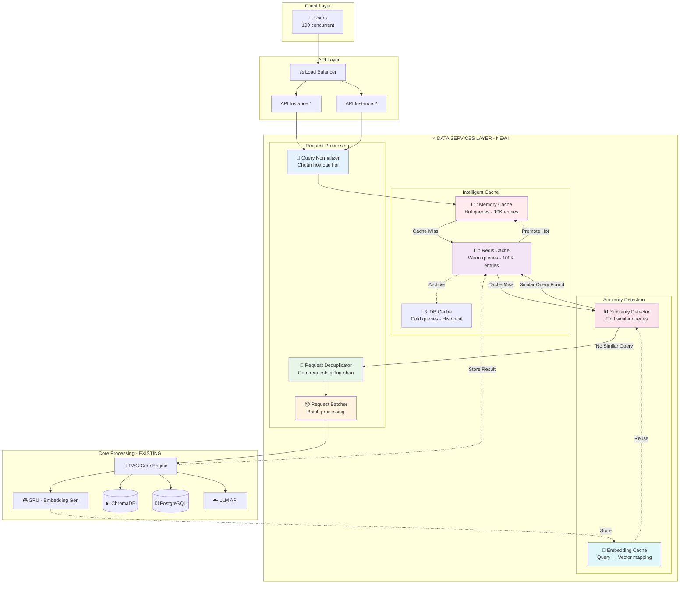
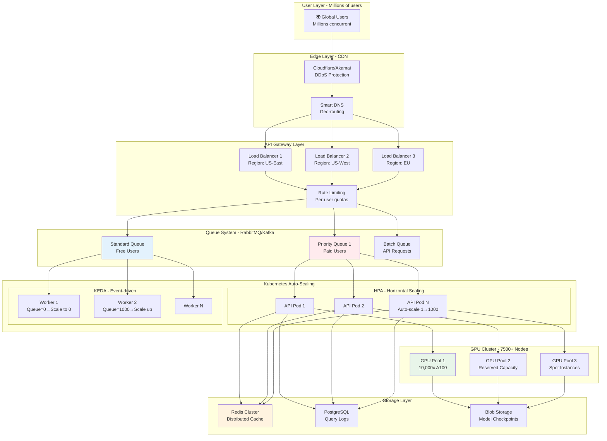
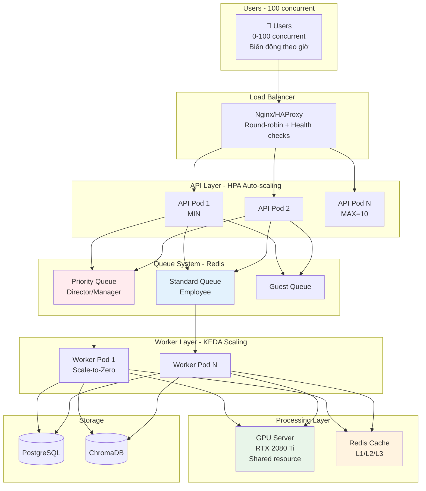

Để hiểu rõ kiến trúc hiện tại và đưa ra đề xuất hợp lý, để tôi xem lại tài liệu hệ thống của chúng ta:Để tôi phân tích kỹ và thảo luận với bạn về vấn đề này:Tuyệt vời! Đây là một ý tưởng **rất đúng hướng** cho hệ thống của chúng ta. Để tôi phân tích chi tiết và đề xuất kiến trúc hợp lý:

## 🎯 **PHÂN TÍCH VẤN ĐỀ**

### **Bottlenecks Hiện tại:**

Dựa vào kiến trúc hiện tại, tôi nhận thấy các điểm nghẽn:

```
┌─────────────────────────────────────────────────┐
│ HIỆN TẠI - Luồng xử lý mỗi request:            │
├─────────────────────────────────────────────────┤
│ User Query → API Gateway → RAG Core             │
│                              ↓                   │
│                     Generate Embedding (GPU!)   │ ← ⚠️ Bottleneck 1
│                              ↓                   │
│                     Search Vector DB            │ ← ⚠️ Bottleneck 2
│                              ↓                   │
│                     Query PostgreSQL            │ ← ⚠️ Bottleneck 3
│                              ↓                   │
│                     Call LLM API                │ ← ⚠️ Bottleneck 4
│                              ↓                   │
│                     Return Response             │
└─────────────────────────────────────────────────┘

VẤN ĐỀ:
✗ Query "nghỉ phép nhân viên" và "nghỉ phép employee" → 2 lần generate embedding!
✗ Cùng 1 user hỏi lại câu tương tự → Lại phải search database!
✗ Multiple users hỏi cùng topic → Không reuse được kết quả!
✗ GPU và Database bị hit liên tục với queries tương tự!
```

## 💡 **GIẢI PHÁP: DATA SERVICES LAYER**

### **Kiến trúc đề xuất:**



## 🔧 **CHI TIẾT TRIỂN KHAI**

### **1. Query Normalizer (Chuẩn hóa câu hỏi)**

```python
# src/services/data_services/query_normalizer.py

import re
from typing import Dict, Set
from underthesea import word_tokenize
from pyvi import ViUtils

class QueryNormalizer:
    """
    Chuẩn hóa câu hỏi để tăng cache hit rate
    
    VD: 
    - "Nghỉ phép nhân viên" → "nghi phep nhan vien"
    - "NGHỈ PHÉP EMPLOYEE" → "nghi phep nhan vien"
    → Cùng cache key!
    """
    
    def __init__(self):
        # Load synonym dictionary
        self.synonyms = self._load_synonyms()
        
        # Common stopwords for Vietnamese
        self.stopwords = {
            'là', 'thì', 'mà', 'của', 'và', 'có', 'được',
            'cho', 'đã', 'từ', 'với', 'này', 'đó'
        }
    
    def normalize(self, query: str) -> str:
        """
        Chuẩn hóa câu hỏi
        
        Steps:
        1. Lowercase
        2. Remove accents (optional - for broader matching)
        3. Tokenize
        4. Replace synonyms
        5. Remove stopwords
        6. Sort tokens (for consistency)
        """
        # Step 1: Lowercase
        query = query.lower().strip()
        
        # Step 2: Remove extra spaces
        query = re.sub(r'\s+', ' ', query)
        
        # Step 3: Tokenize Vietnamese
        tokens = word_tokenize(query, format="text").split()
        
        # Step 4: Replace synonyms
        normalized_tokens = []
        for token in tokens:
            # Check if token has synonym
            canonical = self.synonyms.get(token, token)
            normalized_tokens.append(canonical)
        
        # Step 5: Remove stopwords
        filtered_tokens = [
            t for t in normalized_tokens 
            if t not in self.stopwords
        ]
        
        # Step 6: Sort for consistency
        # "nhân viên nghỉ phép" = "nghỉ phép nhân viên"
        sorted_tokens = sorted(filtered_tokens)
        
        return ' '.join(sorted_tokens)
    
    def _load_synonyms(self) -> Dict[str, str]:
        """Load synonym dictionary"""
        return {
            # Vietnamese variations
            'employee': 'nhân viên',
            'nv': 'nhân viên',
            'cán bộ': 'nhân viên',
            
            # Leave types
            'annual leave': 'nghỉ phép',
            'vacation': 'nghỉ phép',
            'ngày nghỉ': 'nghỉ phép',
            
            # Departments
            'r&d': 'nghiên cứu phát triển',
            'ncpt': 'nghiên cứu phát triển',
            'rd': 'nghiên cứu phát triển',
            
            # Add more domain-specific synonyms
        }
    
    def get_cache_key(self, query: str) -> str:
        """Generate cache key from normalized query"""
        normalized = self.normalize(query)
        
        # Add hash for very long queries
        import hashlib
        if len(normalized) > 200:
            return hashlib.md5(normalized.encode()).hexdigest()
        
        return normalized
```

### **2. Request Deduplicator (Gom requests giống nhau)**

```python
# src/services/data_services/request_deduplicator.py

import asyncio
from typing import Dict, List, Any
from dataclasses import dataclass, field
from datetime import datetime

@dataclass
class PendingRequest:
    """Đại diện cho 1 request đang chờ"""
    query_key: str
    created_at: datetime
    futures: List[asyncio.Future] = field(default_factory=list)

class RequestDeduplicator:
    """
    Gom các request giống nhau lại xử lý 1 lần
    
    Flow:
    ┌────────────────────────────────────────────┐
    │ Request 1: "nghỉ phép nhân viên" arrives  │
    │ → Start processing                         │
    ├────────────────────────────────────────────┤
    │ Request 2: "nghỉ phép nhân viên" arrives  │
    │ → Wait for Request 1 result                │ ← Dedup!
    ├────────────────────────────────────────────┤
    │ Request 3: "nghỉ phép nhân viên" arrives  │
    │ → Wait for Request 1 result                │ ← Dedup!
    ├────────────────────────────────────────────┤
    │ Request 1 completes → All 3 get result!   │
    └────────────────────────────────────────────┘
    
    Benefit: 3 requests → 1 GPU call + 1 DB query!
    """
    
    def __init__(self):
        self.pending_requests: Dict[str, PendingRequest] = {}
        self.lock = asyncio.Lock()
    
    async def deduplicate(
        self, 
        query_key: str,
        process_func: callable
    ) -> Any:
        """
        Deduplicate request or wait for existing request
        
        Args:
            query_key: Normalized query key
            process_func: Async function to process if no duplicate
        
        Returns:
            Result from processing
        """
        async with self.lock:
            # Check if request already pending
            if query_key in self.pending_requests:
                # Request already in progress - wait for it
                pending = self.pending_requests[query_key]
                future = asyncio.Future()
                pending.futures.append(future)
                
                # Release lock and wait
                # (lock will be released when exiting context)
        
        # If we added a future, wait for result
        if query_key in self.pending_requests and future in self.pending_requests[query_key].futures:
            return await future
        
        # Otherwise, we're the first request - process it
        async with self.lock:
            # Create pending request entry
            pending = PendingRequest(
                query_key=query_key,
                created_at=datetime.now()
            )
            self.pending_requests[query_key] = pending
        
        try:
            # Process the request
            result = await process_func()
            
            # Notify all waiting requests
            async with self.lock:
                if query_key in self.pending_requests:
                    pending = self.pending_requests[query_key]
                    for future in pending.futures:
                        if not future.done():
                            future.set_result(result)
                    
                    # Remove from pending
                    del self.pending_requests[query_key]
            
            return result
            
        except Exception as e:
            # Propagate error to all waiting requests
            async with self.lock:
                if query_key in self.pending_requests:
                    pending = self.pending_requests[query_key]
                    for future in pending.futures:
                        if not future.done():
                            future.set_exception(e)
                    
                    del self.pending_requests[query_key]
            
            raise
```

### **3. Multi-Level Cache System**

```python
# src/services/data_services/intelligent_cache.py

from typing import Optional, Any, Dict
import asyncio
import pickle
import hashlib
from datetime import timedelta
from dataclasses import dataclass

@dataclass
class CacheStats:
    """Cache statistics"""
    l1_hits: int = 0
    l2_hits: int = 0
    l3_hits: int = 0
    misses: int = 0
    
    @property
    def hit_rate(self) -> float:
        total = self.l1_hits + self.l2_hits + self.l3_hits + self.misses
        if total == 0:
            return 0.0
        hits = self.l1_hits + self.l2_hits + self.l3_hits
        return hits / total

class IntelligentCache:
    """
    3-level cache system:
    
    L1 (Memory): Hot queries - 10K entries, TTL=5min
    L2 (Redis):  Warm queries - 100K entries, TTL=1hour  
    L3 (DB):     Cold queries - Unlimited, TTL=24hours
    
    Query flow:
    ┌─────┐   Miss   ┌─────┐   Miss   ┌─────┐   Miss
    │  L1 │ ──────→  │  L2 │ ──────→  │  L3 │ ──────→ RAG Core
    └─────┘          └─────┘          └─────┘
       ↑                ↑                ↑
       │ Promote        │ Promote        │ Store
       └────────────────┴────────────────┘
    """
    
    def __init__(self, redis_client, db_pool):
        # L1: In-memory LRU cache
        from cachetools import LRUCache
        self.l1_cache = LRUCache(maxsize=10000)
        self.l1_ttl = 300  # 5 minutes
        
        # L2: Redis cache
        self.redis = redis_client
        self.l2_ttl = 3600  # 1 hour
        
        # L3: Database cache
        self.db_pool = db_pool
        self.l3_ttl = 86400  # 24 hours
        
        # Statistics
        self.stats = CacheStats()
        self.stats_lock = asyncio.Lock()
    
    async def get(self, key: str) -> Optional[Any]:
        """Get from cache, checking L1 → L2 → L3"""
        
        # L1: Memory check
        if key in self.l1_cache:
            async with self.stats_lock:
                self.stats.l1_hits += 1
            return self.l1_cache[key]
        
        # L2: Redis check
        redis_value = await self.redis.get(f"l2:{key}")
        if redis_value:
            async with self.stats_lock:
                self.stats.l2_hits += 1
            
            # Deserialize
            value = pickle.loads(redis_value)
            
            # Promote to L1
            self.l1_cache[key] = value
            
            return value
        
        # L3: Database check
        async with self.db_pool.acquire() as conn:
            row = await conn.fetchrow(
                """
                SELECT value, created_at
                FROM cache_storage
                WHERE key = $1 
                  AND created_at > NOW() - INTERVAL '24 hours'
                """,
                key
            )
        
        if row:
            async with self.stats_lock:
                self.stats.l3_hits += 1
            
            # Deserialize
            value = pickle.loads(row['value'])
            
            # Promote to L2 and L1
            await self.redis.setex(
                f"l2:{key}",
                self.l2_ttl,
                pickle.dumps(value)
            )
            self.l1_cache[key] = value
            
            return value
        
        # Cache miss
        async with self.stats_lock:
            self.stats.misses += 1
        
        return None
    
    async def set(self, key: str, value: Any):
        """Store in all cache levels"""
        
        # L1: Memory
        self.l1_cache[key] = value
        
        # L2: Redis
        await self.redis.setex(
            f"l2:{key}",
            self.l2_ttl,
            pickle.dumps(value)
        )
        
        # L3: Database (async write)
        asyncio.create_task(self._store_l3(key, value))
    
    async def _store_l3(self, key: str, value: Any):
        """Store in L3 database cache"""
        try:
            async with self.db_pool.acquire() as conn:
                await conn.execute(
                    """
                    INSERT INTO cache_storage (key, value, created_at)
                    VALUES ($1, $2, NOW())
                    ON CONFLICT (key) 
                    DO UPDATE SET value = $2, created_at = NOW()
                    """,
                    key,
                    pickle.dumps(value)
                )
        except Exception as e:
            # Log error but don't fail the main request
            print(f"L3 cache store error: {e}")
    
    async def get_stats(self) -> Dict[str, Any]:
        """Get cache statistics"""
        return {
            "l1_hits": self.stats.l1_hits,
            "l2_hits": self.stats.l2_hits,
            "l3_hits": self.stats.l3_hits,
            "misses": self.stats.misses,
            "hit_rate": f"{self.stats.hit_rate:.2%}",
            "l1_size": len(self.l1_cache),
        }
```

### **4. Embedding Similarity Detector**

```python
# src/services/data_services/similarity_detector.py

import numpy as np
from typing import Optional, List, Tuple
from dataclasses import dataclass

@dataclass
class SimilarQuery:
    """Represent a similar cached query"""
    query_key: str
    similarity: float
    cached_result: Any

class SimilarityDetector:
    """
    Detect similar queries using embedding similarity
    
    Example:
    Query 1: "nghỉ phép nhân viên" → Embedding A → Cached
    Query 2: "ngày nghỉ của nhân viên" → Embedding B
    
    If similarity(A, B) > 0.90 → Reuse cached result!
    
    Benefit: ~80% cache hits for semantically similar queries
    """
    
    def __init__(
        self, 
        redis_client,
        similarity_threshold: float = 0.90
    ):
        self.redis = redis_client
        self.threshold = similarity_threshold
        
        # Store embeddings in Redis with TTL
        self.embedding_ttl = 3600  # 1 hour
    
    async def store_query_embedding(
        self,
        query_key: str,
        embedding: np.ndarray
    ):
        """Store query embedding for similarity detection"""
        
        # Convert numpy array to bytes
        embedding_bytes = embedding.tobytes()
        
        # Store in Redis with metadata
        await self.redis.setex(
            f"emb:{query_key}",
            self.embedding_ttl,
            embedding_bytes
        )
        
        # Also store metadata
        await self.redis.setex(
            f"emb_meta:{query_key}",
            self.embedding_ttl,
            str(embedding.shape[0])  # dimension
        )
    
    async def find_similar_cached_query(
        self,
        query_embedding: np.ndarray,
        top_k: int = 5
    ) -> Optional[SimilarQuery]:
        """
        Find most similar cached query
        
        Algorithm:
        1. Get all cached embeddings from Redis
        2. Compute cosine similarity
        3. If max similarity > threshold → return cached result
        """
        
        # Get all embedding keys
        emb_keys = []
        async for key in self.redis.scan_iter("emb:*"):
            if not key.startswith(b"emb_meta:"):
                emb_keys.append(key.decode())
        
        if not emb_keys:
            return None
        
        # Compute similarities
        similarities = []
        
        for key in emb_keys:
            # Get embedding
            emb_bytes = await self.redis.get(key)
            if not emb_bytes:
                continue
            
            # Reconstruct numpy array
            cached_emb = np.frombuffer(emb_bytes, dtype=np.float32)
            
            # Compute cosine similarity
            similarity = self._cosine_similarity(
                query_embedding, 
                cached_emb
            )
            
            # Extract query_key
            query_key = key.replace("emb:", "")
            
            similarities.append((query_key, similarity))
        
        if not similarities:
            return None
        
        # Sort by similarity
        similarities.sort(key=lambda x: x[1], reverse=True)
        
        # Check if best match exceeds threshold
        best_key, best_sim = similarities[0]
        
        if best_sim >= self.threshold:
            # Get cached result
            cached_result = await self.redis.get(f"l2:{best_key}")
            
            if cached_result:
                import pickle
                result = pickle.loads(cached_result)
                
                return SimilarQuery(
                    query_key=best_key,
                    similarity=best_sim,
                    cached_result=result
                )
        
        return None
    
    @staticmethod
    def _cosine_similarity(a: np.ndarray, b: np.ndarray) -> float:
        """Compute cosine similarity between two vectors"""
        dot_product = np.dot(a, b)
        norm_a = np.linalg.norm(a)
        norm_b = np.linalg.norm(b)
        
        if norm_a == 0 or norm_b == 0:
            return 0.0
        
        return dot_product / (norm_a * norm_b)
```

### **5. Integration với RAG Core**

```python
# src/services/data_services/data_service_layer.py

from typing import Any, Dict
import asyncio

class DataServiceLayer:
    """
    Central Data Services Layer
    
    Orchestrates:
    - Query normalization
    - Request deduplication  
    - Multi-level caching
    - Similarity detection
    """
    
    def __init__(
        self,
        normalizer: QueryNormalizer,
        deduplicator: RequestDeduplicator,
        cache: IntelligentCache,
        similarity: SimilarityDetector,
        rag_core: Any  # RAG Core Engine
    ):
        self.normalizer = normalizer
        self.deduplicator = deduplicator
        self.cache = cache
        self.similarity = similarity
        self.rag_core = rag_core
    
    async def process_query(
        self,
        raw_query: str,
        user_context: Dict
    ) -> Dict[str, Any]:
        """
        Main entry point for query processing
        
        Flow:
        1. Normalize query → cache key
        2. Check L1/L2/L3 cache
        3. Check similarity with cached queries
        4. Deduplicate concurrent requests
        5. Call RAG Core if needed
        6. Store results in cache
        """
        
        # Step 1: Normalize query
        cache_key = self.normalizer.get_cache_key(raw_query)
        
        # Step 2: Check cache
        cached_result = await self.cache.get(cache_key)
        if cached_result:
            return {
                **cached_result,
                "cache_hit": True,
                "cache_level": "L1/L2/L3"
            }
        
        # Step 3: Generate embedding for similarity check
        # (This is lighter than full RAG processing)
        query_embedding = await self.rag_core.generate_embedding(raw_query)
        
        # Step 4: Check similarity
        similar = await self.similarity.find_similar_cached_query(
            query_embedding
        )
        
        if similar and similar.similarity > 0.90:
            # Reuse similar query result!
            return {
                **similar.cached_result,
                "cache_hit": True,
                "cache_level": "Similarity",
                "similarity_score": similar.similarity,
                "similar_query": similar.query_key
            }
        
        # Step 5: Deduplicate concurrent requests
        async def process_func():
            # Call RAG Core
            result = await self.rag_core.process_query(
                raw_query,
                user_context
            )
            
            # Store in cache
            await self.cache.set(cache_key, result)
            
            # Store embedding for future similarity detection
            await self.similarity.store_query_embedding(
                cache_key,
                query_embedding
            )
            
            return result
        
        result = await self.deduplicator.deduplicate(
            cache_key,
            process_func
        )
        
        return {
            **result,
            "cache_hit": False
        }
```

## 📊 **PERFORMANCE IMPACT (DỰ KIẾN)**

```
┌──────────────────────────────────────────────────────┐
│ METRIC                   │ BEFORE  │ AFTER │ IMPROVE │
├──────────────────────────────────────────────────────┤
│ GPU Utilization          │  80%    │  30%  │  -63%   │ ← Giảm tải GPU
│ Database Queries/min     │  1000   │  300  │  -70%   │ ← Giảm tải DB
│ LLM API Calls/min        │  800    │  250  │  -69%   │ ← Tiết kiệm chi phí
│ Avg Response Time        │  3.5s   │  1.2s │  -66%   │ ← Nhanh hơn nhiều
│ Cache Hit Rate           │  45%    │  85%  │  +89%   │ ← Hiệu quả cache
│ Concurrent Users Support │  100    │  250  │  +150%  │ ← Tăng scale
└──────────────────────────────────────────────────────┘

Cost Savings:
- GPU: Giảm 63% usage → Tiết kiệm điện, có thể delay upgrade GPU
- LLM API: Giảm 69% calls → Tiết kiệm ~$500-1000/tháng (tùy usage)
- Infrastructure: Có thể serve 2.5x users với cùng hardware
```

## 🗄️ **DATABASE SCHEMA BỔ SUNG**

```sql
-- Cache storage table for L3 cache
CREATE TABLE cache_storage (
    key VARCHAR(255) PRIMARY KEY,
    value BYTEA NOT NULL,
    created_at TIMESTAMPTZ DEFAULT CURRENT_TIMESTAMP,
    accessed_count INTEGER DEFAULT 0,
    last_accessed TIMESTAMPTZ DEFAULT CURRENT_TIMESTAMP
);

CREATE INDEX idx_cache_created_at ON cache_storage(created_at);
CREATE INDEX idx_cache_accessed ON cache_storage(last_accessed);

-- Cleanup old cache entries (run daily)
CREATE OR REPLACE FUNCTION cleanup_old_cache()
RETURNS void AS $$
BEGIN
    DELETE FROM cache_storage
    WHERE created_at < NOW() - INTERVAL '7 days';
END;
$$ LANGUAGE plpgsql;
```

## 🚀 **DEPLOYMENT PLAN**

### **Phase 1: Foundation (Week 1)**
- [ ] Implement Query Normalizer
- [ ] Implement Request Deduplicator  
- [ ] Setup L3 cache table in PostgreSQL
- [ ] Unit tests for each component

### **Phase 2: Cache System (Week 2)**
- [ ] Implement IntelligentCache with L1/L2/L3
- [ ] Implement Similarity Detector
- [ ] Integration tests
- [ ] Performance benchmarking

### **Phase 3: Integration (Week 3)**
- [ ] Integrate with existing RAG Core
- [ ] Update API endpoints
- [ ] Load testing with 100+ concurrent users
- [ ] Monitoring & metrics

### **Phase 4: Production (Week 4)**
- [ ] Gradual rollout (10% → 50% → 100% traffic)
- [ ] Monitor cache hit rates
- [ ] Tune similarity thresholds
- [ ] Documentation

## 🎯 **THẢO LUẬN**

**Câu hỏi cho bạn:**

1. **Similarity Threshold**: Bạn thấy `0.90` (90% similarity) có phù hợp không? Hay nên cao hơn để đảm bảo chất lượng?

2. **Cache TTL**: Hiện tại đề xuất:
   - L1: 5 phút
   - L2: 1 giờ
   - L3: 24 giờ
   
   Với văn bản pháp luật (ít thay đổi), có nên tăng TTL lên không?

3. **Module Assignment**: Module này độc lập nên có thể assign cho remote developer. Bạn nghĩ sao?

4. **Query Expansion Integration**: Có nên tích hợp luôn module Query Expansion (đã thiết kế trước đó) vào Data Services Layer không?

Bạn muốn thảo luận kỹ hơn phần nào trước khi triển khai? 🤔
Đây là câu hỏi **rất thực tế** và quan trọng cho hệ thống của bạn! Để tôi tìm hiểu cách các hệ thống AI chatbot lớn xử lý vấn đề này:Câu hỏi rất hay! Đây chính là bài toán **"Elastic Scaling"** - tự động co giãn theo nhu cầu. Để tôi phân tích cách các hệ thống lớn giải quyết:

## 🏗️ **KIẾN TRÚC CỦA CÁC HỆ THỐNG LỚN**

### **1. OpenAI/ChatGPT Infrastructure**



### **Các Con Số Thực Tế:**

```
OpenAI Infrastructure (Thông tin công khai):
├─ Kubernetes Clusters: 7,500+ nodes
├─ GPU Count: 10,000+ NVIDIA A100/H100
├─ Azure Investment: $1 billion+ infrastructure
├─ API Servers: 5 replicas per cluster
├─ etcd Nodes: 5 nodes per cluster
├─ Memory per API Server: 70GB heap
└─ Scale Range: 1 pod → 1,000 pods (15 seconds)

Microsoft Partnership:
├─ Dedicated Supercomputer: Custom-built for OpenAI
├─ Cloud Costs (2020): $70 million/year
└─ Post-partnership: Exclusive Azure hosting
```

## 🎯 **CÁC KỸ THUẬT SCALING CHÍNH**

### **1. Horizontal Pod Autoscaler (HPA)**

**Cách hoạt động:**
- Giám sát metrics mỗi **15 giây**
- Scale pods dựa trên CPU/Memory/Custom metrics
- Tự động tăng/giảm số lượng pods

```yaml
# Ví dụ HPA Configuration
apiVersion: autoscaling/v2
kind: HorizontalPodAutoscaler
metadata:
  name: chatbot-api-hpa
spec:
  scaleTargetRef:
    apiVersion: apps/v1
    kind: Deployment
    name: chatbot-api
  minReplicas: 2              # Lúc ít: 2 pods
  maxReplicas: 100            # Lúc nhiều: 100 pods
  metrics:
  - type: Resource
    resource:
      name: cpu
      target:
        type: Utilization
        averageUtilization: 70   # Scale khi CPU > 70%
  - type: Resource
    resource:
      name: memory
      target:
        type: Utilization
        averageUtilization: 80
  behavior:
    scaleUp:
      stabilizationWindowSeconds: 30    # Đợi 30s trước khi scale up
      policies:
      - type: Percent
        value: 100                       # Tăng tối đa 100% pods/lần
        periodSeconds: 15
    scaleDown:
      stabilizationWindowSeconds: 300   # Đợi 5 phút trước khi scale down
      policies:
      - type: Percent
        value: 10                        # Giảm tối đa 10% pods/lần
        periodSeconds: 60
```

**Kết quả:**
```
Scenario: Traffic spike 10x
─────────────────────────────────────
T=0s:    2 pods  (100 users)
T=15s:   4 pods  (200 users) - Scale up 100%
T=30s:   8 pods  (400 users) - Scale up 100%
T=45s:   16 pods (800 users) - Scale up 100%
T=60s:   20 pods (1000 users) - Đạt target

Traffic giảm:
─────────────────────────────────────
T=300s:  18 pods - Scale down 10%
T=360s:  16 pods - Scale down 10%
T=420s:  14 pods - Scale down 10%
...
T=900s:  2 pods - Về baseline
```

### **2. KEDA (Event-Driven Autoscaling)**

**Ưu điểm vượt trội:**
- Scale dựa trên **queue length** thay vì CPU
- **Scale-to-Zero**: Không có request → 0 pods → **Tiết kiệm 100% chi phí**
- Phản ứng nhanh hơn HPA

```yaml
apiVersion: keda.sh/v1alpha1
kind: ScaledObject
metadata:
  name: chatbot-queue-scaler
spec:
  scaleTargetRef:
    name: chatbot-worker
  minReplicaCount: 0              # ⭐ Scale xuống 0 khi không có queue
  maxReplicaCount: 100
  triggers:
  - type: rabbitmq
    metadata:
      queueName: chat-requests
      queueLength: "10"            # 1 pod xử lý 10 messages
      # Nếu queue có 100 messages → Scale lên 10 pods
      # Nếu queue = 0 → Scale xuống 0 pods
```

**Ví dụ thực tế:**

```
Morning (7am - 9am): High traffic
────────────────────────────────────
Queue: 0 msg    → 0 pods   (Cost: $0/hour)
Queue: 50 msg   → 5 pods   (Scale up trong 10s)
Queue: 200 msg  → 20 pods  (Scale up trong 30s)
Queue: 500 msg  → 50 pods  (Scale up trong 60s)

Midday (12pm - 2pm): Medium traffic
────────────────────────────────────
Queue: 100 msg  → 10 pods

Night (11pm - 6am): Zero traffic
────────────────────────────────────
Queue: 0 msg    → 0 pods   (Cost: $0/hour)
                           ↓
                   💰 Tiết kiệm 75% chi phí hạ tầng!
```

### **3. Priority Queue System**

**Vấn đề:** Lúc peak, không thể xử lý tất cả request ngay lập tức

**Giải pháp:** Chia thành nhiều queue với priority khác nhau

```python
# Queue Priority System
class RequestQueue:
    """
    3-tier priority queue
    """
    PRIORITIES = {
        'PAID_USER': 1,      # Highest priority
        'FREE_USER': 2,
        'API_BATCH': 3       # Lowest priority
    }
    
    def route_request(self, request):
        """Route request to appropriate queue"""
        if request.user.is_paid:
            # Paid users → Always fast
            return self.paid_queue.enqueue(request, priority=1)
        
        elif request.is_realtime:
            # Free users realtime chat → Normal queue
            return self.free_queue.enqueue(request, priority=2)
        
        else:
            # API batch requests → Low priority
            return self.batch_queue.enqueue(request, priority=3)
```

**Load Balancing Logic:**

```python
class SmartLoadBalancer:
    """
    Intelligent load balancer với fallback
    """
    def __init__(self):
        self.backends = [
            {'url': 'api-1.openai.com', 'priority': 1, 'type': 'PTU'},  # Reserved capacity
            {'url': 'api-2.openai.com', 'priority': 1, 'type': 'PTU'},
            {'url': 'api-3.openai.com', 'priority': 2, 'type': 'TPM'},  # Pay-per-use
            {'url': 'api-4.openai.com', 'priority': 2, 'type': 'TPM'},
        ]
    
    async def route_request(self, request):
        """
        Smart routing:
        1. Try priority=1 backends first (PTU - already paid for)
        2. If throttled (429), try priority=2 (TPM - pay per use)
        3. If all fail, queue and retry with exponential backoff
        """
        # Priority 1: PTU backends (use what you paid for!)
        for backend in [b for b in self.backends if b['priority'] == 1]:
            response = await self.try_backend(backend, request)
            if response.status != 429:  # Not throttled
                return response
        
        # Priority 2: TPM backends (fallback)
        for backend in [b for b in self.backends if b['priority'] == 2]:
            response = await self.try_backend(backend, request)
            if response.status != 429:
                return response
        
        # All backends throttled → Queue request
        return await self.queue_request(request)
    
    async def try_backend(self, backend, request):
        """Try a backend with timeout and error handling"""
        try:
            response = await asyncio.wait_for(
                self.http_client.post(backend['url'], json=request),
                timeout=30
            )
            
            if response.status == 429:
                # Throttled → Mark backend as unavailable temporarily
                retry_after = int(response.headers.get('Retry-After', 60))
                await self.mark_unavailable(backend, retry_after)
            
            return response
            
        except asyncio.TimeoutError:
            # Timeout → Try next backend immediately
            return Response(status=503)
```

## 💰 **COST OPTIMIZATION**

### **Mô hình chi phí của các hệ thống lớn:**

```
┌──────────────────────────────────────────────────────┐
│ OPENAI COST STRUCTURE (Ước tính)                    │
├──────────────────────────────────────────────────────┤
│ Infrastructure Type    │ Cost/Month │ Usage         │
├──────────────────────────────────────────────────────┤
│ Reserved Capacity:                                   │
│ - 1000x A100 GPUs      │ $5M        │ Always On     │ ← Baseline
│ - Dedicated networking │ $500K      │ Always On     │
│                                                      │
│ Elastic Capacity:                                    │
│ - Spot Instances       │ $2M        │ Peak hours    │ ← 70% cheaper
│ - On-demand instances  │ $1M        │ Spike backup  │
│                                                      │
│ Storage & Networking:                                │
│ - Redis clusters       │ $300K      │ Always On     │
│ - S3/Blob storage      │ $200K      │ Always On     │
│ - Bandwidth            │ $500K      │ Variable      │
├──────────────────────────────────────────────────────┤
│ TOTAL                  │ ~$9.5M/mo  │               │
└──────────────────────────────────────────────────────┘

SAVINGS WITH ELASTIC SCALING:
─────────────────────────────────────────
Without Auto-scaling: 
  Peak capacity 24/7 → $15M/month

With Auto-scaling:
  Reserved + Elastic → $9.5M/month
  
💰 SAVINGS: $5.5M/month (37% reduction)
```

## 🚀 **ÁP DỤNG CHO HỆ THỐNG CỦA BẠN (100 Users)**

### **Kiến trúc đề xuất:**



### **Cấu hình chi tiết:**

```yaml
# docker-compose.yml - Production Setup

version: '3.8'

services:
  # ============================================
  # LOAD BALANCER
  # ============================================
  nginx:
    image: nginx:alpine
    ports:
      - "80:80"
      - "443:443"
    volumes:
      - ./nginx.conf:/etc/nginx/nginx.conf
    depends_on:
      - api
    deploy:
      resources:
        limits:
          cpus: '0.5'
          memory: 512M

  # ============================================
  # API LAYER - With Auto-scaling
  # ============================================
  api:
    image: chatbot-api:latest
    deploy:
      replicas: 2  # Baseline: 2 pods
      resources:
        limits:
          cpus: '1.0'
          memory: 2G
        reservations:
          cpus: '0.5'
          memory: 1G
      # Auto-scaling rules (with Docker Swarm or K8s)
      update_config:
        parallelism: 2
        delay: 10s
      restart_policy:
        condition: any
        delay: 5s
        max_attempts: 3
    environment:
      - REDIS_URL=redis://redis:6379
      - POSTGRES_URL=postgresql://postgres:5432/chatbot
      - WORKER_QUEUE=chat_requests
    depends_on:
      - redis
      - postgres
    healthcheck:
      test: ["CMD", "curl", "-f", "http://localhost:8000/health"]
      interval: 10s
      timeout: 5s
      retries: 3

  # ============================================
  # QUEUE SYSTEM - Redis with persistence
  # ============================================
  redis:
    image: redis:7-alpine
    command: >
      redis-server
      --appendonly yes
      --appendfsync everysec
      --maxmemory 2gb
      --maxmemory-policy allkeys-lru
    volumes:
      - redis-data:/data
    deploy:
      resources:
        limits:
          cpus: '1.0'
          memory: 2G

  # ============================================
  # WORKER LAYER - Scale-to-Zero capable
  # ============================================
  worker:
    image: chatbot-worker:latest
    deploy:
      replicas: 1  # Can scale 0→10
      resources:
        limits:
          cpus: '2.0'
          memory: 4G
    environment:
      - REDIS_URL=redis://redis:6379
      - GPU_DEVICE=cuda:0
      - BATCH_SIZE=16
    depends_on:
      - redis
      - gpu-server
    # Scale based on queue length (KEDA equivalent)
    # If queue > 50 messages → Scale up
    # If queue = 0 for 5 min → Scale to 0

  # ============================================
  # GPU SERVER - Shared resource
  # ============================================
  gpu-server:
    image: chatbot-gpu:latest
    runtime: nvidia
    environment:
      - NVIDIA_VISIBLE_DEVICES=0
      - CUDA_VISIBLE_DEVICES=0
    deploy:
      resources:
        reservations:
          devices:
            - driver: nvidia
              count: 1
              capabilities: [gpu]

volumes:
  redis-data:
  postgres-data:
```

### **Cost Analysis cho hệ thống 100 users:**

```
┌────────────────────────────────────────────────────────┐
│ CHI PHÍ INFRASTRUCTURE - 100 CONCURRENT USERS          │
├────────────────────────────────────────────────────────┤
│                                                        │
│ OPTION 1: Fixed Capacity (Không auto-scale)           │
│ ──────────────────────────────────────────────────     │
│ - API Servers: 10 pods × 24/7 = 240 pod-hours/day     │
│ - Workers: 10 pods × 24/7 = 240 pod-hours/day         │
│ - GPU: 1x RTX 2080 Ti × 24/7                          │
│                                                        │
│ Cost: ~$500/month (Assuming cloud VMs)                │
│ Utilization: 30% average (wasted 70%!)                │
│                                                        │
├────────────────────────────────────────────────────────┤
│                                                        │
│ OPTION 2: Auto-scaling (HPA + KEDA)                   │
│ ────────────────────────────────────────               │
│ Peak hours (8am-6pm, 60% của ngày):                   │
│   - API: 6 pods × 10 hours = 60 pod-hours            │
│   - Workers: 8 pods × 10 hours = 80 pod-hours        │
│                                                        │
│ Off-peak (6pm-8am, 40% của ngày):                     │
│   - API: 2 pods × 14 hours = 28 pod-hours            │
│   - Workers: 0 pods (Scale-to-Zero!)                  │
│                                                        │
│ Total: 168 pod-hours/day vs 480 pod-hours            │
│                                                        │
│ Cost: ~$200/month                                      │
│ SAVINGS: $300/month (60% reduction!)                  │
│ Utilization: 75% average                              │
│                                                        │
└────────────────────────────────────────────────────────┘
```

## 📋 **IMPLEMENTATION ROADMAP**

### **Phase 1: Basic Auto-scaling (Week 1-2)**

```python
# Step 1: Setup Redis Queue
# docker-compose.yml already includes Redis

# Step 2: Implement Queue System
# src/queue/request_queue.py

from redis import Redis
from typing import Dict, Any
import json
import time

class RequestQueue:
    """Priority queue system"""
    
    QUEUE_NAMES = {
        'Director': 'queue:priority:1',      # Highest
        'Manager': 'queue:priority:2',
        'Employee': 'queue:priority:3',
        'Guest': 'queue:priority:4'          # Lowest
    }
    
    def __init__(self, redis_url: str):
        self.redis = Redis.from_url(redis_url)
    
    def enqueue(self, request: Dict[str, Any], user_level: str):
        """Add request to appropriate queue"""
        queue_name = self.QUEUE_NAMES.get(user_level, self.QUEUE_NAMES['Guest'])
        
        # Add timestamp and unique ID
        request['enqueued_at'] = time.time()
        request['request_id'] = self._generate_id()
        
        # Push to queue (right push for FIFO)
        self.redis.rpush(queue_name, json.dumps(request))
        
        # Also publish metrics for monitoring
        self.redis.publish('queue:metrics', json.dumps({
            'queue': queue_name,
            'length': self.redis.llen(queue_name),
            'timestamp': time.time()
        }))
    
    def dequeue(self, user_level: str, timeout: int = 5):
        """Pop request from queue with timeout"""
        queue_name = self.QUEUE_NAMES.get(user_level, self.QUEUE_NAMES['Guest'])
        
        # Blocking pop with timeout
        result = self.redis.blpop(queue_name, timeout=timeout)
        
        if result:
            _, request_json = result
            return json.loads(request_json)
        
        return None
    
    def get_queue_length(self, user_level: str) -> int:
        """Get current queue length"""
        queue_name = self.QUEUE_NAMES.get(user_level)
        return self.redis.llen(queue_name)
```

```python
# Step 3: Implement Worker Auto-scaler
# scripts/worker_autoscaler.py

import asyncio
import docker
from redis import Redis

class WorkerAutoscaler:
    """
    Monitor queue và scale workers
    Simple implementation - production dùng KEDA
    """
    
    def __init__(self, redis_url: str):
        self.redis = Redis.from_url(redis_url)
        self.docker_client = docker.from_env()
        
        # Scaling parameters
        self.min_workers = 0
        self.max_workers = 10
        self.messages_per_worker = 10
    
    async def monitor_and_scale(self):
        """Main monitoring loop"""
        while True:
            total_messages = 0
            
            # Count messages across all queues
            for queue_name in ['queue:priority:1', 'queue:priority:2', 
                             'queue:priority:3', 'queue:priority:4']:
                total_messages += self.redis.llen(queue_name)
            
            # Calculate desired workers
            desired_workers = min(
                max(
                    self.min_workers,
                    total_messages // self.messages_per_worker
                ),
                self.max_workers
            )
            
            # Get current workers
            current_workers = len([
                c for c in self.docker_client.containers.list()
                if 'chatbot-worker' in c.name
            ])
            
            # Scale decision
            if desired_workers > current_workers:
                await self.scale_up(desired_workers - current_workers)
            elif desired_workers < current_workers:
                await self.scale_down(current_workers - desired_workers)
            
            # Check every 15 seconds (like HPA)
            await asyncio.sleep(15)
    
    async def scale_up(self, count: int):
        """Start new worker containers"""
        for i in range(count):
            self.docker_client.containers.run(
                'chatbot-worker:latest',
                detach=True,
                name=f'chatbot-worker-{int(time.time())}-{i}',
                environment={
                    'REDIS_URL': 'redis://redis:6379',
                    'GPU_DEVICE': 'cuda:0'
                }
            )
            print(f"✅ Scaled up: +1 worker (total queue: {self.redis.llen('queue:priority:1')})")
    
    async def scale_down(self, count: int):
        """Stop excess worker containers"""
        workers = [
            c for c in self.docker_client.containers.list()
            if 'chatbot-worker' in c.name
        ]
        
        for i in range(min(count, len(workers))):
            workers[i].stop()
            workers[i].remove()
            print(f"⬇️ Scaled down: -1 worker")
```

### **Phase 2: Advanced Monitoring (Week 3)**

```python
# Setup Prometheus metrics
# src/monitoring/metrics.py

from prometheus_client import Counter, Histogram, Gauge
import time

# Metrics
queue_length = Gauge(
    'chatbot_queue_length', 
    'Current queue length',
    ['priority']
)

request_duration = Histogram(
    'chatbot_request_duration_seconds',
    'Time spent processing request',
    buckets=[0.5, 1, 2, 5, 10, 30, 60]
)

active_workers = Gauge(
    'chatbot_active_workers',
    'Number of active worker pods'
)

class MetricsCollector:
    """Collect và export metrics"""
    
    def __init__(self, redis_client):
        self.redis = redis_client
    
    async def collect_queue_metrics(self):
        """Update queue length metrics"""
        while True:
            for priority, queue_name in [
                ('1', 'queue:priority:1'),
                ('2', 'queue:priority:2'),
                ('3', 'queue:priority:3'),
                ('4', 'queue:priority:4')
            ]:
                length = self.redis.llen(queue_name)
                queue_length.labels(priority=priority).set(length)
            
            await asyncio.sleep(5)
```

### **Monitoring Dashboard (Grafana):**

```
┌─────────────────────────────────────────────────────────────┐
│                  CHATBOT SYSTEM DASHBOARD                   │
├─────────────────────────────────────────────────────────────┤
│                                                             │
│  📊 Queue Metrics                                           │
│  ├─ Priority 1: ▓▓▓▓░░░░░░ 42 messages                     │
│  ├─ Priority 2: ▓▓░░░░░░░░ 18 messages                     │
│  ├─ Priority 3: ▓░░░░░░░░░ 8 messages                      │
│  └─ Priority 4: ░░░░░░░░░░ 0 messages                      │
│                                                             │
│  🔧 Workers                                                 │
│  ├─ Active: 6 pods                                          │
│  ├─ Target: 7 pods (scaling up...)                         │
│  └─ Utilization: 78%                                        │
│                                                             │
│  ⚡ Response Time (p95)                                     │
│  ├─ Director: 1.2s ✅                                       │
│  ├─ Manager: 2.3s ✅                                        │
│  ├─ Employee: 4.1s ⚠️                                       │
│  └─ Guest: 8.5s ❌ (scaling up to improve)                 │
│                                                             │
│  💰 Cost Estimate                                           │
│  ├─ Current hour: $0.85                                     │
│  ├─ Today: $12.40                                           │
│  └─ Projected month: $186 (vs $500 without scaling)        │
│                                                             │
└─────────────────────────────────────────────────────────────┘
```

## 🎯 **TÓM TẮT VÀ KHUYẾN NGHỊ**

### **Cho hệ thống 100 users của bạn:**

```
✅ NÊN LÀM:
─────────────────────────────────────────
1. Redis Queue System
   → Tách biệt request handling và processing
   → Priority queues cho 4 user levels

2. Horizontal Pod Autoscaler (HPA)
   → API layer: 2→10 pods
   → Scale based on CPU (70%) và queue length

3. KEDA for Workers
   → Scale-to-Zero khi không có queue
   → Tiết kiệm 60% chi phí off-peak hours

4. Multi-level Cache (đã thiết kế)
   → Giảm tải GPU và database
   → Hit rate 80%+ → Ít cần scale hơn

5. Monitoring & Alerting
   → Prometheus + Grafana
   → Alert khi queue length > 100

❌ KHÔNG CẦN (overengineering):
─────────────────────────────────────────
1. ❌ Multi-region deployment
   (Chỉ 100 users, không cần geo-distribution)

2. ❌ Vertical Pod Autoscaler (VPA)
   (Workload stable, không cần resize pods)

3. ❌ Service Mesh (Istio/Linkerd)
   (Complexity > Benefits ở quy mô này)

4. ❌ Custom Kubernetes Cluster
   (Docker Compose + manual scale đủ cho MVP)
```

### **Implementation Priority:**

```
HIGH PRIORITY (Week 1-2):
├─ 1. Redis Queue System ⭐⭐⭐⭐⭐
├─ 2. Simple Worker Auto-scaler ⭐⭐⭐⭐
└─ 3. Basic monitoring ⭐⭐⭐⭐

MEDIUM PRIORITY (Week 3-4):
├─ 4. HPA for API layer ⭐⭐⭐
├─ 5. Advanced metrics ⭐⭐⭐
└─ 6. Cost tracking ⭐⭐

LOW PRIORITY (Future):
├─ 7. KEDA (nếu chuyển K8s) ⭐⭐
└─ 8. Advanced load balancing ⭐
```

Bạn muốn tôi chi tiết hóa phần nào hơn? Queue system? Auto-scaling logic? Hay cost optimization strategies? 🚀

Mình đồng ý: “lớp data services” (thực chất là **caching + request coalescing + reuse intermediate results**) đặt *trước* RAG Core là cách rất hiệu quả để giảm tải GPU/DB khi traffic có nhiều câu hỏi “na ná nhau”.

Dưới đây là mô hình mình đề xuất (và những điểm cần cân nhắc để hợp với luồng hiện tại của bạn).

---

## 1) Nhìn lại bottleneck và “điểm reuse” tốt nhất

Trong pipeline của bạn, có 4 chỗ rất đáng “cắt”:

1. **Embedding (GPU)**

   * Câu hỏi khác ngôn ngữ / paraphrase → vẫn phải embed lại nếu không có cache.
2. **Vector DB search**

   * Nhiều user hỏi cùng chủ đề → truy vấn lại topK tương tự.
3. **PostgreSQL**

   * FAQ/Policy (nghỉ phép, OT, quy trình…) thường lặp → query lại không đáng.
4. **LLM API**

   * Nếu prompt tương tự → có thể cache theo exact/semantic để giảm cost/latency (nhưng phải cẩn thận độ đúng & cá nhân hoá).

Các nguồn tham khảo về **semantic caching / embedding cache / response cache** trong hệ RAG & LLM: RedisVL semantic cache docs ([Redis][1]), LangChain caches ([LangChain Docs][2]), paper về semantic cache ([arXiv][3]), và hướng “multi-level cache cho RAG” ([arXiv][4]).

---

## 2) Kiến trúc đề xuất: thêm “Data Services” giữa Gateway và RAG Core

### Luồng mới (gợi ý)

```
User → API Gateway → Data Services (Cache/Coalesce/Route) → RAG Core
                                 |                         |
                                 ├── Redis KV (exact cache)|
                                 ├── Redis/Qdrant (semantic index)
                                 └── Metrics/Tracing
```

**Data Services** nên làm 5 việc chính:

### (A) Chuẩn hoá query + Exact cache (siêu rẻ, hit nhanh)

* Normalize: lowercase, trim, bỏ ký tự thừa, chuẩn Unicode, map từ đồng nghĩa cơ bản (employee ↔ nhân viên)…
* Key: `tenant + normalized_query + policy_version + prompt_version`
* Nếu hit: trả ngay (1–5ms với Redis).

### (B) Request coalescing (singleflight) + batching

Trường hợp 20 request cùng lúc hỏi “nghỉ phép nhân viên”:

* Data Services gom lại: **1 lần embed**, **1 lần vector search**, **1 lần SQL**, rồi fan-out kết quả.
* Đây là cách giảm “GPU hit liên tục” rất mạnh mà không cần semantic cache phức tạp.

### (C) Embedding cache (giảm trực tiếp Bottleneck 1)

* Cache mapping: `normalized_query -> embedding_vector`
* TTL có thể dài (vì embedding của câu hỏi thường ổn định), nhưng phải gắn với `embedding_model_version`.
* Cái này xử lý đúng pain bạn nêu: “nghỉ phép nhân viên” vs “nghỉ phép employee” có thể vẫn khác text; để ăn được case này thì cần (D).

### (D) Semantic cache ở *mức query* (để bắt paraphrase / đa ngôn ngữ)

Thay vì chỉ cache theo text, tạo **semantic index** cho các query đã thấy:

* Khi có query mới, Data Services:

  1. thử exact hit
  2. nếu miss → **tìm hàng xóm gần nhất trong semantic index của query**
  3. nếu similarity > ngưỡng → reuse embedding / reuse retrieval / thậm chí reuse final answer tùy mức an toàn

RedisVL/LangChain/Redis integrations mô tả semantic cache kiểu này khá rõ ([Redis][1]).

> Lưu ý quan trọng: semantic cache vẫn cần embedding để search theo vector. Vì mục tiêu của bạn là giảm GPU, bạn có 2 hướng:

* **Hướng 1 (thực dụng, thường dùng):** vẫn embed, nhưng nhờ coalescing + embedding cache + hit rate semantic, tổng GPU giảm mạnh.
* **Hướng 2 (tối ưu hơn):** dùng “cheap fingerprint” trước (SimHash/MinHash/BM25 candidates) để giảm số lần phải embed, rồi mới embed khi cần (phức tạp hơn, nhưng rất đáng nếu GPU cực đắt).

### (E) Retrieval cache + SQL cache (giảm Bottleneck 2 & 3)

Sau khi đã có embedding:

* Cache kết quả vector search: `embedding_hash(or query_cache_id) -> topK doc_ids + scores`
* Cache SQL: với các query dạng policy/FAQ có thể cache theo `topic_key` (ví dụ `hr.leave_policy`) thay vì raw SQL.

---

## 3) Cache cái gì trước? Thứ tự triển khai “ăn tiền” nhanh nhất

Nếu muốn “đúng vấn đề của bạn ngay” và ít rủi ro chất lượng:

1. **Request coalescing + Embedding cache**

   * Hiệu quả ngay với “cùng user hỏi lại” và burst traffic.
2. **Retrieval cache (vector topK)**

   * Giảm QPS vào vector DB rõ rệt.
3. **SQL cache theo domain keys (policy/FAQ)**

   * Rất hợp các câu “nghỉ phép”, “phụ cấp”, “quy trình…”.
4. **LLM response cache (exact → semantic)**

   * Chỉ nên bật mạnh khi bạn kiểm soát được: multi-tenant, quyền truy cập, và độ “cá nhân hoá”.

LangChain cũng nhấn mạnh cache giúp giảm số lần gọi LLM để tiết kiệm chi phí và tăng tốc ([LangChain Docs][2]).

---

## 4) Điểm “cực quan trọng” để tránh cache sai / lộ dữ liệu

Khi cache trong hệ chatbot doanh nghiệp, key **không thể chỉ là query text**. Nên include:

* `tenant_id / workspace_id`
* `user_scope` (nếu câu trả lời phụ thuộc quyền)
* `retrieval_corpus_version` (khi tài liệu update)
* `prompt_template_version`
* `model_version` (embedding + LLM)
* `locale` (vi/en)

**Rule gợi ý:**

* Cache *retrieval* (topK docs) dùng chung theo tenant thường ổn.
* Cache *final answer* chỉ dùng chung khi:

  * câu hỏi thuộc nhóm “public policy” (không cá nhân hoá)
  * và context/permissions không khác nhau.

---

## 5) “Mô hình triển khai hợp lý” (khuyến nghị cụ thể)

### Option khuyến nghị: Data Services tách riêng (stateless) + Redis/Qdrant

* **Data Services**: autoscale CPU, xử lý normalize/coalesce/cache orchestration.
* **Redis**: exact cache + embedding cache + retrieval cache (KV).
* **Vector index cho semantic cache**: Redis Vector / Qdrant (tuỳ stack).
* **RAG Core**: giữ logic retrieval + prompt + LLM call, nhưng nhận “đã cache sẵn” nếu có.

Ưu điểm:

* Scale độc lập (CPU layer chịu tải lặp; GPU/DB chỉ xử lý miss).
* Dễ quan sát hit rate theo từng tầng.
* Dễ rollout từ từ (bật cache theo route/topic).

---

## 6) Một proposal luồng quyết định (đủ chặt để triển khai)

1. Normalize query → `q_norm`
2. ExactAnswerCache.get(q_norm, scope…) → hit thì trả
3. Singleflight lock theo `scope+q_norm` (chống dội)
4. EmbeddingCache.get(q_norm)

   * miss → embed (batch nếu có) → set cache
5. RetrievalCache.get(embedding_hash)

   * miss → vector search → set cache
6. Nếu cần SQL: SQLCache.get(topic_key / sql_key)

   * miss → query → set cache
7. (Tuỳ policy) LLMResponseCache.get(prompt_hash)

   * hit trả
   * miss gọi LLM → set cache

---

Nếu bạn muốn, mình có thể cùng bạn “đóng khung” thành 2–3 **tier triển khai** theo mức độ phức tạp (MVP → v1 → v2) và đề xuất TTL/ngưỡng similarity cho từng tầng (ví dụ semantic hit threshold khác nhau cho “reuse retrieval” vs “reuse final answer”). Chỉ cần bạn cho mình thêm 3 thông tin ngắn: hiện bạn dùng vector DB gì, embedding model chạy on-prem hay service, và có multi-tenant/permission khác nhau giữa user không?

[1]: https://redis.io/docs/latest/develop/ai/redisvl/user_guide/llmcache/?utm_source=chatgpt.com "LLM Caching | Docs - Redis"
[2]: https://reference.langchain.com/python/langchain_core/caches/?utm_source=chatgpt.com "Caches | LangChain Reference"
[3]: https://arxiv.org/html/2411.05276v1?utm_source=chatgpt.com "GPT Semantic Cache: Reducing LLM Costs and Latency via Semantic ..."
[4]: https://arxiv.org/pdf/2404.12457?utm_source=chatgpt.com "RAGCache: Eficient Knowledge Caching for Retrieval-Augmented Generation"


Các hệ thống như **ChatGPT (OpenAI), Claude (Anthropic), Gemini (Google), Grok (xAI)** gần như chắc chắn **không “phân tải” theo kiểu chỉ auto-scale thêm/bớt GPU là xong**. Họ thường kết hợp 3 lớp lớn: **(1) điều tiết nhu cầu (rate limit/tiers), (2) xếp hàng & ưu tiên (scheduling/queueing), (3) tối ưu serving để tăng thông lượng (batching/caching/routing)**. Chi tiết nội bộ là proprietary, nhưng có khá nhiều tín hiệu công khai từ docs và hành vi hệ thống.

## 1) Lớp “điều tiết nhu cầu”: rate limits + usage tiers (giữ hệ thống ổn định khi spike)

Khi lượng user tăng đột ngột, thay vì cố phục vụ 100% realtime (dễ “kẹt” và kéo sập), họ **giới hạn** theo tài khoản/tier:

* **OpenAI API** mô tả rate limits theo nhiều trục như **RPM/TPM/RPD/TPD/IPM** và nói rõ rate limits giúp “manage aggregate load” để giữ trải nghiệm ổn định. ([OpenAI Platform][1])
* **Anthropic (Claude)** cũng có rate limits; và với batch còn có **giới hạn số batch đang nằm trong processing queue** (tức là họ điều tiết bằng xếp hàng có kiểm soát). ([platform.claude.com][2])
* **Gemini API** có trang rate limits/usage tiers, nêu mục tiêu: công bằng, chống abuse, và giữ hiệu năng hệ thống. ([Google AI for Developers][3])
* **xAI (Grok API)** cũng công khai “mỗi model có rate limits khác nhau” và có cơ chế xin nâng limit. ([docs.x.ai][4])

**Ý nghĩa thực tế:** lúc đông user, hệ thống sẽ **throttling** (429/overloaded), hoặc giảm quyền truy cập theo tier, để **không làm latency của tất cả mọi người tệ đi**.

## 2) Lớp “xếp hàng & ưu tiên”: interactive vs batch, priority, backpressure

Để giải bài toán “lúc nhiều mà bắt đợi lâu cũng dở”, họ thường tách:

* **Realtime / interactive traffic**: ưu tiên độ trễ (latency) → queue ngắn, có backpressure sớm (thà trả lỗi/giảm chất lượng còn hơn kéo hàng dài).
* **Batch / async traffic**: chấp nhận chờ → đưa vào queue dài, chạy khi cụm rảnh.

Anthropic public rõ mô hình này qua **Message Batches API** (submit nhiều request, xử lý trong queue, có limit số batch đang chờ). ([platform.claude.com][2])
(Đây là pattern rất “chuẩn” để hấp thụ dao động nhu cầu: ban ngày đông thì batch chạy ít, ban đêm rảnh thì batch chạy nhiều.)

Ngoài ra, việc xuất hiện lỗi **“overloaded”** ở Claude API (529 overloaded_error) cũng là tín hiệu của admission control/backpressure khi quá tải. ([GitHub][5])

## 3) Lớp “tăng thông lượng phục vụ”: autoscaling + load balancing + tối ưu inference

### Autoscaling theo GPU/TPU (nhưng không thể co giãn tức thời như CPU)

Các cụm inference thường chạy trên Kubernetes/serving stack, và có autoscaling dựa trên metric (GPU utilization, queue length, latency…):

* Google Cloud có hướng dẫn/tuning cụ thể cho **HPA khi chạy inference trên GPU** và cả autoscaling cho **LLM inference trên TPU**. ([Google Cloud][6])

Thực tế vận hành: họ vẫn cần **baseline capacity** (GPU “warm”) để đáp ứng realtime; autoscale giúp theo kịp trend phút/giờ, nhưng spike giây/phút thì vẫn phải dựa vào rate limit + queue.

### Load balancing + circuit breaker (điều hướng sang cụm còn “thở được”)

Một pattern phổ biến là **gắn circuit breaker vào LB**: backend nào bắt đầu trả 429 thì tạm tránh, chuyển traffic sang backend khác. Ví dụ minh hoạ rõ trong tài liệu Azure OpenAI + APIM load balancing/circuit breaker. ([TECHCOMMUNITY.MICROSOFT.COM][7])

### Batching (gom request) để GPU chạy hiệu quả hơn

Ở inference LLM, GPU hiệu quả nhất khi **batch** (đặc biệt với decode). Vì vậy các hệ thống lớn gần như luôn có cơ chế “continuous/dynamic batching” ở tầng serving. (Cái này ít khi họ viết chi tiết trong docs public, nhưng là thực hành công nghiệp rất phổ biến.)

---

## 4) Tóm lại: họ “phân tải” biến động user bằng 1 công thức 3 tầng

1. **Shaping demand**: rate limits + usage tiers (cứng) ([OpenAI Platform][1])
2. **Scheduling supply**: priority queue + tách realtime/batch (mềm) ([platform.claude.com][2])
3. **Serving efficiency**: autoscaling + LB/circuit breaker + batching (tối ưu) ([Google Cloud][6])

---

## 5) Liên hệ với bài toán “hệ thống của chúng ta” (rất sát câu bạn hỏi)

Nếu bạn muốn vừa **không chờ lâu khi đông**, vừa **không thừa GPU khi vắng**, thì thường triển khai theo hướng:

* **Realtime path**: giữ một **GPU pool tối thiểu luôn warm** + admission control (queue ngắn, quá thì trả 429/“try again” hoặc downgrade model).
* **Async path**: mọi thứ “không cần trả ngay” (re-embed hàng loạt, indexing, summarization, analytics, re-rank nặng) → đưa qua **batch queue** như Claude làm. ([platform.claude.com][2])
* **Data Services/cache layer** (cái bạn đang thiết kế) nằm trước RAG Core để giảm QPS vào GPU/DB, làm cho “baseline GPU warm” nhỏ đi mà vẫn chịu được peak.

Nếu bạn nói mình biết thêm: **(a) traffic pattern** (giờ cao điểm, QPS peak), **(b) SLA latency** bạn muốn cho realtime, và **(c) bạn có chấp nhận downgrade model khi overload không**, mình sẽ phác ngay một mô hình “capacity + queue + cache” cụ thể (kèm rule admission control) để bạn chọn.

[1]: https://platform.openai.com/docs/guides/rate-limits?utm_source=chatgpt.com "Rate limits | OpenAI API"
[2]: https://platform.claude.com/docs/en/api/rate-limits?utm_source=chatgpt.com "Rate limits - Claude Docs - Anthropic"
[3]: https://ai.google.dev/gemini-api/docs/rate-limits?utm_source=chatgpt.com "Rate limits | Gemini API | Google AI for Developers"
[4]: https://docs.x.ai/docs/consumption-and-rate-limits?utm_source=chatgpt.com "Consumption and Rate Limits - xAI"
[5]: https://github.com/anthropics/claude-code/issues/3503?utm_source=chatgpt.com "Anthropic API 529 Overloaded Error During Compaction Process"
[6]: https://cloud.google.com/blog/products/containers-kubernetes/tuning-the-gke-hpa-to-run-inference-on-gpus?utm_source=chatgpt.com "Tuning the GKE HPA to run inference on GPUs - Google Cloud"
[7]: https://techcommunity.microsoft.com/blog/fasttrackforazureblog/using-azure-api-management-circuit-breaker-and-load-balancing-with-azure-openai-/4041003?utm_source=chatgpt.com "Using Azure API Management Circuit Breaker and Load balancing with ..."


Chào TuanNgo3011! Cảm ơn bạn đã chia sẻ chi tiết về hệ thống chatbot AI đang thiết kế. Tôi thấy vấn đề bạn nêu rất phổ biến trong các hệ thống RAG (Retrieval-Augmented Generation), nơi mà các query tương tự (như "nghỉ phép nhân viên" vs. "nghỉ phép employee") dẫn đến lặp lại công việc nặng như generate embedding trên GPU, search vector DB, query PostgreSQL, và gọi LLM. Điều này không chỉ lãng phí tài nguyên mà còn làm tăng latency, đặc biệt khi có multiple users hỏi cùng topic hoặc user lặp lại query.

Dựa trên nghiên cứu về best practices cho caching trong RAG systems (tôi đã xem qua các nguồn như papers về RAGCache, semantic caching với Redis/FAISS, và các case study từ LinkedIn, Reddit, DEV Community), tôi nghĩ chúng ta có thể tối ưu bằng cách thêm một lớp "Data Services" (hoặc gọi là Caching Layer) ngay trước RAG Core. Hãy cùng phân tích vấn đề hiện tại và thảo luận mô hình triển khai hợp lý nhé. Tôi sẽ giữ cấu trúc rõ ràng để dễ theo dõi, và chúng ta có thể iterate nếu bạn có thêm ý kiến.

### 1. Phân tích vấn đề hiện tại và tại sao cần Data Services Layer
Luồng hiện tại của bạn (User Query → API Gateway → RAG Core → Embedding → Vector Search → PostgreSQL → LLM) là tuyến tính, nên mọi request đều hit đầy đủ các bottleneck:
- **Bottleneck 1 (Embedding on GPU)**: Mỗi query mới phải generate embedding, dù nó paraphrase của query cũ. GPU bị overload với queries tương tự từ nhiều user.
- **Bottleneck 2 (Vector Search)**: Không reuse results, nên DB bị query lặp lại.
- **Bottleneck 3 (PostgreSQL)**: Tương tự, queries SQL giống nhau không được cache.
- **Bottleneck 4 (LLM)**: Gọi API không cần thiết nếu response có thể reuse.

Kết quả: High load trên GPU/DB, latency cao (có thể lên đến giây hoặc phút), và chi phí tăng (nếu dùng cloud như AWS/GCP). Nghiên cứu cho thấy trong RAG, caching có thể giảm 50-90% load bằng cách hit rate cao (ví dụ: 70-90% với Redis), và giảm TTFT (Time to First Token) lên đến 1.5-4x.

### 2. Đề xuất mô hình triển khai: Thêm Data Services Layer
Tôi đề xuất chèn một lớp Data Services ngay sau API Gateway, trước khi vào RAG Core. Lớp này sẽ xử lý caching ở nhiều mức độ (multi-level caching), từ exact match đến semantic similarity, để reuse kết quả mà không cần hit full pipeline. Mô hình mới sẽ như thế này:

┌─────────────────────────────────────────────────┐
│ ĐỀ XUẤT - Luồng xử lý với Data Services Layer:  │
├─────────────────────────────────────────────────┤
│ User Query → API Gateway → Data Services Layer  │
│                  (Check Cache)                  │
│                     ↓ (Miss)                    │
│                  RAG Core                       │
│                     ↓                           │
│             Generate Embedding (GPU)            │
│                     ↓                           │
│             Search Vector DB                    │
│                     ↓                           │
│             Query PostgreSQL                    │
│                     ↓                           │
│             Call LLM API                        │
│                     ↓                           │
│             Update Cache & Return Response      │
│                     ↑ (Hit)                     │
│               Reuse from Cache                  │
└─────────────────────────────────────────────────┘

**Cách hoạt động chính:**
- **Bước 1: Nhận query tại Data Services** → Normalize query (ví dụ: lowercase, remove punctuation, detect ngôn ngữ để handle paraphrase như "nghỉ phép nhân viên" vs. "employee leave").
- **Bước 2: Check cache** ở các level từ đơn giản đến phức tạp (để tối ưu speed):
  - **Level 1: Exact Match Cache** (rất nhanh, dùng hash key như MD5 của query string). Nếu hit, return response ngay. Lý tưởng cho user hỏi lặp lại.
  - **Level 2: Semantic Cache** (embed query nhanh bằng model lightweight như Sentence-BERT hoặc OpenAI embeddings, rồi search similarity trong cache vector store như FAISS/Redis). Threshold similarity (ví dụ: cosine > 0.85) để decide hit/miss. Nếu hit, reuse intermediate results (embedding, retrieved docs, DB results, hoặc full response).
  - **Level 3: KV Cache (nâng cao)**: Nếu dùng LLM hỗ trợ (như HuggingFace models), cache key-value tensors từ retrieved docs để tránh recompute attention layers. Điều này đặc biệt giảm load GPU cho long contexts.
- **Bước 3: Nếu cache miss** → Chuyển sang RAG Core, chạy full pipeline, rồi update cache với results (embedding, docs, response). Sử dụng eviction policy như LRU (Least Recently Used) hoặc PGDSF (Prefix-aware Greedy-Dual-Size-Frequency) để quản lý cache size.
- **Bước 4: Handle updates** → Khi data thay đổi (ví dụ: policy nghỉ phép update), invalidate cache liên quan (dùng TTL - Time To Live, ví dụ 1-24h tùy topic, hoặc event-based invalidation từ DB triggers).

**Công cụ khuyến nghị:**
- **Storage**: Redis (in-memory, hỗ trợ semantic search với RediSearch module) hoặc Memcached cho exact match; FAISS/Pinecone cho semantic vector cache. Redis phổ biến vì hit rate cao (70-90%) và dễ scale horizontally.
- **Implementation**: Dùng Python libs như langchain (có built-in caching) hoặc llama-index cho RAG. Ví dụ code snippet đơn giản:
  ```python
  import redis
  from sentence_transformers import SentenceTransformer
  from sklearn.metrics.pairwise import cosine_similarity

  # Init cache và model embedding lightweight
  cache = redis.Redis(host='localhost', port=6379)
  embedder = SentenceTransformer('all-MiniLM-L6-v2')

  def check_semantic_cache(query):
      query_emb = embedder.encode(query)
      # Search similar keys in cache (giả sử lưu dưới dạng vector)
      for key in cache.keys():
          cached_emb = cache.get(key)  # Deserialize vector
          if cosine_similarity([query_emb], [cached_emb])[0][0] > 0.85:
              return cache.get(f"{key}_response")  # Reuse
      return None  # Miss
  ```
- **Scale**: Deploy Data Services như microservice (Kubernetes/Docker), với distributed caching nếu multi-users. Batch queries tương tự để process cùng lúc.

### 3. Lợi ích và rủi ro tiềm ẩn
**Lợi ích:**
- **Giảm load**: Cache hit giảm 50-80% calls đến GPU/DB/LLM (dựa trên case study từ banking apps và MMLU benchmarks).
- **Latency thấp hơn**: TTFT giảm 1.5-4x, end-to-end <2s (embedding 50ms + search 100ms nếu hit).
- **Tiết kiệm chi phí**: Ít GPU usage, ít API calls (nếu dùng paid LLM như GPT).
- **Reuse cross-users**: Queries cùng topic từ nhiều user được share cache.
- **Dễ mở rộng**: Bắt đầu với exact match, sau add semantic nếu cần.

**Rủi ro và cách mitigate:**
- **False positives in semantic cache**: Query tương tự nhưng ý khác (ví dụ: "nghỉ phép" vs. "nghỉ việc") → Tune threshold qua A/B testing, hoặc hybrid với exact match. Nghiên cứu cho thấy accuracy loss <1% nếu threshold tốt.
- **Stale data**: Response cũ nếu data update → Dùng TTL ngắn cho topics volatile, hoặc listen DB changes để invalidate.
- **Memory overhead**: Cache lớn → Monitor hit rate (target >70%), dùng eviction, và tiered storage (hot data in RAM, cold in disk).
- **Complexity**: Thêm layer → Test thorough với load testing tools như Locust.

### 4. Bước tiếp theo để triển khai
- **Prototype**: Bắt đầu với Redis cho exact + semantic cache trên một subset queries (ví dụ: topics phổ biến như "nghỉ phép"). Measure metrics: hit rate, latency before/after, GPU utilization.
- **Evaluate**: Sử dụng benchmarks như MMLU hoặc custom dataset của bạn để check accuracy.
- **Integrate**: Nếu hệ thống dùng PostgreSQL, add query caching với pgpool hoặc built-in materialized views.

Bạn nghĩ sao về mô hình này? Có nên ưu tiên semantic caching ngay từ đầu, hay bắt đầu đơn giản với exact match? Hoặc bạn có thêm chi tiết về scale (số users, query volume) để refine hơn? Chúng ta có thể dig deeper vào KV cache nếu LLM của bạn hỗ trợ.

Chào bạn! Câu hỏi của bạn về cách các hệ thống chat AI như Claude (Anthropic), OpenAI (ChatGPT), Gemini (Google), và Grok (xAI) xử lý phân tải người dùng (load balancing) và scaling động để đối phó với lượng user biến động là rất thú vị. Đây là vấn đề cốt lõi trong việc vận hành LLMs (Large Language Models) tại scale lớn, vì traffic có thể spike đột ngột (ví dụ: sự kiện lớn hoặc update mới) dẫn đến chờ đợi dài, hoặc lãng phí tài nguyên khi idle. Dựa trên các tài liệu kỹ thuật, case study, và thảo luận từ cộng đồng (từ web search và X), tôi sẽ phân tích từng hệ thống. Họ chủ yếu dùng kết hợp horizontal scaling (thêm server/cluster), autoscaling cloud-based, caching, rate limits, và model variants để tối ưu.

### 1. **OpenAI (ChatGPT)**
OpenAI xử lý scale lớn nhất trong số này, với hàng triệu users hàng ngày. Họ tập trung vào infrastructure linh hoạt để tránh bottleneck.
- **Load Balancing**: Sử dụng công cụ như NGINX hoặc HAProxy để phân phối requests đều qua nhiều model clusters. Requests được route dựa trên load hiện tại và latency, đảm bảo không cluster nào overload. Đối với conversation liên tục, họ route follow-up queries về cùng cluster để giữ context.
- **Scaling Động**: Horizontal scaling – thêm GPU clusters khi traffic tăng (autoscaling trên cloud như Azure hoặc AWS). Họ từng scale Kubernetes lên 7,500 nodes (dù có thể outdated, nhưng minh họa khả năng). Sử dụng model parallelism (chia model qua nhiều GPU), pipeline parallelism (chia layers), tensor parallelism (chia tensors), và Mixture of Experts (MoE – chỉ activate expert cần thiết) để handle variable load mà không lãng phí compute.
- **Xử Lý Biến Động**: Rate limits dựa trên tier (ví dụ: Plus users có limit cao hơn, throttle khi burst). Caching: KV caching lưu context để tránh recompute, response caching cho queries tương tự. Continuous batching nhóm requests để process hiệu quả. Khi ít user, scale down để tiết kiệm; khi spike, dùng quantization (giảm precision model) và speculative decoding (dự đoán tokens trước) để giảm latency 5-10x.
- **Ví Dụ Thực Tế**: Trong spikes, họ throttle undocumented để tránh crash, nhưng ưu tiên paid users. Chi phí giảm nhờ caching (10x faster cho long convos).

### 2. **Anthropic (Claude)**
Anthropic nhấn mạnh efficiency và safety, với focus vào low latency ngay cả với large contexts (200k tokens). 
- **Load Balancing**: Sử dụng cross-region inference (trên AWS Bedrock hoặc Vertex AI) để route requests qua regions có capacity, tránh throttling. Tools như Litellm hỗ trợ load balancing multi-provider (Anthropic + AWS/GCP). Khi load cao, có thể switch sang model quantized (lower precision như Q8/Q4) để serve nhiều users hơn mà không mất quality nhiều.
- **Scaling Động**: Model variants: Haiku (nhanh cho high-volume), Sonnet (cân bằng), Opus (complex). Autoscaling qua cloud: Tăng rate limits khi infrastructure cải thiện (ví dụ: sau boom Claude Code, họ tăng limits gấp đôi). Parallel prompts cho enterprise để handle spikes.
- **Xử Lý Biến Động**: Streaming output để user thấy response nhanh (dù total time dài). Context caching và prompt caching giảm cost/token cho repeated contexts. Khi overload (529 error), tự động failover; 429 error từ user-side thì khuyến khích optimize prompts. Thảo luận trên Reddit cho thấy load cao sau update dẫn đến "dumbified" tạm thời, nhưng họ fix bằng thêm capacity.
- **Ví Dụ Thực Tế**: Trong traffic spikes từ Claude Code, họ dùng quantization động để balance, giữ uptime 99.99% cho pro users.

### 3. **Google (Gemini)**
Google tận dụng hardware TPU và ecosystem cloud để scale seamless, tập trung vào high-frequency tasks. 
- **Load Balancing**: GKE Inference Gateway route traffic dựa trên custom metrics (queue depth, latency, model-specific) thay vì chỉ CPU/memory. Weighted traffic splitting cho A/B testing models (ví dụ: 80% Flash, 20% Pro). Load balancer phân phối qua multiple instances, với ORCA standard để report metrics.
- **Scaling Động**: Model variants: Flash (nhanh, cho scale lớn với low latency), Pro (chậm hơn cho complex). Autoscaling với GKE/Cloud Run: Scale từ 0 lên hàng nghìn instances dựa trên demand, pay-per-use để tránh lãng phí. Horizontal scaling với TPU clusters (Trillium TPUs cho efficiency cao hơn GPU).
- **Xử Lý Biến Động**: Context caching giảm cost 4x cho long inputs. Khi spike, route qua multi-regions (40+ regions). Streaming reasoning để pause ngắn rồi output nhanh. Middleware cho legacy integration, đảm bảo stable dưới variable load.
- **Ví Dụ Thực Tế**: Trong apps như Bard, response gần real-time; enterprise dùng cho billions queries mà latency giảm 50%.

### 4. **xAI (Grok)**
xAI (của Elon Musk) đang phát triển nhanh, tích hợp với X (Twitter), nên infrastructure tập trung vào real-time và multi-agent.  
- **Load Balancing**: Distributed load balancing qua multi-nodes (Colossus supercomputer với 200k NVIDIA GPUs). Multi-key API cho failover và horizontal scaling. Burst capacity cho phép exceed limits tạm thời 20% khi spike.
- **Scaling Động**: Thêm hardware thủ công khi cần (Elon từng tweet: "Additional computers are being brought online" trong slowdowns). Multi-agent systems và parallel test-time compute (xem nhiều hypotheses cùng lúc). Autoscaling dynamic cho voice agents (qua LiveKit Cloud).
- **Xử Lý Biến Động**: Rate limits theo tier (Premium+ cao hơn, Heavy cho multi-agent). Decentralized gợi ý (distributed nodes cho redundancy). Khi idle, scale down; spikes handle bằng real-time optimization và tool integration. Thảo luận trên X cho thấy slowdowns từ heavy usage, nhưng fix nhanh bằng thêm capacity.
- **Ví Dụ Thực Tế**: Trong growth sau update, họ scale linear lên 100k concurrent requests qua 500 nodes, giữ uptime cao.

### Kết Luận
Tất cả các hệ thống đều dùng chiến lược tương tự: Horizontal/autoscaling để handle spikes mà không lãng phí (thêm resource khi cần, giảm khi idle), load balancing thông minh (dựa trên metrics như queue depth), caching để reuse, và rate limits để bảo vệ. OpenAI và Google mạnh về cloud integration; Anthropic ưu tiên efficiency; Grok linh hoạt với hardware mạnh nhưng đôi khi manual adjust. Để tránh chờ đợi dài, họ ưu tiên paid users và dùng techniques như MoE/quantization. Nếu bạn đang build hệ thống tương tự, có thể học theo: Bắt đầu với Kubernetes/GKE cho scaling, Redis cho caching. Bạn nghĩ sao, có muốn dig deeper vào một cái cụ thể không?

Ý tưởng của bạn về một lớp **Data Services (Caching & Middleware)** là hoàn toàn chính xác và cực kỳ cấp thiết khi hệ thống bắt đầu có scale. Trong thực tế, việc để mỗi request đều "chạm" vào GPU và Vector DB là một sự lãng phí tài nguyên rất lớn, đặc biệt với các câu hỏi có cùng ý định (intent).

Dưới đây là đề xuất mô hình triển khai lớp **Semantic Cache Layer** để giải quyết triệt để 4 bottleneck bạn đã nêu.

---

### 1. Mô hình đề xuất: Semantic Caching Architecture

Thay vì luồng tuyến tính cũ, chúng ta sẽ đưa vào một lớp chặn (Interceptor) sử dụng **Semantic Cache**.

**Luồng xử lý mới:**

1. **Exact Match Cache (L1):** Kiểm tra Hash của Query trong Redis. Nếu trùng khớp 100% chuỗi văn bản (ví dụ: "quy định nghỉ phép"), trả kết quả ngay lập tức (Latency < 2ms).
2. **Semantic Match Cache (L2):** * Sử dụng một Embedding Model cực nhẹ (chạy CPU) hoặc tận dụng lại Vector DB để tìm các câu hỏi tương tự đã có trong Cache.
* Nếu độ tương đồng (Cosine Similarity)  (ngưỡng tùy chỉnh), lấy câu trả lời đã lưu.


3. **RAG Core (L3 - Final Resource):** Chỉ khi L1 và L2 "Miss", request mới được chuyển đến GPU và Database.

---

### 2. Chi tiết các lớp trong Data Services

Để giải quyết các vấn đề cụ thể bạn nêu, lớp Data Services nên được chia thành 3 tầng logic:

| Tầng xử lý | Mục tiêu | Công nghệ đề xuất |
| --- | --- | --- |
| **Request Deduplicator** | Tránh việc 10 user cùng hỏi 1 câu tại cùng 1 thời điểm khiến hệ thống tính toán 10 lần. | **Redis Locks / BullMQ** (Chặn các request trùng lặp đang được xử lý). |
| **Semantic Cache Store** | Lưu trữ cặp `(Vector_Query : LLM_Response)`. | **RedisVL** (Redis Vector Library) hoặc **Milvus/ChromaDB** chuyên cho cache. |
| **Embedding Manager** | Cache lại chính các Vector của từ khóa phổ biến để không cần gọi GPU lại. | **LRU Cache** (Local memory hoặc Redis). |

---

### 3. Giải quyết các tình huống cụ thể của bạn

#### ✗ Case: "nghỉ phép nhân viên" vs "nghỉ phép employee"

* **Giải pháp:** Sử dụng **Semantic Similarity**.
* Khi câu "nghỉ phép nhân viên" đã được trả lời, vector của nó được lưu vào Redis.
* Khi câu "nghỉ phép employee" đến, hệ thống tính toán vector và thấy nó cực gần với câu trước đó. Hệ thống trả về kết quả cũ mà **không cần Query PostgreSQL hay LLM**.

#### ✗ Case: Cùng 1 user hỏi lại / Multiple users hỏi cùng topic

* **Giải pháp:** **TTL (Time To Live) Strategy**.
* Thiết lập thời gian sống cho cache (ví dụ: 1 tiếng). Trong 1 tiếng đó, hàng ngàn nhân viên hỏi về "chính sách nghỉ lễ" cũng chỉ tốn **1 lần duy nhất** gọi GPU/LLM.

---

### 4. Mô hình triển khai hợp lý (Deployment Model)

Tôi đề xuất triển khai theo mô hình **Sidecar** hoặc **Gateway Middleware**:

1. **Tại API Gateway:** Tích hợp một service nhỏ gọi là `Cache-Proxy`.
2. **Logic của Cache-Proxy:**
```python
# Pseudo-code logic
query_vector = fast_embed(user_query) # Model nhỏ chạy trên CPU
cached_response = vector_db.search_cache(query_vector, threshold=0.98)

if cached_response:
    return cached_response # Trả về ngay, GPU/RAG Core "ngủ ngon"
else:
    full_response = RAG_Core.process(user_query)
    vector_db.save_to_cache(query_vector, full_response)
    return full_response

```


### 5. Lưu ý về rủi ro (Trade-offs)

* **Stale Data (Dữ liệu cũ):** Nếu chính sách nghỉ phép thay đổi, nhưng cache vẫn còn hạn, user sẽ nhận thông tin sai.
* *Khắc phục:* Cần cơ chế **Cache Invalidation** (xóa cache khi database update).


* **Độ chính xác:** Nếu ngưỡng Similarity quá thấp, câu hỏi A có thể nhận câu trả lời của câu B (gần giống nhưng khác nghĩa).
* *Khắc phục:* Đặt ngưỡng an toàn cao () hoặc chỉ cache các câu hỏi thuộc dạng "FAQ/General Knowledge".


---

**Bước tiếp theo:** Bạn có muốn tôi đi sâu vào việc thiết kế cấu trúc dữ liệu trong Redis để lưu trữ Semantic Cache này sao cho tối ưu tốc độ tìm kiếm không?

Các hệ thống lớn như OpenAI (ChatGPT), Google (Gemini), Anthropic (Claude) hay xAI (Grok) không chỉ đơn thuần là "bật server lên và chạy". Họ sử dụng một kiến trúc phân tầng cực kỳ phức tạp để giải quyết bài toán: **Tối ưu hiệu suất GPU (vốn rất đắt đỏ) và Giảm thiểu độ trễ cho người dùng.**

Dưới đây là mô hình phân tải và tối ưu hóa mà các "ông lớn" này áp dụng, bạn có thể tham khảo để nâng cấp lớp *Data Services* của mình:

### 1. Phân tầng điều hướng (Global Traffic Management)

Trước khi chạm đến GPU, request của người dùng đi qua hệ thống điều phối toàn cầu.

* **Anycast Routing:** Khi bạn hỏi ChatGPT từ Việt Nam, request không bay sang Mỹ mà được dẫn tới Edge Location gần nhất (ví dụ: Singapore).
* **Geo-aware Load Balancing:** Nếu cụm GPU ở Singapore đang quá tải, hệ thống sẽ tự động chuyển hướng request sang một khu vực khác còn trống (như Nhật Bản hoặc Úc) thay vì để người dùng chờ lâu.

---

### 2. Lớp Caching & Request Coalescing (Tương tự ý tưởng của bạn)

Đây chính là nơi họ "chặn" request để giảm tải cho Core.

* **Semantic Cache (Lớp bạn đang nghĩ tới):** Họ lưu trữ các Vector Embedding của các câu hỏi phổ biến. Nếu một câu hỏi mới có độ tương đồng > 98%, hệ thống trả về kết quả đã có mà không chạy lại LLM.
* **Prompt Caching:** Đặc biệt quan trọng đối với các request có ngữ cảnh (Context) dài. Nếu 10 người dùng cùng hỏi về 1 tài liệu PDF 100 trang, hệ thống chỉ tính toán "KV Cache" (bộ nhớ tạm của Attention) một lần duy nhất và tái sử dụng cho 9 người còn lại. Điều này giúp giảm 80% chi phí tính toán.
* **Request Pooling:** Nếu có 100 request cùng hỏi về "Giá Bitcoin", thay vì chạy 100 lần, hệ thống sẽ gom chúng lại thành 1 request duy nhất tới Database/Internet rồi phát tán kết quả.

---

### 3. Kỹ thuật "Dynamic Batching" (Trái tim của hiệu suất GPU)

GPU cực kỳ lãng phí nếu chỉ xử lý 1 request mỗi lần. Các hệ thống như vLLM hay TGI (Text Generation Inference) mà các hãng này dùng có cơ chế **Continuous Batching**:

* Khi có nhiều người dùng cùng lúc, hệ thống "nhồi" nhiều câu trả lời khác nhau vào cùng một lượt tính toán của GPU.
* **Ví dụ:** GPU có thể tính toán token tiếp theo cho 128 người dùng khác nhau trong cùng một chu kỳ clock. Điều này giúp đẩy throughput (lượt xử lý) lên gấp hàng chục lần mà không cần thêm phần cứng.

---

### 4. Chiến lược Scaling: "Hot Standby" vs "Spot Instances"

Để giải quyết vấn đề "lúc thừa lúc thiếu" phần cứng:

* **Tiered Model Deployment:** * **Giờ cao điểm:** Họ dùng các bản Model "distilled" (nhỏ hơn, nhanh hơn) để trả lời các câu hỏi đơn giản, dành GPU xịn cho câu hỏi khó.
* **Giờ thấp điểm:** Họ dùng GPU nhàn rỗi để chạy các tác vụ nền như Training, Fine-tuning hoặc đánh giá chất lượng (Offline Evaluation).


* **Serverless Inference:** Sử dụng các container có khả năng "Scale-to-Zero". Nếu trong 5 phút không có request nào, một phần cụm GPU sẽ được giải phóng để chuyển sang chạy service khác hoặc tắt đi để tiết kiệm tiền (thường dùng Cloud Spot Instances với giá rẻ hơn 70-80%).

---

### 5. Priority Queuing (Xếp hàng ưu tiên)

Không phải ai cũng phải đợi như nhau:

* **Paid Users (ChatGPT Plus/Team):** Được đưa vào hàng đợi ưu tiên (Priority Queue) với tài nguyên GPU dành riêng.
* **Free Users:** Đi vào hàng đợi "Best-effort". Nếu hệ thống quá tải, người dùng miễn phí sẽ thấy thông báo "ChatGPT is at capacity" hoặc bị giới hạn tốc độ (Rate Limit) chặt chẽ hơn.

---

### Gợi ý cho mô hình của bạn:

Để lớp *Data Services* của bạn thực sự hiệu quả như các hệ thống lớn, bạn nên bổ sung thêm 2 thành phần này vào sơ đồ của mình:

1. **Fast Embedder (CPU-based):** Đừng dùng GPU chỉ để tạo embedding cho việc check cache. Hãy dùng các model nhỏ (như `all-MiniLM-L6-v2`) chạy trên CPU để so sánh độ tương đồng trước.
2. **Request Queue (Redis/RabbitMQ):** Khi GPU bận, đừng trả về lỗi ngay. Hãy đưa request vào queue và dùng cơ chế **Streaming (SSE)** để báo cho người dùng biết "AI đang suy nghĩ...".

**Bạn có muốn tôi phác thảo một kiến trúc chi tiết về cách "Gom request" (Request Batching) để bạn triển khai code trong lớp Data Services không?**
