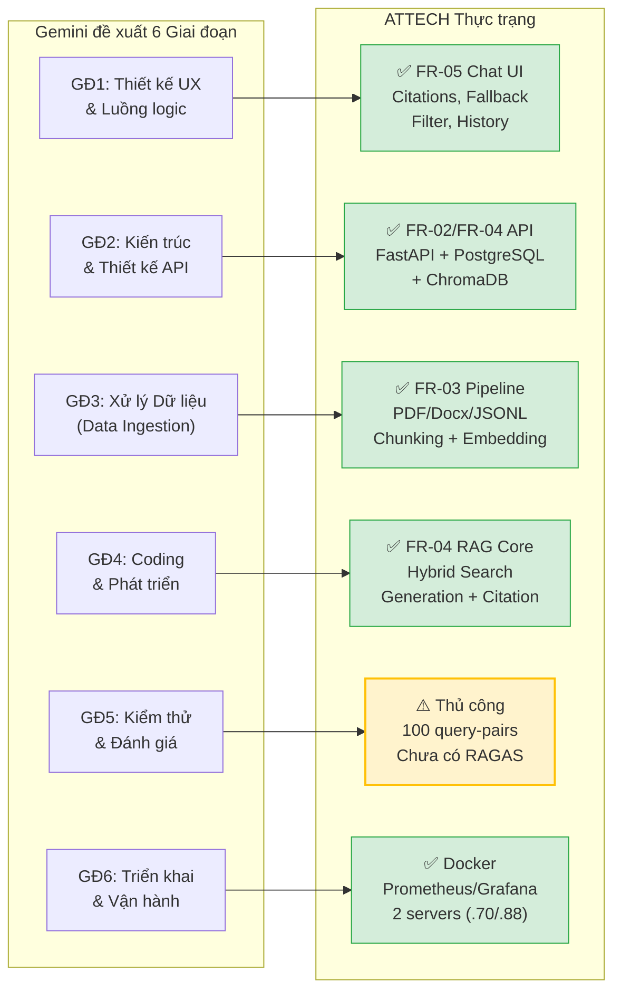
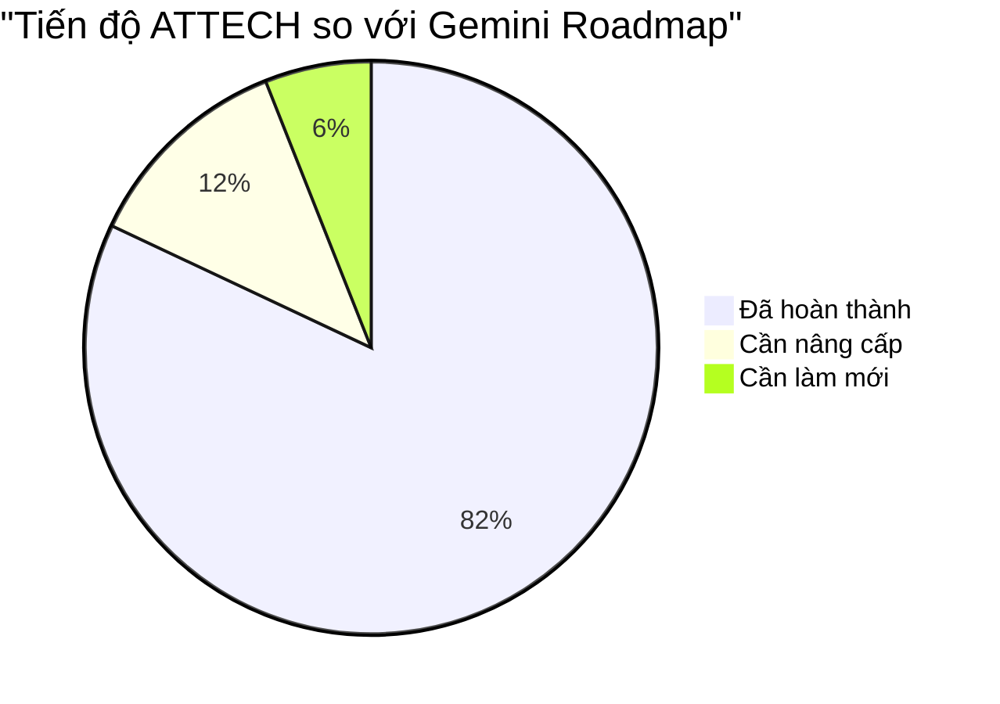
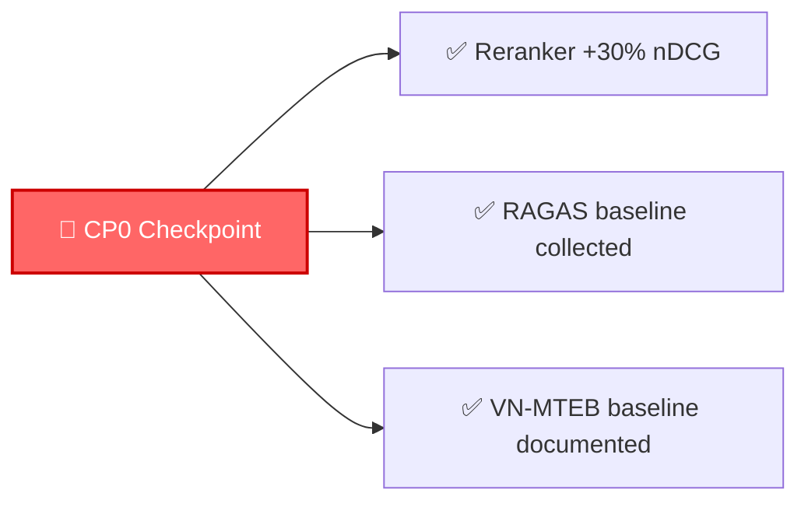

# 📋 KẾ HOẠCH HÀNH ĐỘNG — HỆ THỐNG RAG TÀI LIỆU PHÁP LUẬT ATTECH v2.0

> **Ngày tạo:** 08/02/2026  
> **Dựa trên:** Đặc tả Kỹ thuật v2.0 + Phương án Gemini + Hiện trạng thực tế  
> **Mục tiêu:** Đưa hệ thống từ Phase 1 (Done) → Phase 2 Production  

---

## 1. PHÂN TÍCH ĐỐI CHIẾU: GEMINI vs THỰC TRẠNG ATTECH

### 1.1. Bảng Đối chiếu Tổng quan

Gemini đề xuất **6 giai đoạn chung** cho dự án Retrieval-Augmented Generation mới từ đầu. ATTECH đã hoàn thành Phase 1 (110%), do đó phần lớn các giai đoạn Gemini **đã được thực hiện**. Bảng dưới đây đối chiếu chi tiết:



### 1.2. Chi tiết Từng Giai đoạn Gemini

| Giai đoạn Gemini | Gemini Đề xuất | ATTECH Hiện trạng | Trạng thái | Việc cần làm tiếp |
|---|---|---|---|---|
| **GĐ1: Thiết kế UX** | Persona bot, Fallback, Citations, Upload, History, Filter | FR-05.1 Streamlit UI hoàn chỉnh: chat, upload, history, filter phòng ban, trích dẫn nguồn (Citations) | ✅ **ĐÃ LÀM** (100%) | Bổ sung Graph Explorer UI (Phase 2) |
| **GĐ2: Kiến trúc & API** | Vector Database, Embedding Model, LLM, FastAPI, `POST /ingest`, `POST /chat`, Database SQL | FR-02 PostgreSQL + ChromaDB, FR-04.4 FastAPI API `/api/v1/query`, `/api/v1/ingest`, Qwen3-Embedding-0.6B | ✅ **ĐÃ LÀM** (100%) | Nâng cấp: thêm Cross-Encoder Reranking, pgvector, LiteLLM Gateway |
| **GĐ3: Xử lý Dữ liệu** | ETL Pipeline, OCR, Chunking, Indexing vào Vector Database | FR-03 Pipeline: PDF/Docx/JSONL extraction, chunking 500-1000 tokens, Vietnamese NLP, embedding + indexing ChromaDB | ✅ **ĐÃ LÀM** (95%) | ⚠️ Cải thiện chunking quality, 3-tier NLP fallback, Graph links auto-sync |
| **GĐ4: Coding & Phát triển** | LangChain/LangGraph orchestration, Prompt Engineering, Memory 3-5 turn | FR-04 RAG Core: Hybrid search (0.7 semantic + 0.3 keyword), system prompt grounding, conversation memory | ✅ **ĐÃ LÀM** (90%) | Nâng cấp: 3-way hybrid scoring, Agentic Retrieval-Augmented Generation (Phase 3) |
| **GĐ5: Kiểm thử & Đánh giá** | RAGAS (Faithfulness, Relevancy), Load Testing 50-100 users | ⚠️ **CHỈ CÓ** 100 cặp query-document thủ công, chưa có RAGAS pipeline, chưa có load testing tự động | ⚠️ **CẦN LÀM** (30%) | 🔴 **ƯU TIÊN CAO**: Setup RAGAS pipeline, VN-MTEB benchmark, Load test |
| **GĐ6: Triển khai & Vận hành** | Docker, CI/CD, Monitoring (Grafana), Logging | Docker Compose 2 servers, Prometheus + Grafana dashboards, chưa có CI/CD, chưa có Loki centralized logging | ✅ **ĐÃ LÀM** (80%) | Bổ sung: CI/CD pipeline, Loki logging, RAGAS quality dashboards |

### 1.3. Kết luận Phân tích



**Nhận xét quan trọng:**

1. **Gemini đề xuất phương án tổng quát** cho dự án bắt đầu từ số 0. ATTECH đã vượt qua 82% lộ trình này.
2. **Lỗ hổng lớn nhất** nằm ở **Giai đoạn 5 (Kiểm thử & Đánh giá)** — hệ thống hiện tại chỉ có đánh giá thủ công, THIẾU pipeline đánh giá tự động.
3. **Gemini không đề cập** những công nghệ tiên tiến mà ATTECH v2.0 đã lên kế hoạch: Cross-Encoder Reranking (+33-47% accuracy), Graph Retrieval-Augmented Generation, pgvector, LiteLLM Gateway — đây chính là **lợi thế cạnh tranh** của ATTECH.

---

## 2. NHỮNG VIỆC CẦN LÀM TIẾP THEO — THEO THỨ TỰ ƯU TIÊN

### 2.1. Sơ đồ Tổng quan Lộ trình

```mermaid
graph TD
    START["📍 Hiện tại<br/>Phase 1 Done (110%)<br/>08/02/2026"] --> P0

    subgraph "🔴 P0 — NGAY LẬP TỨC (Tuần 1-2)"
        P0A["1️⃣ Setup RAGAS Pipeline<br/>Baseline metrics"]
        P0B["2️⃣ Tích hợp Cross-Encoder<br/>Reranker trên GPU .88"]
        P0C["3️⃣ VN-MTEB Benchmark<br/>Baseline embedding quality"]
    end

    subgraph "🟡 P1 — PHASE 2 BẮT ĐẦU (Tuần 3-6)"
        P1A["4️⃣ Graph RAG Population<br/>42 docs, 507 edges"]
        P1B["5️⃣ Embedding Upgrade<br/>0.6B → 4B"]
        P1C["6️⃣ Hybrid Scoring 3-way<br/>Semantic + BM25 + Graph"]
    end

    subgraph "🟢 P2 — PHASE 2 GIỮA (Tuần 7-10)"
        P2A["7️⃣ pgvector Integration<br/>Unified SQL search"]
        P2B["8️⃣ LiteLLM Gateway<br/>Multi-provider + Cache"]
        P2C["9️⃣ Vietnamese NLP 3-tier<br/>0% failure rate"]
    end

    subgraph "🔵 P3 — PHASE 3 (Tuần 11-14)"
        P3A["🔟 Agentic RAG<br/>LangGraph"]
        P3B["1️⃣1️⃣ CI/CD Pipeline<br/>Auto test & deploy"]
        P3C["1️⃣2️⃣ Continuous Eval<br/>Weekly RAGAS + Alerts"]
    end

    P0 --> P0A --> P0B --> P0C
    P0C --> CP0{{"🏁 CP0<br/>24/02/2026"}}
    CP0 --> P1A --> P1B --> P1C
    P1C --> CP1{{"🏁 CP1<br/>17/03/2026"}}
    CP1 --> P2A --> P2B --> P2C
    P2C --> CP2{{"🏁 CP2<br/>07/04/2026"}}
    CP2 --> P3A --> P3B --> P3C
    P3C --> CP3{{"🏁 CP3<br/>05/05/2026"}}
    CP3 --> PROD["🚀 Phase 2 Production<br/>05/05/2026"]

    style P0A fill:#FFCCCC,stroke:#CC0000,stroke-width:2px
    style P0B fill:#FFCCCC,stroke:#CC0000,stroke-width:2px
    style P0C fill:#FFCCCC,stroke:#CC0000,stroke-width:2px
    style CP0 fill:#FF6666,stroke:#CC0000,color:#FFF
    style CP1 fill:#FFD700,stroke:#CC9900,color:#000
    style CP2 fill:#90EE90,stroke:#228B22,color:#000
    style CP3 fill:#87CEEB,stroke:#4169E1,color:#000
    style PROD fill:#28A745,stroke:#1E7A30,color:#FFF
```



---

## 3. CHI TIẾT TỪNG BƯỚC — ACTION ITEMS CỤ THỂ

### 🔴 BƯỚC 1: Setup Pipeline Đánh giá RAGAS (Tuần 1)
> **Ưu tiên:** 🔴 CRITICAL — Gemini đúng: "Với AI, Unit Test là chưa đủ"  
> **Lý do:** Không thể đo lường cải thiện của Reranker, Graph, Embedding nếu không có baseline  
> **Server:** .70 (Debian)

| # | Hành động | Lệnh / Chi tiết | Output mong đợi |
|---|---|---|---|
| 1.1 | Cài đặt RAGAS | `pip install ragas==0.2.x --break-system-packages` | Library ready |
| 1.2 | Chuẩn bị Ground Truth Dataset | Chuyển 100 cặp query-document hiện có sang định dạng RAGAS (question, ground_truth, contexts) | `ground_truth_100.json` |
| 1.3 | Viết evaluation script | Script chạy RAGAS metrics: Faithfulness, Answer Relevancy, Context Precision, Context Recall | `scripts/evaluate_ragas.py` |
| 1.4 | Chạy baseline lần đầu | Chạy trên 50 queries mẫu với hệ thống v1.0 hiện tại (KHÔNG có Reranker) | `baseline_v1.0_scores.json` |
| 1.5 | Tích hợp Grafana dashboard | Tạo dashboard "RAG Quality" hiển thị RAGAS metrics theo thời gian | Dashboard trên Grafana |

**Sản phẩm bàn giao:**
- File `ground_truth_100.json` — tập dữ liệu đánh giá chuẩn
- Script `scripts/evaluate_ragas.py` — chạy tự động
- Baseline scores v1.0: Faithfulness, Relevancy, Precision, Recall
- Grafana dashboard "RAG Quality"

---

### 🔴 BƯỚC 2: Tích hợp Cross-Encoder Reranking (Tuần 1-2)
> **Ưu tiên:** 🔴 CRITICAL — Cải thiện kỳ vọng +33-47% nDCG@10  
> **Lý do:** Đây là nâng cấp có impact lớn nhất với effort thấp nhất  
> **Server:** .88 (DietPi/GPU — RTX 2080 Ti)

| # | Hành động | Chi tiết | Output mong đợi |
|---|---|---|---|
| 2.1 | Chọn Reranker model | Benchmark `bge-reranker-v2-m3` vs `Qwen3-Reranker` trên 20 queries tiếng Việt | Model tốt nhất được chọn |
| 2.2 | Deploy Reranker service | Docker container trên .88, VRAM ~2GB, API endpoint `/rerank` | Service running port 8100 |
| 2.3 | Tích hợp vào RAG pipeline | Sửa FR-04.1 Retrieval: Bi-Encoder (top-100) → Cross-Encoder (top-10) | Pipeline 2-stage hoạt động |
| 2.4 | Cấu hình fallback | Timeout 2 giây → fallback về hybrid ranking nếu Reranker fail | Fallback mechanism tested |
| 2.5 | Đo lường A/B | Chạy RAGAS trên cùng 50 queries: v1.0 (không Reranker) vs v2.0 (có Reranker) | nDCG@10 tăng ≥ 30% |

**Kiểm tra VRAM budget:**
```
Qwen3-Embedding-0.6B:  ~2.2 GB
bge-reranker-v2-m3:    ~2.0 GB
Tổng cộng:             ~4.2 GB / 11 GB RTX 2080 Ti ✅ (headroom 6.8 GB)
```

**Sản phẩm bàn giao:**
- Reranker service chạy ổn định trên .88
- A/B test report: nDCG before/after
- Fallback mechanism đã test

---

### 🔴 BƯỚC 3: Chạy VN-MTEB Benchmark (Tuần 2)
> **Ưu tiên:** 🔴 CAO — Cần baseline trước khi upgrade embedding  
> **Server:** .88 (GPU)

| # | Hành động | Chi tiết | Output mong đợi |
|---|---|---|---|
| 3.1 | Cài đặt VN-MTEB | `pip install mteb --break-system-packages` | Library ready |
| 3.2 | Benchmark Qwen3-0.6B | Chạy trên Vietnamese retrieval tasks | Baseline scores documented |
| 3.3 | Lưu kết quả | Ghi vào file `benchmark_qwen3_0.6b.json` | Reference cho upgrade sau |

**Sản phẩm bàn giao:**
- VN-MTEB baseline scores cho Qwen3-0.6B
- File benchmark kết quả

---

### 🏁 CHECKPOINT CP0 — 24/02/2026



**Tiêu chí PASS/FAIL:**
- ✅ Reranker cải thiện ≥ 30% nDCG@10 so với baseline → **PASS**
- ❌ Reranker cải thiện < 15% → thử model khác hoặc tune hyperparameters
- ✅ RAGAS baseline scores được thu thập → **PASS**
- ✅ VN-MTEB baseline documented → **PASS**

---

### 🟡 BƯỚC 4: Graph Retrieval-Augmented Generation Population (Tuần 3-4)
> **Ưu tiên:** 🟡 CAO — Schema đã deploy, cần populate data  
> **Server:** .70 (Database) + .88 (GPU cho embedding)

| # | Hành động | Chi tiết | Output mong đợi |
|---|---|---|---|
| 4.1 | Validate Graph schema | Kiểm tra 6 bảng graph trong PostgreSQL (graph_documents, graph_edges, ...) | 6 tables confirmed |
| 4.2 | Chạy population script | `python populate_graph_correct.py` — nạp 42 documents vào graph_documents | 42 documents populated |
| 4.3 | Tạo semantic links | `python create_semantic_links.py` — tạo 507+ edges | ≥ 507 edges created |
| 4.4 | Validate kết quả | Kiểm tra: 0 isolated nodes, edge types phân bố đúng (same_category, shared_keywords, same_level_peers) | Validation report |
| 4.5 | Setup cron job | Cron chạy `create_semantic_links.py` hàng đêm sau mỗi lần import tài liệu mới | Cron active |

**Sản phẩm bàn giao:**
- Graph populated: 42 docs, 507+ edges
- Validation report: 0 isolated nodes
- Cron job auto-sync đã cấu hình

---

### 🟡 BƯỚC 5: Nâng cấp Embedding Model (Tuần 3-5)
> **Ưu tiên:** 🟡 CAO — Kỳ vọng +15-25% nDCG  
> **Server:** .88 (GPU)

| # | Hành động | Chi tiết | Output mong đợi |
|---|---|---|---|
| 5.1 | Download Qwen3-Embedding-4B | `huggingface-cli download Qwen/Qwen3-Embedding-4B` | Model cached |
| 5.2 | Benchmark so sánh | Chạy VN-MTEB: 0.6B vs 4B, so sánh nDCG@10 trên ground truth | Comparison report |
| 5.3 | Kiểm tra VRAM | 4B (~8GB) + Reranker (~2GB) = ~10GB / 11GB → test concurrent | VRAM OK hoặc plan B |
| 5.4 | Re-embed toàn bộ | Tạo collection `knowledge_base_v2` trong ChromaDB với embeddings mới | New collection ready |
| 5.5 | Chuyển đổi | Switch RAG pipeline sang collection mới, giữ collection cũ backup | Pipeline switched |
| 5.6 | Validate | Chạy RAGAS trên 50 queries, compare vs baseline | nDCG ≥ 0.85 |

**⚠️ Plan B nếu VRAM không đủ:**
- Giữ Qwen3-0.6B + Reranker (tổng 4.2GB) — vẫn đạt +30% từ Reranker
- Hoặc: Load/unload model tuần tự (embedding offline, reranker online)

**Sản phẩm bàn giao:**
- Embedding benchmark report
- Collection `knowledge_base_v2` trong ChromaDB
- RAGAS comparison before/after

---

### 🟡 BƯỚC 6: Hybrid Scoring 3-way + Graph Search API (Tuần 5-6)
> **Ưu tiên:** 🟡 TRUNG BÌNH  
> **Server:** .70 (API) + .88 (GPU)

| # | Hành động | Chi tiết | Output mong đợi |
|---|---|---|---|
| 6.1 | Implement Graph Search API | Endpoint `/api/v1/graph/search` — multi-hop traversal max 2 hops | API endpoint |
| 6.2 | Update scoring formula | `α×semantic + β×keyword + γ×graph` với adaptive weights theo intent | Scoring engine v2 |
| 6.3 | Implement intent classifier | Phân loại: specific_document, how_to_procedure, comparison, general | Classifier active |
| 6.4 | Integration test | Test end-to-end: query → 3-way retrieval → reranking → generation | E2E pass |

**Sản phẩm bàn giao:**
- Graph Search API operational
- 3-way hybrid scoring với adaptive weights
- Integration test report

---

### 🏁 CHECKPOINT CP1 — 17/03/2026

**Tiêu chí PASS/FAIL:**
- ✅ Graph populated ≥ 500 edges, 0 isolated nodes
- ✅ Embedding upgraded, overall nDCG ≥ 0.85
- ✅ Graph search API trả về kết quả hợp lệ
- ✅ 3-way hybrid scoring active

---

### 🟢 BƯỚC 7: pgvector Integration (Tuần 7-8)
> **Ưu tiên:** 🟢 TRUNG BÌNH — Tối ưu hóa, không blocking  
> **Server:** .70 (PostgreSQL)

| # | Hành động | Chi tiết | Output mong đợi |
|---|---|---|---|
| 7.1 | Cài pgvector extension | `CREATE EXTENSION vector;` trong PostgreSQL | Extension active |
| 7.2 | Tạo bảng embeddings | `document_embeddings_v2` với cột `vector(1024)` | Table created |
| 7.3 | Migrate embedding data | Copy từ ChromaDB sang pgvector | Data migrated |
| 7.4 | Tạo HNSW index | `CREATE INDEX ... USING hnsw (embedding vector_cosine_ops)` | Index created |
| 7.5 | Benchmark so sánh | pgvector vs ChromaDB: latency, recall, accuracy | Comparison report |
| 7.6 | Unified SQL query | BM25 + vector + RBAC trong một câu SQL | Query template |

**Lưu ý:** Giữ ChromaDB song song, KHÔNG xóa — chạy dual cho đến khi pgvector validated.

---

### 🟢 BƯỚC 8: LiteLLM Gateway (Tuần 7-8)
> **Ưu tiên:** 🟢 TRUNG BÌNH  
> **Server:** .70 (API proxy)

| # | Hành động | Chi tiết | Output mong đợi |
|---|---|---|---|
| 8.1 | Deploy LiteLLM proxy | Docker container, port 4000, file `litellm_config.yaml` | Proxy running |
| 8.2 | Cấu hình providers | Primary + Fallback chains cho OpenAI/Anthropic/Local | Config file |
| 8.3 | Enable semantic caching | Redis-based, similarity threshold 0.95 | Cache active |
| 8.4 | Test failover | Kill primary provider → verify auto-switch < 5s | Failover tested |
| 8.5 | Cost tracking dashboard | Grafana panel: token usage, cost per query, cache hit rate | Dashboard active |

---

### 🟢 BƯỚC 9: Vietnamese NLP 3-tier Fallback (Tuần 9-10)
> **Ưu tiên:** 🟢 TRUNG BÌNH  
> **Server:** .70 + .88

| # | Hành động | Chi tiết | Output mong đợi |
|---|---|---|---|
| 9.1 | Implement 3-tier service | Tier 1: underthesea → Tier 2: pyvi → Tier 3: whitespace split | VietnameseNLPService v2 |
| 9.2 | Expand Legal NER | 15+ patterns: Nghị quyết, Chỉ thị, Công văn, Luật, tổ chức, ngày tháng | NER patterns |
| 9.3 | Vietnamese prompt injection detection | 10+ patterns phát hiện injection tiếng Việt | Security patterns |
| 9.4 | Test failure rate | Chạy trên 1000 queries → target 0% tokenization failure | Test report |

---

### 🏁 CHECKPOINT CP2 — 07/04/2026

**Tiêu chí PASS/FAIL:**
- ✅ pgvector queries tương đương ChromaDB
- ✅ LiteLLM failover < 5 giây
- ✅ Tokenization failure rate = 0%

---

### 🔵 BƯỚC 10-12: Phase 3 — Nâng cao (Tuần 11-14)

| Bước | Hành động | Chi tiết | Target |
|---|---|---|---|
| **10** | Agentic RAG (LangGraph) | Multi-agent cho complex queries: decompose → route → merge | Complex queries handled |
| **11** | CI/CD Pipeline | GitHub Actions hoặc GitLab CI: auto test → build Docker → deploy | Auto deployment |
| **12** | Continuous Evaluation | Cron RAGAS weekly (Chủ nhật 2AM), 50 queries, alert nếu giảm > 5% | Weekly auto-eval |

### 🏁 CHECKPOINT CP3 — 05/05/2026

**Tiêu chí PASS/FAIL:**
- ✅ Agentic RAG handles multi-hop queries
- ✅ CI/CD pipeline operational
- ✅ Weekly RAGAS eval runs với alerting

---

## 4. BẢNG TÓM TẮT TIMELINE

```mermaid
gantt
    title Lộ trình Hành động ATTECH RAG v2.0
    dateFormat  YYYY-MM-DD
    axisFormat  %d/%m

    section 🔴 P0 - Ngay lập tức
    Bước 1: RAGAS Pipeline          :crit, b1, 2026-02-10, 7d
    Bước 2: Cross-Encoder Reranker  :crit, b2, 2026-02-10, 14d
    Bước 3: VN-MTEB Benchmark       :b3, 2026-02-17, 7d
    CP0 Checkpoint                  :milestone, cp0, 2026-02-24, 0d

    section 🟡 P1 - Phase 2 Start
    Bước 4: Graph RAG Population    :b4, 2026-02-24, 14d
    Bước 5: Embedding Upgrade       :b5, 2026-02-24, 21d
    Bước 6: 3-way Scoring + API     :b6, 2026-03-10, 7d
    CP1 Checkpoint                  :milestone, cp1, 2026-03-17, 0d

    section 🟢 P2 - Phase 2 Mid
    Bước 7: pgvector Integration    :b7, 2026-03-17, 14d
    Bước 8: LiteLLM Gateway         :b8, 2026-03-17, 14d
    Bước 9: Vietnamese NLP 3-tier   :b9, 2026-03-24, 14d
    CP2 Checkpoint                  :milestone, cp2, 2026-04-07, 0d

    section 🔵 P3 - Phase 3
    Bước 10: Agentic RAG            :b10, 2026-04-07, 21d
    Bước 11: CI/CD Pipeline         :b11, 2026-04-14, 14d
    Bước 12: Continuous Eval        :b12, 2026-04-21, 14d
    CP3 Checkpoint                  :milestone, cp3, 2026-05-05, 0d
```

---

## 5. MA TRẬN PHÂN CÔNG TEAM

| Bước | Mô tả | Server | Team phụ trách | Dependencies |
|---|---|---|---|---|
| 1 | RAGAS Pipeline | .70 | Tuan (Local) | Ground truth dataset |
| 2 | Cross-Encoder Reranker | .88 (GPU) | Tuan (Local) | GPU access, VRAM |
| 3 | VN-MTEB Benchmark | .88 (GPU) | Tuan (Local) | Model weights |
| 4 | Graph RAG Population | .70 + .88 | Tuan (Local) | PostgreSQL, scripts |
| 5 | Embedding Upgrade | .88 (GPU) | Tuan (Local) | VRAM budget, ChromaDB |
| 6 | 3-way Scoring + API | .70 | **Có thể remote** | API code only |
| 7 | pgvector | .70 | Tuan (Local) | PostgreSQL admin |
| 8 | LiteLLM Gateway | .70 | **Có thể remote** | Docker, config only |
| 9 | Vietnamese NLP 3-tier | .70 + .88 | **Có thể remote** | Python code only |
| 10 | Agentic RAG | .70 | **Có thể remote** | LangGraph, Python |
| 11 | CI/CD | .70 | **Có thể remote** | Git, Docker |
| 12 | Continuous Eval | .70 | Tuan (Local) | RAGAS, Grafana, Cron |

**Ghi chú:** Các bước đánh dấu "Có thể remote" phù hợp phân công cho team member không cần truy cập GPU/infrastructure trực tiếp.

---

## 6. CHECKLIST TỔNG HỢP

### Tuần 1-2 (10/02 → 24/02/2026) — 🔴 P0

- [ ] Cài đặt RAGAS library
- [ ] Chuyển 100 cặp query-document sang định dạng RAGAS
- [ ] Chạy RAGAS baseline lần đầu (v1.0 scores)
- [ ] Download và benchmark reranker models
- [ ] Deploy reranker service trên .88
- [ ] Tích hợp reranker vào RAG pipeline
- [ ] Test fallback mechanism (2s timeout)
- [ ] Chạy A/B test: RAGAS before/after reranker
- [ ] Chạy VN-MTEB benchmark cho Qwen3-0.6B
- [ ] Tạo Grafana dashboard "RAG Quality"
- [ ] **🏁 CP0: Verify tất cả 3 tiêu chí PASS**

### Tuần 3-6 (24/02 → 17/03/2026) — 🟡 P1

- [ ] Validate 6 bảng Graph trong PostgreSQL
- [ ] Chạy `populate_graph_correct.py`
- [ ] Chạy `create_semantic_links.py`
- [ ] Validate: 42 docs, 507+ edges, 0 isolated nodes
- [ ] Setup cron job cho graph auto-sync
- [ ] Download Qwen3-Embedding-4B
- [ ] Benchmark 0.6B vs 4B trên VN-MTEB
- [ ] VRAM test: 4B + Reranker concurrent
- [ ] Re-embed 42 docs → collection `knowledge_base_v2`
- [ ] Implement Graph Search API `/api/v1/graph/search`
- [ ] Implement 3-way hybrid scoring
- [ ] Implement intent classifier
- [ ] Integration test end-to-end
- [ ] **🏁 CP1: Verify tất cả 4 tiêu chí PASS**

### Tuần 7-10 (17/03 → 07/04/2026) — 🟢 P2

- [ ] Cài pgvector extension trong PostgreSQL
- [ ] Tạo bảng `document_embeddings_v2`
- [ ] Migrate data từ ChromaDB sang pgvector
- [ ] Tạo HNSW index
- [ ] Benchmark pgvector vs ChromaDB
- [ ] Deploy LiteLLM proxy Docker
- [ ] Cấu hình provider chains + failover
- [ ] Enable semantic caching Redis
- [ ] Test failover < 5s
- [ ] Implement Vietnamese NLP 3-tier fallback
- [ ] Expand Legal NER 15+ patterns
- [ ] Test tokenization failure rate = 0%
- [ ] **🏁 CP2: Verify tất cả 3 tiêu chí PASS**

### Tuần 11-14 (07/04 → 05/05/2026) — 🔵 P3

- [ ] Implement Agentic RAG với LangGraph
- [ ] Setup CI/CD pipeline
- [ ] Configure weekly RAGAS cron (Chủ nhật 2AM)
- [ ] Setup alert: metric giảm > 5% → notification
- [ ] **🏁 CP3: Phase 2 Production Ready**

---

## 7. LỜI KHUYÊN THỰC CHIẾN

### 7.1. Gemini Nói Đúng

> *"Bước Xử lý dữ liệu chiếm 70% sự thành công"*

Hoàn toàn chính xác. ATTECH hiện có vấn đề: 95% tài liệu thiếu metadata có cấu trúc, BM25 fail với mã tài liệu pháp luật. **Bước 4 (Graph Population)** và **Bước 9 (Vietnamese NLP 3-tier)** trực tiếp giải quyết vấn đề này.

### 7.2. Gemini Thiếu Sót

| Gemini không đề cập | ATTECH v2.0 đã có kế hoạch | Impact |
|---|---|---|
| Cross-Encoder Reranking | Bước 2 — P0 | +33-47% nDCG@10 |
| Graph Retrieval-Augmented Generation | Bước 4 — P1 | Multi-hop reasoning |
| pgvector unified search | Bước 7 — P2 | BM25 + vector + RBAC trong 1 SQL |
| LLM Gateway (LiteLLM) | Bước 8 — P2 | Failover + Cost tracking |
| Automated continuous evaluation | Bước 12 — P3 | Weekly quality monitoring |

### 7.3. Nguyên tắc Vàng

1. **"Đo trước, cải tiến sau"** — Luôn có RAGAS baseline TRƯỚC KHI tích hợp component mới
2. **"Giữ cái cũ song song"** — ChromaDB vs pgvector, 0.6B vs 4B — chạy đôi cho đến khi validate
3. **"Checkpoint trước khi tiến"** — Không nhảy sang P1 nếu P0 chưa PASS
4. **"Remote-friendly tasks"** — Phân công bước 6, 8, 9, 10, 11 cho team remote

---

> **Tài liệu tham chiếu:**  
> - Đặc tả Kỹ thuật v2.0: `ATTECH_RAG_Technical_Specification_v2_0.md`  
> - Khảo sát Công nghệ 2026: `CAP_NHAT_CONG_NGHE_RAG_2026.md`  
> - Phương án Gemini: Tài liệu đính kèm cuộc hội thoại  
