# 📊 BÁO CÁO CẬP NHẬT CÔNG NGHỆ CHO HỆ THỐNG RAG ATTECH

**Phiên bản:** 1.0  
**Ngày:** 07/02/2026  
**Người thực hiện:** Senior Software Architect & LLM Training Specialist  
**Dự án:** Hệ thống Trợ lý Tri thức Văn bản Pháp luật Việt Nam - ATTECH  
**Mục đích:** Đánh giá và khuyến nghị cập nhật công nghệ mới nhất cho hệ thống chatbot Artificial Intelligence tài liệu nội bộ

---

## 📋 MỤC LỤC

1. [Tổng quan Stack Hiện tại vs Xu hướng 2026](#1-tổng-quan)
2. [Embedding Models — Nâng cấp quan trọng nhất](#2-embedding-models)
3. [Vector Database — Đánh giá ChromaDB và các lựa chọn thay thế](#3-vector-database)
4. [Reranking — Tầng thiếu vắng trong Pipeline hiện tại](#4-reranking)
5. [RAG Framework — Orchestration thế hệ mới](#5-rag-framework)
6. [Graph RAG — Xu hướng chủ đạo 2026](#6-graph-rag)
7. [Agentic RAG — Kiến trúc thế hệ tiếp theo](#7-agentic-rag)
8. [Xử lý Ngôn ngữ Tiếng Việt — Công cụ và mô hình mới](#8-xu-ly-tieng-viet)
9. [Large Language Model Gateway — Quản lý đa nhà cung cấp](#9-llm-gateway)
10. [Đánh giá Chất lượng RAG — Công cụ và Benchmark](#10-danh-gia-chat-luong)
11. [Ma trận So sánh Tổng hợp](#11-ma-tran-so-sanh)
12. [Lộ trình Nâng cấp Đề xuất](#12-lo-trinh-nang-cap)

---

## 1. TỔNG QUAN

### 1.1 Stack Công nghệ Hiện tại của ATTECH

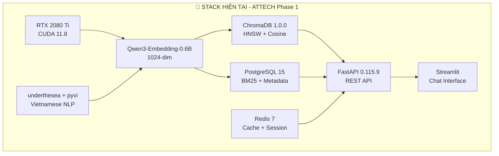

### 1.2 Xu hướng Công nghệ RAG 2026

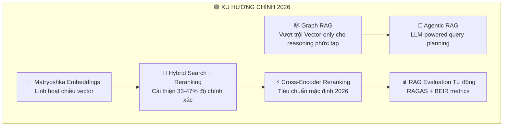

### 1.3 Đánh giá Tổng quan: Hiện tại vs Xu hướng

| Khía cạnh | ATTECH Hiện tại | Xu hướng 2026 | Khoảng cách | Ưu tiên |
|-----------|----------------|---------------|-------------|---------|
| **Embedding Model** | Qwen3-Embedding-0.6B (1024-dim) | Qwen3-Embedding 4B/8B, BGE-M3, Vietnamese-specific | Trung bình | 🟡 P1 |
| **Vector Database** | ChromaDB 1.0.0 | pgvector + ChromaDB hybrid, hoặc Qdrant/Milvus | Thấp | 🟢 P2 |
| **Reranking** | ❌ Không có | Cross-encoder reranking (tiêu chuẩn 2026) | **Cao** | 🔴 P0 |
| **Search** | Hybrid (0.7 semantic + 0.3 BM25) | Hybrid + Graph + Reranking 3 tầng | Trung bình | 🟡 P1 |
| **Graph RAG** | PostgreSQL tables (chưa populated) | Neo4j/ArangoDB hoặc PostgreSQL graph đầy đủ | Trung bình | 🟡 P1 |
| **Agentic RAG** | ❌ Không có | LangGraph/CrewAI multi-agent orchestration | Thấp | 🟢 P3 |
| **Đánh giá** | 100 query-document pairs (thủ công) | RAGAS tự động + continuous evaluation | **Cao** | 🔴 P0 |
| **LLM Gateway** | Multi-provider (OpenAI, Claude) | LiteLLM/AI Gateway chuẩn hóa | Trung bình | 🟡 P2 |

---

## 2. EMBEDDING MODELS

### 2.1 Đánh giá Mô hình Hiện tại

**Mô hình đang dùng:** `Qwen/Qwen3-Embedding-0.6B`
- Kích thước: 0.6 tỷ tham số
- Chiều vector: 1024
- Ngữ cảnh tối đa: 8.192 tokens
- Hỗ trợ đa ngôn ngữ: 100+ ngôn ngữ (bao gồm tiếng Việt)
- Giấy phép: Apache 2.0

**Đánh giá:** Mô hình phù hợp tốt cho quy mô hiện tại (~42 tài liệu, 100 người dùng đồng thời). Tuy nhiên, với yêu cầu xử lý tài liệu pháp luật tiếng Việt chuyên sâu, có những lựa chọn tốt hơn để cân nhắc.

### 2.2 Các Mô hình Embedding Đáng Chú ý 2026

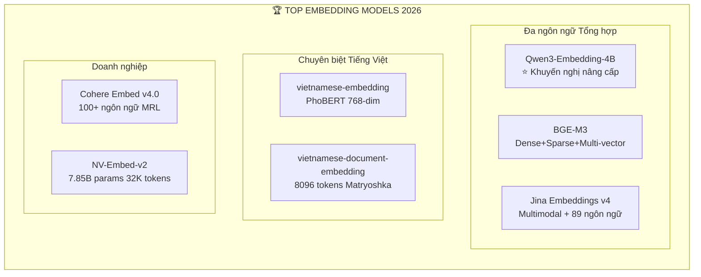

### 2.3 So sánh Chi tiết

| Mô hình | Params | Chiều | Context | Tiếng Việt | GPU VRAM | Giấy phép | Phù hợp ATTECH |
|---------|--------|-------|---------|-----------|----------|-----------|----------------|
| **Qwen3-Embedding-0.6B** (hiện tại) | 0.6B | 1024 | 8K | Tốt | ~2.2GB | Apache 2.0 | ✅ Đang dùng |
| **Qwen3-Embedding-4B** | 4B | 1024 | 32K | Rất tốt | ~8GB | Apache 2.0 | ⭐ **Khuyến nghị** |
| **BGE-M3** | 0.6B | 1024 | 8K | Tốt | ~2.5GB | MIT | ✅ Thay thế tốt |
| **vietnamese-document-embedding** | ~0.3B | 768 | 8K | Xuất sắc | ~1.5GB | Apache 2.0 | ⭐ **Bổ sung cho VN** |
| **Jina Embeddings v4** | ~1B | 2048 | 8K | Tốt | ~4GB | CC-BY-NC-4.0 | ⚠️ Không thương mại |
| **Cohere Embed v4.0** | N/A | 1024 | 512 | Tốt | API-only | Thương mại | 🟡 Fallback API |
| **NV-Embed-v2** | 7.85B | 4096 | 32K | Trung bình | ~16GB+ | CC-BY-NC-4.0 | ❌ Quá lớn cho RTX 2080 Ti |

### 2.4 Khuyến nghị cho ATTECH

**🏆 Phương án tối ưu: Dual Embedding Strategy**

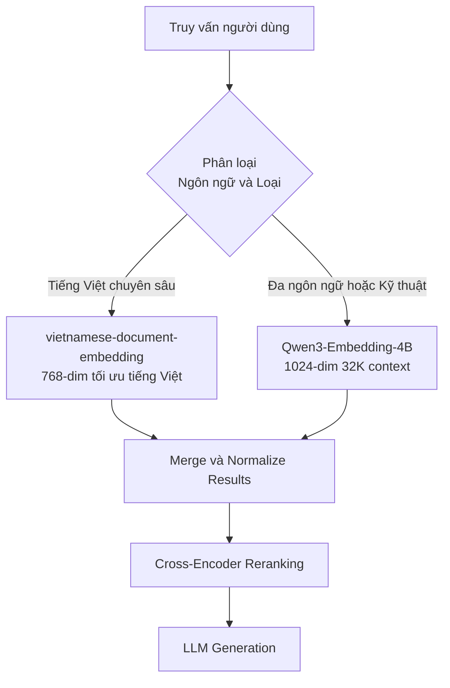

**Lý do:**
1. **Qwen3-Embedding-4B** (nâng từ 0.6B lên 4B): Cùng kiến trúc nên migration dễ dàng, context window tăng từ 8K lên 32K tokens (quan trọng cho tài liệu pháp luật dài), chất lượng embedding tốt hơn đáng kể, vẫn chạy được trên RTX 2080 Ti (11GB VRAM, model khoảng 8GB).
2. **vietnamese-document-embedding** (bổ sung): Được huấn luyện chuyên biệt cho tiếng Việt trên PhoBERT/gte-multilingual, hỗ trợ Matryoshka (linh hoạt chiều vector), sử dụng cùng `pyvi` tokenizer mà ATTECH đã tích hợp.

**⚠️ Lưu ý VRAM:** RTX 2080 Ti có 11GB VRAM. Chạy đồng thời cả 2 model sẽ cần khoảng 10GB. Nên cân nhắc chạy tuần tự (load/unload model theo loại truy vấn) hoặc chọn duy nhất **Qwen3-Embedding-4B** nếu VRAM hạn chế.

---

## 3. VECTOR DATABASE

### 3.1 Đánh giá ChromaDB 1.0.0 Hiện tại

**Ưu điểm vẫn giữ:**
- API đơn giản, developer-friendly
- Tích hợp tốt với Python ecosystem
- Đủ cho quy mô dưới 1 triệu vectors
- HNSW indexing cho similarity search

**Hạn chế cần lưu ý:**
- Giới hạn khoảng 1 triệu vector points trên single node
- Không hỗ trợ distributed/sharding
- Không có Role-Based Access Control (RBAC) tích hợp
- Không có hybrid search native (cần kết hợp với PostgreSQL BM25)
- Community nhỏ hơn Milvus (6K vs 35K GitHub stars)

### 3.2 Các Lựa chọn Vector Database 2026

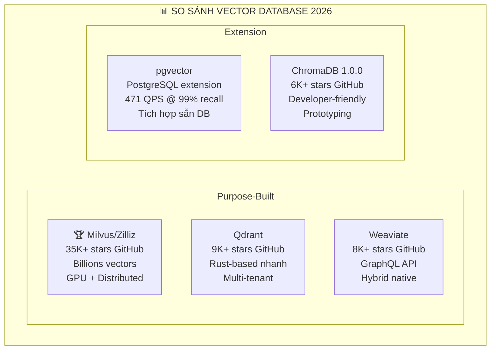

### 3.3 Khuyến nghị cho ATTECH

**🏆 Phương án tối ưu: pgvector + ChromaDB Hybrid (Giữ nguyên + Bổ sung)**

| Thành phần | Vai trò | Lý do |
|-----------|---------|-------|
| **pgvector** (thêm mới) | Vector search chính trong PostgreSQL | ATTECH đã có PostgreSQL 15, thêm extension không cần quản lý thêm database mới. Tích hợp RBAC sẵn có. Hybrid search (BM25 + vector) trong cùng 1 query. 471 QPS @ 99% recall cho 50M vectors. |
| **ChromaDB 1.0.0** (giữ) | Prototyping, embedding cache, fast lookup | Giữ lại cho development/testing. Dữ liệu 42 tài liệu hiện tại vẫn hoạt động tốt. |

**Lý do KHÔNG chuyển sang Milvus/Qdrant:**
- Quy mô ATTECH (42 tài liệu, khoảng 100 người dùng) chưa cần database chuyên biệt xử lý hàng tỷ vectors
- Thêm infrastructure mới tăng complexity không cần thiết cho team
- pgvector giải quyết được tất cả nhu cầu hiện tại và tương lai gần trong cùng PostgreSQL stack

**Cài đặt pgvector:**
```sql
-- Trên PostgreSQL 15 đã có sẵn
CREATE EXTENSION IF NOT EXISTS vector;

-- Tạo bảng với vector column
CREATE TABLE document_embeddings (
    id SERIAL PRIMARY KEY,
    chunk_id INTEGER REFERENCES document_chunks_enhanced(id),
    embedding vector(1024),
    created_at TIMESTAMP DEFAULT NOW()
);

-- HNSW index cho cosine similarity
CREATE INDEX ON document_embeddings 
    USING hnsw (embedding vector_cosine_ops)
    WITH (m = 16, ef_construction = 200);
```

---

## 4. RERANKING — TẦNG THIẾU VẮNG QUAN TRỌNG NHẤT

### 4.1 Tại sao Reranking là Ưu tiên Số 1?

**Đây là khoảng cách lớn nhất trong pipeline ATTECH hiện tại.** Theo nghiên cứu 2026:
- Cross-encoder reranking cải thiện **33-47% độ chính xác** retrieval
- Đã trở thành **kiến trúc mặc định** cho production RAG systems
- Đặc biệt hiệu quả cho truy vấn phức tạp (tài liệu pháp luật, so sánh, multi-hop)

### 4.2 Kiến trúc Two-Stage Retrieval

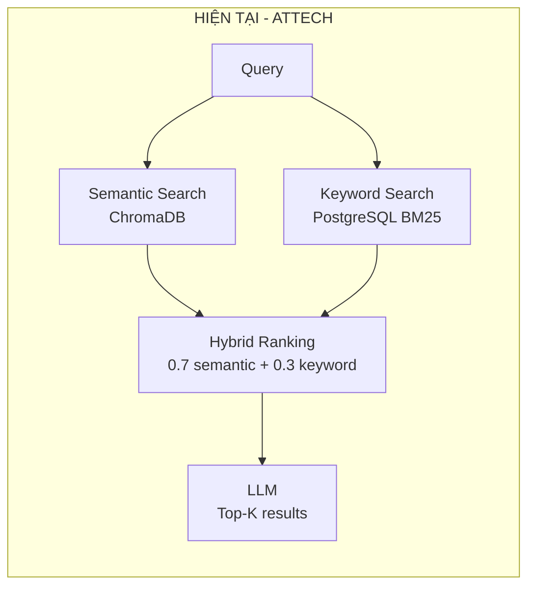

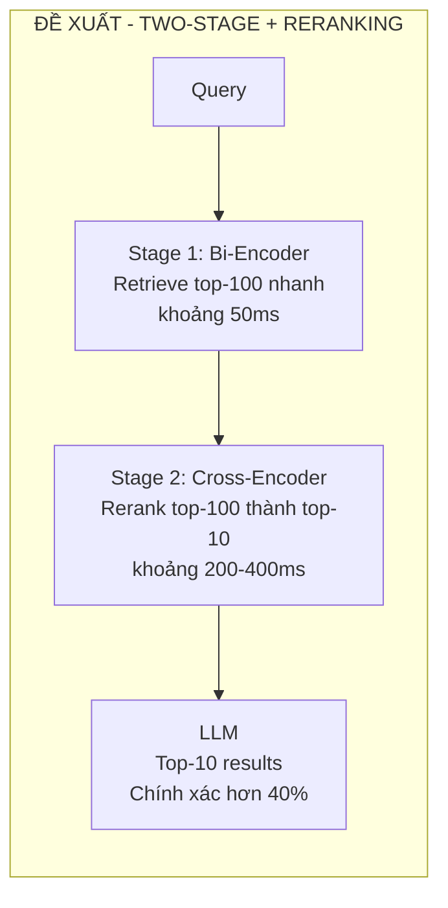

### 4.3 Các Reranker Models Đáng Chú ý

| Model | Loại | Ngôn ngữ | Tốc độ | Tự host | Phù hợp ATTECH |
|-------|------|----------|--------|---------|----------------|
| **cross-encoder/ms-marco-MiniLM-L-12-v2** | Open-source | EN chính, multilingual OK | Nhanh | ✅ | ⭐ **Khởi đầu** |
| **bge-reranker-v2-m3** | Open-source | 100+ ngôn ngữ | Trung bình | ✅ | ⭐ **Khuyến nghị** |
| **Qwen3-Reranker** | Open-source | 100+ ngôn ngữ, instruction-aware | Trung bình | ✅ | ⭐ **Tốt nhất** |
| **Cohere Rerank 3** | API | 100+ ngôn ngữ | Nhanh | ❌ | 🟡 Fallback |
| **Jina Reranker v2** | Open-source | 100+ ngôn ngữ | Nhanh | ✅ | ✅ Thay thế tốt |

### 4.4 Khuyến nghị: Qwen3-Reranker hoặc bge-reranker-v2-m3

**Lý do chọn Qwen3-Reranker:**
- Cùng họ Qwen với embedding model đang dùng nên nhất quán về semantic space
- Instruction-aware: có thể tùy chỉnh behavior cho domain pháp luật Việt Nam
- Hỗ trợ 100+ ngôn ngữ, chất lượng tiếng Việt tốt
- Apache 2.0, self-hosted

**Lý do chọn bge-reranker-v2-m3 (phương án thay thế):**
- Nhỏ gọn hơn, VRAM thấp hơn
- Dense + Sparse + Multi-vector support
- Đã được benchmark rộng rãi trên nhiều domain

**Tích hợp vào pipeline:**
```python
# Pseudo-code tích hợp reranker
from sentence_transformers import CrossEncoder

reranker = CrossEncoder('Qwen/Qwen3-Reranker-0.6B', device='cuda')

async def search_with_reranking(query: str, top_k: int = 10):
    # Stage 1: Bi-encoder retrieve top-100 (nhanh)
    candidates = await hybrid_search(query, limit=100)
    
    # Stage 2: Cross-encoder rerank (chính xác)
    pairs = [(query, doc.content) for doc in candidates]
    scores = reranker.predict(pairs, batch_size=16)
    
    # Sắp xếp theo relevance score
    reranked = sorted(
        zip(candidates, scores), 
        key=lambda x: x[1], 
        reverse=True
    )
    return reranked[:top_k]
```

---

## 5. RAG FRAMEWORK — ORCHESTRATION THẾ HỆ MỚI

### 5.1 Đánh giá Pipeline RAG Hiện tại

ATTECH hiện đang tự xây dựng (custom-built) pipeline RAG với FastAPI. Đây là approach hợp lý cho Phase 1 nhưng cần cân nhắc framework hóa cho Phase 2.

### 5.2 Top RAG Frameworks 2026

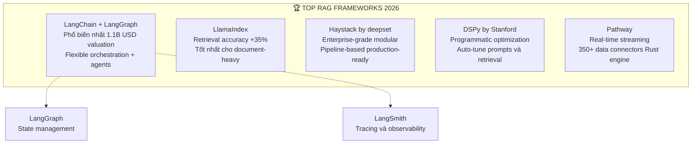

### 5.3 Khuyến nghị cho ATTECH

**🏆 Phương án: Tích hợp LlamaIndex cho Document Processing + Giữ FastAPI cho API**

| Thành phần | Công nghệ | Lý do |
|-----------|-----------|-------|
| **Document Processing** | LlamaIndex | Tối ưu cho indexing và retrieval tài liệu pháp luật. Hỗ trợ hierarchical indexing (phù hợp cấu trúc Nghị định, Chương, Điều, Khoản). Query routing tự động. |
| **API Layer** | FastAPI (giữ nguyên) | Đã hoạt động ổn định, team quen thuộc. Không cần thay đổi. |
| **Orchestration (Phase 3)** | LangGraph | Khi cần Agentic RAG, LangGraph cung cấp state management và multi-step reasoning. |
| **Monitoring** | RAGAS + custom metrics | Đánh giá tự động chất lượng RAG. |

**⚠️ Lưu ý quan trọng:** KHÔNG khuyến nghị chuyển toàn bộ sang framework mới ngay lập tức. Nên tích hợp từng phần, bắt đầu từ LlamaIndex cho document indexing, sau đó mở rộng.

---

## 6. GRAPH RAG — XU HƯỚNG CHỦ ĐẠO 2026

### 6.1 Tại sao Graph RAG Quan trọng cho Tài liệu Pháp luật?

Graph RAG đã vượt trội vector-only approaches cho các tác vụ reasoning phức tạp, giảm 50% chi phí trong khi tăng độ chính xác. Đặc biệt phù hợp cho tài liệu pháp luật Việt Nam vì:

1. **Quan hệ tham chiếu chéo:** Nghị định A tham chiếu Thông tư B, sửa đổi bởi Nghị định C
2. **Cấu trúc phân cấp:** Luật → Nghị định → Thông tư → Quyết định
3. **Truy vấn multi-hop:** "Những quy định nào liên quan đến quy trình phê duyệt trong lĩnh vực hàng không?"
4. **Tính có hiệu lực:** Văn bản nào còn hiệu lực, đã hết hiệu lực, hay bị thay thế

### 6.2 Kiến trúc Graph RAG Đề xuất

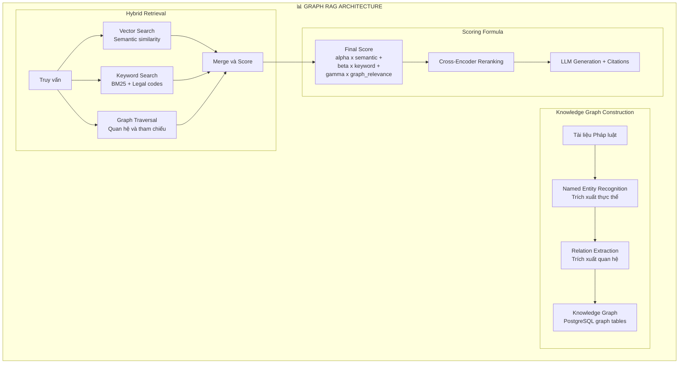

### 6.3 Trạng thái Hiện tại vs Mục tiêu

| Thành phần | Hiện tại | Mục tiêu | Hành động |
|-----------|---------|---------|-----------|
| Graph Schema | 6 tables đã tạo (graph_documents, graph_edges, v.v.) | Đầy đủ và populated | Chạy `populate_graph_correct.py` |
| Graph Data | graph_edges: 5 invalid links, thiếu 507 edges | 42 documents, 507+ edges | Chạy `create_semantic_links.py` |
| Graph Traversal | Chưa có API | Multi-hop traversal API | Implement graph_search_service |
| Scoring Formula | 0.7 x semantic + 0.3 x keyword = 1.0 | alpha x semantic + beta x keyword + gamma x graph | Cập nhật hybrid_ranking |

**Công thức scoring đề xuất (điều chỉnh theo loại truy vấn):**

| Loại truy vấn | alpha (semantic) | beta (keyword) | gamma (graph) | Ví dụ |
|--------------|-------------|-------------|-----------|-------|
| Tìm kiếm cụ thể | 0.3 | 0.5 | 0.2 | "Nghị định 76/2018/NĐ-CP" |
| Câu hỏi khái niệm | 0.5 | 0.2 | 0.3 | "Quy trình cấp phép bay là gì?" |
| So sánh/tham chiếu | 0.2 | 0.2 | 0.6 | "So sánh NĐ 76 với NĐ 45 về phê duyệt" |
| Tổng hợp chủ đề | 0.4 | 0.1 | 0.5 | "Tất cả quy định về an toàn hàng không" |

---

## 7. AGENTIC RAG — KIẾN TRÚC THẾ HỆ TIẾP THEO

### 7.1 Tổng quan

Agentic RAG bổ sung khả năng **planning, reflection, tool use, và multi-agent collaboration** vào pipeline RAG truyền thống. Thay vì single-shot retrieval, hệ thống có thể tự động phân tích truy vấn, chia nhỏ thành các bước, tìm kiếm lặp đi lặp lại, và tự kiểm tra kết quả.

### 7.2 Kiến trúc Agentic RAG cho ATTECH (Phase 3)

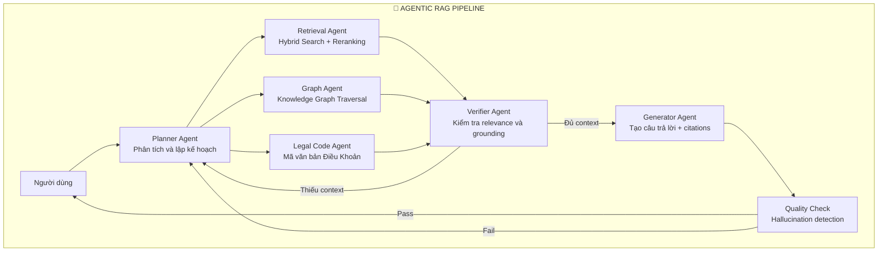

### 7.3 Khuyến nghị

**⏰ Thời điểm triển khai: Phase 3 (sau khi hoàn thiện Graph RAG)**

Agentic RAG là xu hướng mạnh nhưng cần nền tảng vững chắc:
- Hybrid Search + Reranking phải hoạt động tốt trước
- Graph RAG cần populated và validated
- Evaluation framework phải sẵn sàng để đo lường cải thiện

**Framework đề xuất:** LangGraph (state management tốt, tích hợp với LangChain ecosystem, hỗ trợ deterministic + undeterministic routing)

---

## 8. XỬ LÝ NGÔN NGỮ TIẾNG VIỆT

### 8.1 Stack NLP Hiện tại

| Công cụ | Vai trò | Phiên bản |
|---------|---------|-----------|
| underthesea | Tokenization chính, POS tagging, NER | 6.8+ |
| pyvi | Tokenization dự phòng | 0.1.1+ |
| Custom regex | Bảo toàn mã văn bản pháp luật | N/A |

### 8.2 Công nghệ Mới cho Tiếng Việt 2026

**a) VN-MTEB Benchmark (Vietnamese Massive Text Embedding Benchmark)**
- 41 datasets từ 6 loại task cho tiếng Việt
- Bao gồm **Zalo Legal Text Retrieval** dataset — trực tiếp liên quan đến ATTECH
- Cho phép đánh giá chính xác hiệu quả embedding models trên tiếng Việt

**b) vietnamese-document-embedding (dangvantuan/)**
- Chuyên biệt cho tài liệu tiếng Việt dài (8096 tokens)
- Xây dựng trên gte-multilingual
- Matryoshka + Multi-Negative Ranking Loss
- Sử dụng pyvi tokenizer (ATTECH đã tích hợp)

**c) PhoBERT-based Models**
- vietnamese-embedding (dangvantuan/): 768-dim, PhoBERT backbone
- Pearson correlation 84.87 trên STS Benchmark tiếng Việt
- 4 giai đoạn training chuyên biệt cho tiếng Việt

### 8.3 Khuyến nghị Cải thiện NLP Tiếng Việt

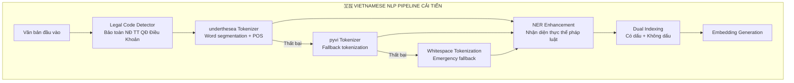

**Cải tiến cụ thể:**
1. **3-tier NLP fallback** (hiện chỉ có 2): underthesea → pyvi → raw whitespace tokenization
2. **Legal Entity NER** mở rộng: Nhận diện "Bộ Giao thông Vận tải", "ICAO", "CAAV" như entities
3. **Prompt Injection Detection tiếng Việt**: Thêm patterns "bỏ qua hướng dẫn trước", "quên chỉ thị"
4. **VN-MTEB Benchmark**: Sử dụng Zalo Legal Text dataset làm evaluation baseline

---

## 9. LARGE LANGUAGE MODEL GATEWAY

### 9.1 Hiện tại

ATTECH hỗ trợ multi-provider LLM (OpenAI, Anthropic Claude) với custom router. Tuy nhiên chưa có chuẩn hóa interface, semantic caching, hay cost tracking.

### 9.2 Công nghệ LLM Gateway 2026

| Gateway | Loại | Tính năng chính | Phù hợp |
|---------|------|----------------|---------|
| **LiteLLM** | Open-source | 100+ LLM providers, OpenAI-compatible API, cost tracking | ⭐ Khuyến nghị |
| **AI Gateway (Portkey)** | SaaS/OSS | Routing, caching, guardrails, load balancing | ✅ Thay thế tốt |
| **Kong AI Gateway** | Enterprise | API management, rate limiting, analytics | 🟡 Quá phức tạp |

### 9.3 Khuyến nghị: LiteLLM

```python
# Ví dụ tích hợp LiteLLM
import litellm

# Cùng interface cho tất cả providers
response = litellm.completion(
    model="anthropic/claude-sonnet-4-5-20250929",
    messages=[{"role": "user", "content": query}],
    max_tokens=1024,
    # Tự động fallback
    fallbacks=["openai/gpt-4o-mini", "ollama/qwen2.5:7b"],
    # Semantic caching
    caching=True,
    cache_params={"type": "redis", "host": "localhost", "port": 6379}
)
```

**Lợi ích:**
- Chuẩn hóa interface cho tất cả LLM providers
- Cost tracking tự động (quan trọng cho ngân sách)
- Semantic caching giảm chi phí API
- Fallback tự động khi provider gặp sự cố
- Rate limiting tích hợp

---

## 10. ĐÁNH GIÁ CHẤT LƯỢNG RAG

### 10.1 Hạn chế Hiện tại

- 100 query-document pairs đánh giá thủ công
- Không có pipeline đánh giá tự động
- Không có alert khi chất lượng retrieval giảm

### 10.2 Framework Đánh giá RAG 2026

```mermaid
graph TB
    subgraph "📊 RAG EVALUATION PIPELINE"
        subgraph "Retrieval Metrics BEIR"
            nDCG[nDCG@10<br/>Normalized Discounted<br/>Cumulative Gain]
            MRR[MRR<br/>Mean Reciprocal Rank]
            RK[Recall@K<br/>K = 5 10 20]
        end
        
        subgraph "Generation Metrics RAGAS"
            FAITH[Faithfulness<br/>Câu trả lời có grounded?]
            REL[Answer Relevance<br/>Câu trả lời có liên quan?]
            CTX[Context Precision<br/>Context có chính xác?]
            HALL[Hallucination Rate<br/>Tỷ lệ bịa thông tin]
        end
        
        subgraph "Vietnamese-Specific"
            ZALO[Zalo Legal Text Benchmark<br/>VN legal retrieval]
            VNMTEB[VN-MTEB<br/>41 datasets 6 tasks]
            CUSTOM[Custom ATTECH Eval<br/>100+ legal Q-A pairs]
        end
        
        nDCG --> DASHB[Dashboard<br/>Grafana + Prometheus]
        MRR --> DASHB
        FAITH --> DASHB
        REL --> DASHB
        ZALO --> DASHB
        DASHB --> ALRT[Alert<br/>Khi metrics giảm hơn 5%]
    end
```

### 10.3 Khuyến nghị Công cụ

| Công cụ | Mục đích | Tích hợp |
|---------|---------|----------|
| **RAGAS** | Đánh giá faithfulness, relevance, context quality | Python library, CI/CD |
| **VN-MTEB** | Benchmark embedding models cho tiếng Việt | HuggingFace, offline eval |
| **LangSmith** | Tracing, debugging LLM calls | LangChain ecosystem |
| **Prometheus + Grafana** (đã có) | Metrics collection và visualization | Đã triển khai |

---

## 11. MA TRẬN SO SÁNH TỔNG HỢP

### 11.1 Công nghệ Hiện tại vs Đề xuất Nâng cấp

| # | Thành phần | Hiện tại | Đề xuất | Cải thiện dự kiến | Nỗ lực | Chi phí |
|---|-----------|---------|---------|-------------------|--------|---------|
| 1 | **Embedding** | Qwen3-0.6B | Qwen3-4B | +15-25% retrieval quality | Trung bình | $0 (OSS) |
| 2 | **VN Embedding** | Không có | vietnamese-document-embedding | +20-30% cho truy vấn VN | Thấp | $0 (OSS) |
| 3 | **Reranker** | Không có | Qwen3-Reranker / bge-reranker-v2-m3 | **+33-47% accuracy** | Trung bình | $0 (OSS) |
| 4 | **Vector DB** | ChromaDB only | pgvector + ChromaDB | Hybrid search tốt hơn RBAC | Trung bình | $0 (OSS) |
| 5 | **Graph RAG** | Tables empty | Populated + API | Multi-hop reasoning | Cao | $0 (OSS) |
| 6 | **LLM Gateway** | Custom router | LiteLLM | Cost tracking caching fallback | Thấp | $0 (OSS) |
| 7 | **Evaluation** | 100 pairs thủ công | RAGAS + VN-MTEB automated | Continuous quality monitoring | Trung bình | $0 (OSS) |
| 8 | **Agentic RAG** | Không có | LangGraph (Phase 3) | Complex query handling | Cao | $0 (OSS) |
| 9 | **RAG Framework** | Custom FastAPI | LlamaIndex indexing + FastAPI API | Better chunking query routing | Trung bình | $0 (OSS) |
| 10 | **VN NLP** | 2-tier fallback | 3-tier + Legal NER + VN prompt injection | Robustness security | Thấp | $0 (OSS) |

### 11.2 Tổng Chi phí Dự kiến

| Hạng mục | Chi phí |
|---------|---------|
| Phần mềm / License | **$0** (tất cả Open Source) |
| GPU Hardware | **$0** (RTX 2080 Ti hiện tại đủ cho Phase 2) |
| LLM API (OpenAI/Anthropic) | Giữ nguyên budget hiện tại, giảm nhờ semantic caching |
| Nhân lực | Effort chính là engineering time |

---

## 12. LỘ TRÌNH NÂNG CẤP ĐỀ XUẤT

### 12.1 Timeline Tổng quan

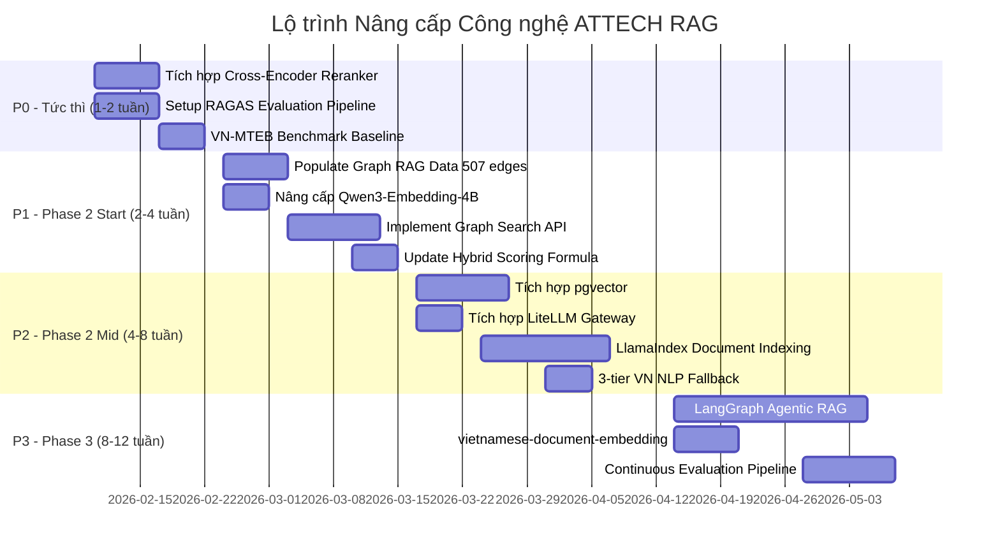

### 12.2 Chi tiết từng Phase

#### 🔴 P0 — Tức thì (Tuần 1-2)

| # | Hành động | Output | Đo lường |
|---|----------|--------|----------|
| 1 | Tích hợp Cross-Encoder Reranker (bge-reranker-v2-m3 hoặc Qwen3-Reranker) | Reranking service trong Docker | nDCG@10 tăng ít nhất 30% |
| 2 | Setup RAGAS evaluation pipeline | Automated eval script | Faithfulness, Relevance scores baseline |
| 3 | Chạy VN-MTEB benchmark trên Qwen3-0.6B hiện tại | Baseline metrics | nDCG@10 trên Zalo Legal Text |

#### 🟡 P1 — Phase 2 Start (Tuần 3-6)

| # | Hành động | Output | Đo lường |
|---|----------|--------|----------|
| 4 | Populate Graph RAG (chạy populate_graph_correct.py + create_semantic_links.py) | 42 documents, 507+ edges | Graph completeness ít nhất 95% |
| 5 | Nâng cấp Qwen3-Embedding từ 0.6B lên 4B | Updated embedding service | nDCG@10 tăng ít nhất 15% vs baseline |
| 6 | Implement Graph Search API endpoint | /api/v1/graph/search | Multi-hop query success rate |
| 7 | Cập nhật Hybrid Scoring: alpha x semantic + beta x keyword + gamma x graph | Updated ranking engine | Overall accuracy improvement |

#### 🟢 P2 — Phase 2 Mid (Tuần 7-10)

| # | Hành động | Output | Đo lường |
|---|----------|--------|----------|
| 8 | Cài đặt pgvector extension, migrate vector data | PostgreSQL vector search | Query latency, accuracy parity |
| 9 | Tích hợp LiteLLM thay custom LLM router | Unified LLM gateway | Cost reduction, failover time |
| 10 | Tích hợp LlamaIndex cho document indexing | Better chunking pipeline | Chunk quality metrics |
| 11 | Implement 3-tier Vietnamese NLP fallback | Robust tokenization | Tokenization failure rate tiến tới 0% |

#### 🔵 P3 — Phase 3 (Tuần 11-14)

| # | Hành động | Output | Đo lường |
|---|----------|--------|----------|
| 12 | LangGraph Agentic RAG cho complex queries | Multi-agent pipeline | Complex query accuracy |
| 13 | Thêm vietnamese-document-embedding (dual embedding) | VN-optimized retrieval | VN-specific nDCG improvement |
| 14 | Continuous evaluation pipeline (tự động, hàng tuần) | Grafana dashboard + alerts | Quality regression detection |

### 12.3 Điểm kiểm tra (Checkpoints)

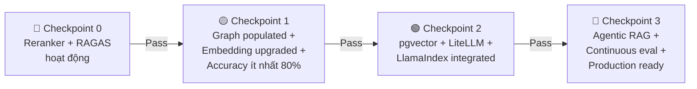

**Tiêu chí Pass cho mỗi Checkpoint:**
- **CP0:** Reranker cải thiện ít nhất 30% nDCG@10. RAGAS baseline metrics thu thập thành công.
- **CP1:** Graph RAG populated (ít nhất 500 edges). Embedding upgrade không regression. Overall accuracy ít nhất 80%.
- **CP2:** pgvector query parity với ChromaDB. LiteLLM failover dưới 5 giây. LlamaIndex chunking quality ít nhất bằng hiện tại.
- **CP3:** Agentic RAG xử lý được complex multi-hop queries. Continuous eval chạy tự động hàng tuần.

---

## 📝 KẾT LUẬN

Hệ thống ATTECH RAG đã có nền tảng vững chắc sau Phase 1 (FR-01 đến FR-08). Các nâng cấp công nghệ đề xuất trong báo cáo này tập trung vào **3 ưu tiên cốt lõi:**

1. **Reranking (P0):** Khoảng cách lớn nhất — thêm Cross-Encoder Reranker có thể cải thiện 33-47% accuracy ngay lập tức với nỗ lực triển khai thấp.

2. **Graph RAG Population + Nâng cấp Embedding (P1):** Dữ liệu graph đã có schema nhưng chưa populated — chạy scripts có sẵn sẽ mở khóa multi-hop reasoning. Nâng cấp Qwen3 từ 0.6B lên 4B cải thiện 15-25% quality trong cùng architecture.

3. **Evaluation Pipeline (P0-P1):** RAGAS + VN-MTEB cung cấp continuous quality monitoring — không có đánh giá tự động thì không thể đo lường cải thiện từ các nâng cấp.

**Điểm mạnh của lộ trình:** Tất cả công nghệ đề xuất đều Open Source ($0 license cost), tương thích với hardware hiện tại (RTX 2080 Ti), và được thiết kế để tích hợp từng bước — không cần đại tu toàn bộ hệ thống.

---

*Báo cáo này dựa trên nghiên cứu các xu hướng công nghệ RAG/AI mới nhất tính đến tháng 02/2026, đối chiếu với project knowledge và trạng thái thực tế của hệ thống ATTECH.*
