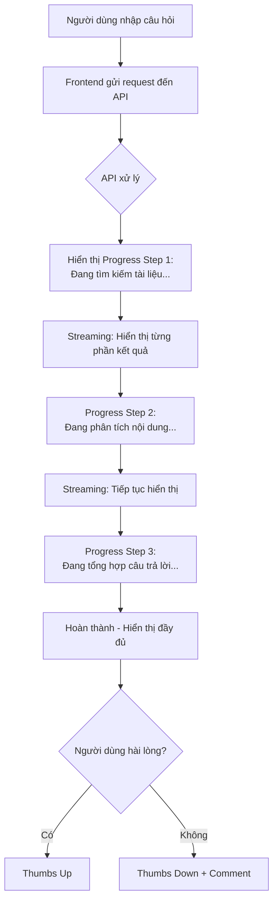

# YÊU CẦU GIAO DIỆN CHATBOT - FRONTEND REQUIREMENTS SPECIFICATION

## THÔNG TIN TÀI LIỆU

**Dự án**: Hệ thống Hỗ trợ Tư vấn Tài liệu Pháp lý  
**Module**: Giao diện Chat Thông minh  
**Phiên bản**: 1.0  
**Ngày**: 15/01/2026  
**Trạng thái**: Yêu cầu Chính thức  
**Đối tượng**: Đội Phát triển Frontend (Outsource)

---

## 1. TỔNG QUAN DỰ ÁN

### 1.1 Mục đích
Tài liệu này xác định yêu cầu chi tiết cho việc xây dựng giao diện người dùng (Frontend) của hệ thống chatbot hỗ trợ tư vấn tài liệu pháp lý. Giao diện này là điểm tương tác chính giữa người dùng và hệ thống AI.

### 1.2 Phạm vi công việc
Đội Outsource sẽ phát triển:
- ✅ Giao diện chat thời gian thực với hiệu ứng streaming
- ✅ Hệ thống hiển thị tiến trình tìm kiếm tài liệu
- ✅ Quản lý lịch sử hội thoại
- ✅ Tính năng tải xuống kết quả
- ✅ Giao diện đa ngôn ngữ (Tiếng Việt/Tiếng Anh)
- ✅ Thiết kế responsive cho Desktop và Mobile

### 1.3 Những gì KHÔNG thuộc phạm vi công việc
- ❌ Logic xử lý backend (API sẽ do đội nội bộ cung cấp)
- ❌ Kết nối database thực tế
- ❌ Triển khai hệ thống AI/Machine Learning
- ❌ Cấu hình server và infrastructure

### 1.4 Sơ đồ luồng hoạt động



---

## 2. YÊU CẦU CÔNG NGHỆ

### 2.1 Tech Stack bắt buộc

#### 2.1.1 Framework và Libraries
```json
{
  "react": "^18.2.0",
  "typescript": "^5.0.0",
  "next": "^14.0.0",
  "tailwindcss": "^3.3.0",
  "framer-motion": "^10.16.0",
  "axios": "^1.6.0",
  "socket.io-client": "^4.7.0"
}
```

#### 2.1.2 Cấu trúc thư mục
```
frontend/
├── src/
│   ├── components/
│   │   ├── chat/
│   │   │   ├── ChatInterface.tsx          # Giao diện chat chính
│   │   │   ├── MessageBubble.tsx          # Bubble tin nhắn
│   │   │   ├── StreamingMessage.tsx       # Message hiển thị từng phần
│   │   │   ├── ProgressIndicator.tsx      # Thanh tiến trình
│   │   │   └── CitationPanel.tsx          # Panel hiển thị nguồn
│   │   ├── ui/
│   │   │   ├── Button.tsx                 # Component nút bấm
│   │   │   ├── Input.tsx                  # Component input
│   │   │   └── LoadingSkeleton.tsx        # Loading placeholder
│   │   └── layout/
│   │       ├── Header.tsx                 # Header với language switcher
│   │       └── Sidebar.tsx                # Sidebar lịch sử chat
│   ├── hooks/
│   │   ├── useStreamingResponse.ts        # Hook xử lý streaming
│   │   └── useProgress.ts                 # Hook quản lý progress
│   ├── services/
│   │   ├── api.ts                         # API service layer
│   │   └── websocket.ts                   # WebSocket connection
│   └── types/
│       └── chat.types.ts                  # TypeScript interfaces
```

### 2.2 Responsive Design Requirements

#### Breakpoints
- **Mobile**: 320px - 768px
- **Tablet**: 768px - 1024px  
- **Desktop**: 1024px - 1920px
- **Large Desktop**: 1920px+

---

## 3. YÊU CẦU CHỨC NĂNG CHI TIẾT

### 3.1 GIAO DIỆN CHAT CHÍNH (CRITICAL FEATURE)

#### 3.1.1 Layout Desktop
```
┌─────────────────────────────────────────────────────────────┐
│ Header: Logo | Tiếng Việt 🇻🇳 ▼ | User: Nguyễn Văn A      │
├──────────┬──────────────────────────────────────────────────┤
│          │                                                  │
│ Sidebar  │          Main Chat Area                         │
│          │                                                  │
│ Lịch sử  │  ┌────────────────────────────────────────┐    │
│ Chat     │  │ User: Quyết định 635 quy định gì?     │    │
│          │  └────────────────────────────────────────┘    │
│ ✓ Hôm nay│                                                  │
│  - Chat1 │  ┌────────────────────────────────────────┐    │
│  - Chat2 │  │ AI: [STREAMING RESPONSE]               │    │
│          │  │ Đang tìm kiếm tài liệu... [█████░░] 60%│    │
│ ✓ Tuần   │  │                                         │    │
│   trước  │  │ Theo Quyết định 635/QĐ-ATTECH...       │    │
│  - Chat3 │  │ [Văn bản tiếp tục hiện ra từng phần]   │    │
│          │  └────────────────────────────────────────┘    │
│          │                                                  │
│          │  📎 Nguồn tham khảo:                            │
│          │  • Quyết định 635 - Trang 5                     │
│          │  • Thông tư 120 - Điều 3                        │
│          │                                                  │
│          │  👍 👎  📥 Tải xuống  🔄 Hỏi lại               │
├──────────┴──────────────────────────────────────────────────┤
│ 💬 Nhập câu hỏi của bạn...                    [Gửi] ➤     │
└─────────────────────────────────────────────────────────────┘
```

#### 3.1.2 Yêu cầu về Message Bubbles

**User Message (Tin nhắn người dùng):**
```typescript
interface UserMessage {
  id: string;
  text: string;
  timestamp: string;
  status: 'sending' | 'sent' | 'failed';
}

// Style
{
  backgroundColor: '#3B82F6',  // Xanh dương
  color: '#FFFFFF',
  borderRadius: '16px 16px 4px 16px',
  padding: '12px 16px',
  maxWidth: '70%',
  alignSelf: 'flex-end',
  boxShadow: '0 2px 4px rgba(0,0,0,0.1)'
}
```

**AI Message (Tin nhắn AI):**
```typescript
interface AIMessage {
  id: string;
  text: string;
  timestamp: string;
  isStreaming: boolean;        // Đang hiển thị từng phần
  progress?: ProgressInfo;     // Thông tin tiến trình
  citations?: Citation[];      // Nguồn tham khảo
}

// Style
{
  backgroundColor: '#F3F4F6',  // Xám nhạt
  color: '#1F2937',
  borderRadius: '16px 16px 16px 4px',
  padding: '12px 16px',
  maxWidth: '80%',
  alignSelf: 'flex-start',
  boxShadow: '0 2px 4px rgba(0,0,0,0.05)'
}
```

### 3.2 STREAMING RESPONSE (CRITICAL - YÊU CẦU ĐẶC BIỆT)

#### 3.2.1 Cơ chế hoạt động

**Mục tiêu:** Người dùng thấy câu trả lời xuất hiện từng từ (như ChatGPT), không phải chờ đợi lâu.

**Phương pháp kỹ thuật:** Server-Sent Events (SSE) hoặc WebSocket

```typescript
// Interface cho Streaming Response
interface StreamingResponse {
  messageId: string;
  chunk: string;              // Phần văn bản mới
  isComplete: boolean;         // Đã hoàn thành chưa
  progress: {
    stage: 'searching' | 'analyzing' | 'synthesizing' | 'complete';
    percentage: number;       // 0-100
    message: string;          // "Đang tìm kiếm tài liệu..."
  };
}
```

#### 3.2.2 API Endpoint cho Streaming

```typescript
// POST /api/v1/chat/stream
// Request
{
  "query": "Quyết định 635 quy định gì về chế độ lương?",
  "session_id": "uuid-xxx",
  "language": "vi"
}

// Response (Server-Sent Events)
// Event 1 - Progress Update
event: progress
data: {"stage": "searching", "percentage": 20, "message": "Đang tìm kiếm tài liệu..."}

// Event 2 - First chunk
event: message
data: {"chunk": "Theo ", "isComplete": false}

// Event 3 - Second chunk  
event: message
data: {"chunk": "Quyết định ", "isComplete": false}

// Event 4 - Continue...
event: message
data: {"chunk": "635/QĐ-ATTECH ", "isComplete": false}

// Event 5 - Progress Update
event: progress
data: {"stage": "analyzing", "percentage": 60, "message": "Đang phân tích nội dung..."}

// Event N - Last chunk
event: message
data: {"chunk": "...điều khoản cuối.", "isComplete": true}

// Final Event - Citations
event: citations
data: [
  {
    "document_id": "QD635_2024",
    "document_title": "Quyết định 635/QĐ-ATTECH",
    "page": 5,
    "text": "Điều 3. Chế độ lương...",
    "relevance_score": 0.95
  }
]
```

#### 3.2.3 Frontend Implementation Example

```typescript
// Hook: useStreamingResponse.ts
import { useEffect, useState } from 'react';

interface StreamingState {
  text: string;
  isStreaming: boolean;
  progress: ProgressInfo;
  citations: Citation[];
}

export const useStreamingResponse = (query: string) => {
  const [state, setState] = useState<StreamingState>({
    text: '',
    isStreaming: false,
    progress: { stage: 'idle', percentage: 0, message: '' },
    citations: []
  });

  useEffect(() => {
    if (!query) return;

    // Kết nối SSE
    const eventSource = new EventSource(
      `/api/v1/chat/stream?query=${encodeURIComponent(query)}`
    );

    setState(prev => ({ ...prev, isStreaming: true }));

    // Nhận progress updates
    eventSource.addEventListener('progress', (e) => {
      const progress = JSON.parse(e.data);
      setState(prev => ({ ...prev, progress }));
    });

    // Nhận message chunks
    eventSource.addEventListener('message', (e) => {
      const data = JSON.parse(e.data);
      setState(prev => ({
        ...prev,
        text: prev.text + data.chunk,
        isStreaming: !data.isComplete
      }));
    });

    // Nhận citations khi hoàn thành
    eventSource.addEventListener('citations', (e) => {
      const citations = JSON.parse(e.data);
      setState(prev => ({ ...prev, citations }));
      eventSource.close();
    });

    // Cleanup
    return () => eventSource.close();
  }, [query]);

  return state;
};
```

#### 3.2.4 Component: StreamingMessage.tsx

```typescript
import React from 'react';
import { motion } from 'framer-motion';

interface StreamingMessageProps {
  text: string;
  isStreaming: boolean;
  progress: ProgressInfo;
}

export const StreamingMessage: React.FC<StreamingMessageProps> = ({
  text,
  isStreaming,
  progress
}) => {
  return (
    <div className="streaming-message">
      {/* Progress Bar - Chỉ hiện khi đang streaming */}
      {isStreaming && (
        <motion.div
          initial={{ opacity: 0, y: -10 }}
          animate={{ opacity: 1, y: 0 }}
          className="mb-3"
        >
          <div className="flex items-center gap-2 mb-2">
            <div className="animate-spin h-4 w-4 border-2 border-blue-500 border-t-transparent rounded-full" />
            <span className="text-sm text-gray-600">{progress.message}</span>
          </div>
          <div className="h-2 bg-gray-200 rounded-full overflow-hidden">
            <motion.div
              className="h-full bg-blue-500"
              initial={{ width: 0 }}
              animate={{ width: `${progress.percentage}%` }}
              transition={{ duration: 0.3 }}
            />
          </div>
        </motion.div>
      )}

      {/* Text Content - Hiển thị từng phần */}
      <div className="message-text">
        {text}
        {isStreaming && (
          <motion.span
            animate={{ opacity: [1, 0, 1] }}
            transition={{ repeat: Infinity, duration: 1 }}
            className="inline-block w-1 h-4 bg-blue-500 ml-1"
          >
            |
          </motion.span>
        )}
      </div>
    </div>
  );
};
```

### 3.3 PROGRESS INDICATORS (YÊU CẦU ĐẶC BIỆT)

#### 3.3.1 Ba giai đoạn tiến trình

```typescript
type ProgressStage = 'searching' | 'analyzing' | 'synthesizing' | 'complete';

interface ProgressInfo {
  stage: ProgressStage;
  percentage: number;        // 0-100
  message: string;
  icon?: string;
}

// Định nghĩa các giai đoạn
const PROGRESS_STAGES: Record<ProgressStage, ProgressInfo> = {
  searching: {
    stage: 'searching',
    percentage: 0-30,
    message: '🔍 Đang tìm kiếm tài liệu liên quan...',
    icon: 'search'
  },
  analyzing: {
    stage: 'analyzing',
    percentage: 30-70,
    message: '🧠 Đang phân tích nội dung tài liệu...',
    icon: 'brain'
  },
  synthesizing: {
    stage: 'synthesizing',
    percentage: 70-100,
    message: '✍️ Đang tổng hợp câu trả lời...',
    icon: 'edit'
  },
  complete: {
    stage: 'complete',
    percentage: 100,
    message: '✅ Hoàn thành',
    icon: 'check'
  }
};
```

#### 3.3.2 Component: ProgressIndicator.tsx

```typescript
import React from 'react';
import { motion } from 'framer-motion';

interface ProgressIndicatorProps {
  stage: ProgressStage;
  percentage: number;
}

export const ProgressIndicator: React.FC<ProgressIndicatorProps> = ({
  stage,
  percentage
}) => {
  const stageInfo = PROGRESS_STAGES[stage];

  return (
    <motion.div
      initial={{ opacity: 0, scale: 0.95 }}
      animate={{ opacity: 1, scale: 1 }}
      exit={{ opacity: 0, scale: 0.95 }}
      className="progress-indicator bg-blue-50 p-4 rounded-lg mb-4"
    >
      {/* Icon + Message */}
      <div className="flex items-center gap-3 mb-3">
        <motion.div
          animate={{ rotate: stage === 'complete' ? 0 : 360 }}
          transition={{ repeat: stage === 'complete' ? 0 : Infinity, duration: 2 }}
        >
          <span className="text-2xl">{stageInfo.message.split(' ')[0]}</span>
        </motion.div>
        <span className="text-sm font-medium text-gray-700">
          {stageInfo.message}
        </span>
      </div>

      {/* Progress Bar */}
      <div className="relative h-2 bg-gray-200 rounded-full overflow-hidden">
        <motion.div
          className="absolute h-full bg-gradient-to-r from-blue-500 to-blue-600"
          initial={{ width: 0 }}
          animate={{ width: `${percentage}%` }}
          transition={{ duration: 0.5, ease: 'easeOut' }}
        />
        
        {/* Shimmer Effect */}
        <motion.div
          className="absolute h-full w-20 bg-gradient-to-r from-transparent via-white/50 to-transparent"
          animate={{ x: ['-100%', '300%'] }}
          transition={{ repeat: Infinity, duration: 1.5, ease: 'linear' }}
        />
      </div>

      {/* Percentage */}
      <div className="text-right mt-2">
        <span className="text-xs text-gray-500">{percentage}%</span>
      </div>
    </motion.div>
  );
};
```

### 3.4 CITATIONS PANEL (Hiển thị nguồn tham khảo)

#### 3.4.1 Data Structure

```typescript
interface Citation {
  document_id: string;
  document_title: string;
  page: number;
  text: string;              // Đoạn trích dẫn
  relevance_score: number;   // 0.0 - 1.0
  url?: string;              // Link tải tài liệu (nếu có)
}
```

#### 3.4.2 UI Display

```typescript
export const CitationPanel: React.FC<{ citations: Citation[] }> = ({ 
  citations 
}) => {
  return (
    <div className="citations-panel mt-4 p-4 bg-gray-50 rounded-lg">
      <h4 className="text-sm font-semibold text-gray-700 mb-3">
        📚 Nguồn tham khảo ({citations.length})
      </h4>
      
      {citations.map((citation, index) => (
        <motion.div
          key={citation.document_id}
          initial={{ opacity: 0, x: -20 }}
          animate={{ opacity: 1, x: 0 }}
          transition={{ delay: index * 0.1 }}
          className="citation-item mb-3 p-3 bg-white rounded border border-gray-200 hover:border-blue-300 transition-colors cursor-pointer"
        >
          {/* Title + Page */}
          <div className="flex items-start justify-between mb-2">
            <h5 className="text-sm font-medium text-gray-900 flex-1">
              {citation.document_title}
            </h5>
            <span className="text-xs text-gray-500 ml-2">
              Trang {citation.page}
            </span>
          </div>

          {/* Excerpt */}
          <p className="text-xs text-gray-600 line-clamp-2">
            "{citation.text}"
          </p>

          {/* Relevance Score */}
          <div className="flex items-center gap-2 mt-2">
            <div className="flex-1 h-1 bg-gray-200 rounded-full overflow-hidden">
              <div
                className="h-full bg-green-500"
                style={{ width: `${citation.relevance_score * 100}%` }}
              />
            </div>
            <span className="text-xs text-gray-500">
              {Math.round(citation.relevance_score * 100)}%
            </span>
          </div>

          {/* Download Link (nếu có) */}
          {citation.url && (
            <button className="mt-2 text-xs text-blue-600 hover:text-blue-700 flex items-center gap-1">
              <span>📥</span>
              <span>Xem tài liệu đầy đủ</span>
            </button>
          )}
        </motion.div>
      ))}
    </div>
  );
};
```

### 3.5 LOADING STATES (Skeleton Loading)

#### 3.5.1 Khi nào hiển thị Loading?

```typescript
// Loading States
enum LoadingState {
  IDLE = 'idle',                    // Không làm gì
  SENDING = 'sending',              // Đang gửi câu hỏi
  SEARCHING = 'searching',          // Đang tìm kiếm (0-30%)
  ANALYZING = 'analyzing',          // Đang phân tích (30-70%)
  SYNTHESIZING = 'synthesizing',    // Đang tổng hợp (70-100%)
  STREAMING = 'streaming',          // Đang hiển thị từng phần
  COMPLETE = 'complete'             // Hoàn thành
}
```

#### 3.5.2 Component: LoadingSkeleton.tsx

```typescript
export const LoadingSkeleton: React.FC = () => {
  return (
    <div className="loading-skeleton animate-pulse">
      {/* Header Skeleton */}
      <div className="h-4 bg-gray-200 rounded w-3/4 mb-3" />
      
      {/* Text Lines Skeleton */}
      <div className="space-y-2">
        <div className="h-3 bg-gray-200 rounded w-full" />
        <div className="h-3 bg-gray-200 rounded w-5/6" />
        <div className="h-3 bg-gray-200 rounded w-4/6" />
      </div>

      {/* Citations Skeleton */}
      <div className="mt-4 space-y-2">
        <div className="h-20 bg-gray-100 rounded" />
        <div className="h-20 bg-gray-100 rounded" />
      </div>
    </div>
  );
};
```

### 3.6 FEEDBACK SYSTEM

#### 3.6.1 UI Components

```typescript
interface FeedbackProps {
  messageId: string;
  onFeedback: (feedback: FeedbackData) => void;
}

interface FeedbackData {
  messageId: string;
  type: 'thumbs_up' | 'thumbs_down';
  comment?: string;
  timestamp: string;
}

export const FeedbackButtons: React.FC<FeedbackProps> = ({
  messageId,
  onFeedback
}) => {
  const [selected, setSelected] = useState<'up' | 'down' | null>(null);
  const [showComment, setShowComment] = useState(false);

  return (
    <div className="feedback-buttons flex items-center gap-2 mt-3">
      {/* Thumbs Up */}
      <button
        onClick={() => {
          setSelected('up');
          onFeedback({
            messageId,
            type: 'thumbs_up',
            timestamp: new Date().toISOString()
          });
        }}
        className={`p-2 rounded-full hover:bg-green-50 transition-colors ${
          selected === 'up' ? 'text-green-600 bg-green-50' : 'text-gray-400'
        }`}
      >
        👍
      </button>

      {/* Thumbs Down */}
      <button
        onClick={() => {
          setSelected('down');
          setShowComment(true);
        }}
        className={`p-2 rounded-full hover:bg-red-50 transition-colors ${
          selected === 'down' ? 'text-red-600 bg-red-50' : 'text-gray-400'
        }`}
      >
        👎
      </button>

      {/* Comment Box (hiện khi thumbs down) */}
      {showComment && (
        <motion.div
          initial={{ opacity: 0, height: 0 }}
          animate={{ opacity: 1, height: 'auto' }}
          className="w-full mt-2"
        >
          <textarea
            placeholder="Vui lòng cho biết vấn đề bạn gặp phải..."
            className="w-full p-2 border rounded text-sm"
            rows={3}
            onBlur={(e) => {
              onFeedback({
                messageId,
                type: 'thumbs_down',
                comment: e.target.value,
                timestamp: new Date().toISOString()
              });
            }}
          />
        </motion.div>
      )}
    </div>
  );
};
```

### 3.7 CHAT HISTORY (Lịch sử hội thoại)

#### 3.7.1 Sidebar Component

```typescript
interface ChatHistory {
  id: string;
  title: string;
  lastMessage: string;
  timestamp: string;
  messageCount: number;
}

export const ChatHistorySidebar: React.FC = () => {
  const [history, setHistory] = useState<ChatHistory[]>([]);
  const [searchQuery, setSearchQuery] = useState('');

  return (
    <aside className="sidebar w-64 bg-gray-50 border-r border-gray-200 flex flex-col h-full">
      {/* Header */}
      <div className="p-4 border-b border-gray-200">
        <h3 className="text-lg font-semibold text-gray-900">Lịch sử Chat</h3>
      </div>

      {/* Search */}
      <div className="p-4">
        <input
          type="text"
          placeholder="🔍 Tìm kiếm cuộc hội thoại..."
          value={searchQuery}
          onChange={(e) => setSearchQuery(e.target.value)}
          className="w-full px-3 py-2 border rounded-lg text-sm"
        />
      </div>

      {/* History List */}
      <div className="flex-1 overflow-y-auto">
        {/* Today */}
        <div className="px-4 py-2">
          <h4 className="text-xs font-semibold text-gray-500 uppercase">
            Hôm nay
          </h4>
          {history.filter(/* today */).map(chat => (
            <ChatHistoryItem key={chat.id} chat={chat} />
          ))}
        </div>

        {/* This Week */}
        <div className="px-4 py-2">
          <h4 className="text-xs font-semibold text-gray-500 uppercase">
            Tuần này
          </h4>
          {history.filter(/* this week */).map(chat => (
            <ChatHistoryItem key={chat.id} chat={chat} />
          ))}
        </div>

        {/* Older */}
        <div className="px-4 py-2">
          <h4 className="text-xs font-semibold text-gray-500 uppercase">
            Cũ hơn
          </h4>
          {history.filter(/* older */).map(chat => (
            <ChatHistoryItem key={chat.id} chat={chat} />
          ))}
        </div>
      </div>

      {/* New Chat Button */}
      <div className="p-4 border-t border-gray-200">
        <button className="w-full py-2 bg-blue-600 text-white rounded-lg hover:bg-blue-700 transition-colors">
          ➕ Chat mới
        </button>
      </div>
    </aside>
  );
};
```

### 3.8 EXPORT FUNCTIONALITY

#### 3.8.1 Export Options

```typescript
type ExportFormat = 'pdf' | 'json' | 'txt' | 'html';

interface ExportRequest {
  sessionId: string;
  format: ExportFormat;
  includeMetadata: boolean;
  includeCitations: boolean;
}

// API
POST /api/v1/chat/export
Body: ExportRequest
Response: {
  downloadUrl: string;
  fileSize: number;
  expiresAt: string;
}
```

#### 3.8.2 Export Button Component

```typescript
export const ExportButton: React.FC<{ sessionId: string }> = ({ 
  sessionId 
}) => {
  const [isExporting, setIsExporting] = useState(false);
  const [showOptions, setShowOptions] = useState(false);

  const handleExport = async (format: ExportFormat) => {
    setIsExporting(true);
    try {
      const response = await api.post('/api/v1/chat/export', {
        sessionId,
        format,
        includeMetadata: true,
        includeCitations: true
      });
      
      // Download file
      window.open(response.data.downloadUrl, '_blank');
    } catch (error) {
      console.error('Export failed:', error);
    } finally {
      setIsExporting(false);
      setShowOptions(false);
    }
  };

  return (
    <div className="relative">
      <button
        onClick={() => setShowOptions(!showOptions)}
        className="p-2 text-gray-600 hover:text-blue-600 rounded-lg hover:bg-gray-100"
        disabled={isExporting}
      >
        {isExporting ? (
          <span className="animate-spin">⏳</span>
        ) : (
          <span>📥 Tải xuống</span>
        )}
      </button>

      {/* Options Dropdown */}
      {showOptions && (
        <motion.div
          initial={{ opacity: 0, y: -10 }}
          animate={{ opacity: 1, y: 0 }}
          className="absolute right-0 mt-2 w-48 bg-white rounded-lg shadow-lg border border-gray-200 z-10"
        >
          <button
            onClick={() => handleExport('pdf')}
            className="w-full text-left px-4 py-2 hover:bg-gray-50 text-sm"
          >
            📄 PDF
          </button>
          <button
            onClick={() => handleExport('json')}
            className="w-full text-left px-4 py-2 hover:bg-gray-50 text-sm"
          >
            📊 JSON
          </button>
          <button
            onClick={() => handleExport('txt')}
            className="w-full text-left px-4 py-2 hover:bg-gray-50 text-sm"
          >
            📝 Text
          </button>
          <button
            onClick={() => handleExport('html')}
            className="w-full text-left px-4 py-2 hover:bg-gray-50 text-sm"
          >
            🌐 HTML
          </button>
        </motion.div>
      )}
    </div>
  );
};
```

---

## 4. API SPECIFICATIONS (MOCK DATA)

### 4.1 Authentication APIs

```typescript
// POST /api/v1/auth/login
Request: {
  "username": "nguyenvana",
  "password": "***"
}

Response: {
  "token": "eyJhbGciOiJIUzI1NiIsInR5cCI6IkpXVCJ9...",
  "user": {
    "id": "user-123",
    "name": "Nguyễn Văn A",
    "email": "nguyenvana@company.com",
    "role": "employee"
  },
  "expiresIn": 3600
}
```

### 4.2 Chat APIs

```typescript
// POST /api/v1/chat/message (Non-streaming)
Request: {
  "query": "Quyết định 635 quy định gì?",
  "session_id": "session-uuid-123",
  "language": "vi"
}

Response: {
  "message_id": "msg-456",
  "answer": "Theo Quyết định 635/QĐ-ATTECH về chế độ lương...",
  "citations": [
    {
      "document_id": "QD635_2024",
      "document_title": "Quyết định 635/QĐ-ATTECH",
      "page": 5,
      "text": "Điều 3. Chế độ lương cơ bản...",
      "relevance_score": 0.95
    }
  ],
  "metadata": {
    "response_time": 1.2,
    "tokens_used": 450,
    "model": "internal-rag-v1"
  }
}

// POST /api/v1/chat/stream (Streaming - Đã mô tả ở 3.2.2)
// SSE endpoint

// GET /api/v1/chat/history
Response: {
  "sessions": [
    {
      "id": "session-1",
      "title": "Quyết định 635 - Lương",
      "created_at": "2026-01-15T10:30:00Z",
      "last_message": "Cảm ơn bạn!",
      "message_count": 8
    }
  ]
}
```

### 4.3 Feedback API

```typescript
// POST /api/v1/feedback
Request: {
  "message_id": "msg-456",
  "session_id": "session-123",
  "feedback_type": "thumbs_down",
  "comment": "Thông tin chưa đầy đủ",
  "timestamp": "2026-01-15T11:00:00Z"
}

Response: {
  "success": true,
  "feedback_id": "fb-789"
}
```

### 4.4 Export API

```typescript
// POST /api/v1/chat/export
Request: {
  "session_id": "session-123",
  "format": "pdf",
  "options": {
    "include_metadata": true,
    "include_citations": true
  }
}

Response: {
  "download_url": "https://api.example.com/downloads/abc123.pdf",
  "file_size": 2048576,
  "expires_at": "2026-01-15T23:59:59Z"
}
```

---

## 5. MOCK DATA CHO TESTING

### 5.1 Mock Conversations

```json
{
  "conversations": [
    {
      "id": "conv-1",
      "title": "Hỏi về Quyết định 635",
      "messages": [
        {
          "id": "msg-1",
          "type": "user",
          "text": "Quyết định 635 quy định gì về chế độ lương?",
          "timestamp": "2026-01-15T10:00:00Z"
        },
        {
          "id": "msg-2",
          "type": "ai",
          "text": "Theo Quyết định 635/QĐ-ATTECH ngày 15/01/2024, chế độ lương được quy định như sau:\n\n1. Mức lương cơ bản: Áp dụng theo bảng lương của Nhà nước\n2. Phụ cấp: Bao gồm phụ cấp trách nhiệm, phụ cấp độc hại, phụ cấp khu vực\n3. Thưởng: Dựa trên hiệu quả công việc và đóng góp cá nhân",
          "timestamp": "2026-01-15T10:00:05Z",
          "citations": [
            {
              "document_id": "QD635_2024",
              "document_title": "Quyết định 635/QĐ-ATTECH",
              "page": 5,
              "text": "Điều 3. Chế độ lương cơ bản áp dụng theo Bảng lương Nhà nước...",
              "relevance_score": 0.95
            },
            {
              "document_id": "TT120_2023",
              "document_title": "Thông tư 120/TT-BTC",
              "page": 12,
              "text": "Phụ cấp trách nhiệm được tính theo vị trí công việc...",
              "relevance_score": 0.87
            }
          ]
        },
        {
          "id": "msg-3",
          "type": "user",
          "text": "Phụ cấp khu vực là bao nhiêu?",
          "timestamp": "2026-01-15T10:01:00Z"
        },
        {
          "id": "msg-4",
          "type": "ai",
          "text": "Phụ cấp khu vực theo Quyết định 635:\n\n• Khu vực I: 0.7 lần mức lương cơ sở\n• Khu vực II: 0.5 lần mức lương cơ sở\n• Khu vực III: 0.3 lần mức lương cơ sở\n\nLưu ý: Mức lương cơ sở hiện tại là 1,800,000 VNĐ/tháng.",
          "timestamp": "2026-01-15T10:01:03Z",
          "citations": [
            {
              "document_id": "QD635_2024",
              "document_title": "Quyết định 635/QĐ-ATTECH",
              "page": 7,
              "text": "Điều 5. Phụ cấp khu vực được phân loại theo 3 khu vực...",
              "relevance_score": 0.98
            }
          ]
        }
      ]
    }
  ]
}
```

### 5.2 Mock Citations Library

```json
{
  "documents": [
    {
      "id": "QD635_2024",
      "title": "Quyết định 635/QĐ-ATTECH",
      "type": "Quyết định",
      "issued_date": "2024-01-15",
      "summary": "Quy định về chế độ lương, phụ cấp và thưởng cho nhân viên ATTECH",
      "total_pages": 25,
      "download_url": "https://example.com/docs/QD635_2024.pdf"
    },
    {
      "id": "TT120_2023",
      "title": "Thông tư 120/TT-BTC",
      "type": "Thông tư",
      "issued_date": "2023-11-20",
      "summary": "Hướng dẫn thực hiện chế độ phụ cấp cho cán bộ nhân viên",
      "total_pages": 18,
      "download_url": "https://example.com/docs/TT120_2023.pdf"
    },
    {
      "id": "CV045_2025",
      "title": "Công văn 045/CV-ATTECH",
      "type": "Công văn",
      "issued_date": "2025-12-10",
      "summary": "Về việc điều chỉnh mức lương và phụ cấp năm 2026",
      "total_pages": 5,
      "download_url": "https://example.com/docs/CV045_2025.pdf"
    }
  ]
}
```

---

## 6. YÊU CẦU PHI CHỨC NĂNG

### 6.1 Performance Requirements

| Metric | Target | Measurement |
|--------|--------|-------------|
| Initial Page Load | < 2 seconds | Time to Interactive (TTI) |
| Message Render | < 100ms | From API response to DOM update |
| Streaming Start | < 500ms | First chunk display |
| Search Response | < 1 second | History search results |
| Bundle Size | < 500KB | Gzipped JavaScript |
| Memory Usage | < 100MB | Chrome DevTools profiler |

### 6.2 Responsive Design

```typescript
// Tailwind Breakpoints
const breakpoints = {
  sm: '640px',   // Mobile landscape
  md: '768px',   // Tablet
  lg: '1024px',  // Desktop
  xl: '1280px',  // Large desktop
  '2xl': '1536px' // Extra large
};

// Layout Changes
// Mobile (< 768px):
// - Single column
// - Sidebar as slide-out drawer
// - Stacked buttons
// - Full-width input

// Desktop (>= 1024px):
// - Two column (sidebar + chat)
// - Fixed sidebar
// - Inline buttons
// - Optimized input area
```

### 6.3 Accessibility (WCAG 2.1 AA)

```typescript
// Required Attributes
<button
  aria-label="Gửi tin nhắn"
  role="button"
  tabIndex={0}
>
  Gửi
</button>

<input
  aria-label="Nhập câu hỏi của bạn"
  aria-required="true"
  aria-invalid={hasError}
/>

// Keyboard Navigation
// - Tab: Di chuyển giữa các elements
// - Enter: Gửi tin nhắn / Kích hoạt button
// - Escape: Đóng modal / dropdown
// - Arrow keys: Điều hướng trong lịch sử chat

// Screen Reader Support
// - Announce new messages: aria-live="polite"
// - Progress updates: aria-live="assertive"
// - Error messages: role="alert"
```

### 6.4 Security

```typescript
// Input Sanitization
import DOMPurify from 'dompurify';

const sanitizeInput = (input: string): string => {
  return DOMPurify.sanitize(input, {
    ALLOWED_TAGS: [],
    ALLOWED_ATTR: []
  });
};

// XSS Prevention
// - Escape all user input
// - Use React's built-in XSS protection
// - Never use dangerouslySetInnerHTML without sanitization

// CSRF Protection
// - Include CSRF token in all API requests
// - Validate token on backend

// Content Security Policy
const cspHeader = `
  default-src 'self';
  script-src 'self' 'unsafe-inline';
  style-src 'self' 'unsafe-inline';
  img-src 'self' data: https:;
  connect-src 'self' https://api.example.com;
`;
```

---

## 7. ANIMATION & TRANSITIONS

### 7.1 Animation Guidelines

```typescript
// Framer Motion Variants
const messageVariants = {
  hidden: { opacity: 0, y: 20, scale: 0.95 },
  visible: { 
    opacity: 1, 
    y: 0, 
    scale: 1,
    transition: { duration: 0.3, ease: 'easeOut' }
  },
  exit: { 
    opacity: 0, 
    y: -20, 
    scale: 0.95,
    transition: { duration: 0.2 }
  }
};

// Loading Animation
const loadingVariants = {
  animate: {
    rotate: 360,
    transition: { 
      repeat: Infinity, 
      duration: 1, 
      ease: 'linear' 
    }
  }
};

// Typing Indicator
const typingVariants = {
  animate: {
    opacity: [1, 0.5, 1],
    transition: {
      repeat: Infinity,
      duration: 1.5,
      ease: 'easeInOut'
    }
  }
};
```

### 7.2 Micro-interactions

```typescript
// Button Hover
<motion.button
  whileHover={{ scale: 1.05 }}
  whileTap={{ scale: 0.95 }}
>
  Gửi
</motion.button>

// Message Slide-in
<motion.div
  initial={{ x: -20, opacity: 0 }}
  animate={{ x: 0, opacity: 1 }}
  transition={{ type: 'spring', stiffness: 100 }}
>
  Message content
</motion.div>

// Progress Bar Fill
<motion.div
  initial={{ width: 0 }}
  animate={{ width: `${percentage}%` }}
  transition={{ duration: 0.5, ease: 'easeOut' }}
/>
```

---

## 8. ERROR HANDLING

### 8.1 Error Types

```typescript
enum ErrorType {
  NETWORK_ERROR = 'network_error',
  AUTH_ERROR = 'auth_error',
  VALIDATION_ERROR = 'validation_error',
  SERVER_ERROR = 'server_error',
  TIMEOUT_ERROR = 'timeout_error'
}

interface ErrorResponse {
  type: ErrorType;
  message: string;
  code: string;
  details?: any;
}
```

### 8.2 Error UI Components

```typescript
export const ErrorMessage: React.FC<{ error: ErrorResponse }> = ({ 
  error 
}) => {
  const getErrorMessage = (type: ErrorType): string => {
    switch (type) {
      case ErrorType.NETWORK_ERROR:
        return '❌ Không thể kết nối đến server. Vui lòng kiểm tra kết nối internet.';
      case ErrorType.AUTH_ERROR:
        return '🔒 Phiên đăng nhập đã hết hạn. Vui lòng đăng nhập lại.';
      case ErrorType.VALIDATION_ERROR:
        return '⚠️ Dữ liệu không hợp lệ. Vui lòng kiểm tra lại.';
      case ErrorType.SERVER_ERROR:
        return '🔧 Hệ thống đang bảo trì. Vui lòng thử lại sau.';
      case ErrorType.TIMEOUT_ERROR:
        return '⏱️ Yêu cầu quá lâu. Vui lòng thử lại.';
      default:
        return '❓ Đã xảy ra lỗi. Vui lòng thử lại.';
    }
  };

  return (
    <motion.div
      initial={{ opacity: 0, y: -10 }}
      animate={{ opacity: 1, y: 0 }}
      className="error-message bg-red-50 border border-red-200 rounded-lg p-4 mb-4"
    >
      <p className="text-sm text-red-800">
        {getErrorMessage(error.type)}
      </p>
      {error.details && (
        <details className="mt-2 text-xs text-red-600">
          <summary className="cursor-pointer">Chi tiết lỗi</summary>
          <pre className="mt-2 p-2 bg-red-100 rounded">
            {JSON.stringify(error.details, null, 2)}
          </pre>
        </details>
      )}
      <button
        className="mt-3 text-sm text-red-600 hover:text-red-700 font-medium"
        onClick={() => window.location.reload()}
      >
        🔄 Tải lại trang
      </button>
    </motion.div>
  );
};
```

### 8.3 Retry Logic

```typescript
// Exponential Backoff Retry
const retryWithBackoff = async (
  fn: () => Promise<any>,
  maxRetries: number = 3,
  delay: number = 1000
): Promise<any> => {
  try {
    return await fn();
  } catch (error) {
    if (maxRetries === 0) throw error;
    
    await new Promise(resolve => setTimeout(resolve, delay));
    return retryWithBackoff(fn, maxRetries - 1, delay * 2);
  }
};

// Usage
const sendMessage = async (message: string) => {
  return retryWithBackoff(
    () => api.post('/api/v1/chat/message', { message }),
    3,
    1000
  );
};
```

---

## 9. TESTING REQUIREMENTS

### 9.1 Unit Testing

```typescript
// Example: StreamingMessage.test.tsx
import { render, screen } from '@testing-library/react';
import { StreamingMessage } from './StreamingMessage';

describe('StreamingMessage', () => {
  it('should display progress bar when streaming', () => {
    render(
      <StreamingMessage
        text="Test message"
        isStreaming={true}
        progress={{ 
          stage: 'searching', 
          percentage: 50, 
          message: 'Đang tìm kiếm...' 
        }}
      />
    );

    expect(screen.getByText('Đang tìm kiếm...')).toBeInTheDocument();
    expect(screen.getByRole('progressbar')).toHaveAttribute('aria-valuenow', '50');
  });

  it('should hide progress bar when completed', () => {
    render(
      <StreamingMessage
        text="Test message"
        isStreaming={false}
        progress={{ stage: 'complete', percentage: 100, message: '' }}
      />
    );

    expect(screen.queryByRole('progressbar')).not.toBeInTheDocument();
  });
});
```

### 9.2 Integration Testing

```typescript
// Example: Chat flow test
describe('Chat Integration', () => {
  it('should complete full chat flow', async () => {
    // 1. User sends message
    const input = screen.getByPlaceholderText('Nhập câu hỏi...');
    fireEvent.change(input, { target: { value: 'Test query' } });
    fireEvent.click(screen.getByText('Gửi'));

    // 2. Progress indicator appears
    await waitFor(() => {
      expect(screen.getByText(/Đang tìm kiếm/i)).toBeInTheDocument();
    });

    // 3. Streaming response starts
    await waitFor(() => {
      expect(screen.getByText(/Theo/i)).toBeInTheDocument();
    });

    // 4. Citations appear
    await waitFor(() => {
      expect(screen.getByText(/Nguồn tham khảo/i)).toBeInTheDocument();
    });

    // 5. Feedback buttons appear
    expect(screen.getByText('👍')).toBeInTheDocument();
    expect(screen.getByText('👎')).toBeInTheDocument();
  });
});
```

### 9.3 E2E Testing với Playwright

```typescript
// Example: e2e/chat.spec.ts
import { test, expect } from '@playwright/test';

test('user can send message and receive streaming response', async ({ page }) => {
  await page.goto('http://localhost:3000');

  // Login
  await page.fill('[name="username"]', 'testuser');
  await page.fill('[name="password"]', 'testpass');
  await page.click('button[type="submit"]');

  // Wait for chat interface
  await expect(page.locator('.chat-interface')).toBeVisible();

  // Send message
  await page.fill('.message-input', 'Test query');
  await page.click('.send-button');

  // Wait for progress indicator
  await expect(page.locator('.progress-indicator')).toBeVisible();

  // Wait for streaming response
  await expect(page.locator('.ai-message')).toContainText('Theo', { timeout: 10000 });

  // Verify citations appeared
  await expect(page.locator('.citations-panel')).toBeVisible();
});
```

---

## 10. DEPLOYMENT & BUILD

### 10.1 Environment Variables

```bash
# .env.example
NEXT_PUBLIC_API_BASE_URL=http://localhost:8000/api/v1
NEXT_PUBLIC_WS_URL=ws://localhost:8000/ws
NEXT_PUBLIC_APP_NAME=Legal Document Assistant
NEXT_PUBLIC_DEFAULT_LANGUAGE=vi
NEXT_PUBLIC_ENABLE_ANALYTICS=false
```

### 10.2 Build Commands

```json
{
  "scripts": {
    "dev": "next dev",
    "build": "next build",
    "start": "next start",
    "lint": "next lint",
    "test": "jest",
    "test:e2e": "playwright test",
    "type-check": "tsc --noEmit",
    "format": "prettier --write \"src/**/*.{ts,tsx}\""
  }
}
```

### 10.3 Docker Support (Optional)

```dockerfile
# Dockerfile
FROM node:18-alpine AS builder

WORKDIR /app
COPY package*.json ./
RUN npm ci
COPY . .
RUN npm run build

FROM node:18-alpine AS runner
WORKDIR /app

COPY --from=builder /app/next.config.js ./
COPY --from=builder /app/public ./public
COPY --from=builder /app/.next ./.next
COPY --from=builder /app/node_modules ./node_modules
COPY --from=builder /app/package.json ./package.json

EXPOSE 3000
CMD ["npm", "start"]
```

---

## 11. BÀN GIAO & DELIVERABLES

### 11.1 Yêu cầu bàn giao

Đội Outsource cần cung cấp:

1. **Source Code**
   - Full source code trên GitHub/GitLab repository
   - README.md với hướng dẫn cài đặt chi tiết
   - .env.example file

2. **Documentation**
   - Component documentation (Storybook hoặc tương tự)
   - API integration guide
   - Deployment guide

3. **Testing**
   - Unit test coverage >= 80%
   - Integration tests cho các flows chính
   - E2E test cases

4. **Build Artifacts**
   - Production build đã optimize
   - Bundle size report
   - Performance audit report

### 11.2 Acceptance Criteria

✅ **Functional Requirements**
- [ ] User có thể gửi/nhận tin nhắn
- [ ] Streaming response hoạt động mượt mà
- [ ] Progress indicators hiển thị chính xác
- [ ] Citations panel hiển thị đúng
- [ ] Feedback system hoạt động
- [ ] Export functionality hoạt động
- [ ] Language switcher hoạt động
- [ ] Chat history search hoạt động

✅ **Performance Requirements**
- [ ] Initial load < 2 seconds
- [ ] Message render < 100ms
- [ ] Streaming start < 500ms
- [ ] Bundle size < 500KB gzipped
- [ ] Memory usage < 100MB

✅ **Quality Requirements**
- [ ] Test coverage >= 80%
- [ ] No TypeScript errors
- [ ] No ESLint errors
- [ ] Passes accessibility audit (WCAG 2.1 AA)
- [ ] Works on Chrome, Firefox, Safari, Edge
- [ ] Responsive on mobile/tablet/desktop

### 11.3 Timeline

| Phase | Duration | Deliverables |
|-------|----------|--------------|
| Setup & Design | 3 ngày | Project setup, Design approval |
| Core Features | 7 ngày | Chat interface, Streaming, Progress |
| Additional Features | 5 ngày | History, Export, Language |
| Testing | 3 ngày | Unit tests, Integration tests |
| Bug Fixes | 2 ngày | Fix issues from testing |
| Documentation | 2 ngày | Complete documentation |
| **Total** | **3 tuần** | Full deliverables |

---

## 12. SUPPORT & COMMUNICATION

### 12.1 Communication Channels

- **Daily Standup**: 9:00 AM (Zoom/Google Meet)
- **Progress Report**: Thứ 3, Thứ 5 qua email
- **Issue Tracking**: GitHub Issues / Jira
- **Emergency Contact**: [Contact Person] - [Phone/Email]

### 12.2 Questions & Clarifications

Nếu có bất kỳ thắc mắc nào về:
- API specifications
- Design details
- Technical requirements
- Timeline adjustments

Vui lòng liên hệ qua:
- **Email**: [technical.lead@company.com]
- **Slack**: #frontend-outsource
- **Phone**: [+84-xxx-xxx-xxx]

---

## 13. APPENDIX

### 13.1 Useful Resources

- **React Documentation**: https://react.dev
- **Next.js Documentation**: https://nextjs.org/docs
- **Tailwind CSS**: https://tailwindcss.com/docs
- **Framer Motion**: https://www.framer.com/motion
- **TypeScript Handbook**: https://www.typescriptlang.org/docs

### 13.2 Design Assets

Sẽ được cung cấp riêng:
- Logo files (SVG, PNG)
- Color palette
- Typography guidelines
- Icon library
- Figma design files

---

## 14. VERSION HISTORY

| Version | Date | Author | Changes |
|---------|------|--------|---------|
| 1.0 | 15/01/2026 | Technical Lead | Initial release |

---

**LƯU Ý QUAN TRỌNG:**

1. ⚠️ **Bảo mật**: Tài liệu này chỉ chứa yêu cầu Frontend. KHÔNG tiết lộ bất kỳ thông tin nào về Backend architecture, Database schema, AI models cho đội Outsource.

2. 🔐 **Mock Data**: Tất cả API endpoints và responses trong tài liệu này là mock data để testing. API thật sẽ do đội nội bộ cung cấp sau khi bàn giao code.

3. 📞 **Liên hệ**: Mọi thắc mắc về technical requirements, vui lòng liên hệ Technical Lead trước khi implement.

---

**END OF DOCUMENT**
