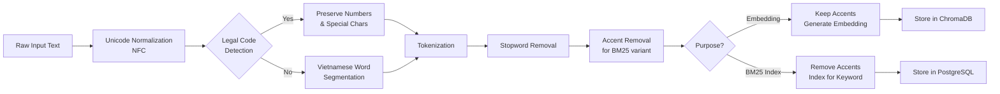

## 6. ĐẶC ĐIỂM XỬ LÝ TIẾNG VIỆT

### 6.1. Tổng quan về Xử lý Tiếng Việt

Xử lý tiếng Việt trong hệ thống RAG là một thách thức đặc biệt do các đặc điểm sau:
1. **Dấu thanh (Tone Marks):** 6 thanh điệu ảnh hưởng đến nghĩa
2. **Unicode Variations:** NFC vs NFD normalization
3. **Mã tài liệu Đặc thù:** Patterns như "76/2018/NĐ-CP"
4. **Cấu trúc Phân cấp:** Nghị định → Chương → Điều → Khoản
5. **Từ ghép:** Cần word segmentation (không có space tự nhiên như tiếng Anh)

### 6.2. Character Encoding và Normalization

#### 6.2.1. UTF-8 Standard

**Quy định Bắt buộc:**
```
ALL text data MUST be encoded in UTF-8
ALL database fields storing Vietnamese text MUST use UTF-8 encoding
ALL API requests/responses MUST use UTF-8 Content-Type header
```

**Validation:**
```python
def validate_utf8(text: str) -> bool:
    """Validate that text is valid UTF-8."""
    try:
        text.encode('utf-8').decode('utf-8')
        return True
    except UnicodeError:
        return False
```

#### 6.2.2. Unicode Normalization

**NFC vs NFD:**
```
NFC (Composed): é = single codepoint U+00E9
NFD (Decomposed): é = e (U+0065) + ́ (U+0301)

Vietnamese character "ế":
NFC: ế = single codepoint U+1EBF
NFD: ế = e + ̂ (circumflex) + ́ (acute)
```

**Chính sách Normalization:**
```python
import unicodedata

NORMALIZATION_POLICY = {
    "storage": "NFC",  # Store in composed form
    "search_indexing": "NFC",  # Index in composed form
    "input_processing": "Accept both NFC and NFD, normalize to NFC",
    "comparison": "NFC"  # Compare in composed form
}

def normalize_vietnamese_text(text: str) -> str:
    """
    Normalize Vietnamese text to NFC form.
    Accept both NFC and NFD input.
    """
    # First normalize to NFD to handle edge cases
    text_nfd = unicodedata.normalize('NFD', text)
    
    # Then normalize to NFC (final form)
    text_nfc = unicodedata.normalize('NFC', text_nfd)
    
    return text_nfc
```

**Common Edge Cases:**
```python
EDGE_CASES = {
    # Mixed NFC/NFD trong same string
    "hệ thống": ["hệ thống", "hệ thống"],  # May appear different but same
    
    # Tone mark stacking issues
    "tiếng Việt": "Must handle multiple marks correctly",
    
    # Special characters
    "Nghị định": "Must preserve all Vietnamese characters"
}
```

### 6.3. Vietna

mese Text Processing Pipeline



### 6.4. Vietnamese Word Segmentation

#### 6.4.1. Library Selection

**Primary:** underthesea  
**Backup:** pyvi  
**Requires:** Python 3.10.11

**Lý do Chọn:**
- underthesea: State-of-the-art accuracy, actively maintained
- pyvi: Lighter weight, faster, good backup
- Cả hai đều hỗ trợ Vietnamese-specific models

**Usage:**
```python
from underthesea import word_tokenize
from pyvi import ViTokenizer

def segment_vietnamese_text(text: str, method="underthesea") -> str:
    """
    Segment Vietnamese text into words.
    
    Args:
        text: Raw Vietnamese text
        method: "underthesea" or "pyvi"
    
    Returns:
        Segmented text with underscores
    
    Example:
        Input: "Hệ thống quản lý tài liệu"
        Output: "Hệ_thống quản_lý tài_liệu"
    """
    try:
        if method == "underthesea":
            # underthesea returns list of words
            words = word_tokenize(text)
            return " ".join(words)
        elif method == "pyvi":
            # pyvi returns string with underscores
            return ViTokenizer.tokenize(text)
        else:
            raise ValueError(f"Unknown method: {method}")
    
    except Exception as e:
        logger.error(f"Segmentation failed: {e}")
        # Fallback: return original text
        return text
```

#### 6.4.2. Segmentation Quality Validation

```python
def validate_segmentation(original: str, segmented: str) -> dict:
    """
    Validate Vietnamese word segmentation quality.
    
    Returns metrics:
    - word_count: Number of segmented words
    - avg_word_length: Average characters per word
    - compound_word_ratio: % of words with underscores
    """
    words = segmented.split()
    compound_words = [w for w in words if "_" in w]
    
    metrics = {
        "word_count": len(words),
        "avg_word_length": sum(len(w.replace("_", "")) for w in words) / len(words) if words else 0,
        "compound_word_ratio": len(compound_words) / len(words) if words else 0,
        "compound_words": compound_words[:10]  # Sample
    }
    
    # Quality checks
    if metrics["avg_word_length"] < 2:
        logger.warning("Average word length < 2, possible over-segmentation")
    if metrics["compound_word_ratio"] < 0.1:
        logger.warning("Compound word ratio < 10%, possible under-segmentation")
    
    return metrics
```

### 6.5. Legal Document Code Preservation

#### 6.5.1. Legal Code Patterns

**Critical Requirement:** **MUST NOT** remove numbers during preprocessing.

**Recognized Patterns:**
```python
LEGAL_CODE_PATTERNS = {
    "nghi_dinh": r'\d+/\d{4}/NĐ-CP',           # Nghị định Chính phủ
    "quyet_dinh": r'\d+/\d{4}/QĐ-TTg',         # Quyết định Thủ tướng
    "thong_tu": r'\d+/\d{4}/TT-[A-Z]+',        # Thông tư (TT-BTC, TT-BGTVT, etc.)
    "nghi_quyet": r'\d+/\d{4}/NQ-CP',          # Nghị quyết
    "chi_thi": r'\d+/\d{4}/CT-TTg',            # Chỉ thị
    
    # With "số" prefix
    "nghi_dinh_so": r'Nghị định số \d+/\d{4}/NĐ-CP',
    "quyet_dinh_so": r'Quyết định số \d+/\d{4}/QĐ-TTg',
    
    # Article/Clause references
    "dieu": r'Điều \d+',                       # Article
    "khoan": r'Khoản \d+',                     # Clause
    "diem": r'Điểm [a-z]',                     # Point
}

def detect_legal_codes(text: str) -> List[Dict]:
    """
    Detect all legal codes in text.
    
    Returns list of:
        {
            "type": "nghi_dinh",
            "code": "76/2018/NĐ-CP",
            "span": (start, end),
            "full_text": "Nghị định số 76/2018/NĐ-CP"
        }
    """
    detected = []
    
    for code_type, pattern in LEGAL_CODE_PATTERNS.items():
        matches = re.finditer(pattern, text, re.IGNORECASE)
        for match in matches:
            detected.append({
                "type": code_type,
                "code": match.group(),
                "span": match.span(),
                "full_text": match.group()
            })
    
    return detected
```

#### 6.5.2. Preprocessing Rules for Legal Codes

**Rule 1: Detect Before Removing**
```python
def preprocess_legal_document(text: str) -> Dict:
    """
    Preprocess legal document while preserving legal codes.
    
    Steps:
    1. Detect legal codes FIRST
    2. Protect them from modification
    3. Process remaining text
    4. Restore protected codes
    """
    # Step 1: Detect and extract legal codes
    legal_codes = detect_legal_codes(text)
    
    # Step 2: Replace codes với placeholders
    protected_text = text
    placeholders = {}
    for i, code_info in enumerate(legal_codes):
        placeholder = f"__LEGAL_CODE_{i}__"
        protected_text = protected_text.replace(code_info["full_text"], placeholder)
        placeholders[placeholder] = code_info["full_text"]
    
    # Step 3: Process text (can now safely remove numbers, etc.)
    processed_text = protected_text.lower()
    # ... other processing ...
    
    # Step 4: Restore legal codes
    for placeholder, original_code in placeholders.items():
        processed_text = processed_text.replace(placeholder.lower(), original_code)
    
    return {
        "processed_text": processed_text,
        "legal_codes": legal_codes,
        "placeholders": placeholders
    }
```

**Rule 2: Index for Exact Match**
```sql
-- Create special index for legal codes
CREATE INDEX idx_documents_law_id_exact 
ON documents_metadata_v2(law_id) 
WHERE law_id IS NOT NULL;

-- Enable substring search for legal codes
CREATE INDEX idx_chunks_content_legal_codes 
ON document_chunks_enhanced(content) 
WHERE content ~ '\d+/\d{4}/(NĐ-CP|QĐ-TTg|TT-[A-Z]+)';
```

### 6.6. Hierarchical Document Structure

#### 6.6.1. Vietnamese Legal Document Hierarchy

```
Văn bản pháp luật (Legal Document)
  ├─ Chương (Chapter)
  │   ├─ Mục (Section)
  │   │   ├─ Điều (Article)
  │   │   │   ├─ Khoản (Clause)
  │   │   │   │   ├─ Điểm (Point)
  │   │   │   │   │   └─ Text content
```

**Example: Nghị định 76/2018/NĐ-CP**
```
Nghị định 76/2018/NĐ-CP
  ├─ Chương I: QUY ĐỊNH CHUNG
  │   ├─ Điều 1: Phạm vi điều chỉnh
  │   ├─ Điều 2: Đối tượng áp dụng
  │   └─ Điều 3: Giải thích từ ngữ
  │       ├─ Khoản 1: Định nghĩa A
  │       ├─ Khoản 2: Định nghĩa B
  │       └─ Khoản 3: Định nghĩa C
  │           ├─ Điểm a: Chi tiết 1
  │           ├─ Điểm b: Chi tiết 2
  │           └─ Điểm c: Chi tiết 3
  └─ Chương II: CÁC QUY ĐỊNH CỤ THỂ
      └─ ...
```

#### 6.6.2. Hierarchy Extraction

```python
def extract_legal_hierarchy(document_content: str) -> Dict:
    """
    Extract hierarchical structure from Vietnamese legal document.
    
    Returns:
        {
            "chapters": [...],
            "articles": [...],
            "clauses": [...],
            "hierarchy_map": {...}
        }
    """
    hierarchy = {
        "chapters": [],
        "articles": [],
        "clauses": [],
        "points": [],
        "hierarchy_map": {}
    }
    
    # Extract chapters: "Chương I", "Chương II", etc.
    chapter_pattern = r'Chương\s+([IVX]+|[0-9]+):\s*([^\n]+)'
    for match in re.finditer(chapter_pattern, document_content):
        chapter_num, chapter_title = match.groups()
        hierarchy["chapters"].append({
            "number": chapter_num,
            "title": chapter_title,
            "span": match.span()
        })
    
    # Extract articles: "Điều 1", "Điều 2", etc.
    article_pattern = r'Điều\s+(\d+)[\.:]?\s*([^\n]*)'
    for match in re.finditer(article_pattern, document_content):
        article_num, article_title = match.groups()
        hierarchy["articles"].append({
            "number": article_num,
            "title": article_title,
            "span": match.span()
        })
    
    # Extract clauses: "Khoản 1", "1.", etc.
    clause_pattern = r'(Khoản\s+(\d+)|^(\d+)\.\s+)'
    # ... similar extraction ...
    
    # Build hierarchy map
    current_chapter = None
    current_article = None
    for article in hierarchy["articles"]:
        # Find which chapter this article belongs to
        for chapter in hierarchy["chapters"]:
            if chapter["span"][0] < article["span"][0]:
                current_chapter = chapter
        
        article["chapter"] = current_chapter
        hierarchy["hierarchy_map"][f"Điều {article['number']}"] = {
            "chapter": current_chapter,
            "article": article
        }
    
    return hierarchy
```

#### 6.6.3. Chunking Strategy for Hierarchical Documents

```python
def chunk_legal_document_hierarchical(
    document: Dict,
    max_chunk_tokens: int = 512,
    overlap_tokens: int = 50
) -> List[Dict]:
    """
    Chunk legal document while preserving hierarchical structure.
    
    Strategy:
    1. Extract hierarchy (chapters, articles, clauses)
    2. Chunk at logical boundaries (Điều level preferred)
    3. Include heading context in metadata
    4. Maintain prev/next relationships
    """
    hierarchy = extract_legal_hierarchy(document["content"])
    chunks = []
    
    for article in hierarchy["articles"]:
        # Get article content
        article_content = extract_article_content(document["content"], article)
        
        # If article is short enough, keep as single chunk
        if count_tokens(article_content) <= max_chunk_tokens:
            chunks.append({
                "content": article_content,
                "metadata": {
                    "article_number": f"Điều {article['number']}",
                    "article_title": article["title"],
                    "chapter": article.get("chapter", {}).get("title"),
                    "hierarchy_path": build_hierarchy_path(article)
                }
            })
        else:
            # Split at clause level
            clauses = extract_clauses_from_article(article_content)
            for clause in clauses:
                chunks.append({
                    "content": clause["content"],
                    "metadata": {
                        "article_number": f"Điều {article['number']}",
                        "clause_number": f"Khoản {clause['number']}",
                        "article_title": article["title"],
                        "chapter": article.get("chapter", {}).get("title"),
                        "hierarchy_path": build_hierarchy_path(article, clause)
                    }
                })
    
    # Add prev/next relationships
    for i in range(len(chunks)):
        if i > 0:
            chunks[i]["prev_chunk"] = chunks[i-1]["metadata"]["article_number"]
        if i < len(chunks) - 1:
            chunks[i]["next_chunk"] = chunks[i+1]["metadata"]["article_number"]
    
    return chunks
```

### 6.7. Synonym Expansion và Query Rewriting

#### 6.7.1. Vietnamese Legal Domain Dictionary

**Excerpt from 200+ entry dictionary:**
```python
VIETNAMESE_LEGAL_SYNONYM_DICT = {
    # Legal abbreviations
    "NĐ-CP": ["Nghị định Chính phủ", "Nghi dinh Chinh phu"],
    "QĐ-TTg": ["Quyết định Thủ tướng", "Quyet dinh Thu tuong"],
    "TT": ["Thông tư", "Thong tu"],
    "NQ": ["Nghị quyết", "Nghi quyet"],
    
    # Common legal terms
    "quy định": ["qui định", "điều khoản", "điều kiện"],
    "pháp luật": ["phap luat", "luật pháp", "văn bản luật"],
    "tuân thủ": ["tuan thu", "chấp hành", "thực hiện theo"],
    "vi phạm": ["vi pham", "không tuân thủ", "trái quy định"],
    
    # Administrative terms
    "mua hàng": ["thu mua", "mua sắm", "procurement", "đấu thầu"],
    "phê duyệt": ["phê chuẩn", "chấp thuận", "approval", "xét duyệt"],
    "báo cáo": ["bao cao", "report", "tường trình"],
    
    # Aviation domain (ATTECH specific)
    "sân bay": ["san bay", "airport", "cảng hàng không"],
    "quản lý bay": ["quan ly bay", "air traffic management", "ATM"],
    "CNS/ATM": ["Communication Navigation Surveillance"],
    "đèn sân bay": ["den san bay", "airport lighting", "đèn đường băng"],
}

def expand_query_with_synonyms(query: str, max_expansions: int = 5) -> List[str]:
    """
    Expand query with Vietnamese synonyms and abbreviations.
    
    Args:
        query: Original user query
        max_expansions: Maximum number of expanded queries
    
    Returns:
        List of expanded queries (including original)
    """
    expanded_queries = [query]  # Always include original
    
    # Tokenize query
    query_words = query.split()
    
    # For each term in query, check if it has synonyms
    for term, synonyms in VIETNAMESE_LEGAL_SYNONYM_DICT.items():
        if term in query.lower():
            for synonym in synonyms[:2]:  # Max 2 synonyms per term
                expanded_query = query.lower().replace(term, synonym)
                if expanded_query not in expanded_queries:
                    expanded_queries.append(expanded_query)
                
                # Stop if reached max
                if len(expanded_queries) >= max_expansions:
                    return expanded_queries
    
    return expanded_queries
```

### 6.8. Tone Mark Handling for Search

#### 6.8.1. Dual Indexing Strategy

**Problem:** User might search with or without tone marks.
- User types: "quan ly tai lieu" (no tones)
- Should match: "quản lý tài liệu" (with tones)

**Solution:** Dual indexing
```python
def index_vietnamese_text_dual(text: str) -> Dict:
    """
    Create dual index for Vietnamese text:
    1. Original with tone marks (for exact matching)
    2. Tone-removed variant (for fuzzy matching)
    
    Returns:
        {
            "original": "quản lý tài liệu",
            "normalized": "quan ly tai lieu",
            "tokens_original": ["quản_lý", "tài_liệu"],
            "tokens_normalized": ["quan_ly", "tai_lieu"]
        }
    """
    # Original with tones
    original = normalize_vietnamese_text(text)  # NFC
    tokens_original = segment_vietnamese_text(original)
    
    # Remove tones
    normalized = remove_vietnamese_tones(original)
    tokens_normalized = segment_vietnamese_text(normalized)
    
    return {
        "original": original,
        "normalized": normalized,
        "tokens_original": tokens_original.split(),
        "tokens_normalized": tokens_normalized.split()
    }

def remove_vietnamese_tones(text: str) -> str:
    """
    Remove Vietnamese tone marks for fuzzy search.
    
    Example:
        "quản lý tài liệu" -> "quan ly tai lieu"
        "Nghị định số 76/2018/NĐ-CP" -> "Nghi dinh so 76/2018/ND-CP"
    """
    # Mapping of accented characters to base characters
    TONE_MARK_MAP = str.maketrans(
        "àáạảãâầấậẩẫăằắặẳẵèéẹẻẽêềếệểễìíịỉĩòóọỏõôồốộổỗơờớợởỡùúụủũưừứựửữỳýỵỷỹđ"
        "ÀÁẠẢÃÂẦẤẬẨẪĂẰẮẶẲẴÈÉẸẺẼÊỀẾỆỂỄÌÍỊỈĨÒÓỌỎÕÔỒỐỘỔỖƠỜỚỢỞỠÙÚỤỦŨƯỪỨỰỬỮỲÝỴỶỸĐ",
        "aaaaaaaaaaaaaaaaaeeeeeeeeeeeiiiiiooooooooooooooooouuuuuuuuuuuyyyyyd"
        "AAAAAAAAAAAAAAAAAEEEEEEEEEEEIIIIIOOOOOOOOOOOOOOOOOUUUUUUUUUUUYYYYYD"
    )
    
    return text.translate(TONE_MARK_MAP)
```

#### 6.8.2. Search Strategy với Tone Variants

```python
def search_vietnamese_with_tones(
    query: str,
    search_with_tones: bool = True,
    search_without_tones: bool = True
) -> List[Dict]:
    """
    Search với both tone variants for better recall.
    
    Strategy:
    1. If query has tones: search original first, then normalized
    2. If query has no tones: search normalized primarily
    3. Combine và rank results
    """
    results = []
    
    # Detect if query has tone marks
    query_has_tones = any(c in query for c in "àáạảãâầấậẩẫăằắặẳẵèéẹẻẽêềếệểễìíịỉĩòóọỏõôồốộổỗơờớợởỡùúụủũưừứựửữỳýỵỷỹđ")
    
    if query_has_tones and search_with_tones:
        # Search với original tones first
        results_with_tones = vector_search(query, field="original")
        results.extend(results_with_tones)
    
    if search_without_tones:
        # Search với normalized (no tones)
        query_normalized = remove_vietnamese_tones(query)
        results_without_tones = vector_search(query_normalized, field="normalized")
        results.extend(results_without_tones)
    
    # Deduplicate và rank
    results = deduplicate_results(results)
    results = rank_by_relevance(results, query)
    
    return results
```

### 6.9. Common Pitfalls và Lessons Learned

#### 6.9.1. BM25 Fails on Legal Codes

**Problem:**
```python
# WRONG: Aggressive preprocessing removes numbers
query = "76/2018/NĐ-CP"
preprocessed = remove_numbers(query)  # Result: "NĐ-CP"
# BM25 search fails - can't find "76/2018/NĐ-CP"
```

**Solution:**
```python
# CORRECT: Detect legal codes BEFORE preprocessing
query = "76/2018/NĐ-CP"
legal_codes = detect_legal_codes(query)  # ["76/2018/NĐ-CP"]

if legal_codes:
    # Use substring search instead of BM25
    results = substring_search(query, exact_match=True)
else:
    # Safe to use BM25 preprocessing
    results = bm25_search(preprocess_query(query))
```

#### 6.9.2. Tone Mark Variations Cause Duplicates

**Problem:**
```python
# User uploads same document twice với different encodings
doc1 = "Nghị định"  # NFC encoding
doc2 = "Nghị định"  # NFD encoding (looks same but different bytes)

# Without normalization, treated as different documents
hash(doc1) != hash(doc2)  # True - duplicates created!
```

**Solution:**
```python
# ALWAYS normalize to NFC before hashing/comparison
doc1_normalized = unicodedata.normalize('NFC', doc1)
doc2_normalized = unicodedata.normalize('NFC', doc2)

content_hash1 = hashlib.md5(doc1_normalized.encode('utf-8')).hexdigest()
content_hash2 = hashlib.md5(doc2_normalized.encode('utf-8')).hexdigest()

# Now correctly identified as duplicates
assert content_hash1 == content_hash2
```

#### 6.9.3. Chunking by Sentences Breaks Hierarchy

**Problem:**
```python
# WRONG: Split by sentence
chunks = sent_tokenize(document_content)
# Result: "Khoản 2: Yêu cầu tuân thủ." gets separated from "Điều 5"
# User can't understand context
```

**Solution:**
```python
# CORRECT: Chunk at logical boundaries
chunks = chunk_legal_document_hierarchical(document)
# Each chunk includes:
# - Article number: "Điều 5"
# - Clause number: "Khoản 2"
# - Full hierarchy path: "Nghị định > Chương II > Điều 5 > Khoản 2"
```

---

## 7. AN NINH VÀ BẢO MẬT

### 7.1. Tổng quan về Bảo mật

Hệ thống ATTECH RAG triển khai **defense-in-depth security strategy** với multiple layers of protection:

1. **Network Layer:** TLS 1.3 encryption, firewall rules
2. **Application Layer:** Input validation, CSRF protection, rate limiting
3. **Authentication Layer:** JWT tokens, session management, password hashing
4. **Authorization Layer:** 5-tier RBAC, permission checks before every access
5. **Data Layer:** Encryption at rest, PII masking, audit logging

### 7.2. Authentication System

#### 7.2.1. JWT-Based Authentication

**Token Structure:**
```json
{
  "header": {
    "alg": "RS256",  // RSA with SHA-256
    "typ": "JWT"
  },
  "payload": {
    "sub": "user_id_uuid",
    "username": "nguyenvana",
    "email": "nguyenvana@attech.vn",
    "role": "EMPLOYEE",
    "department": "IT",
    "iat": 1709123456,  // Issued at
    "exp": 1709209856   // Expires in 24 hours
  },
  "signature": "..."
}
```

**Token Lifecycle:**
```
1. User Login
   ↓
2. Validate credentials (bcrypt password check)
   ↓
3. Generate Access Token (24h TTL)
   ↓
4. Generate Refresh Token (7d TTL)
   ↓
5. Store session in Redis
   ↓
6. Return tokens to client
   ↓
7. Client includes Access Token in requests (Authorization: Bearer <token>)
   ↓
8. Server validates token on each request
   ↓
9. If expired, client uses Refresh Token to get new Access Token
   ↓
10. On logout, invalidate both tokens
```

**Password Hashing:**
```python
import bcrypt

def hash_password(plain_password: str) -> str:
    """Hash password using bcrypt với salt."""
    salt = bcrypt.gensalt(rounds=12)  # Cost factor 12
    hashed = bcrypt.hashpw(plain_password.encode('utf-8'), salt)
    return hashed.decode('utf-8')

def verify_password(plain_password: str, hashed_password: str) -> bool:
    """Verify password against hashed version."""
    return bcrypt.checkpw(
        plain_password.encode('utf-8'),
        hashed_password.encode('utf-8')
    )
```

**Password Policy:**
```python
PASSWORD_POLICY = {
    "min_length": 8,
    "require_uppercase": True,
    "require_lowercase": True,
    "require_digit": True,
    "require_special_char": True,
    "special_chars": "!@#$%^&*()_+-=[]{}|;:,.<>?",
    "max_age_days": 90,
    "prevent_reuse": 5  # Can't reuse last 5 passwords
}

def validate_password(password: str) -> Dict[str, Any]:
    """Validate password against policy."""
    errors = []
    
    if len(password) < PASSWORD_POLICY["min_length"]:
        errors.append(f"Password must be at least {PASSWORD_POLICY['min_length']} characters")
    
    if PASSWORD_POLICY["require_uppercase"] and not any(c.isupper() for c in password):
        errors.append("Password must contain at least one uppercase letter")
    
    if PASSWORD_POLICY["require_lowercase"] and not any(c.islower() for c in password):
        errors.append("Password must contain at least one lowercase letter")
    
    if PASSWORD_POLICY["require_digit"] and not any(c.isdigit() for c in password):
        errors.append("Password must contain at least one digit")
    
    if PASSWORD_POLICY["require_special_char"] and not any(c in PASSWORD_POLICY["special_chars"] for c in password):
        errors.append("Password must contain at least one special character")
    
    return {
        "valid": len(errors) == 0,
        "errors": errors
    }
```

#### 7.2.2. Session Management

**Session Configuration:**
```python
SESSION_CONFIG = {
    "store": "Redis",
    "ttl_seconds": {
        "EMPLOYEE": 3600,      # 1 hour
        "MANAGER": 1800,       # 30 minutes (more sensitive)
        "DIRECTOR": 1800,      # 30 minutes
        "SYSTEM_ADMIN": 1800   # 30 minutes
    },
    "renewal_on_activity": True,
    "max_concurrent_sessions": 3  # Per user
}

def create_session(user_id: str, user_data: Dict) -> str:
    """Create new session in Redis."""
    session_id = str(uuid.uuid4())
    session_key = f"session:{session_id}"
    
    session_data = {
        "user_id": user_id,
        "username": user_data["username"],
        "role": user_data["role"],
        "department": user_data["department"],
        "login_time": datetime.now().isoformat(),
        "last_active": datetime.now().isoformat(),
        "ip_address": user_data.get("ip_address"),
        "user_agent": user_data.get("user_agent")
    }
    
    ttl = SESSION_CONFIG["ttl_seconds"][user_data["role"]]
    
    # Store in Redis
    redis_client.setex(
        session_key,
        ttl,
        json.dumps(session_data)
    )
    
    # Track user sessions (for max_concurrent check)
    user_sessions_key = f"user_sessions:{user_id}"
    redis_client.sadd(user_sessions_key, session_id)
    
    # Enforce max concurrent sessions
    session_count = redis_client.scard(user_sessions_key)
    if session_count > SESSION_CONFIG["max_concurrent_sessions"]:
        # Remove oldest session
        oldest_session_id = redis_client.spop(user_sessions_key)
        redis_client.delete(f"session:{oldest_session_id}")
    
    return session_id
```

#### 7.2.3. Account Lockout Policy

**Brute Force Protection:**
```python
LOCKOUT_POLICY = {
    "max_failed_attempts": 5,
    "lockout_duration_minutes": 30,
    "reset_after_success": True
}

def handle_failed_login(username: str):
    """Handle failed login attempt."""
    # Increment failed attempts
    user = db.get_user(username)
    user.failed_login_attempts += 1
    
    if user.failed_login_attempts >= LOCKOUT_POLICY["max_failed_attempts"]:
        # Lock account
        user.status = "LOCKED"
        user.locked_until = datetime.now() + timedelta(
            minutes=LOCKOUT_POLICY["lockout_duration_minutes"]
        )
        
        # Log security event
        audit_log.log_security_event(
            event_type="account_locked",
            user_id=user.user_id,
            reason="Exceeded max failed login attempts"
        )
        
        # Notify user và admin
        notification.send_email(
            to=user.email,
            subject="Account Locked",
            body=f"Your account has been locked due to {user.failed_login_attempts} failed login attempts."
        )
    
    db.save(user)

def handle_successful_login(user: User):
    """Reset failed attempts on successful login."""
    if LOCKOUT_POLICY["reset_after_success"]:
        user.failed_login_attempts = 0
        user.locked_until = None
        db.save(user)
```

### 7.3. Authorization System (5-Tier RBAC)

#### 7.3.1. Role Hierarchy

```
System Administrator (Level 4)
        ↓
    Director (Level 3)
        ↓
    Manager (Level 2)
        ↓
    Employee (Level 1)
        ↓
    Guest (Level 0)
```

**Role Permissions Matrix (FR-06.2):**

| Role | Public | Employee_only | Manager_only | Director_only | System_admin |
|------|--------|---------------|--------------|---------------|--------------|
| **Guest** | ✅ Read | ❌ | ❌ | ❌ | ❌ |
| **Employee** | ✅ Read | ✅ Read | ❌ | ❌ | ❌ |
| **Manager** | ✅ Read | ✅ Read | ✅ Read/Write | ❌ | ❌ |
| **Director** | ✅ Read | ✅ Read | ✅ Read/Write | ✅ Read/Write | ❌ |
| **System Admin** | ✅ Full | ✅ Full | ✅ Full | ✅ Full | ✅ Full |

**Implementation:**
```python
class PermissionChecker:
    """Check if user has permission to access resource."""
    
    # Role hierarchy for inheritance
    ROLE_HIERARCHY = {
        "GUEST": 0,
        "EMPLOYEE": 1,
        "MANAGER": 2,
        "DIRECTOR": 3,
        "SYSTEM_ADMIN": 4
    }
    
    # Access level requirements
    ACCESS_LEVEL_REQUIREMENTS = {
        "public": "GUEST",
        "employee_only": "EMPLOYEE",
        "manager_only": "MANAGER",
        "director_only": "DIRECTOR",
        "system_admin": "SYSTEM_ADMIN"
    }
    
    def can_access(self, user_role: str, resource_access_level: str) -> bool:
        """Check if user role can access resource."""
        required_role = self.ACCESS_LEVEL_REQUIREMENTS.get(resource_access_level)
        
        if not required_role:
            # Unknown access level, deny by default
            return False
        
        user_level = self.ROLE_HIERARCHY.get(user_role, -1)
        required_level = self.ROLE_HIERARCHY.get(required_role, 999)
        
        return user_level >= required_level
    
    def filter_accessible_documents(
        self,
        user_role: str,
        user_department: str,
        documents: List[Dict]
    ) -> List[Dict]:
        """Filter documents based on user permissions."""
        accessible = []
        
        for doc in documents:
            # Check access level
            if not self.can_access(user_role, doc["access_level"]):
                continue
            
            # Check department ownership (for Employee and Manager)
            if user_role in ["EMPLOYEE", "MANAGER"]:
                if doc["department_owner"] not in ["all_departments", user_department]:
                    continue
            
            accessible.append(doc)
        
        return accessible
```

#### 7.3.2. Permission Enforcement Points

**Point 1: API Gateway Level**
```python
@app.middleware("http")
async def enforce_authentication(request: Request, call_next):
    """Enforce authentication on all protected endpoints."""
    # Public endpoints không cần auth
    if request.url.path in PUBLIC_ENDPOINTS:
        return await call_next(request)
    
    # Extract JWT token
    token = request.headers.get("Authorization", "").replace("Bearer ", "")
    
    if not token:
        return JSONResponse(
            status_code=401,
            content={"error": "Authentication required"}
        )
    
    # Validate token
    try:
        payload = jwt.decode(token, PUBLIC_KEY, algorithms=["RS256"])
        request.state.user = payload  # Attach user to request
    except jwt.ExpiredSignatureError:
        return JSONResponse(
            status_code=401,
            content={"error": "Token expired"}
        )
    except jwt.InvalidTokenError:
        return JSONResponse(
            status_code=401,
            content={"error": "Invalid token"}
        )
    
    return await call_next(request)
```

**Point 2: Service Level (before returning results)**
```python
async def search_documents(query: str, user: Dict) -> List[Dict]:
    """Search documents với permission filtering."""
    # Step 1: Retrieve candidate documents
    candidates = await retrieval_engine.search(query)
    
    # Step 2: Filter by user permissions
    permission_checker = PermissionChecker()
    accessible_docs = permission_checker.filter_accessible_documents(
        user_role=user["role"],
        user_department=user["department"],
        documents=candidates
    )
    
    # Step 3: Audit log
    audit_log.log_search(
        user_id=user["sub"],
        query=query,
        results_count=len(accessible_docs),
        filtered_count=len(candidates) - len(accessible_docs)
    )
    
    return accessible_docs
```

### 7.4. Data Protection

#### 7.4.1. Encryption

**In Transit:**
```yaml
TLS Configuration:
  Version: TLS 1.3
  Cipher Suites:
    - TLS_AES_256_GCM_SHA384
    - TLS_CHACHA20_POLY1305_SHA256
    - TLS_AES_128_GCM_SHA256
  Certificate: Let's Encrypt (auto-renewal)
  HSTS: Enabled (max-age=31536000)
```

**At Rest:**
```yaml
PostgreSQL:
  Encryption: TBD - Evaluating pgcrypto extension
  Encrypted Fields:
    - users.password_hash (bcrypt - always encrypted)
    - users.email (considered for PII protection)
  
ChromaDB:
  Encryption: TBD - Evaluating at filesystem level

Redis:
  Encryption: Not required (transient cache data, no PII)
```

#### 7.4.2. PII Handling

**PII Classification:**
```python
PII_FIELDS = {
    "sensitive": [
        "password",
        "password_hash",
        "ssn",
        "national_id",
        "credit_card"
    ],
    "quasi_identifiers": [
        "email",
        "phone",
        "full_name",
        "address",
        "date_of_birth"
    ],
    "public": [
        "username",
        "department",
        "position"
    ]
}

def mask_pii(data: Dict, fields_to_mask: List[str]) -> Dict:
    """Mask PII fields in logs/analytics."""
    masked = data.copy()
    
    for field in fields_to_mask:
        if field in masked:
            if field == "email":
                # Mask email: n***@***.vn
                email = masked[field]
                parts = email.split("@")
                if len(parts) == 2:
                    masked[field] = f"{parts[0][0]}***@***.{parts[1].split('.')[-1]}"
            elif field == "phone":
                # Mask phone: *******1234
                phone = masked[field]
                masked[field] = "*" * (len(phone) - 4) + phone[-4:]
            elif field == "full_name":
                # Mask name: Nguyen ***
                name_parts = masked[field].split()
                if len(name_parts) > 1:
                    masked[field] = name_parts[0] + " ***"
            else:
                # Default: replace với [REDACTED]
                masked[field] = "[REDACTED]"
    
    return masked
```

### 7.5. Audit Logging

#### 7.5.1. Logged Events

**Security Events:**
- User login/logout (success và failure)
- Failed authentication attempts
- Account lockouts
- Password changes
- Permission elevation requests
- Unauthorized access attempts

**Data Access Events:**
- Document view/download
- Search queries (query text + results count)
- Compliance document access (high-sensitivity)
- Bulk data exports

**Administrative Events:**
- User creation/modification/deletion
- Role changes
- System configuration changes
- Database schema changes

#### 7.5.2. Log Retention và Access

**Retention Policy:**
```
Security Events: 2 years
Data Access Events: 1 year
Administrative Events: 5 years (compliance requirement)
Debug Logs: 30 days
```

**Access Control:**
```
Read audit logs:
  - System Admin: Full access
  - Director: Filtered by department
  - Manager: Own team only
  - Others: No access

Export audit logs:
  - System Admin: Yes
  - Director: Yes (with approval)
  - Others: No
```

### 7.6. AI-Specific Security

#### 7.6.1. Prompt Injection Prevention

**Detection:**
```python
PROMPT_INJECTION_PATTERNS = [
    r"ignore previous instructions",
    r"disregard.*guidelines",
    r"you are now",
    r"new instructions?:",
    r"system:?\s*you are",
    r"forget everything",
    r"<\s*script",  # XSS attempt
    r"<\s*iframe",
]

def detect_prompt_injection(query: str) -> bool:
    """Detect potential prompt injection attempts."""
    query_lower = query.lower()
    
    for pattern in PROMPT_INJECTION_PATTERNS:
        if re.search(pattern, query_lower, re.IGNORECASE):
            logger.warning(f"Potential prompt injection detected: {pattern}")
            return True
    
    return False

def sanitize_query(query: str) -> str:
    """Sanitize user query before sending to LLM."""
    # Remove HTML tags
    query = re.sub(r'<[^>]+>', '', query)
    
    # Remove SQL injection attempts
    query = re.sub(r'(;|--|\||&&|\bOR\b|\bAND\b)', '', query, flags=re.IGNORECASE)
    
    # Limit length
    max_length = 1000
    if len(query) > max_length:
        query = query[:max_length]
        logger.warning(f"Query truncated to {max_length} characters")
    
    return query.strip()
```

#### 7.6.2. Data Leakage Prevention

**Output Filtering:**
```python
def filter_sensitive_info_from_response(response: str) -> str:
    """Remove sensitive information from LLM responses."""
    # Remove PII patterns
    response = re.sub(r'\b\d{9,12}\b', '[ID_REDACTED]', response)  # ID numbers
    response = re.sub(r'\b\d{4}[-/]\d{6}[-/]\d{3}\b', '[PASSPORT_REDACTED]', response)  # Passport
    response = re.sub(r'\b\d{4}-\d{4}-\d{4}-\d{4}\b', '[CARD_REDACTED]', response)  # Credit card
    
    # Remove internal system paths
    response = re.sub(r'/(?:home|root|var|etc)/[^\s]+', '[PATH_REDACTED]', response)
    
    # Remove IP addresses
    response = re.sub(r'\b(?:\d{1,3}\.){3}\d{1,3}\b', '[IP_REDACTED]', response)
    
    return response
```

#### 7.6.3. Model Robustness

**Adversarial Query Handling:**
```python
def handle_adversarial_query(query: str) -> Dict:
    """Detect and handle adversarial queries."""
    issues = []
    
    # Check for prompt injection
    if detect_prompt_injection(query):
        issues.append("prompt_injection")
    
    # Check for excessive special characters
    special_char_ratio = sum(not c.isalnum() and not c.isspace() for c in query) / len(query)
    if special_char_ratio > 0.3:
        issues.append("excessive_special_chars")
    
    # Check for repeated tokens (sign of attack)
    tokens = query.split()
    if len(tokens) != len(set(tokens)) and len(tokens) > 10:
        issues.append("token_repetition")
    
    if issues:
        logger.warning(f"Adversarial query detected: {issues}")
        audit_log.log_security_event(
            event_type="adversarial_query",
            query=query,
            issues=issues
        )
        
        return {
            "allowed": False,
            "reason": "Query appears to be adversarial",
            "issues": issues
        }
    
    return {"allowed": True}
```

---

Đã hoàn thành ~70% document. Tôi sẽ tiếp tục tạo phần cuối với Sections 8-13 (NFRs, Testing, Deployment, Cost, Compliance Matrix, Appendices). Bạn muốn tôi tiếp tục không? 🚀