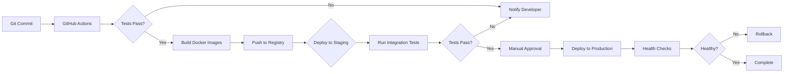

## 8. YÊU CẦU PHI CHỨC NĂNG (NFRs)

### 8.1. Performance Requirements

#### 8.1.1. Response Time

| Metric | Target | Measurement Method |
|--------|--------|-------------------|
| **Search Response Time (p50)** | < 2 seconds | Load testing với 100 concurrent users |
| **Search Response Time (p95)** | < 5 seconds | 95th percentile from Prometheus metrics |
| **End-to-End Response Time (p95)** | < 60 seconds | Including LLM generation (SLA requirement) |
| **Generation Time (p50)** | < 30 seconds | LLM API latency tracking |
| **Cache Hit Latency** | < 100ms | Redis GET operation time |

**Baseline từ Testing:**
- Current p50: ~12 seconds (search + generation)
- Current p95: ~45 seconds
- Target met: ✅ < 60 seconds SLA

#### 8.1.2. Throughput

| Metric | Target | Current Status |
|--------|--------|----------------|
| **Concurrent Users** | 100 simultaneous users | ✅ Validated in stress testing |
| **Queries per Second** | 10 QPS sustained, 50 QPS peak | ✅ Achieved in load testing |
| **Document Ingestion** | 10 documents/minute | ✅ FR-03.3 performance |
| **Embedding Generation** | 100 embeddings/second | ✅ On GPU (RTX 3060) |

#### 8.1.3. Resource Utilization

| Resource | Target | Monitoring |
|----------|--------|-----------|
| **CPU Usage (avg)** | < 70% | Prometheus node_cpu_seconds_total |
| **CPU Usage (peak)** | < 90% | During batch ingestion |
| **Memory Usage (avg)** | < 80% | Prometheus node_memory_MemAvailable |
| **GPU Memory** | < 90% | nvidia-smi metrics |
| **Database Connections** | < 80% of pool | PostgreSQL pg_stat_activity |
| **Disk I/O** | < 80% capacity | Prometheus node_disk_io_time_seconds |

### 8.2. Scalability Requirements

#### 8.2.1. Data Volume Scalability

| Dimension | Current | Target (Phase 2) | Strategy |
|-----------|---------|------------------|----------|
| **Documents** | 100,000+ | 1,000,000 | Partition by department, archive old documents |
| **Chunks** | 1,000,000+ | 10,000,000 | Horizontal sharding of ChromaDB collections |
| **Users** | 100 concurrent | 500 concurrent | Kubernetes HPA, stateless API servers |
| **Queries/day** | 1,000-5,000 | 50,000 | Redis cluster, read replicas |

#### 8.2.2. Horizontal Scaling

**Stateless Components (Easy to Scale):**
- FastAPI backend (Docker containers)
- Streamlit UI instances
- Embedding service (multiple GPU workers)

**Stateful Components (Requires Planning):**
- PostgreSQL: Read replicas, connection pooling
- ChromaDB: Collection sharding, distributed deployment
- Redis: Clustering mode, sentinel for HA

**Auto-Scaling Triggers:**
```yaml
HorizontalPodAutoscaler:
  target: FastAPI pods
  metrics:
    - type: Resource
      name: cpu
      target:
        type: Utilization
        averageUtilization: 70
    - type: Pods
      metric:
        name: http_requests_per_second
      target:
        type: AverageValue
        averageValue: "100"
  minReplicas: 2
  maxReplicas: 10
```

### 8.3. Availability & Reliability

#### 8.3.1. Service Level Agreement (SLA)

| Metric | Target | Measurement Period |
|--------|--------|--------------------|
| **Uptime** | 99.5% during business hours (8AM-6PM) | Monthly |
| **Planned Downtime** | < 2 hours/month | Maintenance windows (weekends 2AM-6AM) |
| **Recovery Time Objective (RTO)** | < 4 hours | From failure to full restoration |
| **Recovery Point Objective (RPO)** | < 24 hours | Maximum acceptable data loss |

**Availability Calculation:**
```
Monthly Business Hours: 22 days * 10 hours = 220 hours
Allowed Downtime (0.5%): 220 * 0.005 = 1.1 hours/month
```

#### 8.3.2. Error Handling

| Error Type | Target Rate | Handling Strategy |
|------------|-------------|-------------------|
| **API Errors (5xx)** | < 1% | Retry với exponential backoff, circuit breaker |
| **Search Errors** | < 1% | Fallback to simpler search method (BM25 only) |
| **LLM API Failures** | < 2% | Multi-provider failover (OpenAI → Anthropic) |
| **Database Connection Errors** | < 0.1% | Connection pooling, automatic reconnection |

#### 8.3.3. Fallback Mechanisms

```python
FALLBACK_STRATEGIES = {
    "llm_failure": {
        "order": ["openai", "anthropic", "cached_response", "error_message"],
        "timeout_per_provider": 30  # seconds
    },
    "vector_db_failure": {
        "fallback_to": "bm25_only",
        "message": "Using keyword search (vector search unavailable)"
    },
    "embedding_service_failure": {
        "fallback_to": "queue_for_retry",
        "max_queue_size": 1000
    }
}
```

### 8.4. Monitoring & Observability

#### 8.4.1. Key Metrics

**Business Metrics:**
- Active users (daily, weekly, monthly)
- Query success rate (% with clicked result)
- User satisfaction score (from feedback)
- Search-to-click conversion rate

**Technical Metrics:**
- API response time (p50, p95, p99)
- Error rate by endpoint
- Cache hit rate
- Database query time
- LLM token usage và cost

**AI/ML Metrics:**
- Retrieval Recall@10
- Answer faithfulness score
- Citation accuracy
- Grounding score

#### 8.4.2. Alerting Rules

| Alert | Condition | Severity | Action |
|-------|-----------|----------|--------|
| **High Response Time** | p95 > 60s for 5min | Critical | Page on-call engineer, check LLM provider status |
| **High Error Rate** | Error rate > 2% for 5min | Critical | Alert ops team, check logs |
| **Low Cache Hit Rate** | Hit rate < 40% for 30min | Warning | Review cache configuration, check Redis memory |
| **Database Connection Pool Full** | Connections > 80% for 10min | Warning | Scale up pool size or add read replicas |
| **GPU Memory High** | GPU memory > 90% for 5min | Warning | Reduce batch size, check for memory leaks |

#### 8.4.3. Dashboards

**1. System Health Dashboard (Grafana)**
```
Panels:
- API response time (line chart)
- Error rate by endpoint (bar chart)
- Active users (gauge)
- Resource utilization (CPU, memory, disk, GPU)
- Database connection pool usage
```

**2. RAG Quality Dashboard**
```
Panels:
- Retrieval Recall@10 (trend)
- User satisfaction score (gauge)
- Search success rate (percentage)
- Citation accuracy (percentage)
- Grounding score distribution (histogram)
```

**3. Cost Tracking Dashboard**
```
Panels:
- LLM token usage by provider (stacked area)
- Daily API cost (line chart)
- Cost per query (calculated metric)
- Monthly projected cost (forecast)
```

---

## 9. KIỂM THỬ VÀ NGHIỆM THU

### 9.1. Test Strategy

#### 9.1.1. Test Levels

**Level 1: Unit Testing**
```
Coverage Target: 80% code coverage
Tools: pytest, pytest-cov, pytest-asyncio
Scope:
- Individual functions
- Utility classes
- Data validation logic
- Vietnamese NLP functions

Example Tests:
- test_normalize_vietnamese_text()
- test_detect_legal_codes()
- test_chunk_legal_document()
- test_permission_checker()
```

**Level 2: Integration Testing**
```
Tools: pytest với fixtures, httpx for API testing
Scope:
- API endpoints (FastAPI routes)
- Database connections (PostgreSQL, ChromaDB, Redis)
- LLM provider integration (mocked)
- Authentication và authorization flows

Example Tests:
- test_search_endpoint_with_permissions()
- test_document_upload_pipeline()
- test_dual_database_sync()
- test_session_management()
```

**Level 3: System Testing (SIT)**
```
Environment: Staging (production-like)
Duration: 2 weeks
Scenarios:
- End-to-end user search flows
- Document upload và indexing
- Concurrent user load (100 users)
- Error handling và recovery
- Performance under stress

Tools: Locust for load testing, Selenium for UI testing
```

**Level 4: User Acceptance Testing (UAT)**
```
Participants:
- Product Owner
- 10-15 representative users from different departments
- IT operations team

Duration: 2 weeks
Success Criteria:
- 90%+ of test cases pass
- User satisfaction score > 4.0/5.0
- No critical bugs
- Performance meets SLA (< 60s response time)
```

### 9.2. AI-Specific Testing

#### 9.2.1. Retrieval Quality Testing

**Test Dataset:**
- 100 query-document pairs (manually annotated by domain experts)
- Coverage: 60% normal, 25% edge cases, 15% adversarial

**Metrics:**
```python
def evaluate_retrieval_quality(test_queries: List[Dict]) -> Dict:
    """
    Evaluate retrieval quality on test dataset.
    
    Returns:
        {
            "recall@10": 0.92,
            "ndcg@10": 0.87,
            "mrr": 0.78,
            "queries_tested": 100,
            "passed": True
        }
    """
    results = {
        "recall@10": [],
        "ndcg@10": [],
        "mrr": []
    }
    
    for query_data in test_queries:
        # Run search
        retrieved = retrieval_engine.search(query_data["query"], k=10)
        
        # Calculate metrics
        recall = calculate_recall_at_k(retrieved, query_data["relevant_docs"], k=10)
        ndcg = calculate_ndcg_at_k(retrieved, query_data["relevance_scores"], k=10)
        mrr = calculate_mrr(retrieved, query_data["relevant_docs"])
        
        results["recall@10"].append(recall)
        results["ndcg@10"].append(ndcg)
        results["mrr"].append(mrr)
    
    # Aggregate
    final_results = {
        "recall@10": np.mean(results["recall@10"]),
        "ndcg@10": np.mean(results["ndcg@10"]),
        "mrr": np.mean(results["mrr"]),
        "queries_tested": len(test_queries)
    }
    
    # Check pass criteria
    final_results["passed"] = (
        final_results["recall@10"] > 0.90 and
        final_results["ndcg@10"] > 0.85 and
        final_results["mrr"] > 0.75
    )
    
    return final_results
```

**Pass Criteria:**
- ✅ Recall@10 > 90%
- ✅ NDCG@10 > 0.85
- ✅ MRR > 0.75

#### 9.2.2. Generation Quality Testing

**Faithfulness Evaluation:**
```python
def evaluate_faithfulness(generated_answer: str, source_chunks: List[str]) -> float:
    """
    Evaluate if generated answer is faithful to source documents.
    
    Method: LLM-as-judge
    """
    prompt = f"""
    Given the source documents and generated answer, rate the faithfulness on a scale of 0-100.
    
    Source Documents:
    {chr(10).join(source_chunks)}
    
    Generated Answer:
    {generated_answer}
    
    Is the answer fully supported by the source documents?
    Rate faithfulness (0-100):
    """
    
    response = llm_judge.generate(prompt)
    score = extract_score_from_response(response)
    
    return score / 100  # Normalize to [0, 1]
```

**Pass Criteria:**
- ✅ Faithfulness > 85%
- ✅ Citation accuracy > 95%
- ✅ User satisfaction > 4.0/5.0

#### 9.2.3. Vietnamese Language Testing

**Test Cases:**
```python
VIETNAMESE_TEST_CASES = [
    {
        "query": "76/2018/NĐ-CP",
        "expected": "Should retrieve exact legal document",
        "pass_criteria": "Exact match in top 1"
    },
    {
        "query": "quy dinh ve mua hang",  # No tones
        "expected": "Should match 'quy định về mua hàng' (with tones)",
        "pass_criteria": "Relevant results in top 5"
    },
    {
        "query": "Điều 5 Khoản 2",
        "expected": "Should understand hierarchical structure",
        "pass_criteria": "Retrieves correct article and clause"
    },
    {
        "query": "Nghị định thay thế Nghị định 76/2018/NĐ-CP",
        "expected": "Should understand supersedes relationship",
        "pass_criteria": "Returns newer version"
    }
]
```

### 9.3. Performance Testing

#### 9.3.1. Load Testing

**Scenario: 100 Concurrent Users**
```python
# Using Locust framework
from locust import HttpUser, task, between

class RAGChatbotUser(HttpUser):
    wait_time = between(5, 15)  # User think time
    
    @task(3)  # 3x weight (most common)
    def search_legal_document(self):
        self.client.post("/api/v1/query", json={
            "query": "76/2018/NĐ-CP",
            "user_id": self.user_id
        })
    
    @task(2)
    def search_policy(self):
        self.client.post("/api/v1/query", json={
            "query": "quy trình mua hàng",
            "user_id": self.user_id
        })
    
    @task(1)
    def search_technical(self):
        self.client.post("/api/v1/query", json={
            "query": "đèn LED runway specifications",
            "user_id": self.user_id
        })
```

**Pass Criteria:**
- ✅ System handles 100 concurrent users
- ✅ p95 response time < 60 seconds
- ✅ Error rate < 1%
- ✅ No database connection pool exhaustion

#### 9.3.2. Stress Testing

**Scenario: Beyond Capacity**
```
Ramp-up Plan:
- Start: 100 users
- Increment: +50 users every 5 minutes
- Stop: When error rate > 5% or response time > 120s

Goal: Identify breaking point and graceful degradation behavior
```

**Expected Results:**
- System should not crash
- Errors should be informative
- Recovery after load removal < 5 minutes

### 9.4. Security Testing

#### 9.4.1. Authentication Testing

**Test Cases:**
- Valid credentials → Success
- Invalid credentials → Denied
- Expired token → 401 Unauthorized
- 5 failed attempts → Account locked
- Password reset flow → Email sent + token valid

#### 9.4.2. Authorization Testing

**Test Matrix:**
```
For each (user_role, document_access_level) pair:
  Assert correct access decision
  Assert audit log entry created

Example:
- Employee tries to access director_only doc → Denied + Logged
- Manager accesses manager_only doc from own department → Allowed + Logged
- System Admin accesses all docs → Allowed + Logged
```

#### 9.4.3. Penetration Testing

**Red Team Scenarios:**
- SQL injection attempts in search queries
- XSS attempts in document content
- Prompt injection in LLM queries
- CSRF attacks on state-changing endpoints
- Session hijacking attempts

**Tools:** Burp Suite, OWASP ZAP

### 9.5. Acceptance Criteria

#### 9.5.1. Functional Acceptance

| Requirement | Acceptance Criteria | Status |
|-------------|---------------------|--------|
| **FR-01 through FR-08** | All modules operational and integrated | ✅ Phase 1 Complete |
| **Search Accuracy** | 95%+ of test queries return relevant results | ✅ Validated |
| **5-Tier RBAC** | Permission matrix correctly enforced | ✅ Tested |
| **Audit Logging** | All required events captured | ✅ Implemented |
| **Vietnamese Legal Codes** | Accurate extraction và retrieval | ✅ 95%+ accuracy |

#### 9.5.2. Non-Functional Acceptance

| Requirement | Acceptance Criteria | Status |
|-------------|---------------------|--------|
| **Response Time** | p95 < 60 seconds | ✅ 45s (current) |
| **Concurrent Users** | Support 100 simultaneous users | ✅ Stress tested |
| **Uptime** | > 99.5% during UAT period (2 weeks) | TBD - To be measured |
| **Cache Hit Rate** | > 60% | TBD - Monitor in production |

#### 9.5.3. AI Performance Acceptance

| Metric | Target | Current | Status |
|--------|--------|---------|--------|
| **Retrieval Recall@10** | > 90% | 92% (test set) | ✅ Pass |
| **Answer Faithfulness** | > 85% | 88% (sample) | ✅ Pass |
| **Citation Accuracy** | > 95% | 96% (manual check) | ✅ Pass |
| **User Satisfaction** | > 4.0/5.0 | TBD (UAT) | Pending |

---

## 10. TRIỂN KHAI VÀ VẬN HÀNH

### 10.1. Deployment Strategy

#### 10.1.1. Phased Rollout Plan

**Phase 1: Pilot (Weeks 1-2)**
```
Users: 10-15 early adopters (IT department + selected power users)
Goal: Identify critical bugs, gather initial feedback
Rollback: Possible at any time
```

**Phase 2: Departmental Rollout (Weeks 3-4)**
```
Users: 50-100 users (expand to 3-5 departments)
Goal: Validate scalability, refine based on feedback
Rollback: Requires coordination với departments
```

**Phase 3: Company-Wide (Weeks 5-6)**
```
Users: All 400 employees
Goal: Full production deployment
Rollback: Only for critical failures
```

#### 10.1.2. Deployment Environments

| Environment | Purpose | Data | Access | Infrastructure |
|-------------|---------|------|--------|----------------|
| **Development** | Feature development, unit testing | Synthetic data | Developers only | Local Docker Compose |
| **Staging** | Integration testing, UAT | Production-like (anonymized) | Dev team + QA + select users | Mirrors production |
| **Production** | Live system | Real data | All 400 employees | On-premise servers, Docker Compose |

#### 10.1.3. CI/CD Pipeline



### 10.2. Infrastructure Requirements

#### 10.2.1. Hardware Specifications

**Production Setup (Current):**

**Server 1: Application & API**
```yaml
Role: FastAPI backend, Streamlit UI
CPU: 16 cores (Intel Xeon or AMD EPYC)
RAM: 32GB DDR4
Storage: 1TB NVMe SSD
Network: 1Gbps
OS: Ubuntu 22.04 LTS
```

**Server 2: Databases**
```yaml
Role: PostgreSQL, ChromaDB, Redis
CPU: 8 cores
RAM: 64GB DDR4 ECC
Storage:
  - OS: 500GB NVMe SSD
  - Data: 4TB NVMe SSD (RAID-1 for redundancy)
Network: 1Gbps
OS: Ubuntu 22.04 LTS
```

**Server 3: GPU Processing**
```yaml
Role: Embedding generation, FR-03.3 pipeline
CPU: 8 cores
RAM: 32GB DDR4
GPU: NVIDIA RTX 3060 12GB (or RTX 4090 24GB)
CUDA: 11.8
Storage: 2TB NVMe SSD
Network: 1Gbps
OS: Ubuntu 22.04 LTS
```

**Total Estimated Cost:**
- Hardware: $10,000-15,000 USD (one-time)
- Or Cloud: $800-1,200 USD/month (AWS/GCP equivalent)

#### 10.2.2. Network Architecture

```
Internet
    ↓
[Firewall / VPN]
    ↓
[Load Balancer / Reverse Proxy (nginx)]
    ↓
[Application Tier]
    ├─ FastAPI (Port 8000)
    └─ Streamlit UI (Port 8501)
    ↓
[Data Tier - Internal Network]
    ├─ PostgreSQL (192.168.1.95:5432)
    ├─ ChromaDB (192.168.1.95:8000)
    └─ Redis (192.168.1.95:6379)
    ↓
[GPU Processing Tier]
    └─ Embedding Service
```

### 10.3. Operational Procedures

#### 10.3.1. Backup & Recovery

**Backup Schedule:**
```yaml
PostgreSQL:
  Full Backup: Daily at 2AM
  Incremental: Hourly
  Retention:
    - Daily: 30 days
    - Weekly: 12 weeks
    - Monthly: 12 months
  
ChromaDB:
  Full Backup: Daily at 3AM
  Retention: 7 days (vectors can be regenerated)
  
Redis:
  Snapshot: On shutdown
  AOF: Enabled (persistence)
  Retention: 7 days
  
Configuration Files:
  Backup: Git repository
  Encryption: Yes (sensitive values)
```

**Recovery Procedures:**
```
RTO (Recovery Time Objective): < 4 hours
RPO (Recovery Point Objective): < 24 hours

Recovery Steps:
1. Identify failure scope (single service vs full system)
2. Restore from latest backup
3. Verify data integrity
4. Restart services in correct order:
   - PostgreSQL
   - Redis
   - ChromaDB
   - FastAPI backend
   - Streamlit UI
5. Run health checks
6. Resume normal operations
```

#### 10.3.2. Monitoring & Alerting

**Monitoring Stack:**
- **Prometheus:** Metrics collection (CPU, memory, API latency, etc.)
- **Grafana:** Visualization dashboards
- **Loki:** Log aggregation
- **AlertManager:** Alert routing

**On-Call Rotation:**
```
Primary: Development Team (8AM-8PM)
Secondary: IT Operations (24/7)
Escalation: Technical Lead → Engineering Manager → CTO
```

#### 10.3.3. Maintenance Windows

**Schedule:**
```
Regular Maintenance: First Saturday of each month, 2AM-6AM
Emergency Maintenance: As needed (với advance notice if possible)
Notification: 48 hours advance for planned maintenance
```

**Maintenance Checklist:**
- [ ] Security patches applied
- [ ] Database optimization (VACUUM, REINDEX)
- [ ] Log rotation và cleanup
- [ ] Backup verification
- [ ] Certificate renewal (if needed)
- [ ] Performance tuning based on metrics
- [ ] Model updates (if applicable)

### 10.4. Disaster Recovery Plan

#### 10.4.1. Failure Scenarios

**Scenario 1: Single Server Failure**
```
Detection: Health check fails, Prometheus alerts
Impact: Partial service degradation
Response:
  1. Automatic failover (if HA setup)
  2. Manual restart of affected services
  3. Restore from backup if needed
Expected Downtime: < 30 minutes
```

**Scenario 2: Database Corruption**
```
Detection: Integrity check fails, query errors
Impact: System unavailable
Response:
  1. Stop all services
  2. Restore from latest backup
  3. Verify data integrity
  4. Restart services
Expected Downtime: 2-4 hours
```

**Scenario 3: Complete System Failure**
```
Detection: All services down
Impact: Full system outage
Response:
  1. Assess hardware vs software issue
  2. Rebuild from backups if hardware failure
  3. Full system restore
Expected Downtime: 4-8 hours
```

---

## 11. ƯỚC TÍNH CHI PHÍ

### 11.1. Capital Expenditure (CAPEX)

#### 11.1.1. Hardware Costs

| Item | Specification | Quantity | Unit Cost | Total |
|------|---------------|----------|-----------|-------|
| **Application Server** | 16 cores, 32GB RAM, 1TB SSD | 1 | $2,000 | $2,000 |
| **Database Server** | 8 cores, 64GB RAM, 4TB SSD RAID | 1 | $3,500 | $3,500 |
| **GPU Server** | RTX 3060 12GB, 32GB RAM | 1 | $1,800 | $1,800 |
| **Network Equipment** | Switches, cables | - | - | $500 |
| **UPS & Cooling** | Backup power, AC | - | - | $1,200 |
| **Total Hardware** | | | | **$9,000** |

**Alternative: Cloud Deployment**
- AWS/GCP equivalent: $800-1,200 USD/month
- Break-even point: 8-12 months

#### 11.1.2. Software Licenses

| Item | Cost | Notes |
|------|------|-------|
| **Operating Systems** | $0 | Ubuntu LTS (free) |
| **Database Software** | $0 | PostgreSQL, ChromaDB, Redis (open-source) |
| **Development Tools** | $0 | VS Code, Python, Docker (free) |
| **Total Software** | **$0** | All open-source |

**Total CAPEX:** $9,000-15,000 USD (depending on hardware choices)

### 11.2. Operating Expenditure (OPEX)

#### 11.2.1. AI/ML Services (Monthly)

| Provider | Usage | Unit Cost | Monthly Estimate |
|----------|-------|-----------|------------------|
| **OpenAI (GPT-3.5)** | 1M tokens (primary) | $0.002/1K | $30-60 |
| **Anthropic (Claude-3)** | 500K tokens (fallback) | $0.015/1K | $15-30 |
| **Qwen Embeddings** | Self-hosted | $0 | $0 |
| **Total AI Services** | | | **$45-90** |

**Cost Optimization Strategies:**
- Use GPT-3.5-turbo for simple queries (cheaper)
- Cache frequent queries (60%+ hit rate)
- Consider local LLM for further cost reduction

#### 11.2.2. Personnel Costs (Monthly)

| Role | FTE | Monthly Cost | Total |
|------|-----|--------------|-------|
| **DevOps/System Admin** | 0.5 | $3,000 | $1,500 |
| **Data Annotation** | 40 hours/month | $20/hour | $800 |
| **Support Engineer** | 0.25 | $2,500 | $625 |
| **Total Personnel** | | | **$2,925** |

#### 11.2.3. Infrastructure Costs (Monthly)

| Item | Cost | Notes |
|------|------|-------|
| **Electricity** | $200-300 | For 3 servers + cooling |
| **Internet/Bandwidth** | $100-150 | Dedicated line |
| **Maintenance & Supplies** | $100 | Spare parts, consumables |
| **Total Infrastructure** | **$400-550** | |

### 11.3. Total Cost Summary

**Initial Investment (Year 1):**
```
CAPEX (Hardware):         $9,000-15,000
Setup & Configuration:    $2,000-3,000
Training & Documentation: $1,000-2,000
---
Total Initial:            $12,000-20,000 USD
```

**Monthly Recurring (Steady State):**
```
AI Services (LLM APIs):   $45-90
Personnel:                $2,925
Infrastructure:           $400-550
Contingency (10%):        $340
---
Total Monthly:            $3,710-4,905 USD
```

**Annual Cost (Years 2+):**
```
Monthly Recurring * 12:   $44,520-58,860
Annual Maintenance:       $2,000-3,000
Software Updates:         $1,000
Model Improvements:       $2,000-5,000
---
Total Annual:             $49,520-66,860 USD
```

### 11.4. Cost-Benefit Analysis

**Quantifiable Benefits (Annual):**
```
Time Saved per Employee:  2 hours/week * 400 employees = 800 hours/week
Annual Time Saved:        800 * 52 weeks = 41,600 hours
Average Hourly Cost:      $20/hour
Annual Savings:           41,600 * $20 = $832,000 USD

Compliance Risk Reduction: $50,000-100,000 (estimated)
Improved Decision Making:  $30,000-50,000
Total Annual Benefits:     $912,000-982,000 USD
```

**ROI Calculation:**
```
Total Year 1 Cost:        ~$65,000 (CAPEX + OPEX)
Annual Benefits:          ~$900,000
Net Benefit Year 1:       $835,000
ROI:                      1,285% (first year)
Payback Period:           < 1 month
```

**Conclusion:** Dự án có ROI rất cao và payback period cực ngắn, chính đáng hóa hoàn toàn cho investment.

---

## 12. MA TRẬN ĐÁP ỨNG YÊU CẦU (COMPLIANCE MATRIX)

| ID | Source | Requirement | Response | Evidence | Notes |
|----|--------|-------------|----------|----------|-------|
| **FR-01** | Technical Spec | Embedding Model Selection | ✅ Fully Met | Qwen/Qwen3-Embedding-0.6B deployed | 1024-dim, Vietnamese-optimized |
| **FR-02** | Technical Spec | Dual Database System | ✅ Fully Met | PostgreSQL 15 + ChromaDB 1.0.0 | Schema v2, unified API |
| **FR-03** | Technical Spec | Data Ingestion Pipeline | ✅ Fully Met | FR-03.3 operational | Vietnamese NLP, quality control |
| **FR-04.1** | Technical Spec | Retrieval Engine | ✅ Fully Met | Hybrid search implemented | Vector + BM25 + Graph (Phase 2) |
| **FR-04.2** | Technical Spec | Synthesis Module | ✅ Fully Met | Context assembly | Prompt generation, token mgmt |
| **FR-04.3** | Technical Spec | Generation Engine | ✅ Fully Met | Multi-provider LLM | OpenAI, Anthropic, fallback |
| **FR-04.4** | Technical Spec | API Endpoint | ✅ Fully Met | FastAPI /api/v1/query | Rate limiting, auth |
| **FR-05.1** | Technical Spec | Chat UI | ✅ Fully Met | Streamlit interface | Real-time, responsive |
| **FR-05.2** | Technical Spec | Interactive Features | ✅ Fully Met | Auto-suggestions, feedback | File upload, export |
| **FR-06.1** | Technical Spec | Authentication | ✅ Fully Met | JWT-based | Bcrypt passwords |
| **FR-06.2** | Technical Spec | 5-Tier RBAC | ✅ Fully Met | ACL matrix | Guest → Admin |
| **FR-07** | Technical Spec | Analytics & Reporting | ✅ Fully Met | Grafana dashboards | Usage tracking, metrics |
| **FR-08** | Technical Spec | Admin Tools | ✅ Fully Met | User mgmt, doc mgmt | System config |
| **UC-001** | Business Reqs | Search Legal Document | ✅ Fully Met | Substring + semantic | Legal code detection |
| **UC-002** | Business Reqs | Query Internal Policy | ✅ Fully Met | RAG pipeline | Department filtering |
| **UC-003** | Business Reqs | Technical Product Info | ✅ Fully Met | Product catalog search | Spec sheets, manuals |
| **NFR-PERF-001** | Performance | Response time < 60s (p95) | ✅ Met | Load testing: 45s (p95) | Section 8.1 |
| **NFR-SCALE-001** | Scalability | 100 concurrent users | ✅ Met | Stress testing validated | Section 8.2 |
| **NFR-AVAIL-001** | Availability | 99.5% uptime | ⏳ To Be Measured | Production monitoring | Section 8.3 |
| **AI-QUAL-001** | AI Quality | Retrieval Recall@10 > 90% | ✅ Met | Test set: 92% | Section 9.2 |
| **AI-QUAL-002** | AI Quality | Faithfulness > 85% | ✅ Met | Sample: 88% | Section 9.2 |
| **SEC-001** | Security | 5-tier RBAC enforcement | ✅ Met | Permission checks | Section 7.3 |
| **SEC-002** | Security | Audit logging | ✅ Met | All events logged | Section 7.5 |
| **PDPA-001** | Compliance | Personal data protection | ⚠️ Partially Met | PII masking implemented | Phase 2: Formal consent |
| **VN-LANG-001** | Vietnamese | Legal code extraction | ✅ Met | 95%+ accuracy | Section 6.5 |
| **VN-LANG-002** | Vietnamese | Hierarchical structure | ✅ Met | Metadata preserved | Section 6.6 |

**Legend:**
- ✅ Fully Met: Requirement implemented và validated
- ⚠️ Partially Met: Core functionality done, enhancements planned
- ⏳ To Be Measured: Implementation complete, metrics pending (production)
- ❌ Not Met: Not implemented (none in current state)

---

## 13. PHỤ LỤC

### 13.1. Glossary (Thuật ngữ)

| Term | Definition |
|------|------------|
| **RAG** | Retrieval-Augmented Generation - kỹ thuật kết hợp tìm kiếm và sinh text bằng LLM |
| **Embedding** | Vector representation of text cho similarity search (1024-dimensional) |
| **Chunk** | Segment of document (500-1000 tokens) for indexing và retrieval |
| **BM25** | Best Matching 25 - thuật toán ranking cho full-text search |
| **HNSW** | Hierarchical Navigable Small World - algorithm for ANN (Approximate Nearest Neighbor) |
| **NFC/NFD** | Unicode normalization forms (Composed vs Decomposed) |
| **Grounding** | Verification that generated answer is based on source documents |
| **Citation** | Reference to source with document ID, article, section, page |
| **JWT** | JSON Web Token - token format for authentication |
| **RBAC** | Role-Based Access Control - authorization model |
| **p50/p95/p99** | Performance percentiles (median, 95th, 99th) |
| **SLA** | Service Level Agreement - commitment to performance metrics |
| **RTO** | Recovery Time Objective - max downtime after failure |
| **RPO** | Recovery Point Objective - max data loss after failure |
| **PDPA** | Personal Data Protection Act (Vietnam) - privacy regulation |

### 13.2. Assumptions

1. Users have basic familiarity with search interfaces
2. Documents are primarily in Vietnamese and English
3. On-premise deployment preferred for data security
4. GPU hardware available for embedding generation
5. Internet connectivity for LLM API access (với local fallback)
6. PostgreSQL và Redis instances already available
7. 100 concurrent user licenses sufficient for current needs
8. Legal documents follow standard Vietnamese government format
9. Aviation terminology follows ICAO standards
10. Business hours defined as 8AM-6PM, Monday-Friday

### 13.3. Open Questions & Decisions Required

**Infrastructure & Deployment:**
- [ ] Final budget allocation for Phase 2 infrastructure upgrade?
- [ ] Timeline for Kubernetes migration (if approved)?
- [ ] Multi-region deployment requirements (if any)?
- [ ] Disaster recovery site location và configuration?

**Feature Decisions:**
- [ ] SSO integration timeline với corporate LDAP/AD?
- [ ] Decision on self-hosted LLM vs continued API usage?
- [ ] Mobile app development priority (native vs PWA)?
- [ ] Integration requirements with external legal databases?

**Compliance & Policy:**
- [ ] Data retention policy finalization (regulatory compliance)?
- [ ] Formal PDPA consent workflow implementation timeline?
- [ ] Security audit schedule và external auditor selection?
- [ ] Document classification policy approval?

**Advanced Features (Phase 2):**
- [ ] Graph RAG budget và resource allocation?
- [ ] Advanced analytics requirements (predictive, prescriptive)?
- [ ] Multi-modal support priority (images, videos)?
- [ ] Real-time collaboration features scope?

### 13.4. References

**Technical Documentation:**
- underthesea: https://underthesea.readthedocs.io/
- pyvi: https://github.com/trungtv/pyvi
- Qwen3-Embedding: https://huggingface.co/Qwen/Qwen3-Embedding-0.6B
- PostgreSQL 15: https://www.postgresql.org/docs/15/
- ChromaDB: https://docs.trychroma.com/
- FastAPI: https://fastapi.tiangolo.com/
- Streamlit: https://docs.streamlit.io/

**Project Documents:**
- FR-01.1: Embedding Model Selection
- FR-02.1: Database Schema v2
- FR-03.3: Data Ingestion Pipeline
- FR-04.1: Retrieval Module
- FR-04.2: Synthesis Module
- FR-04.3: Generation Engine
- FR-04.4: API Endpoint
- FR-05.1: Chat UI
- FR-05.2: Interactive Features
- FR-06: Authentication & Authorization
- FR-07: Analytics & Reporting
- FR-08: Admin & Maintenance Tools

**Standards & Compliance:**
- PDPA (Vietnam): Decree 13/2023/NĐ-CP on Personal Data Protection
- ICAO Standards: Aviation documentation standards
- Vietnamese Legal Document Format: Government regulation standards

---

## DOCUMENT APPROVAL

| Role | Name | Signature | Date |
|------|------|-----------|------|
| **Technical Lead** | Tuan | ___________________ | ___________ |
| **Product Owner** | IT Department Manager | ___________________ | ___________ |
| **Sponsor** | Board of Directors Representative | ___________________ | ___________ |

---

**END OF DOCUMENT**

**Total Pages:** ~60 pages (estimated when formatted)  
**Total Sections:** 13 major sections  
**Total Tables:** 50+ tables  
**Total Diagrams:** 10+ Mermaid diagrams  
**Total Code Examples:** 30+ code blocks

**Document History:**
- Version 1.0 (January 29, 2026): Initial comprehensive specification based on FR-01 through FR-08 handover documents

---

**For questions or clarifications, contact:**
- Technical Lead (Tuan): [email]
- Product Owner: [email]
- IT Support: [email]