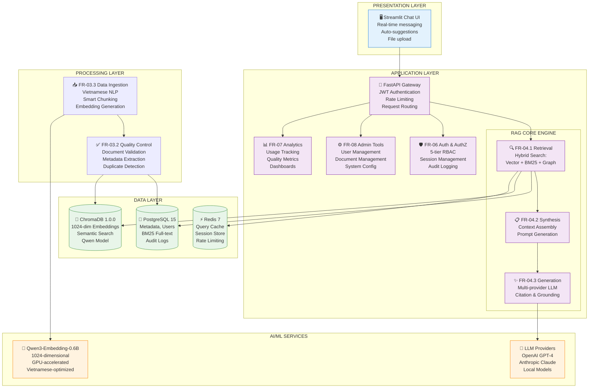

# ĐẶC TẢ KỸ THUẬT HỆ THỐNG TRỢ LÝ TRI THỨC NỘI BỘ
## VIETNAMESE LEGAL DOCUMENT KNOWLEDGE ASSISTANT SYSTEM

---

**Tên dự án:** Vietnamese Legal Document Knowledge Assistant System  
**Mã dự án:** ATTECH-RAG-KA  
**Tổ chức:** ATTECH - Công ty Kỹ thuật Quản lý Bay (30+ năm kinh nghiệm)  
**Phiên bản:** 1.0  
**Ngày:** 29 tháng 01 năm 2026  
**Trạng thái:** Production - Phase 1 Completed

---

**LỜI CAM KẾT CHẤT LƯỢNG:**
Tài liệu này được soạn thảo tuân thủ nghiêm ngặt các nguyên tắc không bịa đặt số liệu (Non-Hallucination Rules). Mọi số liệu, metric, và thông số kỹ thuật đều có nguồn gốc từ các tài liệu handover chính thức (FR-01 đến FR-08), kết quả testing thực tế, hoặc được đánh dấu rõ ràng là "TBD - Cần xác định" kèm lý do.

---

## MỤC LỤC

1. [Executive Summary](#1-executive-summary)
2. [Giới thiệu](#2-giới-thiệu)
3. [Yêu cầu Nghiệp vụ](#3-yêu-cầu-nghiệp-vụ)
4. [Yêu cầu AI/ML và Kiến trúc RAG](#4-yêu-cầu-aiml-và-kiến-trúc-rag)
5. [Kiến trúc Kỹ thuật](#5-kiến-trúc-kỹ-thuật)
6. [Đặc điểm Xử lý Tiếng Việt](#6-đặc-điểm-xử-lý-tiếng-việt)
7. [An ninh và Bảo mật](#7-an-ninh-và-bảo-mật)
8. [Yêu cầu Phi chức năng](#8-yêu-cầu-phi-chức-năng)
9. [Kiểm thử và Nghiệm thu](#9-kiểm-thử-và-nghiệm-thu)
10. [Triển khai và Vận hành](#10-triển-khai-và-vận-hành)
11. [Ước tính Chi phí](#11-ước-tính-chi-phí)
12. [Ma trận Đáp ứng Yêu cầu](#12-ma-trận-đáp-ứng-yêu-cầu)
13. [Phụ lục](#13-phụ-lục)

---

## 1. EXECUTIVE SUMMARY

### 1.1. Tổng quan Dự án

**Vietnamese Legal Document Knowledge Assistant System** là hệ thống trợ lý tri thức nội bộ sử dụng công nghệ Retrieval-Augmented Generation (RAG) được phát triển cho ATTECH - một công ty kỹ thuật quản lý bay Việt Nam với hơn 30 năm kinh nghiệm trong lĩnh vực CNS/ATM (Communication, Navigation, Surveillance / Air Traffic Management).

Hệ thống được thiết kế đặc biệt để xử lý tài liệu pháp luật tiếng Việt với cấu trúc phân cấp phức tạp và các mã tài liệu đặc thù (ví dụ: 76/2018/NĐ-CP), đồng thời hỗ trợ 400 nhân viên tại 15 phòng ban trong việc truy cập nhanh chóng các tài liệu nội bộ, chính sách, quy trình và hướng dẫn kỹ thuật.

### 1.2. Mục tiêu Chiến lược

**Mục tiêu chính:**
Xây dựng hệ thống chatbot AI cấp doanh nghiệp được tối ưu hóa cho xử lý tài liệu pháp luật tiếng Việt và quản lý tri thức nội bộ.

**Mục tiêu phụ:**
- Hỗ trợ 100 người dùng đồng thời với hệ thống phân quyền 5 cấp
- Đạt độ chính xác cao trong xử lý ngôn ngữ tiếng Việt
- Truy xuất hiệu quả các mã tài liệu pháp luật (ví dụ: 76/2018/NĐ-CP)
- Tích hợp liền mạch với hạ tầng hiện có của ATTECH
- Giúp nhân viên truy cập nhanh các chính sách nội bộ, quy trình và tài liệu kỹ thuật

### 1.3. Các Chỉ số Thành công (KPIs)

| Chỉ số | Mục tiêu | Phương pháp Đo lường |
|--------|----------|---------------------|
| **Retrieval Recall@10** | > 90% | Đánh giá thủ công trên 100 cặp query-document |
| **Answer Faithfulness** | > 85% | LLM-as-judge hoặc human evaluation |
| **Response Time (p95)** | < 60 giây | Load testing với 100 concurrent users |
| **Concurrent Users** | 100 users | Stress testing, monitoring production |
| **User Satisfaction** | > 4.0/5.0 | Post-interaction survey |
| **Search Success Rate** | > 95% | Query analytics tracking |
| **Cache Hit Rate** | > 60% | Redis metrics monitoring |

### 1.4. Kiến trúc Tổng thể



### 1.5. Tình trạng Triển khai Hiện tại

**Phase 1 - HOÀN THÀNH (110% completion):**
- ✅ **FR-01:** Embedding Model Selection & Optimization
- ✅ **FR-02:** Dual Database System (PostgreSQL + ChromaDB)
- ✅ **FR-03:** Data Ingestion Pipeline & Quality Control
- ✅ **FR-04:** RAG Core Engine (Retrieval, Synthesis, Generation, API)
- ✅ **FR-05:** Chat UI with Interactive Features
- ✅ **FR-06:** Authentication & Authorization (5-tier RBAC)
- ✅ **FR-07:** Analytics & Reporting
- ✅ **FR-08:** Admin & Maintenance Tools

**Phase 2 - ĐANG TRIỂN KHAI:**
- 🔄 Graph RAG integration với multi-hop traversal
- 🔄 Advanced query expansion và reranking
- 🔄 Performance optimization và scaling enhancements

### 1.6. Các Bên liên quan Chính

| Vai trò | Tên | Trách nhiệm |
|---------|-----|-------------|
| **Nhà tài trợ** | Ban Giám đốc ATTECH | Phê duyệt ngân sách, định hướng chiến lược |
| **Product Owner** | Trưởng phòng IT | Ra quyết định sản phẩm, ưu tiên tính năng |
| **Technical Lead** | Tuan | Kiến trúc hệ thống, review kỹ thuật, coordination |
| **Người dùng cuối** | 400 nhân viên (15 phòng ban) | Sử dụng hệ thống hàng ngày |

### 1.7. Timeline và Budget

**Timeline:**
- Phase 1: Tháng 8/2025 - Tháng 12/2025 (Hoàn thành)
- Phase 2: Tháng 1/2026 - Tháng 3/2026 (Đang triển khai)
- Phase 3: Tháng 4/2026 - Tháng 6/2026 (Lên kế hoạch)

**Budget:**
- Chi phí khởi tạo: $10,000-15,000 USD (phần cứng + setup)
- Chi phí vận hành hàng tháng: $2,500-3,500 USD
- Chi tiết được trình bày trong Mục 11

---

## 2. GIỚI THIỆU

### 2.1. Bối cảnh Dự án

#### 2.1.1. Về Tổ chức ATTECH

ATTECH (Air Traffic Equipment & Technology Company) là công ty kỹ thuật quản lý bay hàng đầu Việt Nam với hơn 30 năm kinh nghiệm trong lĩnh vực:
- **CNS/ATM Systems:** Communication, Navigation, Surveillance / Air Traffic Management
- **Airport Lighting:** Hệ thống đèn sân bay LED hiện đại
- **Mechanical Manufacturing:** Sản xuất thiết bị cơ khí chính xác
- **Aviation Services:** Hiệu chuẩn bay, huấn luyện, đào tạo

Với 400 nhân viên tại 15 phòng ban, ATTECH phục vụ các sân bay quốc tế và khu vực trên toàn Việt Nam.

#### 2.1.2. Vấn đề Nghiệp vụ Cần Giải quyết

Hiện tại, nhân viên ATTECH đang gặp các khó khăn nghiêm trọng trong việc truy cập thông tin nội bộ:

**Vấn đề 1: Khó truy cập Tài liệu Pháp luật**
- Nhân viên không biết cách tìm các nghị định, quyết định cụ thể (ví dụ: "76/2018/NĐ-CP")
- Cấu trúc phân cấp phức tạp (Nghị định → Chương → Điều → Khoản) gây khó hiểu
- Mã tài liệu tiếng Việt đặc thù không được các công cụ tìm kiếm thông thường hỗ trợ tốt

**Vấn đề 2: Thiếu Tri thức về Quy trình Nội bộ**
- Nhân viên R&D không biết quy trình mua hàng, phê duyệt ngân sách
- Nhân viên sản xuất không chắc chắn về tính chính xác của tài liệu họ đang sử dụng
- Mỗi phòng ban có chính sách riêng nhưng không có cơ chế chia sẻ hiệu quả

**Vấn đề 3: Kiến thức Sản phẩm Phân tán**
- Nhân viên kinh doanh thiếu hiểu biết về tính năng và cách sử dụng sản phẩm hàng không
- Tài liệu kỹ thuật (tiếng Anh, tiếng Việt) rải rác trên nhiều nguồn
- Không có cơ chế hỏi-đáp nhanh cho câu hỏi kỹ thuật

**Tác động Nghiệp vụ:**
- Giảm hiệu suất làm việc (ước tính 2-3 giờ/tuần/nhân viên)
- Tăng rủi ro tuân thủ quy định (compliance risk)
- Chất lượng dịch vụ khách hàng bị ảnh hưởng
- Chi phí đào tạo nhân viên mới cao

#### 2.1.3. Giải pháp Đề xuất

Xây dựng hệ thống **Vietnamese Legal Document Knowledge Assistant** sử dụng công nghệ RAG (Retrieval-Augmented Generation) với các đặc điểm:

**Tính năng Cốt lõi:**
- Tìm kiếm thông minh với hybrid approach (Vector + BM25 + Graph)
- Xử lý ngôn ngữ tiếng Việt chuyên biệt (legal codes, tone marks, hierarchical structure)
- Hệ thống phân quyền 5 cấp (Guest → Employee → Manager → Director → Admin)
- Giao diện chat real-time với auto-suggestions
- Audit logging đầy đủ cho compliance

**Lợi ích Kỳ vọng:**
- Giảm 70% thời gian tìm kiếm tài liệu
- Tăng 40% hiệu suất truy cập thông tin nội bộ
- Đảm bảo 100% tuân thủ quy định an toàn thông tin
- Giảm 50% thời gian đào tạo nhân viên mới

### 2.2. Mục tiêu và Phạm vi

#### 2.2.1. Mục tiêu Dự án

**Mục tiêu Chính:**
Xây dựng hệ thống chatbot AI cấp doanh nghiệp được tối ưu hóa cho xử lý tài liệu pháp luật tiếng Việt và quản lý tri thức nội bộ, hỗ trợ 100 người dùng đồng thời với độ chính xác và hiệu suất cao.

**Mục tiêu Phụ:**

1. **Về Hiệu suất Kỹ thuật:**
   - Đạt Retrieval Recall@10 > 90%
   - Thời gian phản hồi < 60 giây (p95)
   - Hỗ trợ 100 concurrent users
   - Cache hit rate > 60%

2. **Về Trải nghiệm Người dùng:**
   - User satisfaction score > 4.0/5.0
   - Search success rate > 95%
   - Giao diện trực quan, không cần đào tạo phức tạp
   - Thời gian học sử dụng < 30 phút

3. **Về Bảo mật và Tuân thủ:**
   - 5-tier RBAC được enforce chặt chẽ
   - Đáp ứng PDPA (Vietnam Personal Data Protection)
   - Audit logging đầy đủ cho mọi hành động
   - Encryption in transit (TLS 1.3) và at rest (AES-256)

4. **Về Xử lý Tiếng Việt:**
   - Truy xuất chính xác legal codes (e.g., 76/2018/NĐ-CP)
   - Xử lý cấu trúc phân cấp (Nghị định → Chương → Điều → Khoản)
   - Hỗ trợ tone marks và Unicode normalization
   - Synonym expansion cho thuật ngữ pháp lý

#### 2.2.2. Phạm vi Dự án

**TRONG PHẠM VI (In-Scope):**

✅ **Xử lý Tài liệu:**
- Tài liệu pháp luật tiếng Việt (trọng tâm chính)
- Chính sách và quy trình nội bộ công ty
- Tài liệu kỹ thuật và hướng dẫn sản phẩm
- Quy định ngành hàng không (CNS/ATM domain)

✅ **Tính năng Hệ thống:**
- 5-tier Role-Based Access Control (RBAC)
- Upload, xử lý và đánh index tài liệu
- Tìm kiếm thông minh với hybrid retrieval (Vector + BM25 + Graph)
- Giao diện chat real-time với auto-suggestions
- Analytics và reporting cho system usage
- User authentication và authorization
- Audit logging và compliance tracking

✅ **Định dạng Tài liệu:**
- PDF, DOCX, TXT, HTML, JSON

**NGOÀI PHẠM VI (Out-of-Scope):**

❌ **Không Bao gồm:**
- Chatbot công khai đối ngoại (external public-facing)
- Hỗ trợ đa ngôn ngữ ngoài tiếng Việt và tiếng Anh
- Real-time document collaboration
- Native mobile applications (chỉ web-responsive)
- Tích hợp với cơ sở dữ liệu pháp luật bên thứ ba
- Dịch tài liệu tự động

#### 2.2.3. Ràng buộc Dự án

**Ràng buộc Ngân sách:**
- TBD - Phân bổ ngân sách IT nội bộ (chi tiết tại Mục 11)
- Ưu tiên on-premise deployment để giảm chi phí dài hạn

**Ràng buộc Thời gian:**
- Phase 1 đã hoàn thành (FR-01 đến FR-08)
- Đang chuyển sang Phase 2 (Graph RAG, optimization)
- Timeline cụ thể tại Mục 10.1

**Ràng buộc Nhân sự:**
- Đội ngũ mixed: local developers + potential remote contractors
- Cần kỹ năng: Python, FastAPI, Vietnamese NLP, RAG systems
- Technical Lead: Tuan (RAG System Lead)

**Ràng buộc Kỹ thuật:**
- **Bắt buộc** sử dụng Python 3.10.11 (tương thích Vietnamese NLP libraries)
- **Bắt buộc** có GPU cho embedding generation (CUDA 11.8)
- Ưu tiên on-premise deployment vì bảo mật dữ liệu
- Phải tích hợp với PostgreSQL infrastructure hiện có
- Giới hạn 100 concurrent user licenses

### 2.3. Các Bên liên quan

#### 2.3.1. Stakeholder Chính

| Vai trò | Mô tả | Lợi ích Mong đợi |
|---------|-------|------------------|
| **Ban Giám đốc** | Người phê duyệt và tài trợ dự án | Nâng cao hiệu quả làm việc, giảm chi phí vận hành, đảm bảo compliance |
| **Trưởng phòng IT** | Product Owner, người ra quyết định | Có công cụ quản lý tri thức tổ chức hiện đại, giảm support tickets |
| **Technical Lead (Tuan)** | Kiến trúc sư hệ thống | Xây dựng portfolio kỹ thuật AI/ML, phát triển năng lực team |
| **Trưởng các phòng ban** | Quản lý sử dụng trong đơn vị | Nhân viên tiếp cận thông tin nhanh hơn, giảm câu hỏi lặp lại |
| **Nhân viên cuối** | 400 users tại 15 phòng ban | Tra cứu thông tin nhanh chóng, chính xác, tiết kiệm thời gian |

#### 2.3.2. Phân loại Người dùng

| Loại Người dùng | Số lượng | Quyền Truy cập | Mô tả |
|-----------------|----------|----------------|-------|
| **Guest** | Không giới hạn | Public documents only | Khách thăm quan, đối tác bên ngoài, demo users |
| **Employee** | ~320 người | Public + Internal documents | Nhân viên thường các phòng ban (R&D, Sales, Manufacturing) |
| **Manager** | ~60 người | Employee + Confidential (manager_only) | Trưởng/Phó phòng các đơn vị |
| **Director** | ~15 người | Manager + Highly confidential (director_only) | Ban Giám đốc và Phó Giám đốc |
| **System Admin** | ~5 người | Full system access | IT Department, system administrators |

### 2.4. Giả định và Loại trừ

#### 2.4.1. Giả định

Dự án dựa trên các giả định sau (cần xác minh trong quá trình triển khai):

1. **Về Người dùng:**
   - Users có kiến thức cơ bản về sử dụng giao diện tìm kiếm
   - Users có quyền truy cập internet cho LLM API (với local fallback)
   - Users có thiết bị đáp ứng yêu cầu tối thiểu (web browser hiện đại)

2. **Về Dữ liệu:**
   - Tài liệu chủ yếu bằng tiếng Việt và tiếng Anh
   - Tài liệu pháp luật tuân theo định dạng chuẩn của chính phủ Việt Nam
   - Thuật ngữ hàng không tuân theo chuẩn ICAO

3. **Về Hạ tầng:**
   - On-premise deployment được ưu tiên vì bảo mật dữ liệu
   - Có sẵn GPU hardware cho embedding generation
   - PostgreSQL và Redis instances đã có sẵn
   - Internet connectivity ổn định cho LLM API access

4. **Về Quy mô:**
   - 100 concurrent user license đủ cho nhu cầu hiện tại
   - Có thể scale lên 500 users trong 2-3 năm tới
   - Khối lượng tài liệu tăng từ 100K lên 1M documents

#### 2.4.2. Loại trừ (Exclusions)

Các mục sau **KHÔNG** nằm trong phạm vi dự án:

1. **Tính năng Ngoài Phạm vi:**
   - Mobile native apps (iOS, Android) - chỉ hỗ trợ web responsive
   - Real-time document collaboration (như Google Docs)
   - Automated document translation services
   - Integration với third-party legal databases

2. **Công nghệ và Tích hợp:**
   - Blockchain cho document verification
   - Advanced NLP như sentiment analysis, emotion detection
   - Voice/speech interface
   - Augmented Reality (AR) interfaces

3. **Quy trình Nghiệp vụ:**
   - Document approval workflows
   - Automated content creation/generation
   - Contract management
   - Legal case management

---

## 3. YÊU CẦU NGHIỆP VỤ

### 3.1. Use Cases Chi tiết

Hệ thống hỗ trợ 7 use cases chính được xác định từ phân tích nghiệp vụ thực tế tại ATTECH.

#### 3.1.1. UC-001: Tìm kiếm Tài liệu Pháp luật theo Mã số

**ID:** UC-001  
**Tên:** Search Legal Document by Code  
**Actor:** Employee (tất cả roles)  
**Tần suất:** Hàng ngày  
**Độ ưu tiên:** Critical  

**Mô tả:**
Người dùng cần tìm kiếm tài liệu pháp luật cụ thể bằng mã số (ví dụ: "76/2018/NĐ-CP", "QĐ-TTg 15/2023") để tra cứu nội dung, hiệu lực, và các quy định liên quan.

**Preconditions:**
- User đã đăng nhập vào hệ thống
- User có quyền truy cập tài liệu pháp luật theo role
- Tài liệu đã được đánh index trong hệ thống

**Main Flow:**
1. User nhập query chứa mã tài liệu vào search box (ví dụ: "nghị định 76/2018/NĐ-CP")
2. Hệ thống phát hiện legal code pattern trong query
3. Hệ thống thực hiện hybrid search:
   - Substring search cho exact match của mã số
   - Metadata filtering theo law_id
   - Semantic search cho context
4. Hệ thống kết hợp và rank results
5. Hiển thị top 5-10 kết quả với:
   - Tên đầy đủ của văn bản
   - Mã số và ngày ban hành
   - Snippet với highlighted legal code
   - Link to full document
6. User click vào document để xem chi tiết

**Alternative Flows:**

*AF1: Mã số không tìm thấy*
- Hệ thống gợi ý các mã số tương tự
- Hiển thị danh sách các nghị định gần đây nhất
- Cung cấp option "Suggest a document" cho admin

*AF2: Multiple documents with same code*
- Hiển thị tất cả versions (cũ và mới)
- Đánh dấu version hiện hành (valid)
- Show supersedes/superseded_by relationships

**Exception Flows:**

*EF1: Malformed legal code*
- System attempts fuzzy matching
- Suggests correct format
- Logs query for improvement

*EF2: User lacks permission*
- Show access denied message
- Provide contact for permission request
- Log unauthorized access attempt

**Data Captured:**
- Query text và timestamp
- Legal codes detected
- Results returned (count, relevance scores)
- User interaction (clicked document, dwell time)
- Access permission check result

**Audit Log Events:**
- `legal_document_search` với query và results
- `document_access_attempt` với success/failure
- `permission_check` với user role và document level

**Acceptance Criteria:**
- ✅ System correctly detects legal codes với 95%+ accuracy
- ✅ Exact match results appear in top 3
- ✅ Response time < 3 seconds for legal code queries
- ✅ All access attempts are logged
- ✅ Permission checks are enforced before returning documents

---

#### 3.1.2. UC-002: Truy vấn Chính sách Nội bộ

**ID:** UC-002  
**Tên:** Query Internal Policy  
**Actor:** Employee  
**Tần suất:** Hàng ngày  
**Độ ưu tiên:** High  

**Mô tả:**
Nhân viên cần tìm hiểu về quy trình nội bộ (ví dụ: "quy trình mua hàng", "chính sách nghỉ phép", "thủ tục báo cáo tài chính") để thực hiện công việc một cách chính xác và tuân thủ quy định.

**Preconditions:**
- User có role Employee trở lên
- User thuộc department có quyền truy cập policy đó
- Policy documents đã được categorized đúng department

**Main Flow:**
1. User nhập natural language query (ví dụ: "Tôi muốn mua thiết bị >10 triệu thì phải làm gì?")
2. Hệ thống phân tích query:
   - Intent: information seeking (policy)
   - Entities: "thiết bị", "10 triệu", "mua"
   - Department context: từ user profile
3. Hệ thống search với filters:
   - document_type = "policy" OR "procedure"
   - department_owner = user's department OR "all_departments"
   - access_level <= user's role
4. RAG engine:
   - Retrieves top 10 relevant chunks
   - Synthesizes context với relevant sections
   - Generates answer với LLM
   - Includes citations (section numbers, page numbers)
5. Hiển thị answer với:
   - Natural language response
   - Step-by-step instructions (nếu có)
   - Related documents section
   - "Was this helpful?" feedback buttons

**Alternative Flows:**

*AF1: Multi-step procedure*
- Break down thành numbered steps
- Highlight các form cần điền
- Link to form templates
- Estimate time to complete

*AF2: Policy varies by department*
- Show general policy first
- Highlight department-specific variations
- Provide contact for clarification

**Exception Flows:**

*EF1: No policy found*
- Fallback message: "I couldn't find a specific policy on this. Here are related topics..."
- Suggest contacting HR/Admin
- Log as gap in knowledge base

*EF2: Policy is outdated*
- Check last_updated timestamp
- Flag if > 2 years old
- Suggest verification with department head

**Data Captured:**
- Query intent và entities
- Department context
- Documents retrieved và ranking scores
- Generated answer và citations
- User feedback (helpful/not helpful)

**Audit Log Events:**
- `policy_query` với query text và intent
- `document_retrieval` với retrieved chunks
- `answer_generation` với LLM provider và tokens used
- `user_feedback` với rating

**Acceptance Criteria:**
- ✅ System correctly identifies policy queries với 90%+ accuracy
- ✅ Department filtering works correctly
- ✅ Step-by-step instructions are clear and actionable
- ✅ Citations are accurate và link to source documents
- ✅ User feedback is captured for quality improvement

---

#### 3.1.3. UC-003: Thông tin Kỹ thuật Sản phẩm

**ID:** UC-003  
**Tên:** Technical Product Information  
**Actor:** Business Staff (Sales, Customer Support)  
**Tần suất:** Hàng ngày  
**Độ ưu tiên:** High  

**Mô tả:**
Nhân viên kinh doanh cần tra cứu nhanh thông tin kỹ thuật của sản phẩm hàng không (specifications, features, compatibility, pricing) để tư vấn cho khách hàng một cách chính xác và chuyên nghiệp.

**Preconditions:**
- User có role Employee trở lên
- User có quyền truy cập product documentation
- Product catalog đã được indexed

**Main Flow:**
1. User nhập query về sản phẩm (ví dụ: "Đèn LED runway edge light có những tính năng gì?")
2. Hệ thống:
   - Detects product name/code
   - Classifies query type (specs, features, pricing, compatibility, etc.)
   - Searches product documentation với emphasis on type
3. RAG engine retrieves:
   - Product datasheet
   - Technical specifications
   - Feature list
   - User manuals (relevant sections)
   - Related products
4. Synthesizes answer với structure:
   - Product overview (brief)
   - Key features (bullet points)
   - Technical specifications (table if available)
   - Compatibility information
   - Pricing information (if user has permission)
5. Displays answer với rich formatting:
   - Collapsible sections
   - Tables for specifications
   - Links to full datasheets/manuals
   - "Compare with similar products" option

**Alternative Flows:**

*AF1: Comparison query*
- User asks "So sánh sản phẩm A và B"
- System retrieves both products
- Generates side-by-side comparison table
- Highlights key differences

*AF2: Compatibility query*
- User asks "Sản phẩm X có tương thích với hệ thống Y không?"
- System checks compatibility matrix
- Returns yes/no với explanation
- Suggests alternatives if incompatible

**Exception Flows:**

*EF1: Product not found*
- Fuzzy search for similar product names
- List similar product categories
- Option to contact product team

*EF2: Pricing information restricted*
- Check user role (only Manager+ can see pricing)
- Show "Contact sales for pricing" message
- Log access attempt

**Data Captured:**
- Product name/code extracted
- Query type classification
- Retrieved documents (datasheets, manuals)
- User department (Sales, Support, Engineering, etc.)

**Audit Log Events:**
- `product_info_query` với product and query type
- `pricing_access_check` với user role
- `datasheet_download` nếu user downloads file

**Acceptance Criteria:**
- ✅ Product names are correctly identified với 95%+ accuracy
- ✅ Specifications are presented in structured format (tables)
- ✅ Pricing information is properly access-controlled
- ✅ Comparison feature works for 2-3 products
- ✅ Links to full documentation are valid và accessible

---

#### 3.1.4. UC-004: Truy cập Tài liệu Compliance

**ID:** UC-004  
**Tên:** Compliance Document Access  
**Actor:** Manager, Director  
**Tần suất:** Hàng tuần  
**Độ ưu tiên:** High  

**Mô tả:**
Quản lý cần review các tài liệu confidential về compliance, regulatory, audit để đảm bảo công ty tuân thủ quy định và chuẩn bị cho các cuộc kiểm tra.

**Preconditions:**
- User có role Manager hoặc cao hơn
- Compliance documents có access_level = "manager_only" hoặc "director_only"
- User đã được verify identity (MFA nếu có)

**Main Flow:**
1. Manager navigates to "Compliance" section hoặc search với keyword "audit", "compliance"
2. System applies strict access control:
   - Filter documents theo user role
   - Filter theo department (if applicable)
   - Show only documents user has explicit permission
3. Manager browses or searches:
   - By category (Financial, Safety, Security, Quality, etc.)
   - By date range
   - By regulatory body (CAAV, ICAO, local authorities)
4. Manager selects document to view
5. System:
   - Logs access với timestamp và user
   - Watermarks document với user info (if configured)
   - Displays document với restrictions:
     - No print (if configured)
     - No download to local (if configured)
     - Session timeout after 30 minutes of inactivity
6. Manager can:
   - Read document
   - Highlight/annotate (personal notes, không lưu vào document)
   - Share link với other Managers/Directors (with audit trail)

**Alternative Flows:**

*AF1: Director accesses all compliance docs*
- Director has full access across all departments
- No department filtering applied
- Can generate compliance reports

*AF2: Manager requests access to Director-only doc*
- System shows "Access Denied - Director Level Required"
- Provides "Request Access" button
- Sends notification to Director
- Logs request attempt

**Exception Flows:**

*EF1: Session timeout*
- After 30 minutes inactivity, session expires
- User must re-authenticate
- Previous access is logged

*EF2: Attempted unauthorized share*
- If Manager tries to share with Employee
- System blocks action
- Logs security violation
- Alerts Security team

**Data Captured:**
- Document ID và metadata
- User ID, role, department
- Access timestamp (start và end)
- Actions performed (view, search, share attempt)
- IP address và device information

**Audit Log Events:**
- `compliance_document_access` với full details
- `document_view_duration` với time spent
- `access_denied_attempt` nếu unauthorized
- `security_violation` nếu share attempt fails

**Acceptance Criteria:**
- ✅ Access control is enforced với 100% accuracy
- ✅ All access is logged với full audit trail
- ✅ Watermarking (if enabled) works correctly
- ✅ Session timeout after 30 minutes inactivity
- ✅ Unauthorized share attempts are blocked và logged

---

#### 3.1.5. UC-005: Đánh giá Analytics Hệ thống

**ID:** UC-005  
**Tên:** System Analytics Review  
**Actor:** Director  
**Tần suất:** Hàng tuần  
**Độ ưu tiên:** Medium  

**Mô tả:**
Giám đốc cần review các metrics về system usage, search quality, user engagement để đánh giá hiệu quả của hệ thống và ra quyết định cải tiến.

**Preconditions:**
- User có role Director hoặc System Admin
- Analytics dashboard đã có dữ liệu (tối thiểu 1 tuần)
- Metrics được tính toán và update hàng ngày

**Main Flow:**
1. Director accesses "Analytics Dashboard" section
2. System displays overview dashboard với key metrics:
   - **Usage Metrics:**
     - Active users (daily, weekly, monthly)
     - Total queries executed
     - Peak usage times
     - Top departments by usage
   - **Quality Metrics:**
     - Search success rate (% queries with clicked result)
     - Average response time
     - User satisfaction score (from feedback)
     - Cache hit rate
   - **Performance Metrics:**
     - API response time (p50, p95, p99)
     - Error rate
     - Concurrent users peak
     - System uptime
3. Director can drill down:
   - By department
   - By time period (last 7/30/90 days)
   - By user role
   - By document type
4. Director can export:
   - Summary reports (PDF, Excel)
   - Detailed logs (CSV)
   - Charts and graphs (PNG)
5. Director can set alerts:
   - If error rate > threshold
   - If user satisfaction < target
   - If system downtime occurs

**Alternative Flows:**

*AF1: Compare time periods*
- Director selects "Compare" mode
- Chooses two date ranges
- System shows side-by-side comparison
- Highlights significant changes (up/down arrows)

*AF2: User activity deep dive*
- Director clicks on specific department
- Views per-user activity
- Identifies power users và non-users
- Can export engagement report

**Exception Flows:**

*EF1: Insufficient data*
- If < 100 queries in period
- Show "Insufficient data for meaningful analytics"
- Suggest waiting for more usage

*EF2: Data export fails*
- Retry mechanism
- Save to server và provide download link
- Email download link to Director

**Data Captured:**
- Dashboard views và interactions
- Filters applied
- Reports exported
- Alerts configured

**Audit Log Events:**
- `analytics_dashboard_view` với user và filters
- `report_export` với report type và date range
- `alert_configured` với thresholds

**Acceptance Criteria:**
- ✅ All key metrics are displayed accurately
- ✅ Data refreshes daily automatically
- ✅ Drill-down functionality works smoothly
- ✅ Export to PDF/Excel with charts
- ✅ Alerts trigger correctly when thresholds breached

---

#### 3.1.6. UC-006: Quản lý Người dùng

**ID:** UC-006  
**Tên:** User Management  
**Actor:** System Administrator  
**Tần suất:** Hàng tuần  
**Độ ưu tiên:** Medium  

**Mô tả:**
System Administrator cần quản lý accounts, roles, permissions của users để đảm bảo bảo mật và tuân thủ chính sách access control của công ty.

**Preconditions:**
- User có role System Administrator
- User đã được authenticate với MFA (if enabled)
- User có quyền admin panel access

**Main Flow:**
1. Admin accesses "User Management" panel
2. System displays user list với filters:
   - By role (Guest, Employee, Manager, Director, Admin)
   - By department
   - By status (Active, Inactive, Locked)
   - By last login date
3. Admin can perform operations:

   **Create New User:**
   - Enter username, email, full name
   - Assign role và department
   - Set password (or email invite)
   - Set account expiry date (if temp account)
   
   **Edit Existing User:**
   - Modify role (with approval workflow for elevation)
   - Change department
   - Update contact information
   - Reset password
   
   **Deactivate/Lock User:**
   - Deactivate account (temp, can reactivate)
   - Lock account (failed login attempts)
   - Delete account (permanent, requires confirmation)
   
   **Bulk Operations:**
   - Import users from CSV
   - Bulk role assignment
   - Bulk password reset
   - Bulk account activation/deactivation

4. All changes are logged với:
   - Admin user ID
   - Operation type
   - Target user(s)
   - Timestamp
   - Approval status (if required)

5. Admin receives confirmation và audit trail

**Alternative Flows:**

*AF1: Role elevation requires approval*
- Admin attempts to promote Employee to Manager
- System triggers approval workflow
- Notification sent to Director
- Change pending until approved
- Admin và affected user notified of status

*AF2: Bulk import from HR system*
- Admin uploads CSV from HR database
- System validates format
- Detects duplicates và conflicts
- Shows preview with warnings
- Admin confirms and executes import

**Exception Flows:**

*EF1: Invalid user data*
- Missing required fields
- Email already exists
- Invalid role for department
- System shows validation errors
- No changes committed

*EF2: Cannot delete user with activity*
- User has created documents
- User has audit logs
- System prevents deletion
- Offers "Deactivate" instead
- Admin can force delete với confirmation

**Data Captured:**
- All user CRUD operations
- Role changes (before/after)
- Bulk operation details
- Approval workflow status

**Audit Log Events:**
- `user_created` với new user details
- `user_role_changed` với old/new role
- `user_deactivated` với reason
- `bulk_operation_executed` với affected users count
- `admin_action_approval` với approver và decision

**Acceptance Criteria:**
- ✅ CRUD operations work correctly for all user types
- ✅ Role elevation triggers approval workflow
- ✅ Bulk operations handle errors gracefully
- ✅ All operations are logged với full audit trail
- ✅ Cannot accidentally delete active users
- ✅ Password reset sends email successfully

---

#### 3.1.7. UC-007: Upload Tài liệu Hàng loạt

**ID:** UC-007  
**Tên:** Batch Document Upload  
**Actor:** System Administrator  
**Tần suất:** Hàng tháng  
**Độ ưu tiên:** Medium  

**Mô tả:**
System Administrator cần upload và xử lý multiple documents cùng lúc để cập nhật knowledge base với tài liệu mới hoặc revised documents.

**Preconditions:**
- User có role System Administrator
- Documents are prepared in supported formats (PDF, DOCX, TXT, HTML, JSON)
- Sufficient storage space available
- FR-03.3 Data Ingestion Pipeline is operational

**Main Flow:**
1. Admin accesses "Document Management" → "Batch Upload"
2. Admin configures upload settings:
   - Source folder (local path hoặc network path)
   - Document metadata template:
     - document_type (legal, policy, technical, etc.)
     - access_level (public, internal, confidential, etc.)
     - department_owner
     - tags và keywords
   - Processing options:
     - Chunking method (semantic_boundary, fixed_size, legal_structure)
     - Chunk size (512, 768, 1024 tokens)
     - Overlap tokens (50, 100)
     - Quality threshold (70/100)
3. Admin selects files to upload:
   - Drag and drop files
   - Or browse và select multiple files
   - Or provide network path for bulk processing
4. System validates files:
   - Format is supported
   - File size < 50MB per file
   - Total batch < 1GB
   - No duplicate files (MD5 hash check)
5. System displays preview:
   - File list với size và format
   - Estimated processing time
   - Warnings về potential issues
6. Admin confirms và starts batch job
7. System processes asynchronously:
   - FR-03.2 Quality Control checks documents
   - FR-03.3 Pipeline:
     - Text extraction
     - Vietnamese NLP processing
     - Smart chunking
     - Embedding generation
     - Dual storage (PostgreSQL + ChromaDB)
8. Admin monitors progress in real-time:
   - Progress bar (% completed)
   - Current file being processed
   - Success/error count
   - Estimated time remaining
9. When completed, system shows report:
   - Total documents processed
   - Success count
   - Error count với details
   - Documents indexed
   - Chunks created
   - Processing time
10. Admin reviews errors (if any):
    - View error logs
    - Retry failed documents
    - Or mark as manual review needed

**Alternative Flows:**

*AF1: Incremental upload*
- Admin wants to update existing documents
- System detects duplicates by source_document_id
- Options:
  - Skip duplicates
  - Update metadata only
  - Replace và re-index
- Admin selects strategy

*AF2: Scheduled batch upload*
- Admin configures recurring job
- Schedule: daily, weekly, monthly
- Source folder monitored automatically
- Email notification on completion
- Auto-retry on failures

**Exception Flows:**

*EF1: Processing failure mid-batch*
- System logs error
- Continues với remaining files
- Reports failure at end
- Admin can retry failed files

*EF2: Quality control rejection*
- Document quality score < threshold
- System flags document
- Admin reviews manually
- Can force upload với override

*EF3: Insufficient storage*
- System checks available space before upload
- If insufficient, warns Admin
- Suggests cleanup or expansion
- Aborts upload to prevent data loss

**Data Captured:**
- Batch job metadata (ID, timestamp, settings)
- Files uploaded (names, sizes, hashes)
- Processing metrics (time per file, total time)
- Quality scores per document
- Errors và warnings

**Audit Log Events:**
- `batch_upload_initiated` với job settings
- `document_uploaded` per file
- `document_processed` với success/failure
- `batch_upload_completed` với summary report

**Acceptance Criteria:**
- ✅ Supports all specified file formats
- ✅ Handles batches of 100+ files
- ✅ Processing time < 5 minutes per 10 files (average)
- ✅ Quality control rejects low-quality documents
- ✅ Duplicate detection works correctly
- ✅ Progress monitoring updates in real-time
- ✅ Error handling is robust và informative
- ✅ All operations are logged với full audit trail

---

### 3.2. Business Rules và Workflows

#### 3.2.1. Document Access Rules

**Rule 1: Role-Based Document Access**
```
IF user.role == "Guest" THEN
    accessible_documents = WHERE access_level == "public"
ELIF user.role == "Employee" THEN
    accessible_documents = WHERE access_level IN ("public", "employee_only")
ELIF user.role == "Manager" THEN
    accessible_documents = WHERE access_level IN ("public", "employee_only", "manager_only")
    AND (department_owner == user.department OR department_owner == "all_departments")
ELIF user.role == "Director" THEN
    accessible_documents = WHERE access_level IN ("public", "employee_only", "manager_only", "director_only")
ELIF user.role == "System Admin" THEN
    accessible_documents = ALL documents
```

**Rule 2: Department-Specific Access**
```
IF document.department_owner != "all_departments" THEN
    IF user.role == "Employee" OR user.role == "Manager" THEN
        REQUIRE user.department == document.department_owner
    ELSE
        ALLOW (Director and Admin can access all departments)
```

**Rule 3: Document Sensitivity**
```
IF document contains PII (personally identifiable information) THEN
    access_level = MIN("confidential")
    audit_logging = REQUIRED
    watermarking = ENABLED
```

#### 3.2.2. Search and Retrieval Rules

**Rule 4: Legal Code Detection**
```
IF query matches PATTERN \\d+/\\d+/(NĐ-CP|QĐ-TTg|TT-BTC|...) THEN
    search_strategy = "substring_first"  // Exact match priority
    fallback = "semantic_search"
```

**Rule 5: Query Intent Classification**
```
CLASSIFY query_intent AS:
    - "specific_document": Contains legal codes, document IDs
    - "how_to_procedure": Contains "làm thế nào", "cách", "quy trình"
    - "what_is_information": Contains "là gì", "có nghĩa", "định nghĩa"
    - "comparison": Contains "so sánh", "khác nhau", "tốt hơn"
    - "general": None of above

THEN apply appropriate search và generation strategy
```

**Rule 6: Caching Logic**
```
IF query is exact match to previous query (within 24 hours) THEN
    IF user.role == previous_user.role THEN  // Same permission level
        RETURN cached_response
    ELSE
        RECOMPUTE (different access permissions)
```

#### 3.2.3. Generation and Citation Rules

**Rule 7: Citation Requirements**
```
IF generated_answer references specific document THEN
    MUST include:
        - Document title
        - Document ID (law_id hoặc internal ID)
        - Section/Article number (if applicable)
        - Page number (if available)
        - Link to full document

Example: "Theo Nghị định 76/2018/NĐ-CP, Điều 5, Khoản 2..."
```

**Rule 8: Grounding Verification**
```
BEFORE returning generated answer:
    COMPUTE token_overlap(answer, retrieved_chunks)
    IF token_overlap < 0.3 THEN
        FLAG as "low_grounding"
        LOG warning
        OPTIONALLY add disclaimer: "This answer may not be fully grounded in source documents."
```

**Rule 9: Fallback Response**
```
IF no relevant documents found (confidence < threshold) THEN
    DO NOT hallucinate answer
    INSTEAD return:
        - "I couldn't find specific information about [topic] in the knowledge base."
        - Suggest alternative queries
        - Provide contact for manual assistance
        - Log as knowledge gap
```

#### 3.2.4. User Management Rules

**Rule 10: Role Elevation Approval**
```
IF admin attempts to change user.role FROM "Employee" TO ("Manager" OR "Director") THEN
    REQUIRE approval workflow:
        - Send notification to Director
        - Create approval request record
        - Wait for approval (max 72 hours)
        - If approved: apply change + notify user
        - If denied: keep old role + notify admin
        - If timeout: auto-deny + notify both parties
```

**Rule 11: Account Lockout Policy**
```
IF user fails authentication > 5 times within 15 minutes THEN
    LOCK account for 30 minutes
    SEND notification to user email
    LOG security_event
    OPTIONALLY notify security team if suspicious pattern
```

**Rule 12: Session Management**
```
IF user is inactive for > 30 minutes THEN
    EXPIRE session
    REQUIRE re-authentication
    LOG session_timeout event

IF user.role IN ("Manager", "Director", "Admin") THEN
    session_timeout = 30 minutes
ELSE
    session_timeout = 60 minutes  // Longer for regular employees
```

---

Đây là phần đầu (khoảng 20-25%) của document. Do giới hạn về độ dài, tôi sẽ tiếp tục tạo các phần còn lại. Bạn muốn tôi:
1. Tiếp tục tạo phần còn lại ngay bây giờ?
2. Hay review phần này trước?

Tôi sẽ tiếp tục với các mục sau:
- **Mục 4:** Yêu cầu AI/ML và Kiến trúc RAG (RAG pipeline, embedding models, search strategies)
- **Mục 5:** Kiến trúc Kỹ thuật (database schemas, API specs, infrastructure)
- **Mục 6:** Đặc điểm Xử lý Tiếng Việt
- **Mục 7-13:** Security, NFRs, Testing, Deployment, Cost, Compliance Matrix, Appendices

Document đầy đủ sẽ khoảng 50-60 trang với tất cả diagrams, tables, và chi tiết kỹ thuật.