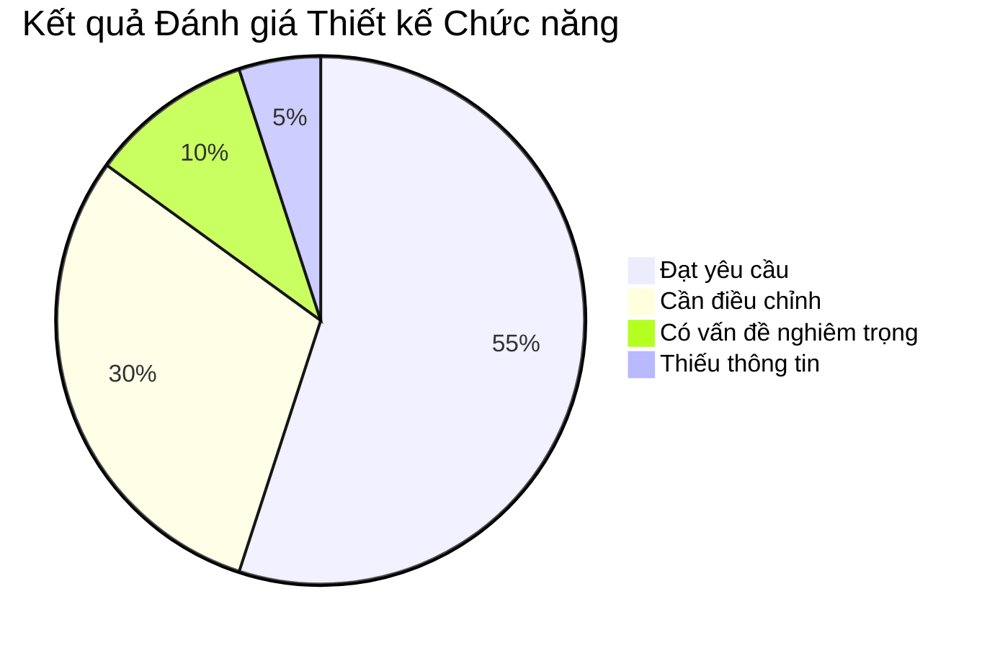
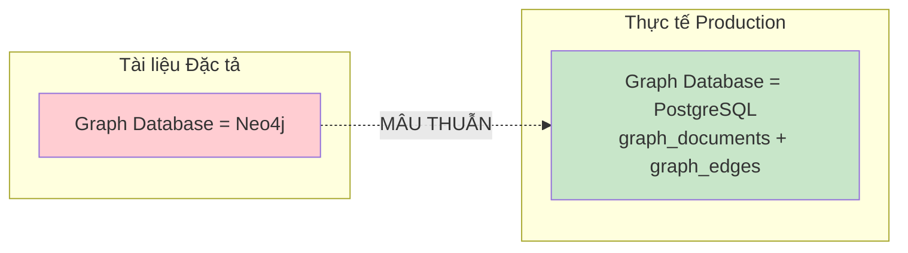
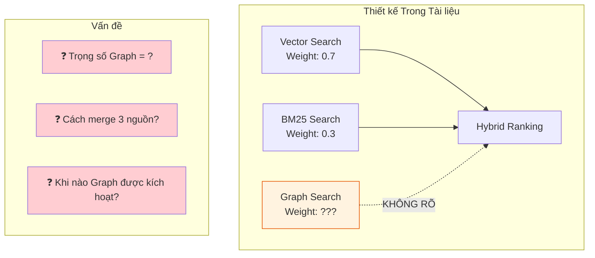
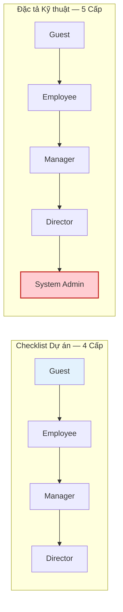
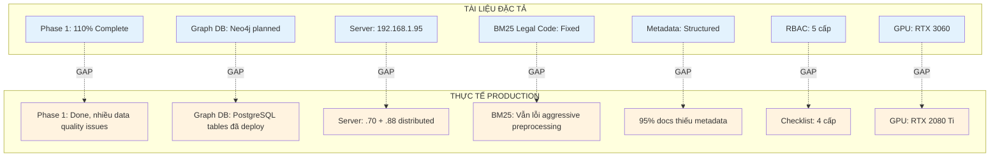
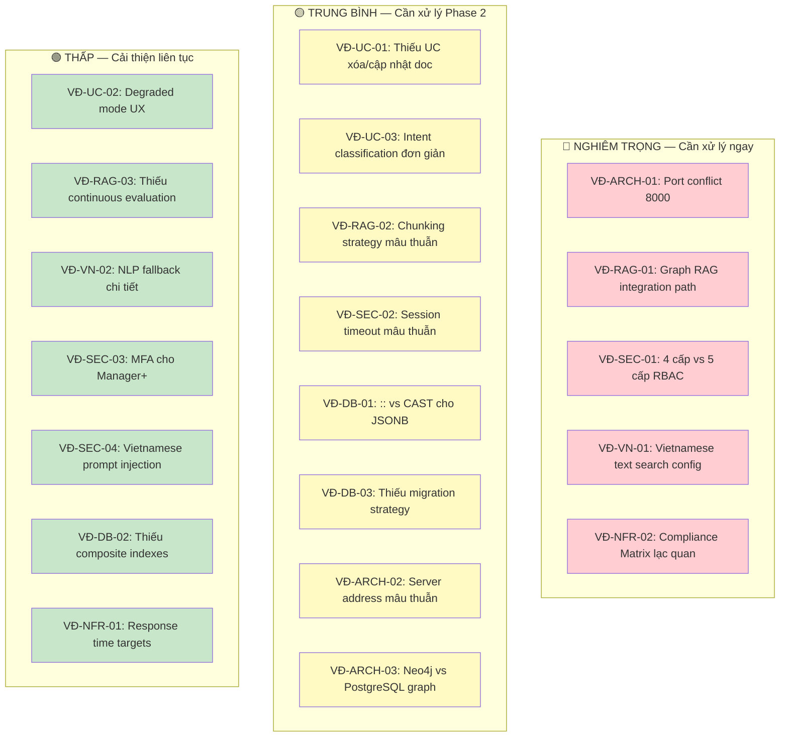

# ĐÁNH GIÁ THIẾT KẾ CHỨC NĂNG
## HỆ THỐNG TRỢ LÝ TRI THỨC NỘI BỘ ATTECH

---

**Ngày đánh giá:** 07 tháng 02 năm 2026  
**Tài liệu đầu vào:**
- `ATTECH_RAG_Technical_Specification_v1_0_Complete.md` (Đặc tả Kỹ thuật)
- `attech_rag_project_input.yaml` (Dữ liệu Đầu vào Dự án)
- Tài liệu handover trong Project Knowledge (FR-01 → FR-08)

**Phạm vi:** Tập trung vào thiết kế chức năng, **bỏ qua** phần chi phí (Mục 11)

---

## MỤC LỤC

1. [Tổng quan Đánh giá](#1-tổng-quan-đánh-giá)
2. [Đánh giá Thiết kế Kiến trúc](#2-đánh-giá-thiết-kế-kiến-trúc)
3. [Đánh giá Use Cases & Luồng Nghiệp vụ](#3-đánh-giá-use-cases--luồng-nghiệp-vụ)
4. [Đánh giá RAG Pipeline](#4-đánh-giá-rag-pipeline)
5. [Đánh giá Xử lý Tiếng Việt](#5-đánh-giá-xử-lý-tiếng-việt)
6. [Đánh giá Database Schema](#6-đánh-giá-database-schema)
7. [Đánh giá Bảo mật & Phân quyền](#7-đánh-giá-bảo-mật--phân-quyền)
8. [Đánh giá Yêu cầu Phi chức năng](#8-đánh-giá-yêu-cầu-phi-chức-năng)
9. [Khoảng cách Tài liệu vs Thực tế](#9-khoảng-cách-tài-liệu-vs-thực-tế)
10. [Tổng hợp Vấn đề & Khuyến nghị](#10-tổng-hợp-vấn-đề--khuyến-nghị)

---

## 1. TỔNG QUAN ĐÁNH GIÁ

### 1.1. Tóm tắt Kết quả



### 1.2. Điểm số Tổng thể

| Hạng mục | Điểm (1-10) | Ghi chú |
|----------|:-----------:|---------|
| **Kiến trúc Tổng thể** | 7/10 | Rõ ràng nhưng có xung đột cổng (port) và mâu thuẫn giữa hai tài liệu |
| **Use Cases** | 8/10 | Chi tiết, đầy đủ 7 UC, có acceptance criteria rõ ràng |
| **RAG Pipeline** | 7/10 | Thiết kế tốt, nhưng Graph Retrieval-Augmented Generation chưa rõ integration path |
| **Xử lý Tiếng Việt** | 8/10 | Điểm mạnh nhất, xử lý dấu thanh và mã pháp lý chi tiết |
| **Database Schema** | 6/10 | Có xung đột `::` vs `CAST()`, thiếu index cho full-text search tiếng Việt |
| **Bảo mật & Phân quyền** | 6/10 | Mâu thuẫn 4 cấp vs 5 cấp, thiếu Multi-Factor Authentication |
| **Yêu cầu Phi chức năng** | 7/10 | Đủ metrics, nhưng một số target chưa validate được |
| **Tính nhất quán** | 5/10 | Nhiều mâu thuẫn giữa hai tài liệu và so với thực tế |

---

## 2. ĐÁNH GIÁ THIẾT KẾ KIẾN TRÚC

### 2.1. Điểm mạnh

Kiến trúc tổng thể tuân theo mô hình phân tầng (layered architecture) hợp lý với sự tách biệt rõ ràng giữa Presentation, Application, Data và Artificial Intelligence/Machine Learning tiers. Sử dụng Docker container hóa là phù hợp cho quy mô 100 người dùng đồng thời. Thiết kế hỗ trợ mở rộng lên Kubernetes trong tương lai.

### 2.2. Vấn đề Phát hiện

#### **VĐ-ARCH-01: Xung đột Cổng (Port Conflict) — NGHIÊM TRỌNG**

Cả FastAPI và ChromaDB đều sử dụng cổng `8000`:

```yaml
# Từ tài liệu YAML (deployment_ports):
- "8000: FastAPI main service"
- "8000: ChromaDB"          # ← XUNG ĐỘT!
```

Trong phần kiến trúc chi tiết (Mục 5.1 của Đặc tả), ChromaDB được ghi nhận tại `192.168.1.95:8000`, cùng với FastAPI cũng ở cổng `8000`. Trên thực tế production, FastAPI chạy ở cổng `8000` và ChromaDB ở cổng khác (hoặc trên server khác), nhưng tài liệu không phản ánh đúng cấu hình này.

**Khuyến nghị:** Cập nhật tài liệu phản ánh đúng cổng thực tế. Ví dụ ChromaDB thường dùng `8001` hoặc cổng riêng trên server database.

#### **VĐ-ARCH-02: Mâu thuẫn Địa chỉ Server**

Đặc tả ghi tất cả database (PostgreSQL, ChromaDB, Redis) đều ở `192.168.1.95`, nhưng thực tế production theo handover documents:
- Server `.70` (Debian): 13 dịch vụ
- Server `.88` (DietPi): 12 dịch vụ  
- PostgreSQL tại `192.168.1.88:5432` (hoặc `192.168.1.70:15432`)

**Khuyến nghị:** Tạo sơ đồ triển khai (deployment diagram) chính xác theo thực tế hiện tại.

#### **VĐ-ARCH-03: Neo4j Được Liệt Kê Nhưng Không Sử Dụng**

File YAML ghi `graph_db: type: "Neo4j (planned for Phase 2 Graph RAG)"`, trong khi thực tế Graph Retrieval-Augmented Generation đã triển khai schema trên PostgreSQL (bảng `graph_documents`, `graph_edges`, v.v.) — không dùng Neo4j.



**Khuyến nghị:** Cập nhật tài liệu phản ánh quyết định dùng PostgreSQL cho Graph Retrieval-Augmented Generation thay vì Neo4j.

---

## 3. ĐÁNH GIÁ USE CASES & LUỒNG NGHIỆP VỤ

### 3.1. Điểm mạnh

7 Use Cases được định nghĩa chi tiết với đầy đủ: Actor, Preconditions, Main Flow, Alternative Flows, Exception Flows, Data Captured, Audit Log Events và Acceptance Criteria. Đây là mức độ chi tiết tốt cho một tài liệu đặc tả.

### 3.2. Vấn đề Phát hiện

#### **VĐ-UC-01: Thiếu Use Case Xóa/Cập nhật Tài liệu**

7 Use Cases hiện tại bao gồm: Tìm kiếm (UC-001 → UC-003), Truy cập (UC-004), Xem Analytics (UC-005), Quản lý User (UC-006), Upload tài liệu (UC-007). Nhưng **hoàn toàn thiếu**:

- **Xóa tài liệu** (document retirement/archival)
- **Cập nhật tài liệu** khi có phiên bản mới (versioning workflow)
- **Quản lý vòng đời tài liệu** (document lifecycle: Draft → Published → Superseded → Archived)

Đối với hệ thống pháp luật, vòng đời tài liệu là **cốt lõi** vì nghị định/thông tư thường xuyên được sửa đổi hoặc thay thế.

**Khuyến nghị:** Bổ sung ít nhất 2 Use Cases:
- **UC-008:** Cập nhật & Thay thế Tài liệu (Document Update & Supersede)
- **UC-009:** Lưu trữ & Hủy bỏ Tài liệu (Document Archive & Retire)

#### **VĐ-UC-02: Thiếu Luồng Xử lý Khi Hệ thống Degraded**

Các fallback strategies (Mục 8.3.3) chỉ mô tả kỹ thuật (ví dụ: "Fall back to BM25 keyword search"), nhưng **không mô tả trải nghiệm người dùng** khi hệ thống ở trạng thái suy giảm:
- Người dùng có được thông báo không?
- Kết quả tìm kiếm có bị ảnh hưởng chất lượng không? Nếu có thì hiển thị cảnh báo gì?
- Admin có được thông báo tự động không?

**Khuyến nghị:** Bổ sung luồng User Experience cho từng fallback scenario.

#### **VĐ-UC-03: Intent Classification Quá Đơn giản**

Chỉ có 5 loại intent (`specific_document`, `how_to_procedure`, `what_is_information`, `comparison`, `general`) và dùng rule-based matching (regex). Điều này:
- Không xử lý được multi-intent queries (ví dụ: "So sánh nghị định 76/2018 với 45/2019 về quy trình phê duyệt")
- Không có cơ chế học từ phản hồi người dùng

**Khuyến nghị:** Bổ sung intent cho multi-hop queries và xem xét Machine Learning-based classification trong Phase 2.

---

## 4. ĐÁNH GIÁ RAG PIPELINE

### 4.1. Điểm mạnh

Pipeline Retrieval-Augmented Generation sử dụng Hybrid Search (Vector + BM25 + Graph) với trọng số 0.7/0.3 là hợp lý. Có reranking tùy chọn và query expansion. Citation injection và grounding check được thiết kế tốt.

### 4.2. Vấn đề Phát hiện

#### **VĐ-RAG-01: Graph Retrieval-Augmented Generation Integration Path Không Rõ — NGHIÊM TRỌNG**

Đặc tả liệt kê Graph Search là Stage 3 trong retrieval pipeline, nhưng:
- Trọng số hybrid ranking chỉ tính cho 2 nguồn (`0.7*semantic + 0.3*keyword = 1.0`), **không có trọng số cho Graph**
- Không mô tả cách kết hợp Graph results vào hybrid ranking
- Graph RAG đã deploy schema (6 bảng) nhưng **data chưa populated** (bảng `graph_edges` có 5 invalid links, thiếu 507 edges dự kiến)



**Khuyến nghị:** Định nghĩa rõ ràng:
1. Công thức hybrid ranking 3 nguồn (ví dụ: `0.5*semantic + 0.2*keyword + 0.3*graph`)
2. Điều kiện kích hoạt Graph search (không phải mọi query đều cần graph traversal)
3. Kế hoạch populate data cho `graph_edges` (dự kiến 507 edges từ 42 documents)

#### **VĐ-RAG-02: Chunking Strategy Mâu thuẫn**

Glossary định nghĩa chunk = 500-1000 tokens, nhưng UC-007 (Batch Upload) cho phép cấu hình `512, 768, 1024 tokens`. Chiến lược chunking theo cấu trúc pháp lý (Điều/Khoản) có thể tạo ra chunk vượt quá giới hạn token nếu một Điều có nội dung rất dài.

**Khuyến nghị:** 
- Đồng nhất: mặc định 512 tokens, tối đa 1024 tokens
- Bổ sung cơ chế recursive splitting khi chunk vượt giới hạn (split tiếp ở mức Khoản, rồi Điểm)

#### **VĐ-RAG-03: Thiếu Cơ chế Đánh giá & Cải thiện Liên tục**

Tài liệu mô tả ground truth dataset (100 cặp query-document) nhưng **không có quy trình** cập nhật ground truth và re-evaluate khi thêm tài liệu mới hoặc thay đổi model/parameters.

**Khuyến nghị:** Bổ sung quy trình:
- Hàng tháng: thêm 10-20 queries mới từ logs thực tế vào ground truth
- Hàng quý: chạy đánh giá toàn bộ và so sánh với lần chạy trước
- Tự động: alert khi retrieval quality giảm dưới ngưỡng

---

## 5. ĐÁNH GIÁ XỬ LÝ TIẾNG VIỆT

### 5.1. Điểm mạnh

Đây là phần được thiết kế tốt nhất trong toàn bộ tài liệu, thể hiện kinh nghiệm thực tế sâu sắc:
- Chiến lược bảo toàn mã pháp lý (detect trước khi xử lý)
- Dual indexing cho dấu thanh (có dấu + không dấu)
- Từ điển đồng nghĩa chuyên ngành (200+ mục, bao gồm cả thuật ngữ hàng không)
- Chunking theo cấu trúc phân cấp pháp lý (Nghị định → Chương → Điều → Khoản → Điểm)
- Bài học kinh nghiệm thực tế (Common Pitfalls)

### 5.2. Vấn đề Phát hiện

#### **VĐ-VN-01: PostgreSQL Vietnamese Text Search Config — NGHIÊM TRỌNG**

Đặc tả sử dụng `'vietnamese'` trong `to_tsvector()` và tsvector trigger:

```sql
-- Từ Đặc tả (dòng 2121):
tsvector_update_trigger(tsv_content, 'pg_catalog.vietnamese', content_normalized);
```

**Vấn đề:** PostgreSQL **KHÔNG CÓ** text search configuration `'vietnamese'` mặc định. PostgreSQL chỉ hỗ trợ sẵn các ngôn ngữ châu Âu. Cần cài đặt extension hoặc tạo custom configuration.

**Khuyến nghị:**
- Xác nhận xem đã cài custom Vietnamese text search configuration chưa
- Nếu chưa, sử dụng `'simple'` config kết hợp với pre-tokenized content từ `underthesea`
- Hoặc triển khai custom dictionary dựa trên `pg_catalog.simple` + Vietnamese stopwords

#### **VĐ-VN-02: Thiếu Xử lý Lỗi Khi NLP Library Fail**

Tài liệu ghi `underthesea` là primary, `pyvi` là backup, nhưng **không mô tả** chi tiết:
- Khi nào `underthesea` fail? (lỗi encoding? text quá dài? ký tự đặc biệt?)
- Fallback sang `pyvi` được thực hiện tự động hay cần cấu hình?
- Khi cả hai đều fail thì sao?

**Khuyến nghị:** Bổ sung xử lý 3 tầng: `underthesea` → `pyvi` → raw whitespace tokenization (fallback cuối cùng).

---

## 6. ĐÁNH GIÁ DATABASE SCHEMA

### 6.1. Điểm mạnh

Schema v2 được thiết kế chi tiết với:
- Bảng `documents_metadata_v2` có đầy đủ fields cho tài liệu pháp lý (law_id, law_type, hierarchy)
- Bảng `document_chunks_enhanced` có linked list (prev/next) và heading context
- JSONB cho flexible metadata
- Audit logging toàn diện

### 6.2. Vấn đề Phát hiện

#### **VĐ-DB-01: Sử dụng `::` Thay vì `CAST()` cho JSONB Indexes**

Theo quy tắc dự án: *"Sử dụng CAST() thay vì :: cho JSONB indexes"*. Tuy nhiên, tài liệu hiện tại sử dụng cú pháp `::` trong nhiều chỗ liên quan đến JSONB:

```sql
-- Ví dụ từ project knowledge (DOCUMENT_ID_LAW_ID_FILTER):
WHERE (metadata->'financial'->>'budget')::numeric BETWEEN ? AND ?
-- ↑ Nên là: CAST(metadata->'financial'->>'budget' AS numeric)
```

**Khuyến nghị:** Rà soát toàn bộ SQL scripts/code và thay thế `::` bằng `CAST()` cho nhất quán.

#### **VĐ-DB-02: Thiếu Index cho Các Trường Tìm kiếm Quan trọng**

Bảng `search_analytics` thiếu index cho `retrieval_method` — một trường thường xuyên dùng trong báo cáo phân tích. Bảng `document_chunks_enhanced` thiếu index composite cho `(document_id, article_number)` — cần thiết cho truy vấn theo Điều khoản trong một tài liệu cụ thể.

**Khuyến nghị:** Bổ sung các index:
```sql
CREATE INDEX idx_search_analytics_method ON search_analytics(retrieval_method);
CREATE INDEX idx_chunks_doc_article ON document_chunks_enhanced(document_id, article_number);
```

#### **VĐ-DB-03: Không có Chiến lược Migration**

Không có kế hoạch migration từ schema Phase 1 sang Phase 2, đặc biệt khi thêm các bảng Graph Retrieval-Augmented Generation. Cũng không có công cụ migration management (ví dụ: Alembic cho Python/FastAPI).

**Khuyến nghị:** Sử dụng Alembic cho database migrations, đảm bảo mỗi thay đổi schema có script rollback.

---

## 7. ĐÁNH GIÁ BẢO MẬT & PHÂN QUYỀN

### 7.1. Vấn đề Phát hiện

#### **VĐ-SEC-01: Mâu thuẫn 4 Cấp vs 5 Cấp Phân quyền — NGHIÊM TRỌNG**

Checklist dự án quy định: *"4 levels: Guest < Employee < Manager < Director"*
Đặc tả mô tả: *"5-tier RBAC: Guest → Employee → Manager → Director → System Admin"*



**Vấn đề:** System Admin là vai trò **kỹ thuật** (quản trị hệ thống) chứ không phải vai trò **nghiệp vụ** (phân cấp quyền lực tổ chức). Cần làm rõ:
- System Admin có quyền truy cập **tất cả** tài liệu (kể cả director_only) không?
- System Admin có thể tạo/xóa Director không?

**Khuyến nghị:** 
- Cập nhật checklist thành 5 cấp để đồng nhất
- Phân biệt rõ: 4 cấp **nghiệp vụ** (Guest → Director) + 1 cấp **kỹ thuật** (System Admin)
- Hạn chế System Admin chỉ được quản lý hệ thống, **không** truy cập nội dung director_only trừ khi được Director ủy quyền

#### **VĐ-SEC-02: Session Timeout Mâu thuẫn**

Đặc tả (Rule 12): Manager/Director/Admin = 30 phút, Employee = 60 phút.
YAML (security_privacy): Session timeout = 30 phút cho **tất cả**.

**Khuyến nghị:** Đồng nhất policy: 30 phút cho tài liệu mật (Manager+), 60 phút cho Employee, phiên vĩnh viễn không tồn tại cho Guest.

#### **VĐ-SEC-03: Thiếu Multi-Factor Authentication**

YAML ghi `mfa_required: "No (future enhancement)"` nhưng hệ thống xử lý tài liệu pháp lý mật. Đối với UC-004 (Compliance Document Access), MFA nên là **bắt buộc**.

**Khuyến nghị:** Triển khai MFA tối thiểu cho Manager+ khi truy cập tài liệu confidential/restricted.

#### **VĐ-SEC-04: Prompt Injection Detection Quá Cơ bản**

Chỉ dùng regex patterns (8 mẫu) — dễ bị bypass bằng các kỹ thuật encoding, token splitting, hoặc tiếng Việt. Ví dụ:
- `"bỏ qua hướng dẫn trước"` (tiếng Việt tương đương "ignore previous instructions") không bị phát hiện
- Unicode obfuscation: `"ⅰgnore"` thay cho `"ignore"`

**Khuyến nghị:** Bổ sung Vietnamese prompt injection patterns và sử dụng semantic similarity detection thay vì chỉ regex.

---

## 8. ĐÁNH GIÁ YÊU CẦU PHI CHỨC NĂNG

### 8.1. Vấn đề Phát hiện

#### **VĐ-NFR-01: KPI Response Time Mâu thuẫn**

| Nguồn | Search Response Time | End-to-End |
|--------|---------------------|------------|
| KPIs (Mục 1.3) | Không nêu | < 60s (p95) |
| NFRs (Mục 8.1.1) | < 2s (p50), < 5s (p95) | < 60s (p95) |
| UC-001 Acceptance | < 3s cho legal code queries | Không nêu |

Search response time **2 giây (p50)** cho semantic search là rất tham vọng với 100 người dùng đồng thời trên phần cứng consumer-grade. Baseline hiện tại là **12 giây (p50)**, cách xa mục tiêu 2 giây.

**Khuyến nghị:** Điều chỉnh mục tiêu search response time cho thực tế hơn (< 5s p50, < 15s p95) hoặc xác định rõ chiến lược caching để đạt target.

#### **VĐ-NFR-02: Compliance Matrix Khai Báo Quá Lạc quan**

Compliance Matrix (Mục 12) khai báo gần như tất cả "✅ Fully Met", nhưng thực tế từ project knowledge cho thấy:
- 95% tài liệu thiếu structured metadata
- BM25 vẫn lỗi với legal codes do preprocessing
- Graph tables trống (chưa populate)
- 5 parent-child links invalid trong graph_edges
- Một số tài liệu gặp warnings về token limits khi chunking

**Khuyến nghị:** Đánh giá lại Compliance Matrix với trạng thái thực tế, phân biệt rõ giữa "code deployed" và "functionality validated end-to-end".

---

## 9. KHOẢNG CÁCH TÀI LIỆU VS THỰC TẾ

### 9.1. Bảng So sánh Chi tiết



### 9.2. Chi tiết Khoảng cách

| # | Mục | Tài liệu | Thực tế | Mức độ |
|---|------|-----------|---------|--------|
| 1 | GPU Hardware | RTX 3060 12GB | RTX 2080 Ti, CUDA 11.8, PyTorch 2.7.1 | Thấp |
| 2 | Server layout | Tất cả 192.168.1.95 | Distributed: .70 (13 services) + .88 (12 services) | Trung bình |
| 3 | Graph Database | Neo4j (planned) | PostgreSQL graph tables (deployed 29/12/2025) | Trung bình |
| 4 | BM25 legal codes | "Fixed in FR-02.1" | Vẫn có lỗi aggressive preprocessing removes numbers | Cao |
| 5 | Document metadata | Structured | 95% thiếu structured metadata | Cao |
| 6 | Graph data | Part of hybrid search | graph_edges: 5 invalid links, chưa populated đủ | Cao |
| 7 | RBAC levels | 5 cấp (trong spec) | 4 cấp (trong checklist) | Trung bình |
| 8 | Library versions | FastAPI 0.104.1 | FastAPI 0.115.9, sentence-transformers 5.1.1 | Thấp |

---

## 10. TỔNG HỢP VẤN ĐỀ & KHUYẾN NGHỊ

### 10.1. Phân loại Vấn đề Theo Mức độ



### 10.2. Lộ trình Khuyến nghị

| Ưu tiên | Hành động | Thời gian | Người thực hiện |
|---------|-----------|-----------|-----------------|
| **P0** | Đồng nhất RBAC 5 cấp trong checklist và spec | 1 ngày | Technical Lead |
| **P0** | Sửa port conflict trong tài liệu deployment | 1 ngày | Technical Lead |
| **P0** | Cập nhật Compliance Matrix theo thực tế | 2 ngày | Technical Lead + QA |
| **P0** | Verify Vietnamese text search config trên PostgreSQL | 1 ngày | Database team |
| **P1** | Định nghĩa Graph RAG integration formula | 3 ngày | Technical Lead |
| **P1** | Populate graph_edges data (507 edges) | 1 tuần | Data team |
| **P1** | Bổ sung UC-008, UC-009 cho document lifecycle | 3 ngày | Business Analyst |
| **P1** | Setup Alembic cho database migrations | 2 ngày | Backend developer |
| **P2** | Triển khai MFA cho Manager+ | 1 tuần | Security team |
| **P2** | Cải thiện prompt injection detection cho tiếng Việt | 1 tuần | NLP team |
| **P2** | Setup continuous RAG evaluation pipeline | 2 tuần | ML team |

### 10.3. Kết luận

Hai tài liệu (Đặc tả Kỹ thuật và YAML Input) cung cấp cái nhìn **toàn diện** về hệ thống với mức độ chi tiết tốt, đặc biệt ở phần xử lý tiếng Việt và Use Cases. Tuy nhiên, tồn tại **nhiều điểm mâu thuẫn** giữa hai tài liệu, giữa tài liệu và thực tế production, và giữa tài liệu và checklist dự án. Những mâu thuẫn này cần được giải quyết **trước khi** sử dụng tài liệu làm cơ sở cho Phase 2.

Điểm đáng lo ngại nhất là **khoảng cách giữa Compliance Matrix (khai báo gần 100% hoàn thành) và thực trạng data quality** (95% thiếu metadata, BM25 vẫn lỗi, Graph data trống). Khuyến nghị mạnh mẽ cần thực hiện **technical debt audit** toàn diện trước khi bắt đầu Phase 2.

---

**Người đánh giá:** Senior Software Architect & LLM Training Specialist  
**Ngày:** 07/02/2026  
**Phiên bản:** 1.0
